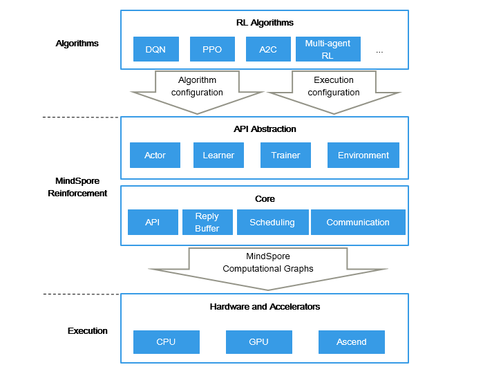

MindSpore Reinforcement Documents
===================================

MindSpore Reinforcement is an open-source reinforcement learning framework that supports the distributed training of agents using reinforcement learning algorithms. MindSpore Reinforcement offers a clean API abstraction for writing reinforcement learning algorithms, which decouples the algorithm from deployment and execution considerations, including the use of accelerators, the level of parallelism and the distribution of computation across a cluster of workers. MindSpore Reinforcement translates the reinforcement learning algorithm into a series of compiled computational graphs, which are then run efficiently by the MindSpore framework on CPUs, GPUs, and Ascend AI processors.

Unique Design Features
-----------------------

1. Offers an algorithmic-centric API for writing reinforcement learning algorithms

   In MindSpore Reinforcement, users describe reinforcement algorithms in Python in terms of intuitive algorithmic concepts, such as agents, actors, environments, and learners. Agents contain actors that interact with an environment and collect rewards. Based on the rewards, learners update policies that govern the behaviour of actors. Users can focus on the implementation of their algorithm without the framework getting in their way.

2. Decouples reinforcement learning algorithms from their execution strategy

   The API exposed by MindSpore Reinforcement for implementing algorithms makes no assumptions about how the algorithm will be executed. MindSpore Reinforcement can therefore execute the same algorithm on a single laptop with one GPU and on a cluster of machines with many GPUs. Users provide a separate execution configuration, which describes the resources that MindSpore Reinforcement can use for training.

3. Accelerates reinforcement learning algorithms efficiently

   MindSpore Reinforcement is designed to speed up the training of reinforcement learning algorithms by executing the computation on hardware accelerators, such as GPUs or Ascend AI processors. It not only accelerates the neural network computation, but it also translates the logic of actors and learners to computational graphs with parallelizable operators. These computational graphs are executed by the MindSpore framework, taking advantage of its compilation and auto-parallelisation features.

Future Roadmap
---------------

- This initial release of MindSpore Reinforcement contains a stable API for implementing reinforcement learning algorithms and executing computation using MindSpore’s computational graphs. It does not yet include the more advanced features for the parallel and distributed execution of algorithms or the support for multi-agent scenarios with cooperating and competing agents – stay tuned for future releases of MindSpore Reinforcement that will include these features.

Typical MindSpore Reinforcement Application Scenarios
------------------------------------------------------

- `Train a deep Q network <https://www.mindspore.cn/reinforcement/docs/en/master/dqn.html>`_

  The DQN algorithm uses an experience replay technique to maintain previous observations for off-policylearning.

.. toctree::
   :glob:
   :maxdepth: 1
   :caption: Installation

   reinforcement_install

.. toctree::
   :glob:
   :maxdepth: 1
   :caption: Guide

   custom_config_info
   dqn

.. toctree::
   :maxdepth: 1
   :caption: API References

   reinforcement
