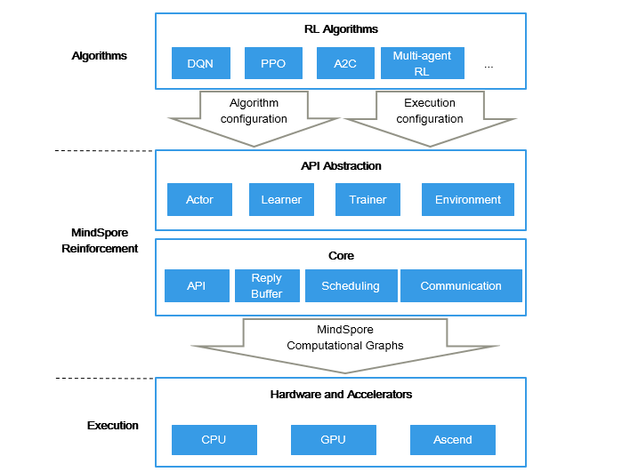

MindSpore Reinforcement 文档
=============================

MindSpore Reinforcement是一个开源的强化学习框架，支持使用强化学习算法对agent进行分布式训练。MindSpore Reinforcement为编写强化学习算法提供了简洁的API抽象，它将算法与具体的部署和执行过程解耦，包括加速器的使用、并行度以及跨节点的计算调度。MindSpore Reinforcement将强化学习算法转换为一系列编译后的计算图，然后由MindSpore框架在CPU、GPU或AscendAI处理器上高效运行。

设计特点
--------

1. 提供以算法为中心的API，用于编写强化学习算法

   在MindSpore Reinforcement中，用户使用直观的算法概念（如agent、actor、environment、learner）来描述由Python表达的强化学习算法。Agent包含与环境交互并收集奖励的actor。根据奖励，learner更新用于控制actor行为的策略。用户可以专注于算法的实现，而不用关注框架的计算细节。

2. 将强化学习算法与其执行策略解耦

   MindSpore Reinforcement提供的用于算法实现的API并没有假设算法如何被执行。因此，MindSpore Reinforcement可以在单GPU的笔记本电脑和多GPU的计算机集群上执行相同的算法。用户提供了单独的执行配置，该配置描述了MindSpore Reinforcement可以用于训练的资源。

3. 高效加速强化学习算法

   MindSpore Reinforcement旨在通过在硬件加速器（如GPU或Ascend AI处理器）上执行计算，加速对强化学习算法的训练。它不仅加速了神经网络的计算，而且还将actor和learner的逻辑转换为具有并行算子的计算图。MindSpore利用框架自身在编译和自动并行上的特性优势来执行这些计算图。

未来路标
---------

- MindSpore Reinforcement初始版本包含一个稳定的API，用于实现强化学习算法和使用MindSpore的计算图执行计算。初始版本暂时不包含算法的并行和分布式执行的高级功能，也不支持包含相互合作和竞争关系agent的多智能体场景。MindSpore Reinforcement的后续版本将包含这些功能，敬请期待。

使用MindSpore Reinforcement的典型场景
--------------------------------------

- `训练深度Q网络 <https://www.mindspore.cn/reinforcement/docs/zh-CN/master/dqn.html>`_

  DQN算法使用经验回放技术来维护先前的观察结果，进行off-policy学习。

.. toctree::
   :glob:
   :maxdepth: 1
   :caption: 安装部署

   reinforcement_install

.. toctree::
   :glob:
   :maxdepth: 1
   :caption: 使用指南

   custom_config_info
   dqn

.. toctree::
   :maxdepth: 1
   :caption: API参考

   reinforcement
