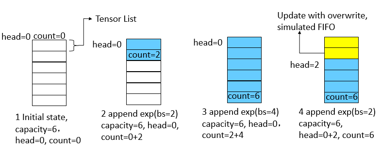
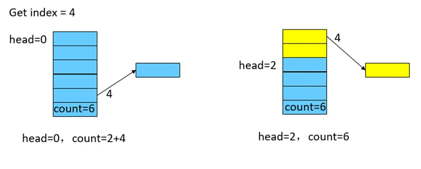
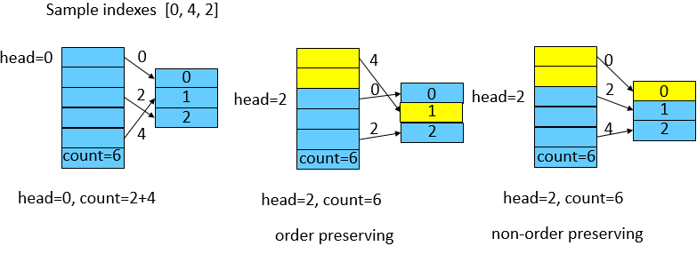

# ReplayBuffer 使用说明

<a href="https://gitee.com/mindspore/docs/blob/r2.0.0-alpha/docs/reinforcement/docs/source_zh_cn/replaybuffer.md" target="_blank"></a>

## ReplayBuffer 简介

在强化学习中，ReplayBuffer是一个常用的基本数据存储方式，它的功能在于存放智能体与环境交互得到的数据。
使用ReplayBuffer可以解决以下几个问题：

1. 存储的历史经验数据，可以通过采样的方式抽取，以打破训练数据的相关性，使抽样的数据具有独立同分布的特性。
2. 可以提供数据的临时存储，提高数据的利用率。

## MindSpore Reinforcement Learning 的 ReplayBuffer 实现

一般情况下，算法人员使用原生的Python数据结构或Numpy的数据结构来构造ReplayBuffer，或者一般的强化学习框架也提供了标准的API封装。不同的是，MindSpore实现了设备端的ReplayBuffer结构，一方面能在使用GPU硬件时减少数据在Host和Device之间的频繁拷贝，另一方面，以MindSpore算子的形式表达ReplayBuffer，可以构建完整的IR图，使能MindSpore GRAPH_MODE的各种图优化，提升整体的性能。

在MindSpore中，提供了两种ReplayBuffer，分别是UniformReplayBuffer和PriorityReplayBuffer，分别用于常用的FIFO存储和带有优先级的存储。下面以UniformReplayBuffer为例介绍实现及使用。
以一个List的Tensor表示，每个Tensor代表一组按列存储的数据（如一组[state, action, reward]）。新放入UniformReplayBuffer中的数据以FIFO的机制进行内容的更新，具有插入、查找、采样等功能。

### 参数解释

创建一个UniformReplayBuffer，初始化参数为batch_size、capacity、shapes、types。

* batch_size表示sample一次数据的大小，整数值。
* capacity表示创建UniformReplayBuffer的总容量，整数值。
* shapes表示Buffer中，每一组数据的shape大小，以list表示。
* types表示Buffer中，每一组数据对应的数据类型，以list表示。

### 功能介绍

#### 1 插入 -- insert

插入方法接收一组数据作为入参，需满足数据的shape和type与创建的UniformReplayBuffer参数一致。无输出。
为了模拟循环队列的FIFO特性，我们使用两个游标来确定队列的头部head和有效长度count。下图展示了几次插入操作的过程。

1. buffer的总大小为6，初始状态时，游标head和count均为0。
2. 插入一个batch_size为2的数据后，当前的head不变，count加2。
3. 继续插入一个batch_size为4的数据后，队列已满，count为6。
4. 继续插入一个batch_size为2的数据后，覆盖式更新旧数据，并将head加2。



#### 2 查找 -- get_item

查找方法接受一个index作为入参，表示需要查找的数据的具体位置。输出为一组Tensor。如下图所示：

1. UniformReplayBuffer刚满或未满的情况下，根据index直接找到对应数据。
2. 对于已经覆盖过的数据，通过游标进行重映射。



#### 3 采样 -- sample

采样方法无输入，输出为一组Tensor，大小为创建UniformReplayBuffer时的batch_size大小。如下图所示：
假定batch_size为3，算子中会随机产生一组indexes，这组随机的indexes有两种情况：

1. 保序：每个index即代表真实的数据位置，需要经过游标重映射操作。
2. 不保序：每个index不代表真实位置，直接获取。

两种方式对随机性有轻微影响，默认采用不保序的方式以获取最佳的性能。



## MindSpore Reinforcement Learning 的 UniformReplayBuffer 使用介绍

### UniformReplayBuffer的创建

MindSpore Reinforcement Learning 提供了标准的ReplayBuffer API。用户可以使用配置文件的方式使用框架创建的ReplayBuffer，形如[dqn](https://gitee.com/mindspore/reinforcement/blob/r2.0.0-alpha/mindspore_rl/algorithm/dqn/config.py)的配置文件：

```python
'replay_buffer':
    {'number': 1,
     'type': UniformReplayBuffer,
     'capacity': 100000,
     'data_shape': [(4,), (1,), (1,), (4,)],
     'data_type': [ms.float32, ms.int32, ms.foat32, ms.float32],
     'sample_size': 64}
```

或者，用户可以直接使用API接口，创建所需的数据结构：

```python
from mindspore_rl.core.uniform_replay_buffer import UniformReplayBuffer
import mindspore as ms
sample_size = 2
capacity = 100000
shapes = [(4,), (1,), (1,), (4,)]
types = [ms.float32, ms.int32, ms.float32, ms.float32]
replaybuffer = UniformReplayBuffer(sample_size, capacity, shapes, types)
```

### 使用创建的UniformReplayBuffer

以API形式创建的[UniformReplayBuffer](https://gitee.com/mindspore/reinforcement/blob/r2.0.0-alpha/mindspore_rl/core/uniform_replay_buffer.py)进行数据操作为例：

* 插入操作

```python
state = ms.Tensor([0.1, 0.2, 0.3, 0.4], ms.float32)
action = ms.Tensor([1], ms.int32)
reward = ms.Tensor([1], ms.float32)
new_state = ms.Tensor([0.4, 0.3, 0.2, 0.1], ms.float32)
replaybuffer.insert([state, action, reward, new_state])
replaybuffer.insert([state, action, reward, new_state])
```

* 查找操作

```python
exp = replaybuffer.get_item(0)
```

* 采样操作

```python
samples = replaybuffer.sample()
```

* 重置操作

```python
replaybuffer.reset()
```

* 当前buffer使用的大小

```python
size = replaybuffer.size()
```

* 判断当前buffer是否已满

```python
if replaybuffer.full():
    print("Full use of this buffer.")
```
