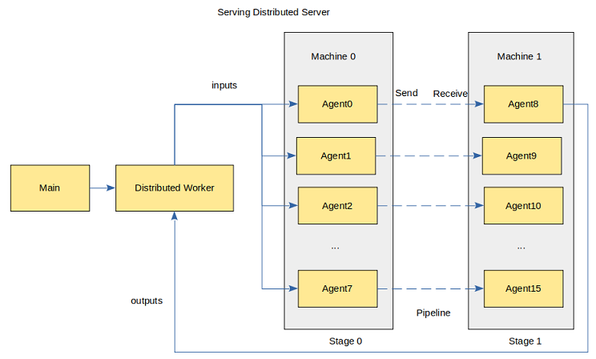

# MindSpore Serving-based Distributed Inference Service Deployment

Translator: [xiaoxiaozhang](https://gitee.com/xiaoxinniuniu)

<a href="https://gitee.com/mindspore/docs/blob/r1.7/docs/serving/docs/source_en/serving_distributed_example.md" target="_blank"></a>

## Overview

Distributed inference means that multiple cards are used in the inference phase, in order to solve the problem that too many parameters are in the very large scale neural network and the model cannot be fully loaded into a single card for inference, multi-cards can be used for distributed inference. This document describes the process of deploying the distributed inference service, which is similar to the process of deploying the [single-card inference service](https://www.mindspore.cn/serving/docs/en/r1.7/serving_example.html), and these two can refer to each other.

The architecture of the distributed inference service shows as follows：



The `Main` process provides an interface for client access, manages `Distributed Worker` process, and performs task management and distribution; `Distributed Worker` automatically schedule `Agent` processes based on model configurations to complete distributed inference; Each `Agent` contains a slice of the distributed model, occupies a device, and loads the model to performance inference.

The preceding figure shows the scenario where rank_size is 16 and stage_size is 2. Each stage contains 8 `Agent`s and occupies 8 devices. rank_size indicates the number of devices used in inference, stage indicates a pipeline segment, and stage_size indicates the number of pipeline segments. The `Distributed Worker` sends an inference requests to the `Agent`s and obtains the inference result from the `Agent`s. `Agent`s communicate with each other using HCCL.

Currently, the distributed model has the following restrictions:

- The model of the first stage receives the same input data.
- The models of other stages do not receive data.
- All models of the latter stage return the same data.
- Only Ascend 910 inference is supported.

The following uses a simple distributed network MatMul as an example to demonstrate the deployment process.

### Environment Preparation

Before running the sample network, ensure that MindSpore Serving has been properly installed and the environment variables are configured. To install and configure MindSpore Serving on your PC, go to the [MindSpore Serving installation page](https://www.mindspore.cn/serving/docs/en/r1.7/serving_install.html).

### Exporting a Distributed Model

For details about the files required for exporting distributed models, see the [export_model directory](https://gitee.com/mindspore/serving/tree/r1.7/example/matmul_distributed/export_model), the following files are required:

```text
export_model
├── distributed_inference.py
├── export_model.sh
├── net.py
└── rank_table_8pcs.json
```

- `net.py` contains the definition of MatMul network.
- `distributed_inference.py` is used to configure distributed parameters.
- `export_model.sh` creates `device` directory on the current host and exports model files corresponding to `device`.
- `rank_table_8pcs.json` is a json file for configuring the multi-cards network. For details, see [rank_table](https://gitee.com/mindspore/models/tree/r1.7/utils/hccl_tools).

Use [net.py](https://gitee.com/mindspore/serving/blob/r1.7/example/matmul_distributed/export_model/net.py) to construct a network that contains the MatMul and Neg operators.

```python
import numpy as np
from mindspore import Tensor, Parameter, ops
from mindspore.nn import Cell


class Net(Cell):
    def __init__(self, matmul_size, transpose_a=False, transpose_b=False, strategy=None):
        super().__init__()
        matmul_np = np.full(matmul_size, 0.5, dtype=np.float32)
        self.matmul_weight = Parameter(Tensor(matmul_np))
        self.matmul = ops.MatMul(transpose_a=transpose_a, transpose_b=transpose_b)
        self.neg = ops.Neg()
        if strategy is not None:
            self.matmul.shard(strategy)

    def construct(self, inputs):
        x = self.matmul(inputs, self.matmul_weight)
        x = self.neg(x)
        return x
```

Use [distributed_inference.py](https://gitee.com/mindspore/serving/blob/r1.7/example/matmul_distributed/export_model/distributed_inference.py) to configure the distributed model. Refer to [Distributed inference](https://www.mindspore.cn/tutorials/experts/en/r1.7/parallel/distributed_inference.html)。

```python
import numpy as np
from net import Net
from mindspore import context, Model, Tensor, export
from mindspore.communication import init


def test_inference():
    """distributed inference after distributed training"""
    context.set_context(mode=context.GRAPH_MODE)
    init(backend_name="hccl")
    context.set_auto_parallel_context(full_batch=True, parallel_mode="semi_auto_parallel",
                                      device_num=8, group_ckpt_save_file="./group_config.pb")

    predict_data = create_predict_data()
    network = Net(matmul_size=(96, 16))
    model = Model(network)
    model.infer_predict_layout(Tensor(predict_data))
    export(model.predict_network, Tensor(predict_data), file_name="matmul", file_format="MINDIR")


def create_predict_data():
    """user-defined predict data"""
    inputs_np = np.random.randn(128, 96).astype(np.float32)
    return Tensor(inputs_np)
```

Run [export_model.sh](https://gitee.com/mindspore/serving/blob/r1.7/example/matmul_distributed/export_model/export_model.sh) to export the distributed model. After the command is executed successfully, the `model` directory is created in the upper-level directory. The structure is as follows:

```text
model
├── device0
│   ├── group_config.pb
│   └── matmul.mindir
├── device1
├── device2
├── device3
├── device4
├── device5
├── device6
└── device7
```

Each `device` directory contains two files, `group_config.pb` and `matmul.mindir`, which represent the model group configuration file and model file respectively.

### Deploying the Distributed Inference Service

For details about how to start the distributed inference service, refer to [matmul_distributed](https://gitee.com/mindspore/serving/tree/r1.7/example/matmul_distributed), the following files are required:

```text
matmul_distributed
├── serving_agent.py
├── serving_server.py
├── matmul
│   └── servable_config.py
├── model
└── rank_table_8pcs.json
```

- `model` is the directory for storing model files.
- `serving_server.py` is the script for starting services, including `Main` process and `Distributed Worker` process.
- `serving_agent.py` is the script for starting `Agent`s.
- `servable_config.py` is the [Model Configuration File](https://www.mindspore.cn/serving/docs/en/r1.7/serving_model.html). It declares a distributed model with rank_size 8 and stage_size 1 through `declare_distributed_servable`, and defines a method `predict` for distributed servable.

The content of the model configuration file is as follows:

```python
from mindspore_serving.server import distributed
from mindspore_serving.server import register

model = distributed.declare_servable(rank_size=8, stage_size=1, with_batch_dim=False)


@register.register_method(output_names=["y"])
def predict(x):
    y = register.add_stage(model, x, outputs_count=1)
    return y
```

#### Starting Serving Server

Use [serving_server.py](https://gitee.com/mindspore/serving/blob/r1.7/example/matmul_distributed/serving_server.py) to call `distributed.start_servable` method to deploy the serving sever, including the `Main` and `Distributed Worker` processes.

```python
import os
import sys
from mindspore_serving import server
from mindspore_serving.server import distributed


def start():
    servable_dir = os.path.dirname(os.path.realpath(sys.argv[0]))
    distributed.start_servable(servable_dir, "matmul",
                               rank_table_json_file="rank_table_8pcs.json",
                               version_number=1,
                               distributed_address="127.0.0.1:6200",
                               wait_agents_time_in_seconds=0)

    server.start_grpc_server("127.0.0.1:5500")
    server.start_restful_server("127.0.0.1:1500")


if __name__ == "__main__":
    start()
```

- `servable_dir` is the directory for storing a servable.
- `servable_name` is the name of the servable, which corresponds to a directory for storing model configuration files.
- `rank_table_json_file` is the JSON file for configuring multi-cards network.
- `distributed_address` is the address of the `Distributed Worker`.
- `wait_agents_time_in_seconds` specifies the duration of waiting for all `Agent`s to be registered, the default value 0 means it will wait forever.

#### Starting Agent

Use [serving_agent.py](https://gitee.com/mindspore/serving/blob/r1.7/example/matmul_distributed/serving_agent.py) to call `startup_agents` method to start 8 `Agent` processes on the current host. `Agent`s obtain rank_tables from `Distributed Worker` so that `Agent`s can communicate with each other using HCCL.

```python
from mindspore_serving.server import distributed


def start_agents():
    """Start all the agents in current machine"""
    model_files = []
    group_configs = []
    for i in range(8):
        model_files.append(f"model/device{i}/matmul.mindir")
        group_configs.append(f"model/device{i}/group_config.pb")

    distributed.startup_agents(distributed_address="127.0.0.1:6200", model_files=model_files,
                               group_config_files=group_configs, agent_start_port=7000,
                               agent_ip=None, rank_start=None)


if __name__ == '__main__':
    start_agents()
```

- `distributed_address` is the address of the `Distributed Worker`.
- `model_files` is a list of model file paths.
- `group_config_files` is a list of model group configuration file paths.
- `agent_start_port` is the start port used by the `Agent`. The default value is 7000.
- `agent_ip` is the IP address of an `Agent`. The default value is None. The IP address used by the `Agent` to communicate with the `Distributed Worker` is obtained from rank_table by default. If the IP address is unavailable, you need to set both `agent_ip` and `rank_start`.
- `rank_start` is the start rank_id of the current server, the default value is None.

### Executing Inference

To access the inference service through gRPC, the client needs to specify the network address of the gRPC server. Run [serving_client.py](https://gitee.com/mindspore/serving/blob/r1.7/example/matmul_distributed/serving_client.py) to call the `predict` method of matmul distributed model, execute inference.

```python
import numpy as np
from mindspore_serving.client import Client


def run_matmul():
    """Run client of distributed matmul"""
    client = Client("localhost:5500", "matmul", "predict")
    instance = {"x": np.ones((128, 96), np.float32)}
    result = client.infer(instance)
    print("result:\n", result)


if __name__ == '__main__':
    run_matmul()
```

The following return value indicates that the Serving distributed inference service has correctly executed the inference of MatMul net:

```text
result:
[{'y': array([[-48., -48., -48., ..., -48., -48., -48.],
      [-48., -48., -48., ..., -48., -48., -48.],
      [-48., -48., -48., ..., -48., -48., -48.],
      ...,
      [-48., -48., -48., ..., -48., -48., -48.],
      [-48., -48., -48., ..., -48., -48., -48.],
      [-48., -48., -48., ..., -48., -48., -48.]], dtype=float32)}]
```
