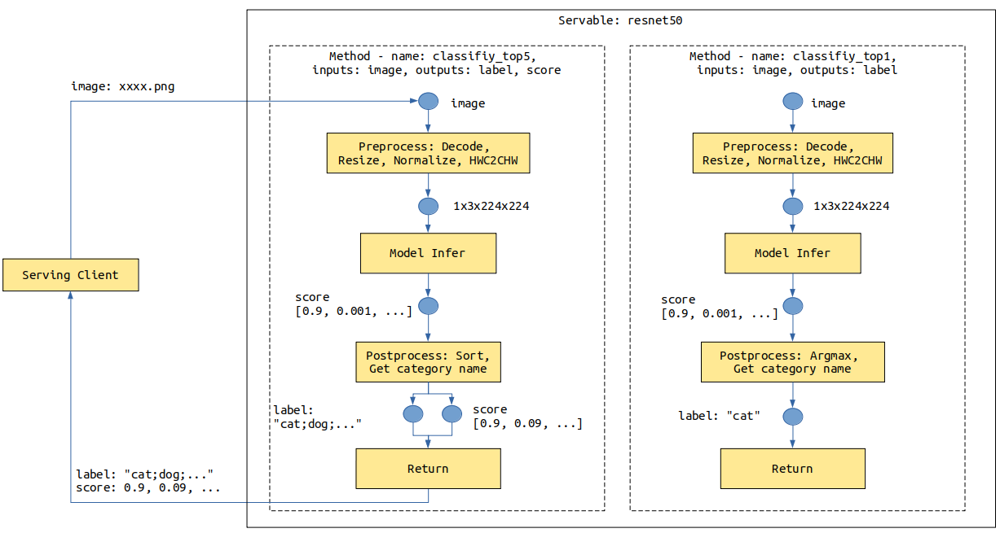
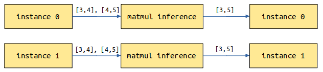
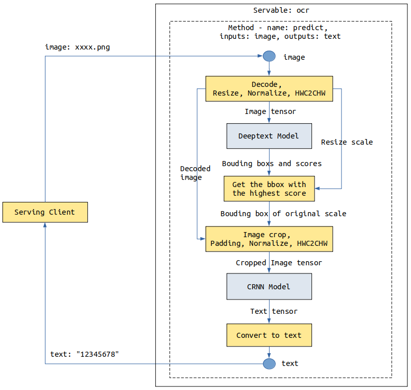
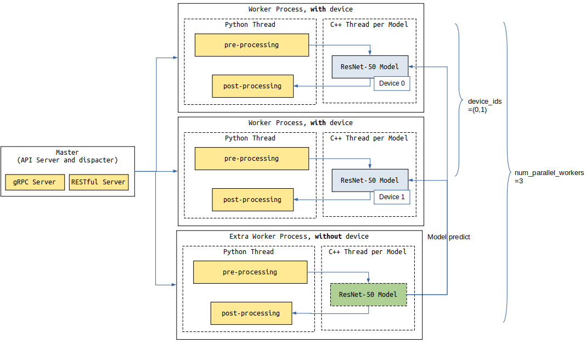

# Servable Provided Through Model Configuration

<a href="https://gitee.com/mindspore/docs/blob/master/docs/serving/docs/source_en/serving_model.md" target="_blank"></a>

## Overview

When [MindSpore](#https://www.mindspore.cn/) is used as the inference backend, MindSpore Serving supports the Ascend 910/710/310 and Nvidia GPU environments. The Ascend 710/310 environment supports both `OM` and `MindIR` model formats, and the Ascend 910 and GPU environment only supports the `MindIR` model format.

When [MindSpore Lite](#https://www.mindspore.cn/lite) is used as the inference backend, MindSpore Serving supports Ascend 310, Nvidia GPU and CPU environments. Only the `MindIR_Opt` model format is supported. Currently, models in `MindIR` format exported from MindSpore and models exported from other frameworks need to be converted to `MindIR_Opt` format using MindSpore Lite conversion tool. During model conversion, if the target device is set to `Ascend310`, the generated `MindIR_Opt` model can be used only in the Ascend 310 environment. Otherwise, the generated `MindIR_Opt` model can be used only in the Nvidia GPU and CPU environments.

MindSpore Serving Servable provides the inference services of the following types: One inference service comes from a single model, and the other one comes from a combination of multiple models. The two types of sevices are configured through the same interface. Models need to be configured to provide the Serving inference service.

The following describes how to configure models to provide Servable. ResNet-50 is used as an example to describe how to configure a single model to provide Servable. For details about the sample code, see the [ResNet-50 Example](https://gitee.com/mindspore/serving/tree/master/example/resnet/). Serving client is referred to as the client.

## Concepts

### Methods

For a ResNet-50 inference model, the data sent by the client is images in JPG or PNG format, and the image classification is expected to be returned. The input of a ResNet model is the tensor generated by operations such as image `Decode`, `Resize`, and `Normalize`. The output is the score tensor of each category. The image needs to be converted into a tensor that meets the model input requirements during preprocessing. **Name of the top 1 category** or **Names of the top 5 categories and their scores** are returned after post-processing.

The following shows the `resnet50` Servable data flowchart. The image data is transmitted from the client to the Serving through a network. The Serving performs preprocessing, inference, and post-processing, and returns the result to the client.



The provided preprocessing may vary according to the composition, structure, or type of data input from the client in different scenarios. The provided post-processing may also vary according to the model output requirements. For example, in the preceding `resnet50` Servable, two post-processing functions are provided for the following two scenarios: **Name of the top 1 category** and **Names of the top 5 categories and their scores**.

Different services processing flows can be represented by different methods. One Servable can provide one or more methods. The Servable name and the method name are marked with a service provided by the Serving. Each method performs a series of operations such as Python processing or model inference on the data provided by the client, and returns the required result to the client.
The preceding `resnet` Servable provides the `classify_top5` and `classify_top1` methods.

A method of one Servable is used to:

- Specify a method name for the client to specify a method to be used.
- Specify the input and output names of a method for the client to specify the input and obtain the output.
- Define one or more processing stages of the method. Each stage can be a Python function or a model. Within a method, the number and sequence of Python functions and models are not limited, and can be reused in multiple stages. A method can use multiple models.
- Define a data flow between method input, stages, and method output. The former data value can be used as the latter data input.

### Instances

Each request includes one or more independent instances which do not affect each other's result. For example, a category is returned for an image, and three categories are returned for three independent images.

## Services Provided by a Single Model

Take the ResNet-50 model as an example. The model configuration file directory is as follows:

```text
resnet50
├── 1
│   └── resnet50_1b_cifar10.mindir
├── 2
│   └── resnet50_1b_cifar10.mindir
└── servable_config.py
```

- `resnet50`: a directory, which is named after the Servable name.

- `servable_config.py`: configures Servable, including preprocessing and post-processing definitions, model declaration, and method definition.

- `1` and `2`: directories, which indicate models of the `1` and `2` versions. The model version is a positive integer starting from `1`. A larger number indicates a later version.

- `resnet50_1b_cifar10.mindir`: a model file. When the Servable is started, the model file of the corresponding version is loaded.

### Preprocessing and Post-processing Definition

The following is an example to define preprocessing and post-processing:

```python
import numpy as np
import mindspore.dataset.vision.c_transforms as VC

# cifar 10
idx_2_label = ['airplane', 'automobile', 'bird', 'cat', 'deer', 'dog', 'frog', 'horse', 'ship', 'truck']


def preprocess_eager(image):
    """
    Define preprocess, input is image numpy, return preprocess result.
    Return type can be numpy, str, bytes, int, float, or bool.
    Use MindData Eager, this image processing can also use other image processing library,
    likes numpy, PIL or cv2 etc.
    """
    image_size = 224
    mean = [0.4914 * 255, 0.4822 * 255, 0.4465 * 255]
    std = [0.2023 * 255, 0.1994 * 255, 0.2010 * 255]

    decode = VC.Decode()
    resize = VC.Resize([image_size, image_size])
    normalize = VC.Normalize(mean=mean, std=std)
    hwc2chw = VC.HWC2CHW()

    image = decode(image)
    image = resize(image)
    image = normalize(image)
    image = hwc2chw(image)
    return image

def postprocess_top1(score):
    """
    Define postprocess. This example has one input and one output.
    The input is the numpy tensor of the score, and the output is the label str of top one.
    """
    max_idx = np.argmax(score)
    return idx_2_label[max_idx]


def postprocess_top5(score):
    """
    Define postprocess. This example has one input and two outputs.
    The input is the numpy tensor of the score. The first output is the str joined by labels of top five, and the second output is the score tensor of the top five.
    """
    idx = np.argsort(score)[::-1][:5]  # top 5
    ret_label = [idx_2_label[i] for i in idx]
    ret_score = score[idx]
    return ";".join(ret_label), ret_score
```

The preprocessing and post-processing are defined in the same format. The input parameters are the input data of each instance. If the input data is a text, the input parameter is a str object. If the input data is of other types, such as Tensor, Scalar number, Boolean, and Bytes, the input parameter is a **numpy object**. The instance processing result is returned through `return`, and each data returned can be **numpy array** or **bool, int, float, str, or bytes of Python**.

### Model Declaration

The sample code for declaring the `resnet50` Servable model is as follows:

```python
from mindspore_serving.server import register
resnet_model = register.declare_model(model_file="resnet50_1b_cifar10.mindir", model_format="MindIR", with_batch_dim=True)
```

In the preceding code:

1. The input parameter `model_file` indicates the model file name.
2. The input parameter `model_format` indicates the model format.
3. If the first dimension of the model input and output is not the `batch` dimension, you need to change the value of `with_batch_dim` from the default value `True` to `False`.

    Set `with_batch_dim` to `True` if models contain the `batch` dimension, such as image and text processing models. Assume that `batch_size=2` and the current request has three instances of images which will be split into two batches for model inference. For the first batch, two images are inferred to return two results. For the second batch, the remaining image is copied and inferred to return one result. Finally, three results are returned.

    

    Set `with_batch_dim` to `False` if models do not involve or consider the `batch` dimension. For example, the input and output are matrix multiplication models of 2D tensors. Each instance of the request performs an independent inference task.

    

4. If a model has one data input with `batch` dimension information and one model configuration information input without `batch` dimension information, you can set `with_batch_dim` to `True` and set an extra parameter `without_batch_dim_inputs` to specify the input information that does not contain the `batch` dimension information. For example:

    ```python
    from mindspore_serving.server import register
    # Input1 indicates the input shape information of the model, without the batch dimension information.
    # input0: [N,3,416,416], input1: [2]
    yolov_model = register.declare_model(model_file="yolov3_darknet53.mindir", model_format="MindIR",
                                        with_batch_dim=True, without_batch_dim_inputs=1)
    ```

5. If you want to configure run-time parameters about model and the device information, you can use the argument `context` and `config_file` of `declare_model`. You can refer to [API document](https://www.mindspore.cn/serving/api/en/master/server.html#mindspore_serving.server.register.declare_model).

For distributed model, the only difference compared with non-distributed single model configuration is declaration, you need to use `mindspore_serving.server.distributed.declare_servable` method, `rank_size` is the number of devices used in the model, `stage_size` is the number of stages in the pipeline.

```python
from mindspore_serving.server import distributed

model = distributed.declare_servable(rank_size=8, stage_size=1, with_batch_dim=False)
```

### Method Definition

An example of the method definition is as follows:

```python
from mindspore_serving.server import register

@register.register_method(output_names=["label"])
def classify_top1(image):
    """Define method `classify_top1` for servable `resnet50`.
     The input is `image` and the output is `label`."""
    x = register.add_stage(preprocess_eager, image, outputs_count=1)
    x = register.add_stage(resnet_model, x, outputs_count=1)
    x = register.add_stage(postprocess_top1, x, outputs_count=1)
    return x


@register.register_method(output_names=["label", "score"])
def classify_top5(image):
    """Define method `classify_top5` for servable `resnet50`.
     The input is `image` and the output is `label` and `score`. """
    x = register.add_stage(preprocess_eager, image, outputs_count=1)
    x = register.add_stage(resnet_model, x, outputs_count=1)
    label, score = register.add_stage(postprocess_top5, x, outputs_count=2)
    return label, score
```

The preceding code defines the `classify_top1` and `classify_top5` methods in Servable `resnet50`. The input parameter of the `classify_top1` method is `image` and the output parameter is `label`. The input parameter of the `classify_top5` method is `image` and the output parameters are `label` and `score`. That is, the input parameters of the Servable method are specified by the input parameters of the Python function, and the output parameters of the Servable method are specified by the parameter `output_names` of `register_method`.

In the preceding method definition:

- `add_stage` defines a stage that specifies the preprocessing, model and post-processing used and there inputs.

- `return` specifies the data returned by the method and corresponds to the `output_names` parameter of `register_method`.

When a user uses a service provided by a Servable method on the client, the user needs to set the input value based on the input parameter name and obtain the output value based on the output parameter name. For example, the method `classify_top5` accessed by the client is as follows:

```python
import os
from mindspore_serving.client import Client

def read_images():
    """Read images for directory test_image"""
    image_files = []
    images_buffer = []
    for path, _, file_list in os.walk("./test_image/"):
        for file_name in file_list:
            image_file = os.path.join(path, file_name)
            image_files.append(image_file)
    for image_file in image_files:
        with open(image_file, "rb") as fp:
            images_buffer.append(fp.read())
    return image_files, images_buffer

def run_classify_top5():
    """Client for servable resnet50 and method classify_top5"""
    client = Client("localhost:5500", "resnet50", "classify_top5")
    instances = []
    image_files, images_buffer = read_images()
    for image in images_buffer:
        instances.append({"image": image})  # input `image`

    result = client.infer(instances)

    for file, result_item in zip(image_files, result):  # result for every image
        label = result_item["label"]  # result `label`
        score = result_item["score"]  # result `score`
        print("file:", file)
        print("label result:", label)
        print("score result:", score)

if __name__ == '__main__':
    run_classify_top5()
```

In addition, one request may include multiple instances, and multiple requests in queue for processing also have multiple instances. If multiple instances need to be processed concurrently by using, for example, multiple threads in customized preprocessing or post-processing (for example, the MindData concurrency is used to process multiple input images during preprocessing), MindSpore Serving provides parameter `batch_size` for interface `add_stage`. For details, see [ResNet-50 sample model configuration](https://gitee.com/mindspore/serving/blob/master/example/resnet/resnet50/servable_config.py).

## Services Composed of Multiple Models

Take an OCR service as an example, which involves two models: Deeptext and CRNN. When a client sends an image, the Deeptext model identifies the text box in the image, the CRNN model identifies the text content in the text box, and finally the server returns the text content to the client.



 The number of stages in a method is not limited, and each stage can be a Python function or a model. We can use `add_stage` multiple times to define services composed of multiple models.

The two model files must exist in each model version directory. If there is only version 1, the model configuration file directory is as follows:

```text
ocr
├── 1
│   │── deeptext_bs1.mindir
│   └── crnn_bs1.mindir
└── servable_config.py
```

Use `declare_model` to declare the Deeptext and CRNN models, and use multiple `add_stage` to connect these models:

```python
from mindspore_serving.server import register

deeptext_model = register.declare_model(model_file="deeptext_bs1.mindir", model_format="MindIR")

crnn_model = register.declare_model(model_file="crnn_bs1.mindir", model_format="MindIR")

def deeptext_prerpocess(image):
    # decode, resize, normalize, HWC2CHW
    ...
    return image, decode_image, scale

def deeptext_postprocess(bboxs, scores, scale):
    # Get the bbox with the highest score
    ...
    return bbox

def crnn_preprocess(decode_image, bbox):
    # crop, padding, normalize, HWC2CHW
    ...
    return cropped_image

def crnn_postprocess(text_tensor):
    # Convert text tensor to text
    ...
    return text_str

@register.register_method(output_names=["text"])
def predict(image):
    """Define method `classify_top1` for servable `resnet50`.
     The input is `image` and the output is `label`."""
    image, decode_image, scale = register.add_stage(deeptext_prerpocess, image, outputs_count=3)
    bboxs, scores = register.add_stage(deeptext_model, image, outputs_count=2)
    bbox = register.add_stage(deeptext_postprocess, bboxs, scores, scale, outputs_count=1)

    cropped_image = register.add_stage(crnn_preprocess, decode_image, bbox, outputs_count=1)
    text_tensor = register.add_stage(crnn_model, cropped_image, outputs_count=1)
    text_str = register.add_stage(crnn_postprocess, text_tensor, outputs_count=1)
    return text_str
```

## Multi-process Concurrency

The throughput of a Servable in a Serving server is affected by two aspects: the throughput of the models and the precessing time of Python tasks such as preprocessing and postprocessing. Model inference and Python tasks are executed concurrently.

If the average processing time of each instance decreases when the batch size of the model increaces, you can increase the batch size of the model by considreing the throughtput and request delay.

The other method is to increase the number of worker processes, You can configure the `device_ids` parameter to deploy the Servable to multiple device cores.

Due to the Python GIL, all Python tasks in a process are scheduled and executed in a Python thread. If the Python task processing time is greater than the model inference time, you can set the parameter `num_parallel_workers` to configure additional worker processes to process Python tasks.

In the following example, two worker processes(`device_ids`) occupying device 0 and device 1 are configured to process model inference tasks and Python tasks, and an extra worker process is configured to process only Python tasks. There are three(`num_parallel_workers`) workers in total.

```python

import os
import sys
from mindspore_serving import server


def start():
    servable_dir = os.path.dirname(os.path.realpath(sys.argv[0]))
    # Total 3 worker, two worker occupy device 0 and device 1, the model inference tasks
    # of other workers are forwarded to the worker that occupies the device.
    config = server.ServableStartConfig(servable_directory=servable_dir,
                                        servable_name="resnet50",
                                        device_ids=(0,1),
                                        num_parallel_workers=3)
    server.start_servables(config)

    server.start_grpc_server("127.0.0.1:5500")
    server.start_restful_server("127.0.0.1:1500")


if __name__ == "__main__":
    start()
```


