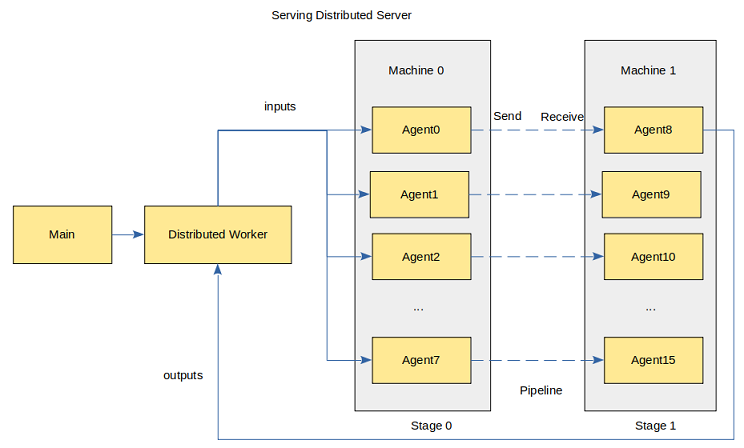

# 基于MindSpore Serving部署分布式推理服务

<a href="https://gitee.com/mindspore/docs/blob/master/docs/serving/docs/source_zh_cn/serving_distributed_example.md" target="_blank"></a>

## 概述

分布式推理是指推理阶段采用多卡进行推理，针对超大规模神经网络模型参数个数过多、模型无法完全加载至单卡中进行推理的问题，可利用多卡进行分布式推理。本文介绍部署分布式推理服务的流程，与[单卡推理服务](https://www.mindspore.cn/serving/docs/zh-CN/master/serving_example.html)部署流程大致相同，可以相互参考。

分布式推理服务的架构如图所示：



`Main`进程提供客户端访问的接口，管理`Distributed Worker`并进行任务管理与分发；`Distributed Worker`进程根据模型配置自动调度`Agent`完成分布式推理；每一个`Agent`进程包含一个分布式模型的切片，占用一个device，加载模型执行推理。

上图展示了rank_size为16，stage_size为2的场景，每个stage包含8个`Agent`，占用8个device。rank_size表示推理使用的device的个数，stage表示流水线的一段，stage_size表示流水线的段数。`Distributed Worker`向`Agent`发送推理请求并从`Agent`获取推理结果。`Agent`之间使用HCCL通信。

当前对分布式模型有以下限制：

- 第一个stage的模型接收相同的输入数据。
- 其他的stage的模型不接收数据。
- 最后一个stage的所有模型都返回相同的数据。
- 仅支持Ascend 910推理。

下面以一个简单的分布式网络MatMul为例，演示部署流程。

### 环境准备

运行示例前，需确保已经正确安装了MindSpore Serving，并配置了环境变量。MindSpore Serving安装和配置可以参考[MindSpore Serving安装页面](https://www.mindspore.cn/serving/docs/zh-CN/master/serving_install.html)。

### 导出分布式模型

导出分布式模型需要的文件可以参考[export_model目录](https://gitee.com/mindspore/serving/tree/master/example/matmul_distributed/export_model)，需要如下文件列表：

```text
export_model
├── distributed_inference.py
├── export_model.sh
├── net.py
└── rank_table_8pcs.json
```

- `net.py`为MatMul网络定义。
- `distributed_inference.py`配置分布式相关的参数。
- `export_model.sh`在当前机器上创建`device`目录并且导出每个`device`对应的模型文件。
- `rank_table_8pcs.json`为配置当前多卡环境的组网信息的json文件，可以参考[rank_table](https://gitee.com/mindspore/models/tree/master/utils/hccl_tools)。

使用[net.py](https://gitee.com/mindspore/serving/blob/master/example/matmul_distributed/export_model/net.py)，构造一个包含MatMul、Neg算子的网络。

```python
import numpy as np
from mindspore import Tensor, Parameter, ops
from mindspore.nn import Cell


class Net(Cell):
    def __init__(self, matmul_size, transpose_a=False, transpose_b=False, strategy=None):
        super().__init__()
        matmul_np = np.full(matmul_size, 0.5, dtype=np.float32)
        self.matmul_weight = Parameter(Tensor(matmul_np))
        self.matmul = ops.MatMul(transpose_a=transpose_a, transpose_b=transpose_b)
        self.neg = ops.Neg()
        if strategy is not None:
            self.matmul.shard(strategy)

    def construct(self, inputs):
        x = self.matmul(inputs, self.matmul_weight)
        x = self.neg(x)
        return x
```

使用[distributed_inference.py](https://gitee.com/mindspore/serving/blob/master/example/matmul_distributed/export_model/distributed_inference.py)， 配置分布式模型。可以参考[分布式推理](https://www.mindspore.cn/docs/programming_guide/zh-CN/master/distributed_inference.html)。

```python
import numpy as np
from net import Net
from mindspore import context, Model, Tensor, export
from mindspore.communication import init


def test_inference():
    """distributed inference after distributed training"""
    context.set_context(mode=context.GRAPH_MODE)
    init(backend_name="hccl")
    context.set_auto_parallel_context(full_batch=True, parallel_mode="semi_auto_parallel",
                                      device_num=8, group_ckpt_save_file="./group_config.pb")

    predict_data = create_predict_data()
    network = Net(matmul_size=(96, 16))
    model = Model(network)
    model.infer_predict_layout(Tensor(predict_data))
    export(model.predict_network, Tensor(predict_data), file_name="matmul", file_format="MINDIR")


def create_predict_data():
    """user-defined predict data"""
    inputs_np = np.random.randn(128, 96).astype(np.float32)
    return Tensor(inputs_np)
```

使用[export_model.sh](https://gitee.com/mindspore/serving/blob/master/example/matmul_distributed/export_model/export_model.sh)，导出分布式模型。执行成功后会在上一级目录创建`model`目录，结构如下：

```text
model
├── device0
│   ├── group_config.pb
│   └── matmul.mindir
├── device1
├── device2
├── device3
├── device4
├── device5
├── device6
└── device7
```

每个`device`目录都包含两个文件`group_config.pb`和`matmul.mindir`，分别表示模型分组配置文件与模型文件。

### 部署分布式推理服务

启动分布式推理服务，可以参考[matmul_distributed](https://gitee.com/mindspore/serving/tree/master/example/matmul_distributed)，需要如下文件列表：

```text
matmul_distributed
├── serving_agent.py
├── serving_server.py
├── matmul
│   └── servable_config.py
├── model
└── rank_table_8pcs.json
```

- `model`为存放模型文件的目录。
- `serving_server.py`为启动服务脚本，包括`Main`和`Distributed Worker`进程。
- `serving_agent.py`为启动`Agent`脚本。
- `servable_config.py`为[模型配置文件](https://www.mindspore.cn/serving/docs/zh-CN/master/serving_model.html)，通过`distributed.declare_servable`声明了一个rank_size为8、stage_size为1的分布式模型，同时定义了一个分布式servable的方法`predict`。

模型配置文件内容如下：

```python
from mindspore_serving.server import distributed
from mindspore_serving.server import register

model = distributed.declare_servable(rank_size=8, stage_size=1, with_batch_dim=False)


@register.register_method(output_names=["y"])
def predict(x):
    y = register.add_stage(model, x, outputs_count=1)
    return y
```

#### 启动Serving服务器

使用[serving_server.py](https://gitee.com/mindspore/serving/blob/master/example/matmul_distributed/serving_server.py)，调用`distributed.start_servable`方法部署分布式Serving服务器。

```python
import os
import sys
from mindspore_serving import server
from mindspore_serving.server import distributed


def start():
    servable_dir = os.path.dirname(os.path.realpath(sys.argv[0]))
    distributed.start_servable(servable_dir, "matmul",
                               rank_table_json_file="rank_table_8pcs.json",
                               version_number=1,
                               distributed_address="127.0.0.1:6200",
                               wait_agents_time_in_seconds=0)

    server.start_grpc_server("127.0.0.1:5500")
    server.start_restful_server("127.0.0.1:1500")


if __name__ == "__main__":
    start()
```

- `servable_dir`为servable存放的目录。
- `servable_name`为servable的名称，对应一个存放模型配置文件的目录。
- `rank_table_json_file`为配置当前多卡环境的组网信息的json文件。
- `distributed_address`为`Distributed Worker`的地址。
- `wait_agents_time_in_seconds`设置等待所有`Agent`注册完成的时限，默认为0表示会一直等待。

#### 启动Agent

使用[serving_agent.py](https://gitee.com/mindspore/serving/blob/master/example/matmul_distributed/serving_agent.py)，调用`startup_agents`方法会在当前机器上启动的8个`Agent`进程。`Agent`会从`Distributed Worker`获取rank_table，这样`Agent`之间才能利用HCCL进行通信。

```python
from mindspore_serving.server import distributed


def start_agents():
    """Start all the agents in current machine"""
    model_files = []
    group_configs = []
    for i in range(8):
        model_files.append(f"model/device{i}/matmul.mindir")
        group_configs.append(f"model/device{i}/group_config.pb")

    distributed.startup_agents(distributed_address="127.0.0.1:6200", model_files=model_files,
                               group_config_files=group_configs, agent_start_port=7000,
                               agent_ip=None, rank_start=None)


if __name__ == '__main__':
    start_agents()
```

- `distributed_address`为`Distributed Worker`的地址。
- `model_files`为模型文件路径的列表。
- `group_config_files`为模型分组配置文件路径的列表。
- `agent_start_port`表示`Agent`占用的起始端口，默认为7000。
- `agent_ip`为`Agent`的ip地址，默认为None。`Agent`与`Distributed Worker`通信的ip默认会从rank_table获取，如果该ip地址不可用，则需要同时设置`agent_ip`与`rank_start`。
- `rank_start`为当前机器起始的rank_id，默认为None。

### 执行推理

通过gRPC访问推理服务，client需要指定gRPC服务器的网络地址。运行[serving_client.py](https://gitee.com/mindspore/serving/blob/master/example/matmul_distributed/serving_client.py)，调用matmul分布式模型的`predict`方法，执行推理。

```python
import numpy as np
from mindspore_serving.client import Client


def run_matmul():
    """Run client of distributed matmul"""
    client = Client("localhost:5500", "matmul", "predict")
    instance = {"x": np.ones((128, 96), np.float32)}
    result = client.infer(instance)
    print("result:\n", result)


if __name__ == '__main__':
    run_matmul()
```

执行后显示如下返回值，说明Serving分布式推理服务已正确执行MatMul网络的推理：

```text
result:
[{'y': array([[-48., -48., -48., ..., -48., -48., -48.],
      [-48., -48., -48., ..., -48., -48., -48.],
      [-48., -48., -48., ..., -48., -48., -48.],
      ...,
      [-48., -48., -48., ..., -48., -48., -48.],
      [-48., -48., -48., ..., -48., -48., -48.],
      [-48., -48., -48., ..., -48., -48., -48.]], dtype=float32)}]
```
