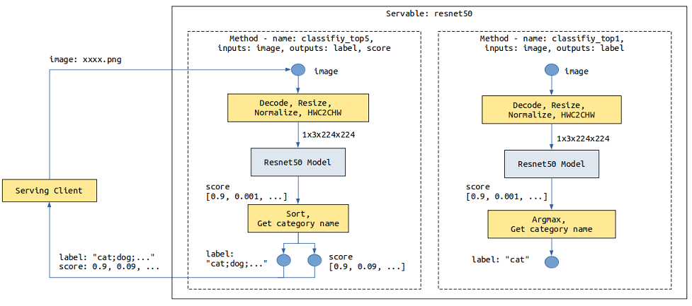
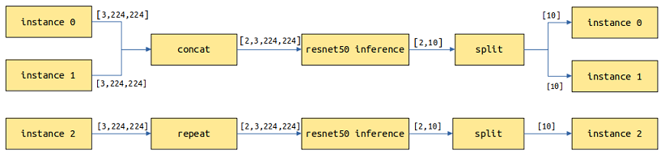
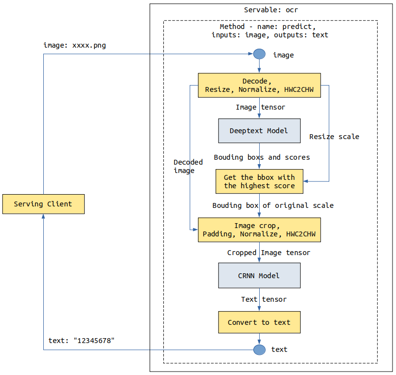
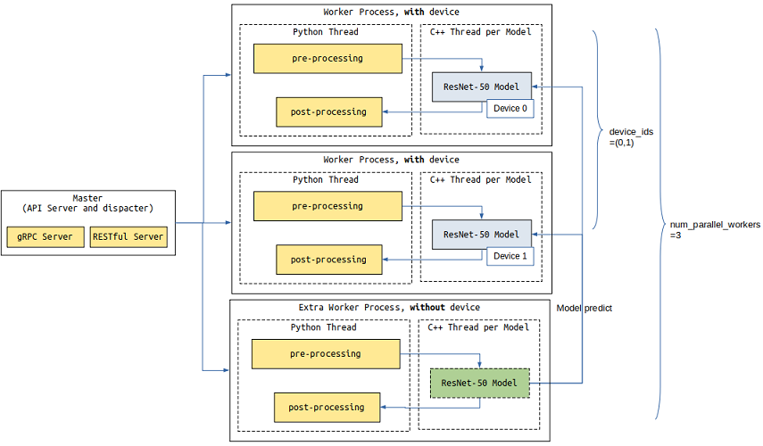

# 通过配置模型提供Servable

<a href="https://gitee.com/mindspore/docs/blob/r1.7/docs/serving/docs/source_zh_cn/serving_model.md" target="_blank"></a>

## 概述

运行示例前，需确保已经正确安装了MindSpore Serving，并配置了环境变量。MindSpore Serving安装和配置可以参考[MindSpore Serving安装页面](https://www.mindspore.cn/serving/docs/zh-CN/r1.7/serving_install.html)。

MindSpore Serving的Servable提供推理服务，包含两种类型，一种是推理服务来源于单模型，一种是推理服务来源于多模型组合，它们使用相同的接口进行定义。模型需要进行配置以提供Serving推理服务。

本文将说明如何对模型进行配置以提供Servable，单个模型以ResNet-50作为样例，样例代码可参考[ResNet-50样例](https://gitee.com/mindspore/serving/tree/r1.7/example/resnet/) 。Serving客户端简称客户端。

## 相关概念

### 方法

以ResNet-50推理模型为例，客户端发来的数据为jpg、png等格式的图片，预期返回图片的分类。ResNet-50模型输入为经过图片`Decode`、`Resize`、`Normalize`等操作产生的Tensor，输出为每个类别的得分Tensor。需要通过预处理将图片转化为满足模型输入的Tensor，通过后处理返回**得分最大的类别名称**或者**前5类别名称及其得分**。

以下图是`resnet50` Servable数据流程图，描述了图像数据从Serving客户端通过网络传输到Serving，Serving进行预处理、推理和后处理，最后向Serving客户端返回结果：



在不同的场景下，如果来自客户端的数据输入组成、结构或类型不同，可以提供不同的预处理。如果对模型的输出也有不同的要求，可以提供不同的后处理。比如上述`resnet50` Servable，针对返回**得分最大的类别名称**还是**前5类别名称及其得分**这两种场景提供了两个后处理。

不同的服务处理流程可以通过不同的方法来体现，一个Servable可提供一个或多个方法，Servable的名称和方法的名称标记了Serving提供的一个服务，每个方法对客户端提供的数据进行一系列Python处理或者模型推理等操作，最后将需要的结果返回给客户端。上述的`resnet50` Servable提供了`classify_top5`和`classify_top1`两个方法（`Method`）。

Servable的方法包含如下内容：

- 指定方法名，使客户端可以通过方法名指定使用的方法。
- 指定方法的输入和输出名称，使客户端可以通过名称来指定输入、获取输出。
- 指定方法一个或多个处理阶段（`Stage`），每个`Stage`可以是一个Python函数或者一个模型。一个方法中，Python函数和模型的数量不限制、顺序不限制，并且可在多个`Stage`中被重复使用，一个方法中可以使用多个不同模型。
- 定义方法输入、各个`Stage`、方法输出之间的数据流，前者作为后者的输入。

### 实例

每次请求可包括一个或多个实例，每个实例之间相互独立，结果互不影响。比如一张图片返回一个分类类别，三张独立的图片独立返回三个分类类别。

## 单模型服务

以ResNet-50模型为例，模型配置文件目录结果如下图所示：

```text
resnet50
├── 1
│   └── resnet50_1b_cifar10.mindir
├── 2
│   └── resnet50_1b_cifar10.mindir
└── servable_config.py
```

- 目录`resnet50`指示Servable的名称。

- 通过`servable_config.py`配置Servable，其中包括预处理和后处理定义、模型声明、方法定义。

- 目录`1`和`2`表示版本`1`和版本`2`的模型，模型版本为正整数，从`1`开始，数字越大表示版本越新。

- `resnet50_1b_cifar10.mindir`为模型文件，Servable启动会加载对应版本的模型文件。

### 预处理和后处理定义

预处理和后处理定义方式例子如下：

```python
import numpy as np
import mindspore.dataset.vision.c_transforms as VC

# cifar 10
idx_2_label = ['airplane', 'automobile', 'bird', 'cat', 'deer', 'dog', 'frog', 'horse', 'ship', 'truck']


def preprocess_eager(image):
    """
    Define preprocess, input is image numpy, return preprocess result.
    Return type can be numpy, str, bytes, int, float, or bool.
    Use MindData Eager, this image processing can also use other image processing library,
    likes numpy, PIL or cv2 etc.
    """
    image_size = 224
    mean = [0.4914 * 255, 0.4822 * 255, 0.4465 * 255]
    std = [0.2023 * 255, 0.1994 * 255, 0.2010 * 255]

    decode = VC.Decode()
    resize = VC.Resize([image_size, image_size])
    normalize = VC.Normalize(mean=mean, std=std)
    hwc2chw = VC.HWC2CHW()

    image = decode(image)
    image = resize(image)
    image = normalize(image)
    image = hwc2chw(image)
    return image


def postprocess_top1(score):
    """
    Define postprocess. This example has one input and one output.
    The input is the numpy tensor of the score, and the output is the label str of top one.
    """
    max_idx = np.argmax(score)
    return idx_2_label[max_idx]


def postprocess_top5(score):
    """
    Define postprocess. This example has one input and two outputs.
    The input is the numpy tensor of the score. The first output is the str joined by labels of top five,
    and the second output is the score tensor of the top five.
    """
    idx = np.argsort(score)[::-1][:5]  # top 5
    ret_label = [idx_2_label[i] for i in idx]
    ret_score = score[idx]
    return ";".join(ret_label), ret_score
```

预处理和后处理定义格式相同，入参为每个实例的输入数据。输入数据为文本时，入参为str对象；输入数据为其他数据类型，包括Tensor、Scalar number、Bool、Bytes时，入参为**numpy对象**。通过`return`返回实例的处理结果，`return`返回的每项数据可为**numpy、Python的bool、int、float、str、或bytes**数据对象。

### 模型声明

`resnet50` Servabale模型声明示例代码如下所示：

```python
from mindspore_serving.server import register
resnet_model = register.declare_model(model_file="resnet50_1b_cifar10.mindir", model_format="MindIR", with_batch_dim=True)
```

其中：

1. `declare_model`入参`model_file`指示模型的文件名称。
2. `model_format`指示模型的模型格式。
3. 如果模型输入和输出第1维度不是`batch`维度，需要设置参数`with_batch_dim=False`，`with_batch_dim`默认为`True`。

    设置`with_batch_dim`为`True`，主要针对处理图片、文本等包含`batch`维度的模型。假设`batch_size=2`，当前请求有3个实例，共3张图片，会拆分为2次模型推理，第1次处理2张图片返回2个结果，第2次对剩余的1张图片进行拷贝做一次推理并返回1个结果，最终返回3个结果。

    

    设置`with_batch_dim`为`False`，主要针对不涉及或不考虑`batch`维度的模型。比如输入输出为二维Tensor的矩阵乘模型。请求的每个实例将单独作一次推理任务。

    

4. 另外，对于一个模型，假设其中一个输入是数据输入，包括`batch`维度信息，另一个输入为模型配置信息，没有包括`batch`维度信息，此时在设置`with_batch_dim`为`True`基础上，设置额外参数`without_batch_dim_inputs`指定没有包括`batch`维度信息的输入信息。例如：

    ```python
    from mindspore_serving.server import register
    # Input1 indicates the input shape information of the model, without the batch dimension information.
    # input0: [N,3,416,416], input1: [2]
    yolov_model = register.declare_model(model_file="yolov3_darknet53.mindir", model_format="MindIR",
                                         with_batch_dim=True, without_batch_dim_inputs=1)
    ```

5. 如果想要配置模型运行时的参数以及设备信息，可以使用`declare_model`的`context`和`config_file`入参。具体可以参考相关[API文档](https://www.mindspore.cn/serving/docs/zh-CN/r1.7/server.html#mindspore_serving.server.register.declare_model)。

对于分布式模型，与非分布式单模型配置相比仅声明方法不同，需要使用`mindspore_serving.server.distributed.declare_servable`，其中入参`rank_size`表示模型推理使用的device个数，`stage_size`表示流水线的段数，可以参考[部署分布式推理服务](https://www.mindspore.cn/serving/docs/zh-CN/r1.7/serving_distributed_example.html)。

```python
from mindspore_serving.server import distributed

model = distributed.declare_servable(rank_size=8, stage_size=1, with_batch_dim=False)
```

### 方法定义

方法定义的例子如下：

```python
from mindspore_serving.server import register

@register.register_method(output_names=["label"])
def classify_top1(image):  # pipeline: preprocess_eager/postprocess_top1, model
    """Define method `classify_top1` for servable `resnet50`.
     The input is `image` and the output is `label`."""
    x = register.add_stage(preprocess_eager, image, outputs_count=1)
    x = register.add_stage(model, x, outputs_count=1)
    x = register.add_stage(postprocess_top1, x, outputs_count=1)
    return x


@register.register_method(output_names=["label", "score"])
def classify_top5(image):
    """Define method `classify_top5` for servable `resnet50`.
     The input is `image` and the output is `label` and `score`. """
    x = register.add_stage(preprocess_eager, image, outputs_count=1)
    x = register.add_stage(model, x, outputs_count=1)
    label, score = register.add_stage(postprocess_top5, x, outputs_count=2)
    return label, score
```

上述代码在Servable `resnet50`定义了`classify_top1`和`classify_top5`方法，其中方法`classify_top1`入参为`image`，出参为`label`，方法`classify_top5`入参为`image`，出参为`label`和`score`。即，Servable方法的入参由Python函数的入参指定，Servable方法的出参由`register_method`的参数`output_names`指定。

另外方法定义中：

- `add_stage`定义一个`Stage`，指示使用的预处理、模型和后处理，以及它们的输入。`Stage`的输入可以是方法的输入或者前序`Stage`的输出。

- `return`指示了方法的返回数据，可以是方法的输入或者`add_stage`的输出，和`register_method`的`output_names`参数对应。

用户在客户端使用Servable某个方法提供的服务时，需要通过入参名称指定对应输入的值，通过出参名称获取各个输出的值。比如客户端访问方法`classify_top5`：

```python
import os
from mindspore_serving.client import Client

def read_images():
    """Read images for directory test_image"""
    image_files = []
    images_buffer = []
    for path, _, file_list in os.walk("./test_image/"):
        for file_name in file_list:
            image_file = os.path.join(path, file_name)
            image_files.append(image_file)
    for image_file in image_files:
        with open(image_file, "rb") as fp:
            images_buffer.append(fp.read())
    return image_files, images_buffer

def run_classify_top5():
    """Client for servable resnet50 and method classify_top5"""
    client = Client("localhost:5500", "resnet50", "classify_top5")
    instances = []
    image_files, images_buffer = read_images()
    for image in images_buffer:
        instances.append({"image": image})  # input `image`

    result = client.infer(instances)

    for file, result_item in zip(image_files, result):  # result for every image
        label = result_item["label"]  # result `label`
        score = result_item["score"]  # result `score`
        print("file:", file)
        print("label result:", label)
        print("score result:", score)

if __name__ == '__main__':
    run_classify_top5()
```

另外，一次请求可包括多个实例，且多个排队处理的请求也将有多个实例，如果需要在自定义的预处理或后处理中通过多线程等并发方式处理多个实例，比如在预处理中使用MindData并发能力处理多个输入图片，MindSpore Serving在接口`add_stage`中提供了入参`batch_size`用于注册此类预处理和后处理。详情可参考[ResNet-50样例的模型配置](https://gitee.com/mindspore/serving/blob/r1.7/example/resnet/resnet50/servable_config.py) 。

## 多模型组合

以一个简单OCR服务为例，涉及Deeptext和CRNN两个模型，客户端发来一张图片，Deeptext模型识别图片中的文本框，CRNN对文本框的内容进行识别，最终向客户端返回文本内容。



一个方法中的`Stage`数量不限制，每个`Stage`可以是模型或者是Python函数，我们可多次使用`add_stage`定义多模型组合的服务。

需要注意的是，由于Python GIL的存在，并非Python任务的`Stage`越多性能越好，在MindSpore Serving服务器中，所有的Python任务在一个Python线程中被调度执行。如果需要提升Python任务的吞吐量，可以参考下文[多进程并发](#多进程并发)。

首先需要在各个模型版本目录中同时存在这两个模型文件，只有一个版本1时，模型配置文件目录结果如下图所示：

```text
ocr
├── 1
│   │── deeptext_bs1.mindir
│   └── crnn_bs1.mindir
└── servable_config.py
```

使用`declare_model`声明Deeptext和CRNN两个模型，使用多个`add_stage`串接两个模型。

```python
from mindspore_serving.server import register

deeptext_model = register.declare_model(model_file="deeptext_bs1.mindir", model_format="MindIR")

crnn_model = register.declare_model(model_file="crnn_bs1.mindir", model_format="MindIR")

def deeptext_prerpocess(image):
    # decode, resize, normalize, HWC2CHW
    ...
    return image, decode_image, scale

def deeptext_postprocess(bboxs, scores, scale):
    # Get the bbox with the highest score
    ...
    return bbox

def crnn_preprocess(decode_image, bbox):
    # crop, padding, normalize, HWC2CHW
    ...
    return cropped_image

def crnn_postprocess(text_tensor):
    # Convert text tensor to text
    ...
    return text_str

@register.register_method(output_names=["text"])
def predict(image):
    """Define method `classify_top1` for servable `resnet50`.
     The input is `image` and the output is `label`."""
    image, decode_image, scale = register.add_stage(deeptext_prerpocess, image, outputs_count=3)
    bboxs, scores = register.add_stage(deeptext_model, image, outputs_count=2)
    bbox = register.add_stage(deeptext_postprocess, bboxs, scores, scale, outputs_count=1)

    cropped_image = register.add_stage(crnn_preprocess, decode_image, bbox, outputs_count=1)
    text_tensor = register.add_stage(crnn_model, cropped_image, outputs_count=1)
    text_str = register.add_stage(crnn_postprocess, text_tensor, outputs_count=1)
    return text_str
```

## 多进程并发

影响一个Serving服务器内的一个Servable的吞吐能力主要有两个方面，一是模型推理吞吐能力，其次是预处理、后处理等Python任务的处理时间。模型推理和Python任务并发执行。

如果当增加模型batch size，平均每个batch的处理时间变小，则可权衡吞吐量和时延，适当增加模型的batch size。

另一种方式是增加Worker进程的个数，可通过参数`device_ids`部署到多卡。由于Python GIL的存在，进程内所有的Python任务在一个Python线程中被调度执行，如果Python函数处理时间大于模型推理时间，可通过参数`num_parallel_workers`配置额外的进程。

下面示例中的Servable，配置了2个Worker分别占用设备0和1（`device_ids`），可以处理模型推理和Python任务，配置了1个额外Worker，仅处理Python任务，共3（`num_parallel_workers`）个Worker。

```python

import os
import sys
from mindspore_serving import server


def start():
    servable_dir = os.path.dirname(os.path.realpath(sys.argv[0]))
    # Total 3 worker, two worker occupy device 0 and device 1, the model inference tasks
    # of other workers are forwarded to the worker that occupies the device.
    config = server.ServableStartConfig(servable_directory=servable_dir,
                                        servable_name="resnet50",
                                        device_ids=(0,1),
                                        num_parallel_workers=3)
    server.start_servables(config)

    server.start_grpc_server("127.0.0.1:5500")
    server.start_restful_server("127.0.0.1:1500")


if __name__ == "__main__":
    start()
```


