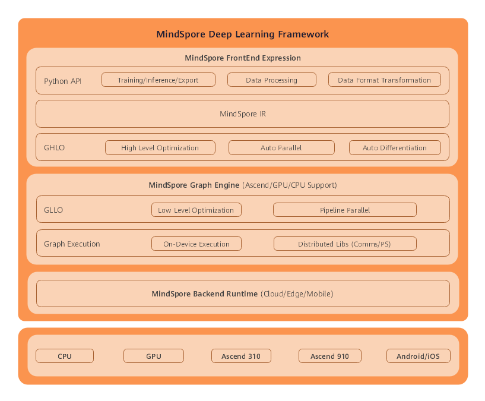

# Overall Architecture

`Ascend` `GPU` `CPU` `On Device` `Model Development` `Model Optimization` `Framework Development` `Intermediate` `Expert` `Contributor`

The MindSpore framework consists of the Frontend Expression layer, Graph Engine layer, and Backend Runtime layer.

- MindSpore Frontend Expression layer

  This layer contains Python APIs, MindSpore intermediate representation (IR), and graph high level optimization (GHLO).
  - Python APIs provide users with a unified API for model training, inference, and export, and a unified API for data processing and format transformation.
  - GHLO includes optimization irrelevant to hardware (such as dead code elimination), auto parallel, and auto differentiation.
  - MindSpore IR provides unified intermediate representations, based on which MindSpore performs pass optimization.

- MindSpore Graph Engine layer

  This layer contains graph low level optimization (GLLO) and graph execution.
  - GLLO includes hardware-related optimization and in-depth optimization related to the combination of hardware and software, such as operator fusion and buffer fusion.
  - Graph execution provides communication APIs required for offline graph execution and distributed training.

- MindSpore Backend Runtime layer

  This layer contains the efficient running environments on the cloud, edge and device.
