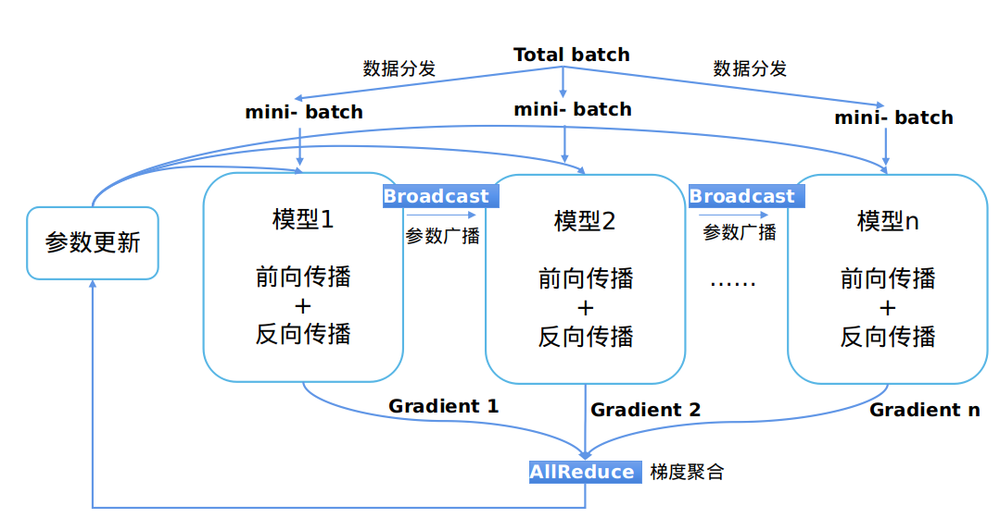

# 分布式训练设计

## 背景

随着深度学习的快步发展，为了提升神经网络的精度和泛化能力，数据集和参数量都在呈指数级向上攀升。分布式并行训练成为一种解决超大规模网络性能瓶颈的发展趋势。MindSpore支持了当前主流的分布式训练范式并开发了一套自动混合并行解决方案。本篇设计文档将会集中介绍几种并行训练方式的设计原理，同时指导用户进行自定义开发。

## 概念

### 集合通信

集合通信指在一组进程间通信，组内所有进程满足一定规则的发送和接收数据。MindSpore通过集合通信的方式进行并行训练过程中的数据传输工作，在Ascend芯片上它依赖于华为集合通信库HCCL完成。

### 同步模式

在同步模式下，所有的设备同时读取参数的取值，并且当反向传播算法完成之后同步更新参数的取值。MindSpore目前采用的是同步训练模式。

## 数据并行

这个小节介绍了在MindSpore中`ParallelMode.DATA_PARALLEL`数据并行模式是如何工作的。

### 设计原理

1. 环境依赖

    每次开始进行并行训练前，通过调用`mindspore.communication.init`接口初始化通信资源，并自动创建全局通信组`HCCL_WORLD_GROUP`。

2. 数据分发

    数据并行的核心在于将数据集在样本维度拆分并下发到不同的卡上。在`mindspore.dataset`模块提供的所有数据集加载接口中都有`num_shards`和`shard_id`两个参数，它们用于将数据集拆分为多份并循环采样的方式，采集`batch`大小的数据到各自的卡上，当出现数据量不足的情况时将会从头开始采样。

3. 网络构图

    数据并行网络的书写方式与单机网络没有差别，这是因为在正反向传播过程中各卡的模型间是独立执行的，只是保持了相同的网络结构。唯一需要特别注意的是为了保证各卡间训练同步，相应的网络参数初始化值应当是一致的，这里建议通过`numpy.random.seed`在每张卡上设置相同的随机数种子达到模型广播的目的。

4. 梯度聚合

    数据并行理论上应该实现和单机一致的训练效果，为了保证计算逻辑的一致性，在梯度计算完成后插入`AllReduce`算子实现各卡间的梯度聚合操作。这里我们设置了`mean`开关，用户可以选择是否要对求和后的梯度值进行求平均操作，也可以将其视为超参项，类比于学习率倍数放大或缩小。

5. 参数更新

    因为引入了梯度聚合操作，所以各卡的模型会以相同的梯度值一起进入参数更新步骤。因此MindSpore实现的是一种同步数据并行训练方式。理论上最终每卡训练出来的模型是相同的，如果网络中含有在样本维度的归约类型操作，网络的输出可能会有所差别，这是由数据并行的切分性质决定的。

### 代码实现

1. 集合通信

    - [management.py](https://gitee.com/mindspore/mindspore/blob/r0.6/mindspore/communication/management.py): 这个文件中涵盖了集合通信过程中常用的`helper`函数接口，例如获取集群数量和卡的序号等。当在Ascend芯片上执行时，框架会加载环境上的`libhccl.so`库文件，通过它来完成从Python层到底层的通信接口调用。
    - [comm_ops.py](https://gitee.com/mindspore/mindspore/blob/r0.6/mindspore/ops/operations/comm_ops.py): MindSpore将支持的集合通信操作都包装为算子的形式放在这个文件下，包括`AllReduce`、`AllGather`、`ReduceScatter`和`Broadcast`等。`PrimitiveWithInfer`中除了定义算子所需属性外，还包括构图过程中输入到输出的`shape`和`dtype`推导。

2. 梯度聚合

    - [grad_reducer.py](https://gitee.com/mindspore/mindspore/blob/r0.6/mindspore/nn/wrap/grad_reducer.py): 这个文件实现了梯度聚合的过程。对入参`grads`用`HyperMap`展开后插入`AllReduce`算子，这里采用的是全局通信组，用户也可以根据自己网络的需求仿照这个模块进行自定义开发。MindSpore中单机和分布式执行共用一套网络封装接口，在`Cell`内部通过`ParallelMode`来区分是否要对梯度做聚合操作，网络封装接口建议参考`TrainOneStepCell`代码实现。

## 其他并行

建设中，即将上线。

