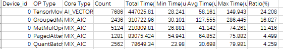
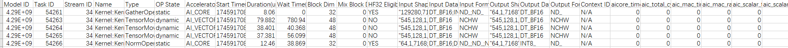
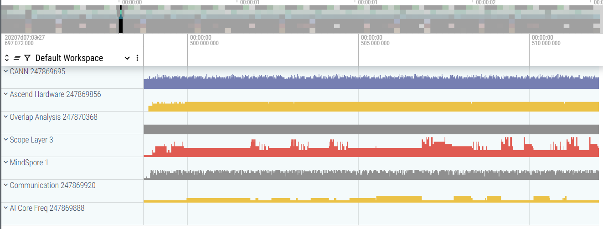
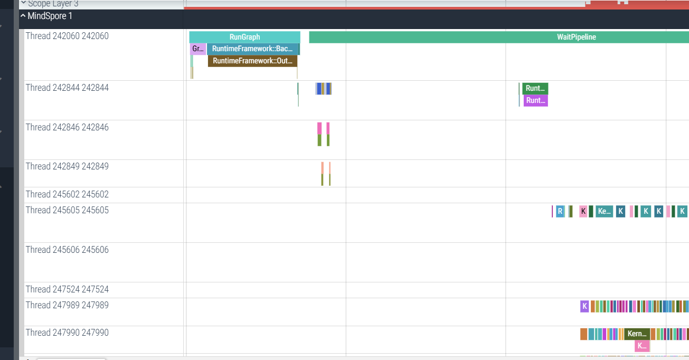
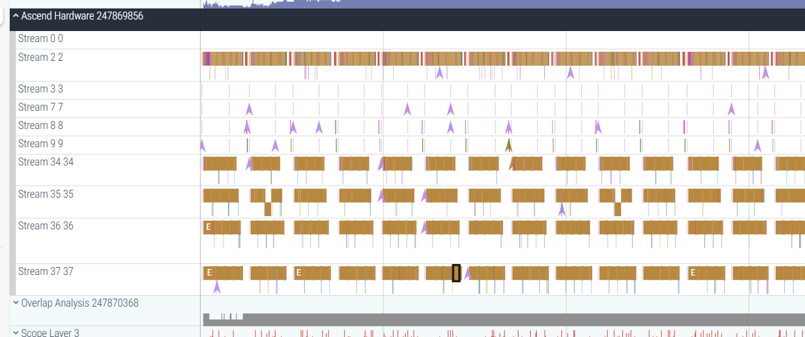

# Profiling Methods

[](https://gitee.com/mindspore/docs/blob/master/docs/vllm_mindspore/docs/source_en/user_guide/supported_features/profiling/profiling.md)

vLLM MindSpore supports the `mindspore.Profiler` module to track the performance of workers in vLLM MindSpore. User can follow the [Collecting Profiling Data](#collecting-profiling-data) section to gather data and then analyze it according to [Analyzing Profiling Data](#analyzing-profiling-data). Additionally, user can inspect the model's IR graph through [Graph Data Dump](#graph-data-dump) to analyze and debug the model structure.  

## Collecting Profiling Data

To enable profiling data collection, user need to set the `VLLM_TORCH_PROFILER_DIR` environment variable to the directory where the profiling results will be saved. For multi-machine inference, this variable must be set on each machine before inference:  

```bash
export VLLM_TORCH_PROFILER_DIR=/path/to/save/vllm_profile
```

After setting the variable, Run the following command to launch the vLLM MindSpore service. We take [Qwen2.5-32B](https://huggingface.co/Qwen/Qwen2.5-32B-Instruct) as an example:  

```bash  
export TENSOR_PARALLEL_SIZE=4
export MAX_MODEL_LEN=1024
python3 -m vllm_mindspore.entrypoints vllm.entrypoints.openai.api_server --model "Qwen/Qwen2.5-32B-Instruct" --trust_remote_code --tensor-parallel-size $TENSOR_PARALLEL_SIZE --max-model-len $MAX_MODEL_LEN
```  

If the service starts successfully, you will see output similar to the following, indicating that the `start_profile` and `stop_profile` requests are being monitored:  

```text  
INFO 05-15 12:03:07 [launcher.py:31] Route: /start_profile, Methods: POST  
INFO 05-15 12:03:07 [launcher.py:31] Route: /stop_profile, Methods: POST  
INFO: Started server process [212135]  
INFO: Waiting for application startup.  
INFO: Application startup complete.  
```  

Once the service is running, user can send the following requests to perform a profiling collection:  

```shell  
# Request to start profiling  
curl -X POST http://127.0.0.1:8000/start_profile  

# Request for inference  
curl http://localhost:8000/v1/completions \  
    -H "Content-Type: application/json" \  
    -d '{  
        "model": "/home/DeepSeekV3",  
        "prompt": "San Francisco is a",  
        "max_tokens": 7,  
        "temperature": 0  
    }'  

# Request to stop profiling  
curl -X POST http://127.0.0.1:8000/stop_profile  
```  

When the log displays content similar to the following, it indicates that profiling data collection for one worker is complete:  

```text  
Parsing: [####################] 3/3 Done  
```  

## Analyzing Profiling Data

The directory specified by `VLLM_TORCH_PROFILER_DIR` contains the profiling results, with subdirectories named with the `ascend_ms` suffix. Each subdirectory stores the profiling results for one worker. The files in these subdirectories can be referenced for performance analysis, as described in [Ascend Performance Tuning](https://www.mindspore.cn/tutorials/en/master/debug/profiler.html).  

User can select a subdirectory to analyze the performance of a single worker:  

- `op_statistic.csv`: Overall operator statistics.

    

- `kernel_details.csv`: Detailed execution data for each operator.

    

- `trace_view.json`: System-wide execution data. This file can be uploaded to the [Perfetto UI](https://ui.perfetto.dev/) for visual inspection of system execution. Clicking on a process in the left sidebar displays trace event information for all threads under that process:

    

  In MindSpore information, it shows the operator dispatch in graph execution.

    

  In Ascend information, it shows the actual execution of Ascend operators, which can be correlated with the operators dispatched in the MindSpore process.

    

## Graph Data Dump

Refer to the [MindSpore Dump Documentation](https://www.mindspore.cn/tutorials/en/master/debug/dump.html). First, configure the JSON file, then set the `MINDSPORE_DUMP_CONFIG` environment variable to point to the absolute path of this configuration file. After inference completes, the graph data can be obtained.  

The dump results include the IR graph. Additionally, by configuring the `dump_mode` in the JSON file, user can choose to dump execution data for all operators or specific operators.
