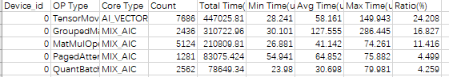
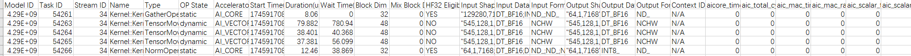
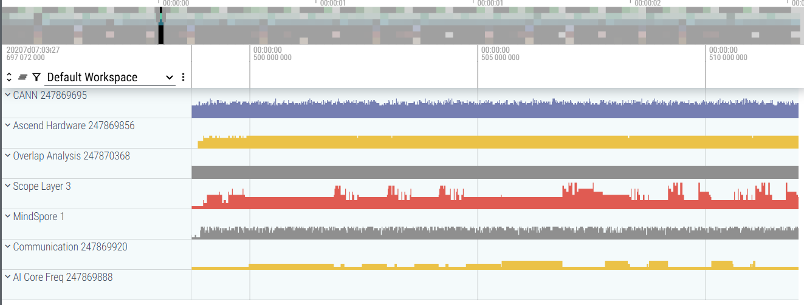
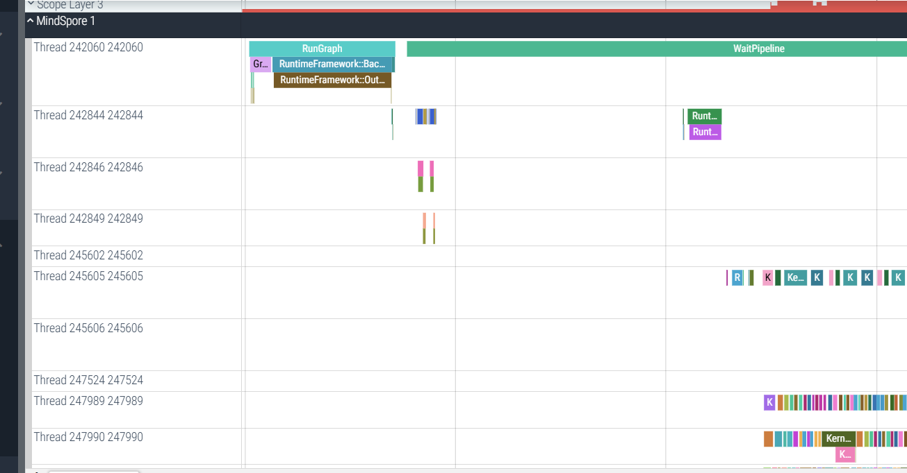
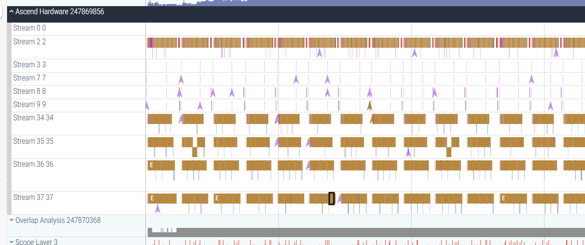

# 调试方法

[](https://gitee.com/mindspore/docs/blob/master/docs/vllm_mindspore/docs/source_zh_cn/user_guide/supported_features/profiling/profiling.md)

vLLM MindSpore支持使用`mindspore.Profiler`模块，跟踪vLLM MindSpore中worker的性能。用户可以根据[采集profiling数据](#采集profiling数据)章节，在完成数据采集后，根据[分析profiling数据](#分析profiling数据)，进行数据分析。另一方面，用户可以根据[图数据dump](#图数据dump)，查看模型的IR图，从而进行对模型结构的分析与调试。

## 采集profiling数据

用户开启profiling数据的采集，需要将`VLLM_TORCH_PROFILER_DIR`环境变量，设置为跟踪结果的保存目录，来开启跟踪功能。如果多机推理，在组网前每台机器都需要设置该变量：

```bash
export VLLM_TORCH_PROFILER_DIR=/path/to/save/vllm_profile
```

设置完成后，以[Qwen2.5-32B](https://huggingface.co/Qwen/Qwen2.5-32B-Instruct) 为例，启动vLLM MindSpore服务：

```bash
export TENSOR_PARALLEL_SIZE=4
export MAX_MODEL_LEN=1024
python3 -m vllm_mindspore.entrypoints vllm.entrypoints.openai.api_server --model "Qwen/Qwen2.5-32B-Instruct" --trust_remote_code --tensor-parallel-size $TENSOR_PARALLEL_SIZE --max-model-len $MAX_MODEL_LEN
```

若服务成功拉起，则可以获得类似的执行结果，且可以从中看到监听`start_profile`和`stop_profile`请求：

```text
INFO 05-15 12:03:07 [launcher.py:31] Route: /start_profile, Methods: POST
INFO 05-15 12:03:07 [launcher.py:31] Route: /stop_profile, Methods: POST
INFO: Started server process [212135]
INFO: Waiting for application startup.
INFO: Application startup complete.
```

在服务成功启动后，用户可通过以下命令，发送请求，执行一次profiling采集：

```shell
# Request for starting profiling
curl -X POST http://127.0.0.1:8000/start_profile

# Request for inference
curl http://localhost:8000/v1/completions \
    -H "Content-Type: application/json" \
    -d '{
        "model": "/home/DeepSeekV3",
        "prompt": "San Francisco is a",
        "max_tokens": 7,
        "temperature": 0
    }'

# Request for stopping profiling
curl -X POST http://127.0.0.1:8000/stop_profile
```

当日志中有类似的内容，则说明一个worker上的profiling数据采集完毕：

```text
Parsing: [####################] 3/3 Done
```

## 分析profiling数据

`VLLM_TORCH_PROFILER_DIR`指向的目录保存profiling结果，该目录下存在多个以`ascend_ms`为后缀结尾的子目录夹。一个子文件夹保存了一个worker的profiling结果。子文件夹中各文件作用可参考[Ascend性能调优](https://www.mindspore.cn/tutorials/zh-CN/master/debug/profiler.html)。

用户可选择一个子文件夹进行一个worker的性能分析：

- `op_statistic.csv`：算子总体数据。

   

- `kernel_details.csv`：算子每次执行数据。

   

- `trace_view.json`：系统总体执行。该文件可拖动至[Perfetto页面](https://ui.perfetto.dev/)，可视化查看系统总体执行情况。网页左侧侧边栏点击某个进程，可以查看该进程下所有线程中记录的trace事件信息：

   

   其中，打开MindSpore进程详细信息，可看到图执行中算子下发的情况，执行算子下发任务：

   

   打开Ascend进程详细信息，可看到昇腾算子的实际执行情况，这里面的算子可以与MindSpore进程中下发的算子对应：

   

## 图数据dump

参考[MindSpore dump功能文档](https://www.mindspore.cn/tutorials/zh-CN/master/debug/dump.html)，首先设置json配置文件，然后设置`MINDSPORE_DUMP_CONFIG`环境变量指向该配置文件的绝对路径，在推理结束可获取图数据。

dump结果包含了IR图，另外在json配置中对`dump_mode`做相应设置，选择dump所有算子或某些算子的执行数据。
