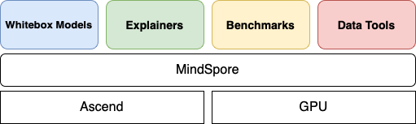

MindSpore XAI Documents
===========================

MindSpore XAI is an explainable AI toolbox based on MindSpore. Currently, most deep learning models are black-box models with good performance but poor explainability. XAI aims to provide users decision explanations of the model, help users better understand the model, trust the model, and improve the model when an error occurs. Besides a variety of explanation methods, we also provide a set of evaluation methods to evaluate the explanation methods from various dimensions. It helps users compare and select the explanation methods that are most suitable for a particular scenario.

Typical MindSpore XAI Application Scenarios
--------------------------------------------

1. Using Explainers <https://www.mindspore.cn/xai/docs/en/master/using_explainers.html>`_

   Explain image classification models by saliency maps.

2. Using Benchmarks <https://www.mindspore.cn/xai/docs/en/master/using_benchmarks.html>`_

   Score the goodness of explainers.

3. Using MindInsight <https://www.mindspore.cn/xai/docs/en/master/using_mindinsight.html>`_

   Visualize the results from explainers and benchmarks.

.. toctree::
   :glob:
   :maxdepth: 1
   :caption: Installation

   installation

.. toctree::
   :glob:
   :maxdepth: 1
   :caption: Guide

   using_explainers
   using_benchmarks
   using_mindinsight
