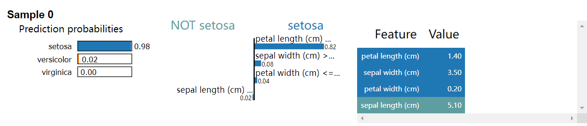
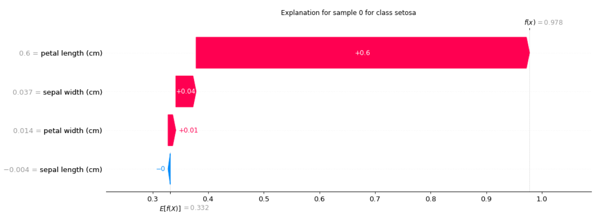
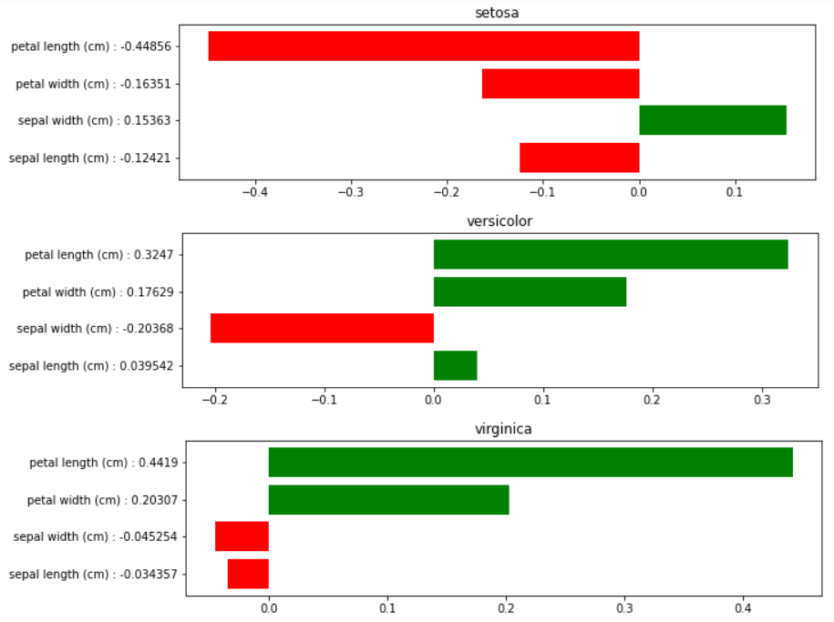

# Using Tabular Explainers

<a href="https://gitee.com/mindspore/docs/blob/r1.9/docs/xai/docs/source_en/using_tabular_explainers.md" target="_blank"></a>

## Introduction

In this tutorial we explain the tabular data classification using 4 different explainers, including `LIMETabular`,
`SHAPKernel`, `SHAPGradient`, and `PseudoLinearCoef`.

The complete code of the tutorial below is [using_tabular_explainers.py](https://gitee.com/mindspore/xai/blob/r1.9/examples/using_tabular_explainers.py).

## Import Dataset

We use the [Iris](https://scikit-learn.org/stable/auto_examples/datasets/plot_iris_dataset.html) dataset for the demonstration.
These data sets consist of 3 different types of irises’ petal and sepal lengths.

```python
import sklearn.datasets
import mindspore as ms

iris = sklearn.datasets.load_iris()

# feature_names: ['sepal length (cm)', 'sepal width (cm)', 'petal length (cm)', 'petal width (cm)']
feature_names = iris.feature_names
# class_names: ['setosa', 'versicolor', 'virginica']
class_names = list(iris.target_names)

# convert data and labels from numpy array to mindspore tensor
# use the first 100 samples
data = ms.Tensor(iris.data, ms.float32)[:100]
labels = ms.Tensor(iris.target, ms.int32)[:100]

# explain the first sample
inputs = data[:1]
# explain the label 'setosa'(class index 0)
targets = 0
```

## Import Model

Here we define a simple linear classifier.

```python
import numpy as np
import mindspore.nn as nn


class LinearNet(nn.Cell):
    def __init__(self):
        super(LinearNet, self).__init__()
        # input features: 4
        # output classes: 3
        self.linear = nn.Dense(4, 3, activation=nn.Softmax())

    def construct(self, x):
        x = self.linear(x)
        return x


net = LinearNet()

# load pre-trained parameters
weight = np.array([[0.648, 1.440, -2.05, -0.977], [0.507, -0.276, -0.028, -0.626], [-1.125, -1.183, 2.099, 1.605]])
bias = np.array([0.308, 0.343, -0.652])
net.linear.weight.set_data(ms.Tensor(weight, ms.float32))
net.linear.bias.set_data(ms.Tensor(bias, ms.float32))
```

## Using LIMETabular

`LIMETabular` approximates the machine learning model with a local, interpretable model to explain each individual
prediction.

```python
from mindspore_xai.explainer import LIMETabular

# convert features to feature stats
feature_stats = LIMETabular.to_feat_stats(data, feature_names=feature_names)
# initialize the explainer
lime = LIMETabular(net, feature_stats, feature_names=feature_names, class_names=class_names)
# explain
lime_outputs = lime(inputs, targets, show=True)
print("LIMETabular:")
for i, exps in enumerate(lime_outputs):
    for exp in exps:
        print("Explanation for sample {} class {}:".format(i, class_names[targets]))
        print(exp, '\n')
```

output:

```text
LIMETabular:

Explanation for sample 0 class setosa:

[('petal length (cm) <= 1.60', 0.8182714590301656),
('sepal width (cm) > 3.30', 0.0816516722404966), ('petal width (cm) <= 0.30', 0.03557190104069489),
('sepal length (cm) <= 5.10', -0.021441399016492325)]
```



`LIMETabular` also supports a callable function, for example:

```python
def predict_fn(x):
    return net(x)


# initialize the explainer
lime = LIMETabular(predict_fn, feature_stats, feature_names=feature_names, class_names=class_names)
```

## Using SHAPKernel

`SHAPKernel` is a method that uses a special weighted linear regression to compute the importance of each feature.

```python
from mindspore_xai.explainer import SHAPKernel

# initialize the explainer
shap_kernel = SHAPKernel(net, data, feature_names=feature_names, class_names=class_names)
# explain
shap_kernel_outputs = shap_kernel(inputs, targets, show=True)
print("SHAPKernel:")
for i, exps in enumerate(shap_kernel_outputs):
    for exp in exps:
        print("Explanation for sample {} class {}:".format(i, class_names[targets]))
        print(exp, '\n')
```

output:

```text
SHAPKernel:

Explanation for sample 0 class setosa:

[-0.00403276  0.03651359  0.59952676  0.01399141]
```



`SHAPKernel` also supports a callable function, for example:

```python
# initialize the explainer
shap_kernel = SHAPKernel(predict_fn, data, feature_names=feature_names, class_names=class_names)
```

## Using SHAPGradient

`SHAPGradient` explains a model using expected gradients (an extension of integrated gradients).

```python
from mindspore_xai.explainer import SHAPGradient

# initialize the explainer
shap_gradient = SHAPGradient(net, data, feature_names=feature_names, class_names=class_names)
# explain
shap_gradient_outputs = shap_gradient(inputs, targets, show=True)
print("SHAPGradient:")
for i, exps in enumerate(shap_gradient_outputs):
    for exp in exps:
        print("Explanation for sample {} class {}:".format(i, class_names[targets]))
        print(exp, '\n')
```

output:

```text
SHAPGradient:

Explanation for sample 0 class setosa:

[-0.0112452  0.08389313  0.47006473  0.0373782]
```


## Using PseudoLinearCoef

`PseudoLinearCoef` provides a global attribution method to measure the sensitivity of features around the classifier decision boundary.

```python
from mindspore_xai.explainer import PseudoLinearCoef

# initialize the explainer
plc_explainer = PseudoLinearCoef(net, len(class_names), feature_names=feature_names, class_names=class_names)
# explain
plc, relative_plc = plc_explainer(data, show=True)
```



```python
print("Pseudo Linear Coef.:")
for target, target_name in enumerate(class_names):
    print(f"class {target_name}")
    print(str(plc[target]))

print("\nRelative Pseudo Linear Coef.:")
for target, target_name in enumerate(class_names):
    for view_point, view_point_name in enumerate(class_names):
        if target == view_point:
            continue
        print(f"{target_name} relative to {view_point_name}")
        print(str(relative_plc[target, view_point]))
```

output:

```text
Pseudo Linear Coef.:

class setosa

[-0.12420721  0.15363358 -0.44856226 -0.16351467]

class versicolor

[ 0.03954152 -0.20367564  0.3246966  -0.17629193]

class virginica

[-0.03425665 -0.04525428  0.44189668  0.20307252]

Relative Pseudo Linear Coef.:

setosa relative to versicolor

[-0.12564947  0.15629557 -0.44782427 -0.16126522]

setosa relative to virginica

[-0.11122696  0.12967573 -0.45520434 -0.18375972]

versicolor relative to setosa

[ 0.02240782 -0.23672473  0.3889126   0.21666989]

versicolor relative to virginica

[ 0.21087858  0.1268154  -0.31746316 -0.22748768]

virginica relative to setosa

[ 0.07109872 -0.08392082  0.5585888   0.23082316]

virginica relative to versicolor

[-0.15152863 -0.00229146  0.31223866  0.17223847]
```
