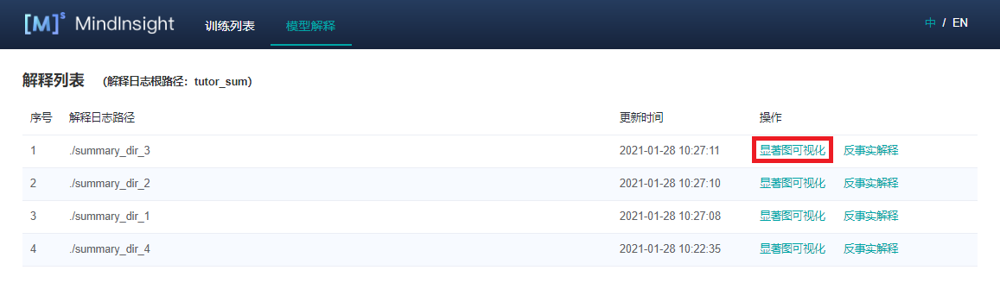
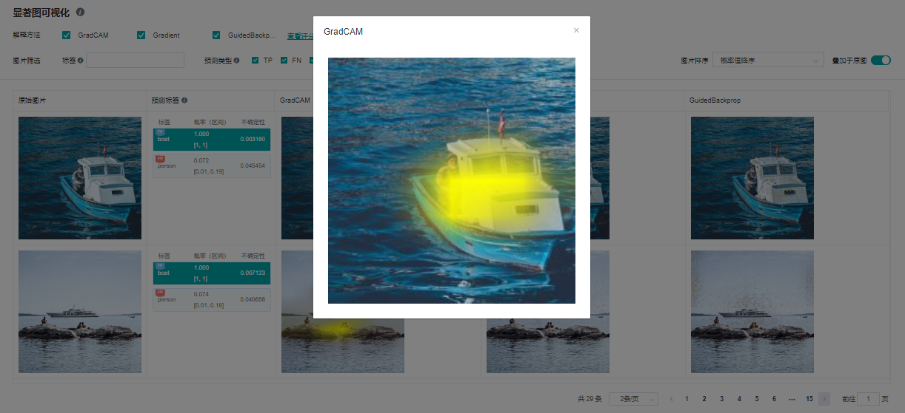
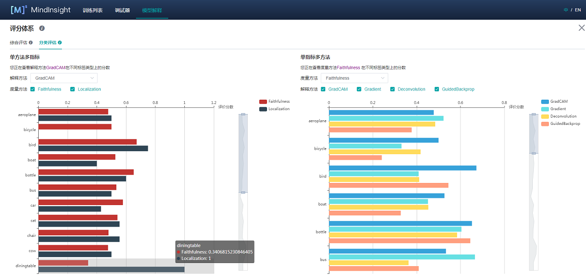
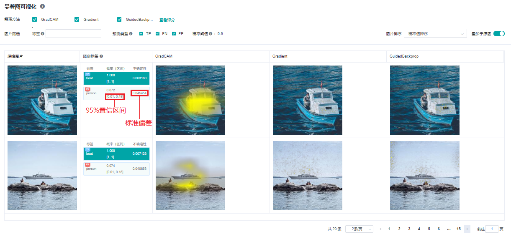
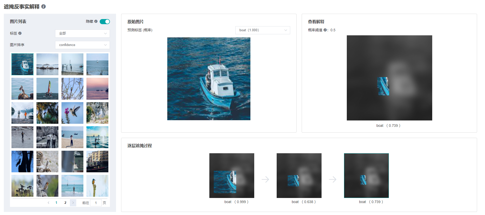

# 使用 MindInsight 可视化

<!-- TOC -->

- [使用 MindInsight 可视化](#使用-mindinsight-可视化)
    - [操作流程](#操作流程)
        - [下载教程数据集及模型](#下载教程数据集及模型)
        - [准备脚本](#准备脚本)
        - [使用限制](#使用限制)
        - [启动 MindInsight](#启动-mindinsight)
    - [页面及功能介绍](#页面及功能介绍)
        - [显著图可视化](#显著图可视化)
        - [解释方法评估](#解释方法评估)
            - [综合评估](#综合评估)
            - [分类评估](#分类评估)
    - [不确定性](#不确定性)
    - [反事实](#反事实)
        - [基于遮掩的反事实](#基于遮掩的反事实)
            - [基于遮掩的反事实使用限制](#基于遮掩的反事实使用限制)
            - [基于遮掩的反事实页面及功能介绍](#基于遮掩的反事实页面及功能介绍)

<!--/ TOC -->

<a href="https://gitee.com/mindspore/docs/blob/master/docs/xai/docs/source_zh_cn/using_mindinsight.md" target="_blank"></a>

## 操作流程

### 下载教程数据集及模型

请参阅 [下载教程数据集及模型](https://www.mindspore.cn/xai/docs/zh-CN/master/using_explainers.html#下载教程数据集及模型) 以下载所有本教程所需的文件。

### 准备脚本

以下教程参考了 [using_mindinsight.py](https://gitee.com/mindspore/xai/blob/master/examples/using_mindinsight.py) 。

当前[MindSpore XAI](https://www.mindspore.cn/xai)提供解释方法及给解释方法进行评估的度量Python API，已提供的解释方法可以通过`mindspore_xai.explanation`包获取，度量方法可以通过`mindspore_xai.benchmark`包获取。用户准备好待解释的黑盒模型和数据，在脚本中根据需要实例化解释方法及度量方法，调用API用于收集解释结果和解释度量结果。

MindSpore XAI还提供`mindspore_xai.runner.ImageClassificationRunner`运行模块，支持自动化运行所有解释方法和度量方法。用户将实例化的解释方法及度量方法进行注册，即可自动运行解释方法及度量方法，并生成及保存包含解释结果及解释度量结果的解释日志。

下面以ResNet50及带有20类多标签数据为例，用户初始化`explanation`中解释方法及`benchmark`中度量方法，调用`ImageClassificationRunner`进行解释和度量。其样例代码如下：

```python
# 必须先把当前目录切换到 xai/examples/
import mindspore.nn as nn
from mindspore import context
from mindspore import load_checkpoint, load_param_into_net

from mindspore_xai.explanation import GradCAM, GuidedBackprop
from mindspore_xai.benchmark import Faithfulness
from mindspore_xai.runner import ImageClassificationRunner

from common.resnet import resnet50
from common.dataset import classes, load_dataset


context.set_context(mode=context.PYNATIVE_MODE)
num_classes = 20

net = resnet50(num_classes)
param_dict = load_checkpoint("xai_examples_data/ckpt/resnet50.ckpt")
load_param_into_net(net, param_dict)

# 构造解释器及加载黑盒模型
gradcam = GradCAM(net, layer='layer4')
guidedbackprop = GuidedBackprop(net)

# 构造度量方法去为解释器评分
# 需要用激活函数去构造 Faithfulness 度量方法, Faithfulness 会使用激活函数把模型输出的 logit 转换为分类慨率
activation_fn = nn.Sigmoid()  # for multi-label classification
faithfulness = Faithfulness(num_labels=num_classes, metric='InsertionAUC', activation_fn=activation_fn)

# 构造要解释的数据集对象, 如果要使用 Localization 评分, 数据集需要提供界框资讯
# 数据集要提供以下其中一种的资讯列组合: [图], [图, 标签] 或 [图, 标签, 界框] (资讯列的先后次序必须跟从)
# 请参阅 'mindspore.dataset.project' 的API文档了解如何管理资讯列
test_dataset = load_dataset('xai_examples_data/test')

data = (test_dataset, classes)
explainers = [gradcam, guidedbackprop]
benchmarkers = [faithfulness]

# 构造 runner 时要指定 summary_dir 文件夹路径
runner = ImageClassificationRunner(summary_dir='./summary_dir', network=net, activation_fn=activation_fn, data=data)
runner.register_saliency(explainers, benchmarkers)

# 调用 runner.run() 会产生解释及评分结果并会保存到 summary_dir 文件夹
runner.run()
```

### 使用限制

- 当前只支持图片分类下的CNN网络模型，比如：Lenet、Resnet、Alexnet。
- 输入的图片数据必须为单通道、三通道或四通道格式。
- 仅支持GPU和Ascend设备下的PyNative运行模式。
- 不同的 `ImageClassificationRunner` 对象需要使用不同的解释方法及度量方法对象，所以用户必须针对每个 `ImageClassificationRunner` 对象实例化独占的解释方法及度量方法对象，否则可能会产生错误。下方是一个正确的实例化示例。

```python
gradcam = GradCAM(net, layer='layer4')
guidedbackprop = GuidedBackprop(net)

runner = ImageClassificationRunner(summary_dir='./summary_dir_1', network=net, activation_fn=activation_fn, data=data)
runner.register_saliency(explainers=[gradcam, guidedbackprop])
runner.run()

# 只使用 GradCAM 构造另一個 runner
runner2 = ImageClassificationRunner(summary_dir='./summary_dir_2', network=net, activation_fn=activation_fn, data=data)

# 在另一个 runner 中重用解释器对象可能会引致异常或错误, 例如:
# runner2.register_saliency(explainers=[gradcam])

# 使用新构造的 GradCAM 对象是正确的做法
gradcam2 = GradCAM(net, layer='layer4')
runner2.register_saliency(explainers=[gradcam2])

runner2.run()
```

### 启动 MindInsight

启动MindInsight系统，在顶部选择进入“模型解释”模块。可以看到所有的解释日志路径，当日志满足条件时，操作列会有“显著图可视化”的功能入口。



## 页面及功能介绍

### 显著图可视化

显著图可视化用于展示对模型决策结果影响最为显著的图片区域，通常高亮部分可视为图片被标记为目标分类的关键特征。


进入显著图可视化界面，会展示：

- 用户通过Dataset的Python API接口设置的目标数据集。
- 真实标签、预测标签，以及模型对对应标签的预测概率。根据具体情况，系统会在对应标签的左上角增加TP，FN，FP（含义见界面提示信息）的旗标。
- 选中的解释方法给出的显著图。

界面操作：

1. 通过界面上方的解释方法勾选需要的解释方法。
2. 通过切换界面右上方的“叠加于原图”按钮可以选择让显著图叠加于原图上显示。
3. 点击不同标签，显示模型对不同标签的显著图分析结果。对于不同的分类结果，通常模型的关注点也是不同的。
4. 点选预测类型复选框，以显示具有已选类型的标签的图片：TP - 真阳性、 FN - 假阴性、 FP - 假阳性。
5. 通过界面上方的标签筛选功能，筛选出指定标签图片。
6. 通过界面右上角的图片排序改变图片显示的顺序，可选“概率值降序”或“不确定性值降序”。
7. 点击解释方法最右边的“查看评分”，可以进入评估所有解释方法的界面。
8. 点击图片可查看放大图。



### 解释方法评估

#### 综合评估

对当前提供的解释方法，从不同的评估维度进行评分。我们提供了多种评估度量维度，帮助用户对比不同解释方法在不同维度上的表现，从而挑选最适合用户使用的解释方法。用户可以根据对特定场景下看中的指标进行权重配置，得到综合得分。


#### 分类评估

分类评估页提供两种形式的对比，一种是同一解释方法的不同度量维度在各个标签下的分值，一种是对于同一度量维度，不同解释方法在各个标签下的分值。



## 不确定性

模型决策结果存有不确定性，名为 [Epistemic Uncertainty](https://www.mindspore.cn/probability/docs/zh-CN/master/nn_probability/mindspore.nn.probability.toolbox.UncertaintyEvaluation.html#mindspore.nn.probability.toolbox.UncertaintyEvaluation) 。计算方法是在模型中插入dropout层再多次重复推理，最后得出输出概率的标准偏差和95%置信区间：



模型和数据集的准备、使用限制跟前述的解释方法相同，用户通过调用 `ImageClassificationRunner` 的 `register_uncertainty()` 来启用不确定性计算，下方是一个使用例子。

```python
runner = ImageClassificationRunner(summary_dir='./summary_dir_1', network=net, activation_fn=activation_fn, data=data)
runner.register_saliency(explainers=[gradcam, guidedbackprop])
runner.register_uncertainty()
runner.run()
```

要注意的是 `register_uncertainty()` 必须跟 `register_saliency()`一起使用，但调用次序没有限制。

## 反事实

反事实是一种相对新的模型解释方法，是指对已得出的推理结果进行否定而重新表征。例如一张动物图片被模型分类为猫，我们可以通过解答反事实问题（例如：如何把这张图片进行编辑从而令其不会被模型分类为猫?）从而解释一个模型决策（例如：将这张图片分类为猫）。反事实解释存有不同的形式，`ImageClassificationRunner` 提供了一个容易使用的“基于遮掩的反事实（简称“HOC”）”接口。将来，会支持不同的反事实功能。

### 基于遮掩的反事实

HOC是一种基于遮掩的反事实方法，目的是在目标标签的预测概率高于阈值(暂固定为0.5)的约束条件下搜索出最小的图片显示区域。整个搜索是一个分层级的过程，首先把整个图片使用高斯模糊遮掩住，之后从最大的显示区块开始搜索，再深入搜索到更小的子区块以获得更精确的结果。最终我们会得到一个区块树，每一个节点代表一个正方形的显示区块，而子节点则是在父节点范围内的更小的正方形显示区块。根节点代表了整个原始图片区域，而它的直接子节点就是第一层的显示区块。

目前，`ImageClassificationRunner` 会基于输入图片大小自动计算分层数量(一到三层)，显示区块大小，平移步幅及模糊遮掩图。第一层的显示区块边长为输入图片的短边的一半(向下舍入)，每下一层显示区块边长就会减半，最小为28个像素否则不会再增加下一层。平移步幅是显示区块边长的五分之一(向下舍入)。

模型和数据集的准备跟前述的解释方法相同，用户通过调用 `ImageClassificationRunner` 的 `register_hierarchical_occlusion()` 来启用HOC，下方是一个使用例子。

```python
runner = ImageClassificationRunner(summary_dir='./summary_dir_1', network=net, activation_fn=activation_fn, data=data)
runner.register_hierarchical_occlusion()
runner.run()
```

用户可在同一个runner上配合使用 register_saliency() 。

#### 基于遮掩的反事实使用限制

- 包括所有前述的使用限制，但只支持三通道输入的模型。
- 图片数据必须为RGB三通道格式，短边的长度必须大于或等于56像素。
- 在只调用了`register_hierarchical_occlusion()`但没有调用`register_saliency()`的情况下，可以同时支持PyNative和Graph运行模式。

#### 基于遮掩的反事实页面及功能介绍

可以看到在解释日志列表上所有使用了HOC功能的解释日志的”反事实解释”链接已经可被点击，点击后就会进入反事实页面。


基于遮掩的反事实解释页面展示了所有搜寻到的结果，包括：

- 所有预测概率大于0.5的目标标签的样本及其原始图片。
- 目标标签的预测概率。
- 搜索过程中每个分层的结果图及其预测概率。



界面操作：

1. 在左侧“图片列表”面板右上方有个“隐藏”开关，当开关开启时页面将会隐藏不含HOC解释结果的数据。开关默认为开启，用户可选择关闭以显示所有数据。
2. 在左侧“图片列表”面板选择要显示样本的标签筛选及排序方法，可以选择使用预测概率排序。
3. 在左侧“图片列表”面板流览样本或翻页，当点击了一个样本图片后，相关的HOC搜索结果会在其他的面板上显示。
4. 在中央“原始图片”面板选择要显示的标签搜寻结果，只有预测概率大于0.5的标签才有HOC搜索结果。
5. 在下方“逐层遮掩过程”面板检视搜寻过程的分层结果图，当点击了一张结果图后，它会被放大显示在右侧“查看解释”面板上。 (注意: 为了区分显示，已遮掩的区域被降低了亮度及转成了灰阶，但在实际的搜索中只是使用了高斯模糊作遮掩，并没有对亮度或彩度进行调整。)
