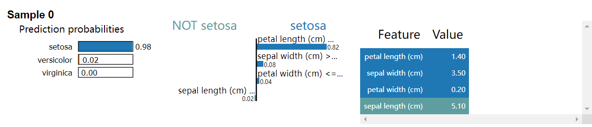
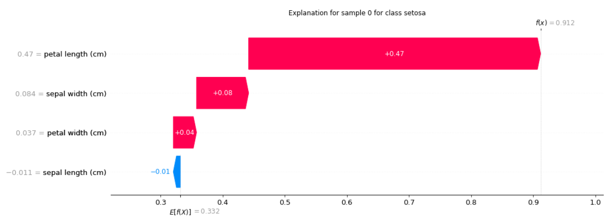

# 使用表格解释器

<a href="https://gitee.com/mindspore/docs/blob/master/docs/xai/docs/source_zh_cn/using_tabular_explainers.md" target="_blank"></a>

## 简介

在这个教程中，我们将使用三个不同的解释器来解释表格数据的分类结果，这三个解释器包括 `LIMETabular` ，
 `SHAPKernel` 和 `SHAPGradient` 。

所有解释器都支持 `PYNATIVE_MODE` 。除了 `SHAPGradient` 以外的所有解释器都支持 `GRAPH_MODE` 。

|     解释器      |  PYNATIVE_MODE  | GRAPH_MODE |
|:------------:|:---------------:|:----------:|
| LIMETabular  |       支持        |     支持     |
|  SHAPKernel  |       支持        |     支持     |
| SHAPGradient |       支持        |  <blank>   |

以下教程的完整代码：[using_tabular_explainers.py](https://gitee.com/mindspore/xai/blob/master/examples/using_tabular_explainers.py).

## 准备数据集

我们使用 [Iris](https://scikit-learn.org/stable/auto_examples/datasets/plot_iris_dataset.html) 数据集进行演示，
这个数据集包含了三种鸢尾花的花瓣长度和萼片长度。

```python
import sklearn.datasets
import mindspore as ms

iris = sklearn.datasets.load_iris()

# 特征名称: ['sepal length (cm)', 'sepal width (cm)', 'petal length (cm)', 'petal width (cm)']
feature_names = iris.feature_names
# 类别名称: ['setosa', 'versicolor', 'virginica']
class_names = list(iris.target_names)

# 将数据和标签从 numpy 数组转换为 mindspore Tensor
# 使用前100个样本
data = ms.Tensor(iris.data, ms.float32)[:100]
labels = ms.Tensor(iris.target, ms.int32)[:100]

# 解释第一个样本
inputs = data[:1]
# 解释标签 'setosa'（类索引 0）
targets = 0
```

## 准备模型

这里我们定义一个简单的线性分类器。

```python
import numpy as np
import mindspore.nn as nn


class LinearNet(nn.Cell):
    def __init__(self):
        super(LinearNet, self).__init__()
        # 输入特征个数: 4
        # 输出类别个数: 3
        self.linear = nn.Dense(4, 3, activation=nn.Softmax())

    def construct(self, x):
        x = self.linear(x)
        return x


net = LinearNet()

# 加载预训练参数
weight = np.array([[0.648, 1.440, -2.05, -0.977], [0.507, -0.276, -0.028, -0.626], [-1.125, -1.183, 2.099, 1.605]])
bias = np.array([0.308, 0.343, -0.652])
net.linear.weight.set_data(ms.Tensor(weight, ms.float32))
net.linear.bias.set_data(ms.Tensor(bias, ms.float32))
```

## 使用 LIMETabular

`LIMETabular` 针对一个复杂难解释的模型，提供一个局部可解释的模型来对单个样本进行解释。

```python
from mindspore_xai.explainer import LIMETabular

# 将特征转换为特征统计数据
feature_stats = LIMETabular.to_feat_stats(data, feature_names=feature_names)
# 初始化解释器
lime = LIMETabular(net, feature_stats, feature_names=feature_names, class_names=class_names)
# 解释
lime_outputs = lime(inputs, targets, show=True)
print("LIMETabular:")
for i, exps in enumerate(lime_outputs):
    for j, exp in enumerate(exps):
        print("对于第 {} 个样本的类别 {} 的解释：".format(i, class_names[targets]))
        print(exp, '\n')
```

输出:
> LIMETabular：
>
> 对于第 0 个样本的类别 setosa 的解释:
>
> [('petal length (cm) <= 1.60', 0.8182714590301656),
> ('sepal width (cm) > 3.30', 0.0816516722404966), ('petal width (cm) <= 0.30', 0.03557190104069489),
> ('sepal length (cm) <= 5.10', -0.021441399016492325)]



`LIMETabular` 也支持可调用函数，例如：

```python
def predict_fn(x):
    return net(x)


# 初始化解释器
lime = LIMETabular(predict_fn, feature_stats, feature_names=feature_names, class_names=class_names)
```

## 使用 SHAPKernel

`SHAPKernel` 使用特殊的加权线性回归来计算每个特征的重要性。

```python
from mindspore_xai.explainer import SHAPKernel

# 初始化解释器
shap_kernel = SHAPKernel(net, data, feature_names=feature_names, class_names=class_names)
# 解释
shap_kernel_outputs = shap_kernel(inputs, targets, show=True)
print("SHAPKernel:")
for i, exps in enumerate(shap_kernel_outputs):
    for j, exp in enumerate(exps):
        print("对于第 {} 个样本的类别 {} 的解释：".format(i, class_names[targets]))
        print(exp, '\n')
```

输出:
> SHAPKernel:
>
> 对于第 0 个样本的类别 setosa 的解释:
>
> [-0.00403276  0.03651359  0.59952676  0.01399141]


`SHAPKernel` 也支持可调用函数，例如：

```python
# 初始化解释器
shap_kernel = SHAPKernel(predict_fn, data, feature_names=feature_names, class_names=class_names)
```

## 使用 SHAPGradient

`SHAPGradient` 使用预期梯度（积分梯度的一种扩展）来解释模型。

```python
from mindspore_xai.explainer import SHAPGradient
from mindspore import set_context, PYNATIVE_MODE

# 梯度仅在 PYNATIVE_MODE 下有效。
set_context(mode=PYNATIVE_MODE)
# 初始化解释器
shap_gradient = SHAPGradient(net, data, feature_names=feature_names, class_names=class_names)
# 解释
shap_gradient_outputs = shap_gradient(inputs, targets, show=True)
print("SHAPGradient:")
for i, exps in enumerate(shap_gradient_outputs):
    for j, exp in enumerate(exps):
        print("对于第 {} 个样本的类别 {} 的解释：".format(i, class_names[targets]))
        print(exp, '\n')
```

输出:

> SHAPGradient:
>
> 对于第 0 个样本的类别 setosa 的解释:
>
> [-0.0112452   0.08389313  0.47006473  0.0373782 ]


