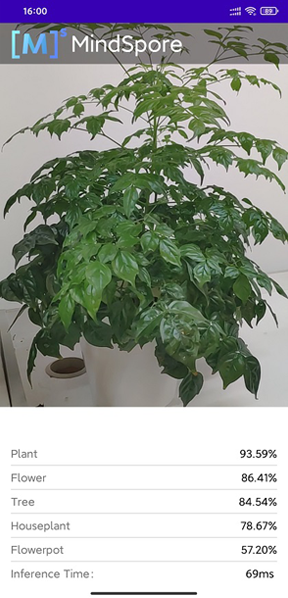

# Implementing an Image Classification Application

<a href="https://gitee.com/mindspore/docs/blob/r0.7/lite/tutorials/source_en/quick_start/quick_start.md" target="_blank"></a>

## Overview

It is recommended that you start from the image classification demo on the Android device to understand how to build the MindSpore Lite application project, configure dependencies, and use related APIs.
     
This tutorial demonstrates the on-device deployment process based on the image classification sample program on the Android device provided by the MindSpore team.  

1. Select an image classification model.
2. Convert the model into a MindSpore Lite model.
3. Use the MindSpore Lite inference model on the device. The following describes how to use the MindSpore Lite C++ APIs (Android JNIs) and MindSpore Lite image classification models to perform on-device inference, classify the content captured by a device camera, and display the most possible classification result on the application's image preview screen.
   
> Click to find [Android image classification models](https://download.mindspore.cn/model_zoo/official/lite/mobilenetv2_openimage_lite) and [sample code](https://gitee.com/mindspore/mindspore/tree/r0.7/model_zoo/official/lite/image_classification).

## Selecting a Model

The MindSpore team provides a series of preset device models that you can use in your application.  
Click [here](https://download.mindspore.cn/model_zoo/official/lite/mobilenetv2_openimage_lite/mobilenetv2.ms) to download image classification models in MindSpore ModelZoo.
In addition, you can use the preset model to perform migration learning to implement your image classification tasks. 

## Converting a Model

After you retrain a model provided by MindSpore, export the model in the [.mindir format](https://www.mindspore.cn/tutorial/en/r0.7/use/saving_and_loading_model_parameters.html#export-mindir-model). Use the MindSpore Lite [model conversion tool](https://www.mindspore.cn/lite/tutorial/en/r0.7/use/converter_tool.html) to convert the .mindir model to a .ms model.

Take the mobilenetv2 model as an example. Execute the following script to convert a model into a MindSpore Lite model for on-device inference.
```bash
./converter_lite --fmk=MS --modelFile=mobilenetv2.mindir --outputFile=mobilenetv2.ms
```

## Deploying an Application

The following section describes how to build and execute an on-device image classification task on MindSpore Lite.

### Running Dependencies

- Android Studio 3.2 or later (Android 4.0 or later is recommended.)
- Native development kit (NDK) 21.3
- CMake 3.10.2
- Android software development kit (SDK) 26 or later
- OpenCV 4.0.0 or later (included in the sample code)

### Building and Running

1. Load the sample source code to Android Studio and install the corresponding SDK. (After the SDK version is specified, Android Studio automatically installs the SDK.) 

    

    Start Android Studio, click `File > Settings > System Settings > Android SDK`, and select the corresponding SDK. As shown in the following figure, select an SDK and click `OK`. Android Studio automatically installs the SDK.

    

    (Optional) If an NDK version issue occurs during the installation, manually download the corresponding [NDK version](https://developer.android.com/ndk/downloads) (the version used in the sample code is 21.3). Specify the SDK location in `Android NDK location` of `Project Structure`.

    

2. Connect to an Android device and runs the image classification application.

    Connect to the Android device through a USB cable for debugging. Click `Run 'app'` to run the sample project on your device.

    

    For details about how to connect the Android Studio to a device for debugging, see <https://developer.android.com/studio/run/device>.

3. Continue the installation on the Android device. After the installation is complete, you can view the content captured by a camera and the inference result.

    


## Detailed Description of the Sample Program  

This image classification sample program on the Android device includes a Java layer and a JNI layer. At the Java layer, the Android Camera 2 API is used to enable a camera to obtain image frames and process images. At the JNI layer, the model inference process is completed in [Runtime](https://www.mindspore.cn/lite/tutorial/en/r0.7/use/runtime.html).

> This following describes the JNI layer implementation of the sample program. At the Java layer, the Android Camera 2 API is used to enable a device camera and process image frames. Readers are expected to have the basic Android development knowledge.

### Sample Program Structure

```
app
|
├── libs # library files that store MindSpore Lite dependencies
│   └── arm64-v8a
│       ├── libopencv_java4.so
│       └── libmindspore-lite.so
│
├── opencv # dependency files related to OpenCV
│   └── ...
|
├── src/main
│   ├── assets # resource files
|   |   └── model.ms # model file
│   |
│   ├── cpp # main logic encapsulation classes for model loading and prediction
|   |   ├── include # header files related to MindSpore calling
|   |   |   └── ...
│   |   |
|   |   ├── MindSporeNetnative.cpp # JNI methods related to MindSpore calling
│   |   └── MindSporeNetnative.h # header file
│   |
│   ├── java # application code at the Java layer
│   │   └── com.huawei.himindsporedemo 
│   │       ├── gallery.classify # implementation related to image processing and MindSpore JNI calling
│   │       │   └── ...
│   │       └── obejctdetect # implementation related to camera enabling and drawing
│   │           └── ...
│   │   
│   ├── res # resource files related to Android
│   └── AndroidManifest.xml # Android configuration file
│
├── CMakeList.txt # CMake compilation entry file
│
├── build.gradle # Other Android configuration file
└── ...
```

### Configuring MindSpore Lite Dependencies

When MindSpore C++ APIs are called at the Android JNI layer, related library files are required. You can use MindSpore Lite [source code compilation](https://www.mindspore.cn/lite/tutorial/en/r0.7/build.html) to generate the `libmindspore-lite.so` library file.

In Android Studio, place the compiled `libmindspore-lite.so` library file (which can contain multiple compatible architectures) in the `app/libs/ARM64-V8a` (Arm64) or `app/libs/armeabi-v7a` (Arm32) directory of the application project. In the `build.gradle` file of the application, configure the compilation support of CMake, `arm64-v8a`, and `armeabi-v7a`.　　

```
android{
    defaultConfig{
        externalNativeBuild{
            cmake{
                arguments "-DANDROID_STL=c++_shared"
            }
        }

        ndk{ 
            abiFilters'armeabi-v7a', 'arm64-v8a'  
        }
    }
}
```

Create a link to the `.so` library file in the `app/CMakeLists.txt` file:

```
# Set MindSpore Lite Dependencies.
include_directories(${CMAKE_SOURCE_DIR}/src/main/cpp/include/MindSpore)
add_library(mindspore-lite SHARED IMPORTED )
set_target_properties(mindspore-lite PROPERTIES
    IMPORTED_LOCATION "${CMAKE_SOURCE_DIR}/libs/libmindspore-lite.so")

# Set OpenCV Dependecies.
include_directories(${CMAKE_SOURCE_DIR}/opencv/sdk/native/jni/include)
add_library(lib-opencv SHARED IMPORTED )
set_target_properties(lib-opencv PROPERTIES
    IMPORTED_LOCATION "${CMAKE_SOURCE_DIR}/libs/libopencv_java4.so")

# Link target library.       
target_link_libraries(
    ...
    mindspore-lite
    lib-opencv
    ...
)
```


In this example, the  download.gradle File configuration auto download ` libmindspot-lite.so  `and  `libopencv_ Java4.so` library file,  placed in the 'app / libs / arm64-v8a' directory.

Note: if the automatic download fails, please manually download the relevant library files and put them in the corresponding location.

libmindspore-lite.so [libmindspore-lite.so]( https://download.mindspore.cn/model_zoo/official/lite/lib/mindspore%20version%200.7/libmindspore-lite.so)

libmindspore-lite include [libmindspore-lite include]( https://download.mindspore.cn/model_zoo/official/lite/lib/mindspore%20version%200.7/include.zip)

libopencv_java4.so [libopencv_java4.so](https://download.mindspore.cn/model_zoo/official/lite/lib/opencv%204.4.0/libopencv_java4.so)

libopencv include [libopencv include]( https://download.mindspore.cn/model_zoo/official/lite/lib/opencv%204.4.0/include.zip)


### Downloading and Deploying a Model File

In this example, the  download.gradle File configuration auto download `mobilenetv2.ms `and placed in the 'app / libs / arm64-v8a' directory.

Note: if the automatic download fails, please manually download the relevant library files and put them in the corresponding location.

mobilenetv2.ms [mobilenetv2.ms]( https://download.mindspore.cn/model_zoo/official/lite/mobilenetv2_openimage_lite/mobilenetv2.ms)


### Compiling On-Device Inference Code

Call MindSpore Lite C++ APIs at the JNI layer to implement on-device inference.

The inference code process is as follows. For details about the complete code, see `src/cpp/MindSporeNetnative.cpp`. 

1. Load the MindSpore Lite model file and build the context, session, and computational graph for inference.  

    - Load a model file. Create and configure the context for model inference.
        ```cpp
        // Buffer is the model data passed in by the Java layer
        jlong bufferLen = env->GetDirectBufferCapacity(buffer);
        char *modelBuffer = CreateLocalModelBuffer(env, buffer);  
        ```
        
    - Create a session.
        ```cpp
        void **labelEnv = new void *;
        MSNetWork *labelNet = new MSNetWork;
        *labelEnv = labelNet;
        
        // Create context.
        lite::Context *context = new lite::Context;
        
        context->device_ctx_.type = lite::DT_CPU;
        context->thread_num_ = numThread;  //Specify the number of threads to run inference
        
        // Create the mindspore session.
        labelNet->CreateSessionMS(modelBuffer, bufferLen, "device label", context);
        delete(context);
        
        ```
        
    - Load the model file and build a computational graph for inference.
        ```cpp
        void MSNetWork::CreateSessionMS(char* modelBuffer, size_t bufferLen, std::string name, mindspore::lite::Context* ctx)
        {
            CreateSession(modelBuffer, bufferLen, ctx);  
            session = mindspore::session::LiteSession::CreateSession(ctx);
            auto model = mindspore::lite::Model::Import(modelBuffer, bufferLen);
            int ret = session->CompileGraph(model);
        }
        ```
    
2. Convert the input image into the Tensor format of the MindSpore model. 

    Convert the image data to be detected into the Tensor format of the MindSpore model.

    ```cpp
    // Convert the Bitmap image passed in from the JAVA layer to Mat for OpenCV processing
    BitmapToMat(env, srcBitmap, matImageSrc);
   // Processing such as zooming the picture size.
    matImgPreprocessed = PreProcessImageData(matImageSrc);  

    ImgDims inputDims; 
    inputDims.channel = matImgPreprocessed.channels();
    inputDims.width = matImgPreprocessed.cols;
    inputDims.height = matImgPreprocessed.rows;
    float *dataHWC = new float[inputDims.channel * inputDims.width * inputDims.height]

    // Copy the image data to be detected to the dataHWC array.
    // The dataHWC[image_size] array here is the intermediate variable of the input MindSpore model tensor.
    float *ptrTmp = reinterpret_cast<float *>(matImgPreprocessed.data);
    for(int i = 0; i < inputDims.channel * inputDims.width * inputDims.height; i++){
       dataHWC[i] = ptrTmp[i];
    }

    // Assign dataHWC[image_size] to the input tensor variable.
    auto msInputs = mSession->GetInputs();
    auto inTensor = msInputs.front();
    memcpy(inTensor->MutableData(), dataHWC,
        inputDims.channel * inputDims.width * inputDims.height * sizeof(float));
    delete[] (dataHWC);
   ```
   
3. Perform inference on the input tensor based on the model, obtain the output tensor, and perform post-processing.    

   - Perform graph execution and on-device inference.

        ```cpp
        // After the model and image tensor data is loaded, run inference.
        auto status = mSession->RunGraph();
        ```

   - Obtain the output data.
        ```cpp
        auto msOutputs = mSession->GetOutputMapByNode();
        std::string retStr = ProcessRunnetResult(msOutputs, ret);
        ```
        
   - Perform post-processing of the output data.
        ```cpp
        std::string ProcessRunnetResult(std::unordered_map<std::string,
                std::vector<mindspore::tensor::MSTensor *>> msOutputs,
                int runnetRet) {
        
            // Get model output results.
            std::unordered_map<std::string, std::vector<mindspore::tensor::MSTensor *>>::iterator iter;
            iter = msOutputs.begin();
            auto brach1_string = iter->first;
            auto branch1_tensor = iter->second;
        
            int OUTPUTS_LEN = branch1_tensor[0]->ElementsNum();
        
            float *temp_scores = static_cast<float * >(branch1_tensor[0]->MutableData());
        
            float scores[RET_CATEGORY_SUM];
            for (int i = 0; i < RET_CATEGORY_SUM; ++i) {
                scores[i] = temp_scores[i];
            }
        
            // Converted to text information that needs to be displayed in the APP. 
            std::string retStr = "";
            if (runnetRet == 0) {
                for (int i = 0; i < RET_CATEGORY_SUM; ++i) {
                    if (scores[i] > 0.3){
                   retStr += g_labels_name_map[i];
                        retStr += ":";
                        std::string score_str = std::to_string(scores[i]);
                        retStr += score_str;
                        retStr += ";";
                   }
             }
            else {
                MS_PRINT("MindSpore run net failed!");
                for (int i = 0; i < RET_CATEGORY_SUM; ++i) {
                    retStr += " :0.0;";
                }
            }
            return retStr;
        }      
        ```