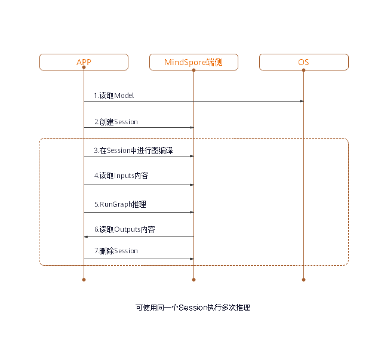

# Runtime User Guide


<a href="https://gitee.com/mindspore/docs/blob/r0.7/lite/tutorials/source_en/use/runtime.md" target="_blank"></a>

## Overview

After model conversion using MindSpore Lite, the model inference process needs to be completed in Runtime.

The procedure for using Runtime is shown in the following figure:



Its components and their functions are described as follows:
- `Model`: model used by MindSpore Lite, which instantiates the list of operator prototypes through image composition or direct network loading.
- `Lite Session`: provides the graph compilation function and calls the graph executor for inference.
- `Scheduler`: operator heterogeneous scheduler. It can select a proper kernel for each operator based on the heterogeneous scheduling policy, construct a kernel list, and split a graph into subgraphs.
- `Executor`: graph executor, which executes the kernel list to dynamically allocate and release tensors.
- `Operator`: operator prototype, including operator attributes and methods for inferring the shape, data type, and format.
- `Kernel`: operator, which provides specific operator implementation and the operator forwarding function.
- `Tensor`: tensor used by MindSpore Lite, which provides functions and APIs for tensor memory operations.
   
## Reading Models

In MindSpore Lite, a model file is an `.ms` file converted using the model conversion tool. During model inference, the model needs to be loaded from the file system and parsed. Related operations are mainly implemented in the Model component. The Model component holds model data such as weight data and operator attributes.

A model is created based on memory data using the static `Import` method of the Model class. The `Model` instance returned by the function is a pointer, which is created by using `new`. If the pointer is not required, you need to release it by using `delete`.

## Session Creation

When MindSpore Lite is used for inference, sessions are the main entrance of inference. You can compile and execute graphs through sessions.

### Creating Contexts

Contexts save some basic configuration parameters required by sessions to guide graph compilation and execution. The definition of context is as follows:

MindSpore Lite supports heterogeneous inference. The preferred backend for inference is specified by `device_ctx_` in `Context` and is CPU by default. During graph compilation, operator selection and scheduling are performed based on the preferred backend.

MindSpore Lite has a built-in thread pool shared by processes. During inference, `thread_num_` is used to specify the maximum number of threads in the thread pool. The default maximum number is 2. It is recommended that the maximum number be no more than 4. Otherwise, the performance may be affected.

MindSpore Lite supports dynamic memory allocation and release. If `allocator` is not specified, a default `allocator` is generated during inference. You can also use the `Context` method to allow multiple `Context` to share the memory allocator.

### Creating Sessions

Use the `Context` created in the previous step to call the static `CreateSession` method of LiteSession to create `LiteSession`. The `LiteSession` instance returned by the function is a pointer, which is created by using `new`. If the pointer is not required, you need to release it by using `delete`.

### Example

The following sample code demonstrates how to create a `Context` and how to allow two `LiteSession` to share a memory pool.

```cpp
auto context = new (std::nothrow) lite::Context;
if (context == nullptr) {
    MS_LOG(ERROR) << "New context failed while running %s", modelName.c_str();
    return RET_ERROR;
}
// The preferred backend is GPU, which means, if there is a GPU operator, it will run on the GPU first, otherwise it will run on the CPU.
context->device_ctx_.type = lite::DT_GPU;
// The medium core takes priority in thread and core binding methods. This parameter will work in the BindThread interface. For specific binding effect, see the "Run Graph" section.
context->cpu_bind_mode_ = MID_CPU;
// Configure the number of worker threads in the thread pool to 2, including the main thread. 
context->thread_num_ = 2;
// Allocators can be shared across multiple Contexts.
auto *context2 = new Context(context->thread_num_, context->allocator, context->device_ctx_);
context2->cpu_bind_mode_ = context->cpu_bind_mode_;
// Use Context to create Session.
auto session1 = session::LiteSession::CreateSession(context);
// After the LiteSession is created, the Context can be released.
delete (context);
if (session1 == nullptr) {
    MS_LOG(ERROR) << "CreateSession failed while running %s", modelName.c_str();
    return RET_ERROR;
}
// session1 and session2 can share one memory pool.
auto session2 = session::LiteSession::CreateSession(context2);
delete (context2);
if (session == nullptr) {
    MS_LOG(ERROR) << "CreateSession failed while running %s", modelName.c_str();
    return RET_ERROR;
}
```

## Graph Compilation

### Variable Dimension

When using MindSpore Lite for inference, after the session creation and graph compilation have been completed, if you need to resize the input shape, you can reset the shape of the input tensor, and then call the session's Resize() interface.

### Example

The following code demonstrates how to resize the input of MindSpore Lite:

```cpp
// Assume we have created a LiteSession instance named session.
auto inputs = session->GetInputs();
std::vector<int> resize_shape = {1, 128, 128, 3};
// Assume the model has only one input,resize input shape to [1, 128, 128, 3]
inputs[0]->set_shape(resize_shape);
session->Resize(inputs);
```

### Compiling Graphs

Before graph execution, call the `CompileGraph` API of the `LiteSession` to compile graphs and further parse the Model instance loaded from the file, mainly for subgraph split and operator selection and scheduling. This process takes a long time. Therefore, it is recommended that `ListSession` achieve multiple executions with one creation and one compilation.

### Example

The following code demonstrates how to compile graph of MindSpore Lite:

```cpp
// Assume we have created a LiteSession instance named session and a Model instance named model before.
// The methods of creating model and session can refer to "Import Model" and "Create Session" two sections.
auto ret = session->CompileGraph(model);
if (ret != RET_OK) {
    std::cerr << "CompileGraph failed" << std::endl;
    // session and model need to be released by users manually.
    delete (session);
    delete (model);
    return ret;
}
```

## Data Input

### Obtaining Input Tensors

Before graph execution, you need to copy the input data to model input tensors.

MindSpore Lite provides the following methods to obtain model input tensors.

1. Use the `GetInputsByName` method to obtain vectors of the model input tensors that are connected to the model input node based on the node name.
2. Use the `GetInputs` method to directly obtain the vectors of all model input tensors.

### Copying Data

After model input tensors are obtained, you need to enter data into the tensors. Use the `Size` method of `MSTensor` to obtain the size of the data to be entered into tensors, use the `data_type` method to obtain the data type of tensors, and use the `MutableData` method of `MSTensor` to obtain the writable pointer.

### Example

The following sample code shows how to obtain the entire graph input `MSTensor` from `LiteSession` and enter the model input data to `MSTensor`.

```cpp
// Assume we have created a LiteSession instance named session.
auto inputs = session->GetInputs();
// Assume that the model has only one input tensor.
auto in_tensor = inputs.front();
if (in_tensor == nullptr) {
    std::cerr << "Input tensor is nullptr" << std::endl;
    return -1;
}
// It is omitted that users have read the model input file and generated a section of memory buffer: input_buf, as well as the byte size of input_buf: data_size.
if (in_tensor->Size() != data_size) {
    std::cerr << "Input data size is not suit for model input" << std::endl;
    return -1;
}
auto *in_data = in_tensor->MutableData();
if (in_data == nullptr) {
    std::cerr << "Data of in_tensor is nullptr" << std::endl;
    return -1;
}
memcpy(in_data, input_buf, data_size);
// Users need to free input_buf.
// The elements in the inputs are managed by MindSpore Lite so that users do not need to free inputs.
```

Note:  
- The data layout in the model input tensors of MindSpore Lite must be NHWC.
- The model input `input_buf` is read from disks. After it is copied to model input tensors, you need to release `input_buf`.
- Vectors returned by using the `GetInputs` and `GetInputsByName` methods do not need to be released by users.

## Graph Execution

### Executing Sessions

After a MindSpore Lite session performs graph compilation, you can use `RunGraph` of `LiteSession` for model inference.

### Core Binding

The built-in thread pool of MindSpore Lite supports core binding and unbinding. By calling the `BindThread` API, you can bind working threads in the thread pool to specified CPU cores for performance analysis. The core binding operation is related to the context specified when `LiteSession` is created. The core binding operation sets the affinity between a thread and CPU based on the core binding policy in the context.

Note that core binding is an affinity operation, which is affected by system scheduling. Therefore, successful binding to the specified CPU core cannot be ensured. After executing the code of core binding, you need to perform the unbinding operation. The following is an example:

```cpp
// Assume we have created a LiteSession instance named session.
session->BindThread(true);
auto ret = session->RunGraph();
if (ret != mindspore::lite::RET_OK) {
    std::cerr << "RunGraph failed" << std::endl;
    delete session;
    return -1;
}
session->BindThread(false);
```

> Core binding parameters can be used to bind big cores first or middle cores first.  
> The rule for determining big core or middle core is based on the CPU core frequency instead of CPU architecture. For the CPU architecture where big, middle, and little cores are not distinguished, this rule can be used.  
> Big core first indicates that threads in the thread pool are bound to cores according to core frequency. The first thread is bound to the core with the highest frequency, and the second thread is bound to the core with the second highest frequency. This rule also applies to other threads.  
> Middle cores are defined based on experience. By default, middle cores are cores with the third and fourth highest frequency. Middle core first indicates that threads are bound to middle cores preferentially. When there are no available middle cores, threads are bound to little cores.

### Callback Running

MindSpore Lite can transfer two `KernelCallBack` function pointers to call back the inference model when calling `RunGraph`. Compared with common graph execution, callback running can obtain extra information during the running process to help developers analyze performance and fix bugs. The extra information includes:
- Name of the running node
- Input and output tensors before inference of the current node
- Input and output tensors after inference of the current node

### Example

The following sample code demonstrates how to use `LiteSession` to compile a graph, defines two callback functions as the before-callback pointer and after-callback pointer, transfers them to the `RunGraph` API for callback inference, and demonstrates the scenario of multiple graph executions with one graph compilation.

```cpp
// Assume we have created a LiteSession instance named session and a Model instance named model before.
// The methods of creating model and session can refer to "Import Model" and "Create Session" two sections.
auto ret = session->CompileGraph(model);
if (ret != RET_OK) {
    std::cerr << "CompileGraph failed" << std::endl;
    // session and model need to be released by users manually.
    delete (session);
    delete (model);
    return ret;
}
// Copy input data into the input tensor. Users can refer to the "Input Data" section. We uses random data here.
auto inputs = session->GetInputs();
for (auto in_tensor : inputs) {
    in_tensor = inputs.front();
    if (in_tensor == nullptr) {
        std::cerr << "Input tensor is nullptr" << std::endl;
        return -1;
    }
    // When calling the MutableData method, if the data in MSTensor is not allocated, it will be malloced. After allocation, the data in MSTensor can be considered as random data.
    (void) in_tensor->MutableData();
}
// Definition of callback function before forwarding operator.
auto before_call_back_ = [&](const std::vector<mindspore::tensor::MSTensor *> &before_inputs,
                             const std::vector<mindspore::tensor::MSTensor *> &before_outputs,
                             const session::CallBackParam &call_param) {
    std::cout << "Before forwarding " << call_param.name_callback_param << std::endl;
    return true;
};
// Definition of callback function after forwarding operator.
auto after_call_back_ = [&](const std::vector<mindspore::tensor::MSTensor *> &after_inputs,
                            const std::vector<mindspore::tensor::MSTensor *> &after_outputs,
                            const session::CallBackParam &call_param) {
    std::cout << "After forwarding " << call_param.name_callback_param << std::endl;
    return true;
};
// Call the callback function when performing the model inference process.
ret = session_->RunGraph(before_call_back_, after_call_back_);
if (ret != RET_OK) {
  MS_LOG(ERROR) << "Run graph failed.";
  return RET_ERROR;
}
// CompileGraph would cost much time, a better solution is calling CompileGraph only once and RunGraph much more times.
for (size_t i = 0; i < 10; i++) {
    auto ret = session_->RunGraph();
    if (ret != RET_OK) {
        MS_LOG(ERROR) << "Run graph failed.";
        return RET_ERROR;
    }
}
// session and model needs to be released by users manually.
delete (session);
delete (model);
```

## Obtaining Outputs

### Obtaining Output Tensors

After performing inference, MindSpore Lite can obtain the model inference result.

MindSpore Lite provides the following methods to obtain the model output `MSTensor`.
1. Use the `GetOutputsByName` method to obtain vectors of the model output `MSTensor` that is connected to the model output node based on the node name.
2. Use the `GetOutputMapByNode` method to directly obtain the mapping between the names of all model output nodes and the model output `MSTensor` connected to the nodes.
3. Use the `GetOutputByTensorName` method to obtain the model output `MSTensor` based on the tensor name.
4. Use the `GetOutputMapByTensor` method to directly obtain the mapping between the names of all model output tensors and the model output `MSTensor`.

After model output tensors are obtained, you need to enter data into the tensors. Use the `Size` method of `MSTensor` to obtain the size of the data to be entered into tensors, use the `data_type` method to obtain the data type of `MSTensor`, and use the `MutableData` method of `MSTensor` to obtain the writable pointer.

### Example

The following sample code shows how to obtain the output `MSTensor` from `LiteSession` using the `GetOutputMapByNode` method and print the first ten data or all data records of each output `MSTensor`.

```cpp
// Assume we have created a LiteSession instance named session before.
auto output_map = session->GetOutputMapByNode();
// Assume that the model has only one output node.
auto out_node_iter = output_map.begin();
std::string name = out_node_iter->first;
// Assume that the unique output node has only one output tensor.
auto out_tensor = out_node_iter->second.front();
if (out_tensor == nullptr) {
    std::cerr << "Output tensor is nullptr" << std::endl;
    return -1;
}
// Assume that the data format of output data is float 32.
if (out_tensor->data_type() != mindspore::TypeId::kNumberTypeFloat32) {
    std::cerr << "Output of lenet should in float32" << std::endl;
    return -1;
}
auto *out_data = reinterpret_cast<float *>(out_tensor->MutableData());
if (out_data == nullptr) {
    std::cerr << "Data of out_tensor is nullptr" << std::endl;
    return -1;
}
// Print the first 10 float data or all output data of the output tensor. 
std::cout << "Output data: ";
for (size_t i = 0; i < 10 && i < out_tensor->ElementsNum(); i++) {
    std::cout << " " << out_data[i];
}
std::cout << std::endl;
// The elements in outputs do not need to be free by users, because outputs are managed by the MindSpore Lite.
```

Note that the vectors or map returned by the `GetOutputsByNodeName`, `GetOutputMapByNode`, `GetOutputByTensorName` and `GetOutputMapByTensor` methods do not need to be released by users. 

The following sample code shows how to obtain the output `MSTensor` from `LiteSession` using the `GetOutputsByNodeName` method.

```cpp
// Assume we have created a LiteSession instance named session before.
// Assume that model has a output node named output_node_name_0.
auto output_vec = session->GetOutputsByNodeName("output_node_name_0");
// Assume that output node named output_node_name_0 has only one output tensor.
auto out_tensor = output_vec.front();
if (out_tensor == nullptr) {
    std::cerr << "Output tensor is nullptr" << std::endl;
    return -1;
}
```

The following sample code shows how to obtain the output `MSTensor` from `LiteSession` using the `GetOutputMapByTensor` method.

```cpp
// Assume we have created a LiteSession instance named session before.
auto output_map = session->GetOutputMapByTensor();
// Assume that output node named output_node_name_0 has only one output tensor.
auto out_tensor = output_vec.front();
if (out_tensor == nullptr) {
    std::cerr << "Output tensor is nullptr" << std::endl;
    return -1;
}
``` 

The following sample code shows how to obtain the output `MSTensor` from `LiteSession` using the `GetOutputByTensorName` method.

```cpp
// We can use GetOutputTensorNames method to get all name of output tensor of model which is in order.
auto tensor_names = this->GetOutputTensorNames();
// Assume we have created a LiteSession instance named session before.
// Use output tensor name returned by GetOutputTensorNames as key
for (auto tensor_name : tensor_names) {
    auto out_tensor = this->GetOutputByTensorName(tensor_name);
    if (out_tensor == nullptr) {
        std::cerr << "Output tensor is nullptr" << std::endl;
        return -1;
    }
}
```

## Obtaining Version String

### Example

The following sample code shows how to obtain version string using `Version` method.

```cpp
#include "include/version.h"
std::string version = mindspore::lite::Version(); 
```
