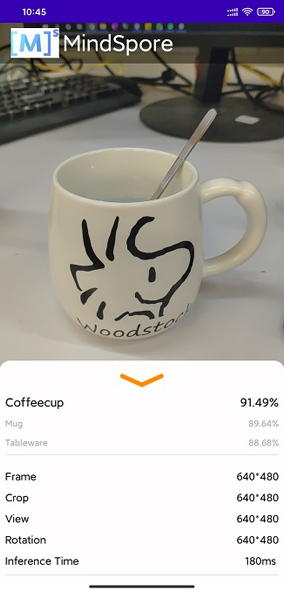

# 实现一个图像分类应用

<a href="https://gitee.com/mindspore/docs/blob/r0.7/lite/tutorials/source_zh_cn/quick_start/quick_start.md" target="_blank"></a>

## 概述

我们推荐你从端侧Android图像分类demo入手，了解MindSpore Lite应用工程的构建、依赖项配置以及相关API的使用。
     
本教程基于MindSpore团队提供的Android“端侧图像分类”示例程序，演示了端侧部署的流程。  
1. 选择图像分类模型。
2. 将模型转换成MindSpore Lite模型格式。
3. 在端侧使用MindSpore Lite推理模型。详细说明如何在端侧利用MindSpore Lite C++ API（Android JNI）和MindSpore Lite图像分类模型完成端侧推理，实现对设备摄像头捕获的内容进行分类，并在APP图像预览界面中，显示出最可能的分类结果。
   
> 你可以在这里找到[Android图像分类模型](https://download.mindspore.cn/model_zoo/official/lite/mobilenetv2_openimage_lite)和[示例代码](https://gitee.com/mindspore/mindspore/blob/r0.7/model_zoo/official/lite/image_classification)。

## 选择模型

MindSpore团队提供了一系列预置终端模型，你可以在应用程序中使用这些预置的终端模型。  
MindSpore Model Zoo中图像分类模型可[在此下载](https://download.mindspore.cn/model_zoo/official/lite/mobilenetv2_openimage_lite/mobilenetv2.ms)。
同时，你也可以使用预置模型做迁移学习，以实现自己的图像分类任务。

## 转换模型

如果预置模型已经满足你要求，请跳过本章节。 如果你需要对MindSpore提供的模型进行重训，重训完成后，需要将模型导出为[.mindir格式](https://www.mindspore.cn/tutorial/zh-CN/r0.7/use/saving_and_loading_model_parameters.html#mindir)。然后使用MindSpore Lite[模型转换工具](https://www.mindspore.cn/lite/tutorial/zh-CN/r0.7/use/converter_tool.html)将.mindir模型转换成.ms格式。

以mobilenetv2模型为例，如下脚本将其转换为MindSpore Lite模型用于端侧推理。
```bash
./converter_lite --fmk=MS --modelFile=mobilenetv2.mindir --outputFile=mobilenetv2.ms
```

## 部署应用

接下来介绍如何构建和执行MindSpore Lite端侧图像分类任务。

### 运行依赖

- Android Studio >= 3.2 (推荐4.0以上版本)
- NDK 21.3
- CMake 3.10.2 
- Android SDK >= 26
- OpenCV >= 4.0.0 （本示例代码已包含）

### 构建与运行

1. 在Android Studio中加载本示例源码，并安装相应的SDK（指定SDK版本后，由Android Studio自动安装）。 

    

    启动Android Studio后，点击`File->Settings->System Settings->Android SDK`，勾选相应的SDK。如下图所示，勾选后，点击`OK`，Android Studio即可自动安装SDK。

    

    （可选）若安装时出现NDK版本问题，可手动下载相应的[NDK版本](https://developer.android.com/ndk/downloads?hl=zh-cn)（本示例代码使用的NDK版本为21.3），并在`Project Structure`的`Android NDK location`设置中指定SDK的位置。

    

2. 连接Android设备，运行图像分类应用程序。

    通过USB连接Android设备调试，点击`Run 'app'`即可在你的设备上运行本示例项目。

    

    Android Studio连接设备调试操作，可参考<https://developer.android.com/studio/run/device?hl=zh-cn>。

3. 在Android设备上，点击“继续安装”，安装完即可查看到设备摄像头捕获的内容和推理结果。

    

    识别结果如下图所示。

    


## 示例程序详细说明  

本端侧图像分类Android示例程序分为JAVA层和JNI层，其中，JAVA层主要通过Android Camera 2 API实现摄像头获取图像帧，以及相应的图像处理等功能；JNI层在[Runtime](https://www.mindspore.cn/lite/tutorial/zh-CN/r0.7/use/runtime.html)中完成模型推理的过程。

> 此处详细说明示例程序的JNI层实现，JAVA层运用Android Camera 2 API实现开启设备摄像头以及图像帧处理等功能，需读者具备一定的Android开发基础知识。

### 示例程序结构

```
app
|
├── libs # 存放MindSpore Lite依赖的库文件
│   └── arm64-v8a
│       ├── libopencv_java4.so
│       └── libmindspore-lite.so
│
├── opencv # opencv 相关依赖文件
│   └── ...
|
├── src/main
│   ├── assets # 资源文件
|   |   └── model.ms # 存放模型文件
│   |
│   ├── cpp # 模型加载和预测主要逻辑封装类
|   |   ├── ..
|   |   ├── MindSporeNetnative.cpp # MindSpore调用相关的JNI方法
│   |   └── MindSporeNetnative.h # 头文件
│   |
│   ├── java # java层应用代码
│   │   └── com.huawei.himindsporedemo 
│   │       ├── gallery.classify # 图像处理及MindSpore JNI调用相关实现
│   │       │   └── ...
│   │       └── obejctdetect # 开启摄像头及绘制相关实现
│   │           └── ...
│   │   
│   ├── res # 存放Android相关的资源文件
│   └── AndroidManifest.xml # Android配置文件
│
├── CMakeList.txt # cmake编译入口文件
│
├── build.gradle # 其他Android配置文件
└── ...
```

### 配置MindSpore Lite依赖项

Android JNI层调用MindSpore C++ API时，需要相关库文件支持。可通过MindSpore Lite[源码编译](https://www.mindspore.cn/lite/tutorial/zh-CN/r0.7/build.html)生成`libmindspore-lite.so`库文件。

本示例中，bulid过程由download.gradle文件配置自动下载`libmindspore-lite.so`以及OpenCV的`libopencv_java4.so`库文件，并放置在`app/libs/arm64-v8a`目录下。

注： 若自动下载失败，请手动下载相关库文件并将其放在对应位置：

libmindspore-lite.so [下载链接](https://download.mindspore.cn/model_zoo/official/lite/lib/mindspore%20version%200.7/libmindspore-lite.so)

libmindspore-lite include文件  [下载链接](https://download.mindspore.cn/model_zoo/official/lite/lib/mindspore%20version%200.7/include.zip)

libopencv_java4.so  [下载链接](https://download.mindspore.cn/model_zoo/official/lite/lib/opencv%204.4.0/libopencv_java4.so)

libopencv include文件  [下载链接](https://download.mindspore.cn/model_zoo/official/lite/lib/opencv%204.4.0/include.zip)


```
android{
    defaultConfig{
        externalNativeBuild{
            cmake{
                arguments "-DANDROID_STL=c++_shared"
            }
        }

        ndk{ 
            abiFilters'armeabi-v7a', 'arm64-v8a'  
        }
    }
}
```

在`app/CMakeLists.txt`文件中建立`.so`库文件链接，如下所示。

```
# Set MindSpore Lite Dependencies.
include_directories(${CMAKE_SOURCE_DIR}/src/main/cpp/include/MindSpore)
add_library(mindspore-lite SHARED IMPORTED )
set_target_properties(mindspore-lite PROPERTIES
    IMPORTED_LOCATION "${CMAKE_SOURCE_DIR}/libs/libmindspore-lite.so")

# Set OpenCV Dependecies.
include_directories(${CMAKE_SOURCE_DIR}/opencv/sdk/native/jni/include)
add_library(lib-opencv SHARED IMPORTED )
set_target_properties(lib-opencv PROPERTIES
    IMPORTED_LOCATION "${CMAKE_SOURCE_DIR}/libs/libopencv_java4.so")

# Link target library.       
target_link_libraries(
    ...
    mindspore-lite
    lib-opencv
    ...
)
```

### 下载及部署模型文件

从MindSpore Model Hub中下载模型文件，本示例程序中使用的终端图像分类模型文件为`mobilenetv2.ms`，同样通过`download.gradle`脚本在APP构建时自动下载，并放置在`app/src/main/assets`工程目录下。

注：若下载失败请手工下载模型文件，mobilenetv2.ms [下载链接](https://download.mindspore.cn/model_zoo/official/lite/mobilenetv2_openimage_lite/mobilenetv2.ms)

### 编写端侧推理代码

在JNI层调用MindSpore Lite C++ API实现端测推理。

推理代码流程如下，完整代码请参见`src/cpp/MindSporeNetnative.cpp`。 

1. 加载MindSpore Lite模型文件，构建上下文、会话以及用于推理的计算图。  

    - 加载模型文件：创建并配置用于模型推理的上下文
        ```cpp
        // Buffer is the model data passed in by the Java layer
        jlong bufferLen = env->GetDirectBufferCapacity(buffer);
        char *modelBuffer = CreateLocalModelBuffer(env, buffer);  
        ```
        
    - 创建会话
        ```cpp
        void **labelEnv = new void *;
        MSNetWork *labelNet = new MSNetWork;
        *labelEnv = labelNet;
        
        // Create context.
        lite::Context *context = new lite::Context;
        context->device_ctx_.type = lite::DT_CPU;
        context->thread_num_ = numThread;  //Specify the number of threads to run inference
        
        // Create the mindspore session.
        labelNet->CreateSessionMS(modelBuffer, bufferLen, "device label", context);
        delete(context);
        
        ```
        
    - 加载模型文件并构建用于推理的计算图
        ```cpp
        void MSNetWork::CreateSessionMS(char* modelBuffer, size_t bufferLen, std::string name, mindspore::lite::Context* ctx)
        {
            CreateSession(modelBuffer, bufferLen, ctx);  
            session = mindspore::session::LiteSession::CreateSession(ctx);
            auto model = mindspore::lite::Model::Import(modelBuffer, bufferLen);
            int ret = session->CompileGraph(model);
        }
        ```
    
2. 将输入图片转换为传入MindSpore模型的Tensor格式。 

    将待检测图片数据转换为输入MindSpore模型的Tensor。

    ```cpp
    // Convert the Bitmap image passed in from the JAVA layer to Mat for OpenCV processing
    BitmapToMat(env, srcBitmap, matImageSrc);
   // Processing such as zooming the picture size.
    matImgPreprocessed = PreProcessImageData(matImageSrc);  

    ImgDims inputDims; 
    inputDims.channel = matImgPreprocessed.channels();
    inputDims.width = matImgPreprocessed.cols;
    inputDims.height = matImgPreprocessed.rows;
    float *dataHWC = new float[inputDims.channel * inputDims.width * inputDims.height]

    // Copy the image data to be detected to the dataHWC array.
    // The dataHWC[image_size] array here is the intermediate variable of the input MindSpore model tensor.
    float *ptrTmp = reinterpret_cast<float *>(matImgPreprocessed.data);
    for(int i = 0; i < inputDims.channel * inputDims.width * inputDims.height; i++){
       dataHWC[i] = ptrTmp[i];
    }

    // Assign dataHWC[image_size] to the input tensor variable.
    auto msInputs = mSession->GetInputs();
    auto inTensor = msInputs.front();
    memcpy(inTensor->MutableData(), dataHWC,
        inputDims.channel * inputDims.width * inputDims.height * sizeof(float));
    delete[] (dataHWC);
   ```
   
3. 对输入Tensor按照模型进行推理，获取输出Tensor，并进行后处理。    

   - 图执行，端测推理。

        ```cpp
        // After the model and image tensor data is loaded, run inference.
        auto status = mSession->RunGraph();
        ```

   - 获取输出数据。
        ```cpp
        auto msOutputs = mSession->GetOutputMapByNode();
        std::string retStr = ProcessRunnetResult(msOutputs, ret);
        ```
        
   - 输出数据的后续处理。
        ```cpp
        std::string ProcessRunnetResult(std::unordered_map<std::string,
                std::vector<mindspore::tensor::MSTensor *>> msOutputs,
                int runnetRet) {
        
            // Get model output results.
            std::unordered_map<std::string, std::vector<mindspore::tensor::MSTensor *>>::iterator iter;
            iter = msOutputs.begin();
            auto brach1_string = iter->first;
            auto branch1_tensor = iter->second;
        
            int OUTPUTS_LEN = branch1_tensor[0]->ElementsNum();
        
            float *temp_scores = static_cast<float * >(branch1_tensor[0]->MutableData());
            float scores[RET_CATEGORY_SUM];
            for (int i = 0; i < RET_CATEGORY_SUM; ++i) {
               scores[i] = temp_scores[i];
            }
        
            // Converted to text information that needs to be displayed in the APP. 
            std::string retStr = "";
            if (runnetRet == 0) {
                for (int i = 0; i < RET_CATEGORY_SUM; ++i) {
                    if (scores[i] > 0.3){
                        retStr += g_labels_name_map[i];
                        retStr += ":";
                   std::string score_str = std::to_string(scores[i]);
                        retStr += score_str;
                        retStr += ";";
                    }
            }
           else {
                MS_PRINT("MindSpore run net failed!");
                for (int i = 0; i < RET_CATEGORY_SUM; ++i) {
                    retStr += " :0.0;";
                }
            }
        
            return retStr;
        }      
        ```
