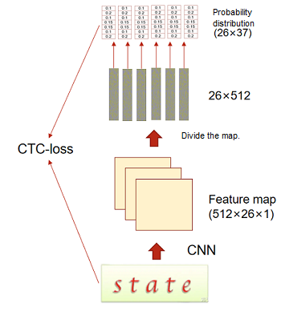

# CNN and CTC for Recognizing Text from Images

[](https://gitee.com/mindspore/docs/blob/master/tutorials/application/source_en/cv/cnnctc.md)

> You can run this case on a GPU or CPU in dynamic graph mode. Other devices and running modes will be supported in later versions.

## Model Introduction

### Text Recognition Process

Text recognition refers to recognizing text from an image and converting a text area in the image into character information. Generally, a CNN is used to extract rich feature information from the image, and then recognition is performed based on the extracted feature information. Here, ResNet is used as the feature extraction network, and the CTC(Connectionist Temporal Classification) method is used for recognition. The number of characters, character styles, and font sizes of each sample are different. As a result, the output of each column may not correspond to each character. CTC proposes a loss calculation method that does not require alignment, for network training.

To implement the model, perform the following steps:

1. Use CNN (ResNet) to extract a feature map from a text image.
2. Divide the feature map in each image into different feature sequences.
3. Classify characters of each sequence.
4. Use the CTC loss function to calculate the loss. The CTC can predict non-fixed-length labels based on fixed-length feature sequences.

The following figure shows the overall process.



### CTC Method

For fixed-length output and variable-length label data, CTC provides a loss calculation method for training network parameters. The key is to predict characters in each column and modify the entire character sequence to a non-fixed-length character stream by deleting duplicate and whitespace characters. The procedure is as follows:

1. Obtain a fixed-length character sequence.

    The fixed-length character sequence is obtained according to the probability distribution of the sequence obtained by the model in each position. In the sequence $H = h_1$, . . . , $h_T$ output by the model, $T$ indicates the sequence length, which is fixed. $\pi$ indicates the character sequence obtained based on the probability distribution of the sequence. The probability is defined as follows:

    $$
    p(\pi|H)=\prod_{t=1}^{T}{y^t_{\pi_t}}
    $$

    $y^t_{\pi_t}$ indicates the probability of generating the character $\pi_t$ at each time step $t$.

2. Change the fixed-length character sequence to a non-fixed-length sequence.

    The mapping function $M$ maps $\pi$ to $Y$ by deleting repeated characters and whitespaces. For example, the mapping function $M$ maps 'aaa-dd-d-c-d---d' to 'addcdd', where '-' indicates whitespace characters.

3. Define conditional probability.

    The conditional probability is defined as the sum of all probabilities of the fixed-length character sequence $\pi$ that can be mapped to the label character sequence $Y$ by using the mapping function $M$.

    $$
    p(Y|H)= \displaystyle \sum^{ }_{\pi:M(\pi)=Y}{P(\pi|H)}
    $$

4. Use an objective function.

    The objective of training is to obtain the maximum value of the conditional probability. In addition, the process of calculating the conditional probability contains only the addition and multiplication operations, which must be derivative. Therefore, a gradient can be obtained to update the network model parameters. The formula is as follows:

    $$
    p(Y|H)=- \displaystyle \sum^{ }*{X*i,Y_i\in TD}{logP(Y_i|X_i)}
    $$

    $TD$ indicates the training dataset.

5. Perform testing.

    During the test, the character with the maximum probability is used as the predicted label sequence at each time step. The formula is as follows:

    $$
    Y^*\approx M(arg  max  P(\pi|H))
    $$

### ResNet

The residual neural network (ResNet) was proposed by He Kaiming, Zhang Xiangyu, Ren Shaoqing, Sun Jian, and others from Microsoft Research and won the 2015 ImageNet Large Scale Visual Recognition Challenge (ILSVRC). A main contribution of the ResNet is to propose a "shortcut connection", which greatly solves the degradation problem of the network and effectively alleviates the vanishing gradient problem of a relatively deep neural network in a training process, thereby implementing a deeper network structure design and improving the model accuracy.

1. Residual network structure

    The residual network structure consists of one main branch and one shortcut branch. The main branch is obtained by stacking a series of convolution operations. The shortcut branch is obtained directly from the input to the output. After the ReLU activation function is used, the output obtained by the main branch plus the output obtained by the shortcut branch is the final residual network output.

    In the residual network structure used here, the main branch has a two-layer convolutional network structure:

    - Layer-1 network: Convolutional layer whose **Kernel_size** is **3** + BatchNorm + ReLU
    - Layer-2 network: Convolutional layer whose **Kernel_size** is **3** + BatchNorm

    Finally, the feature matrix output by the main branch is added to the feature matrix output by the shortcut branch, and the final output of the residual network structure is obtained by using the ReLU activation function.

2. ResNet structure

    The ResNet consists of five layers:

    - Layer 1: Convolutional layer whose **Kernel_size** is **3** + BatchNorm + Convolutional layer whose **Kernel_size** is **3** + BatchNorm + ReLU
    - Layer 2: Maximum pooling + Residual network + Convolutional layer whose **Kernel_size** is **3** + BatchNorm
    - Layer 3: Maximum pooling + Residual network + Convolutional layer whose **Kernel_size** is **3** + BatchNorm
    - Layer 4: Maximum pooling + Residual network + Convolutional layer whose **Kernel_size** is **3** + BatchNorm
    - Layer 5: Residual network + Convolutional layer whose **Kernel_size** is **2** + BatchNorm + Convolutional layer whose **Kernel_size** is **2** + BatchNorm

## Datasets

### Introduction

A plurality of datasets are combined into one dataset and then used for training. In addition, the label length of each piece of data in the dataset is different. To achieve a better training effect, it is expected that the label length of each piece of training data is the same, and data needs to be extracted based on a certain index.

In this case, the [MJSynth](https://www.robots.ox.ac.uk/~vgg/data/text/) and [SynthText](https://github.com/ankush-me/SynthText) datasets are used for model training. The [IIIT 5K-word](https://cvit.iiit.ac.in/research/projects/cvit-projects/the-iiit-5k-word-dataset) dataset is used for testing.

- MJSynth (MJ)

    MJ is a STR-specific synthetic dataset containing 8.9-million word box images. The process of generating a word box is as follows:

    1. Font rendering.
    2. Border and shadow rendering.
    3. Background coloring.
    4. Synthesis of fonts, borders, and backgrounds.
    5. Projective distortion.
    6. Natural data blending.
    7. Noise injection.

- SynthText (ST)

    ST is just another synthetically generated dataset that was created with the intention of detecting scene text. Although ST was designed for scene text detection tasks, it was also used for scene text recognition (STR) by cropping word boxes. ST contains 5.5 million cropped training word boxes.

- IIIT 5K-word (IIIT)

    The IIIT 5K-word dataset is harvested from Google image search. Query words like billboards, signboard, house numbers, house name plates, and movie posters are used to collect images. The IIIT dataset contains 2000 images for training and 3000 images for evaluation.

### Combining Datasets and Generating Indexes

- Combine datasets.

    Open the LMDB files of each dataset in sequence, read the images and labels, and write them to the same new LMDB file.

- Analyze the length distribution and combinations of labels in the new dataset.

    On the premise that the total length of labels of all data in a batch is fixed, obtain the possible combinations of lengths of labels of data in the batch. First, obtain a length of a label in each piece of data, distribution of label lengths in the dataset, and a total length of all labels in the dataset. Then, calculate an average length of labels in each batch. Finally, obtain possible combinations according to the average length in the batch and distribution of label lengths to make the average length of each batch the same.

- Obtain an index list based on the label combinations.

    Form an index list of data collected during training based on the obtained possible combinations. The hyperparameter can be used to control the size of the actual training dataset. During sampling, the hyperparameter is randomly selected based on the label length combination. Therefore, the hyperparameter can be set to a larger value to collect all data in the dataset as much as possible.

### Downloading a Dataset

Use the `download` module to download and decompress the dataset. Before downloading data, use `pip install download` to install the `download` package.

```python
from download import download

url = "https://mindspore-website.obs.cn-north-4.myhuaweicloud.com/notebook/datasets/cnnctc_dataset.tar.gz"

download(url, ".", kind="tar.gz", replace=True)
```

Output:

```text
Downloading data from https://mindspore-website.obs.cn-north-4.myhuaweicloud.com/notebook/datasets/cnnctc_dataset.tar.gz (545.4 MB)

file_sizes: 100%|████████████████████████████| 572M/572M [08:38<00:00, 1.10MB/s]
Extracting tar.gz file...
Successfully downloaded / unzipped to .
```

```text
'.'
```

## Model Building

The model building consists of three parts:

1. Use ResNet to extract features from images.
2. Divide the feature map extracted from each image into different feature sequences.
3. Predict each feature sequence to obtain the probabilities that the sequence belongs to different characters.

```python
from mindspore import nn
from mindspore.common.initializer import TruncatedNormal


class CNNCTC(nn.Cell):
    def __init__(self, num_class, hidden_size, final_feature_width):
        super(CNNCTC, self).__init__()

        self.num_class = num_class
        self.hidden_size = hidden_size
        self.final_feature_width = final_feature_width

        self.feature_extraction = ResNet(3, 512, BasicBlock, [1, 2, 5, 3])
        self.prediction = nn.Dense(self.hidden_size, self.num_class)

    def construct(self, x):
        x = self.feature_extraction(x)
        # Convert dimensions to facilitate image division by column.
        x = ops.transpose(x, (0, 3, 1, 2))  # [b, c, h, w] -> [b, w, c, h]
        x = ops.reshape(x, (-1, self.hidden_size))
        x = self.prediction(x)
        x = ops.reshape(x, (-1, self.final_feature_width, self.num_class))

        return x


class ResNet(nn.Cell):
    def __init__(self, input_channel, output_channel, block, layers):
        super(ResNet, self).__init__()

        self.output_channel_block = [int(output_channel / 4), int(output_channel / 2), output_channel, output_channel]
        self.inplanes = int(output_channel / 8)

        self.conv0_1 = nn.Conv2d(input_channel, int(output_channel / 16), kernel_size=3, stride=1, padding=1,
                                 pad_mode='pad', weight_init=TruncatedNormal(0.02), has_bias=False)
        self.bn0_1 = nn.BatchNorm2d(int(output_channel / 16), momentum=0.1)
        self.conv0_2 = nn.Conv2d(int(output_channel / 16), self.inplanes, kernel_size=3, stride=1, padding=1,
                                 pad_mode='pad', weight_init=TruncatedNormal(0.02), has_bias=False)
        self.bn0_2 = nn.BatchNorm2d(self.inplanes, momentum=0.1)
        self.relu = nn.ReLU()

        self.maxpool1 = nn.MaxPool2d(kernel_size=2, stride=2, pad_mode='valid')
        self.layer1 = self._make_layer(block, self.output_channel_block[0], layers[0])
        self.conv1 = nn.Conv2d(self.output_channel_block[0], self.output_channel_block[0], kernel_size=3, stride=1,
                               padding=1, pad_mode='pad', weight_init=TruncatedNormal(0.02), has_bias=False)
        self.bn1 = nn.BatchNorm2d(self.output_channel_block[0], momentum=0.1)

        self.maxpool2 = nn.MaxPool2d(kernel_size=2, stride=2, pad_mode='valid')
        self.layer2 = self._make_layer(block, self.output_channel_block[1], layers[1])
        self.conv2 = nn.Conv2d(self.output_channel_block[1], self.output_channel_block[1], kernel_size=3, stride=1,
                               padding=1, pad_mode='pad', weight_init=TruncatedNormal(0.02), has_bias=False)
        self.bn2 = nn.BatchNorm2d(self.output_channel_block[1], momentum=0.1)
        self.pad = nn.Pad(((0, 0), (0, 0), (0, 0), (2, 2)))

        self.maxpool3 = nn.MaxPool2d(kernel_size=2, stride=(2, 1), pad_mode='valid')
        self.layer3 = self._make_layer(block, self.output_channel_block[2], layers[2])
        self.conv3 = nn.Conv2d(self.output_channel_block[2], self.output_channel_block[2], kernel_size=3, stride=1,
                               padding=1, pad_mode='pad', weight_init=TruncatedNormal(0.02), has_bias=False)
        self.bn3 = nn.BatchNorm2d(self.output_channel_block[2], momentum=0.1)

        self.layer4 = self._make_layer(block, self.output_channel_block[3], layers[3])
        self.conv4_1 = nn.Conv2d(self.output_channel_block[3], self.output_channel_block[3], kernel_size=2,
                                 stride=(2, 1), padding=0, pad_mode='valid', weight_init=TruncatedNormal(0.02),
                                 has_bias=False)
        self.bn4_1 = nn.BatchNorm2d(self.output_channel_block[3], momentum=0.1)
        self.conv4_2 = nn.Conv2d(self.output_channel_block[3], self.output_channel_block[3], kernel_size=2, stride=1,
                                 padding=0, pad_mode='valid', weight_init=TruncatedNormal(0.02), has_bias=False)
        self.bn4_2 = nn.BatchNorm2d(self.output_channel_block[3], momentum=0.1)

    def _make_layer(self, block, planes, blocks, stride=1):
        downsample = None
        if stride != 1 or self.inplanes != planes * block.expansion:
            downsample = nn.SequentialCell(
                [nn.Conv2d(self.inplanes, planes * block.expansion, kernel_size=1, stride=stride, padding=0,
                           pad_mode='same', weight_init=TruncatedNormal(0.02), has_bias=False),
                 nn.BatchNorm2d(planes * block.expansion, momentum=0.1)]
            )

        layers = [block(self.inplanes, planes, stride, downsample)]
        self.inplanes = planes * block.expansion
        for _ in range(1, blocks):
            layers.append(block(self.inplanes, planes))

        return nn.SequentialCell(layers)

    def construct(self, x):
        x = self.conv0_1(x)
        x = self.bn0_1(x)
        x = self.relu(x)
        x = self.conv0_2(x)
        x = self.bn0_2(x)
        x = self.relu(x)

        x = self.maxpool1(x)
        x = self.layer1(x)
        x = self.conv1(x)
        x = self.bn1(x)
        x = self.relu(x)

        x = self.maxpool2(x)
        x = self.layer2(x)
        x = self.conv2(x)
        x = self.bn2(x)
        x = self.relu(x)

        x = self.maxpool3(x)
        x = self.layer3(x)
        x = self.conv3(x)
        x = self.bn3(x)
        x = self.relu(x)

        x = self.layer4(x)
        x = self.pad(x)
        x = self.conv4_1(x)
        x = self.bn4_1(x)
        x = self.relu(x)
        x = self.conv4_2(x)
        x = self.bn4_2(x)
        x = self.relu(x)

        return x


class BasicBlock(nn.Cell):
    expansion = 1

    def __init__(self, inplanes, planes, stride=1, downsample=None):
        super(BasicBlock, self).__init__()

        self.conv1 = nn.Conv2d(inplanes, planes, kernel_size=3, stride=stride, padding=1, pad_mode='pad',
                               weight_init=TruncatedNormal(0.02), has_bias=False)
        self.bn1 = nn.BatchNorm2d(planes, momentum=0.1)
        self.conv2 = nn.Conv2d(planes, planes, kernel_size=3, stride=stride, padding=1, pad_mode='pad',
                               weight_init=TruncatedNormal(0.02), has_bias=False)
        self.bn2 = nn.BatchNorm2d(planes, momentum=0.1)
        self.relu = nn.ReLU()
        self.downsample = downsample

    def construct(self, x):
        residual = x

        out = self.conv1(x)
        out = self.bn1(out)
        out = self.relu(out)

        out = self.conv2(out)
        out = self.bn2(out)

        if self.downsample is not None:
            residual = self.downsample(x)
        out = ops.add(out, residual)
        out = self.relu(out)

        return out
```

## Dynamic Learning Rate

Set the learning rate based on the number of training steps. If learning rate < warmup_steps, the learning rate changes linearly. If learning rate ≥ warmup_steps, the learning rate changes according to the cosine distribution.

```python
# Implement dynamic learning rate.
import math

def dynamic_lr(steps_per_epoch, base_lr, warmup_ratio, warmup_step, epochs):
    total_steps = steps_per_epoch * epochs
    warmup_steps = int(warmup_step)
    decay_steps = total_steps - warmup_steps
    lr = []
    for i in range(total_steps):
        if i < warmup_steps:
            lr_inc = (float(base_lr) - float(base_lr * warmup_ratio)) / float(warmup_steps)
            learning_rate = float(base_lr * warmup_ratio) + lr_inc * i
            lr.append(learning_rate)
        else:
            base = float(i - warmup_steps) / float(decay_steps)
            learning_rate = (1 + math.cos(base * math.pi)) / 2 * base_lr
            lr.append(learning_rate)
    return lr
```

## Model Training

Next, a training process is established.

To use functional automatic differentiation, you need to define the forward process function forward_fn and use mindspore.value_and_grad to obtain the differentiation function grad_fn. Encapsulate the execution of the differentiation function and optimizer into the train_step function, and then set the epochs for training the dataset.

```python
import time
import numpy as np
import matplotlib.pyplot as plt
import mindspore as ms
from mindspore import ops, ParameterTuple, Tensor
from mindspore.common import dtype
from mindspore.train.serialization import load_checkpoint, load_param_into_net
from mindspore.dataset import MindDataset

device_target = 'CPU'
train_dataset_path = './cnnctc_dataset/STMJ_train_dataset.mindrecord'
batch_size = 64
epochs = 5
pred_trained = ''
final_feature_width = 26
num_class = 37
hidden_size = 512

ms.set_context(device_target=device_target, mode=ms.PYNATIVE_MODE)

# Load the dataset.
data = MindDataset(dataset_files=train_dataset_path)
dataset_size = data.get_dataset_size()
print('dataset_size:', dataset_size)
print('batch_size:', batch_size)

# Initialize the model.
net = CNNCTC(num_class, hidden_size, final_feature_width)

# Load the pre-trained weight.
if pred_trained:
    param_dict = load_checkpoint(pred_trained)
    load_param_into_net(net, param_dict)
    print('Pred_trained parameters loaded!')

# Set the loss function.
loss_fn = nn.CTCLoss(blank=0, reduction='mean', zero_infinity=False)

# Set the learning rate.
lr = Tensor(dynamic_lr(dataset_size // batch_size, 0.0005, 0.0625, 2000, epochs), dtype.float32)
lr = lr[::-1]

# Set the optimizer.
opt = nn.RMSProp(params=net.trainable_params(),
                 centered=True,
                 learning_rate=lr,
                 momentum=0.8)

# Set the forward process.
def forward_fn(data):
    logits = net(data['img'])
    logits = ops.log_softmax(logits)
    logits = ops.transpose(logits, (1, 0, 2))
    loss = loss_fn(logits, data['text'], data['sequence_length'], data['target_lengths'])
    return loss, logits

# Calculate the gradient.
grad_fn = ms.value_and_grad(forward_fn, None, ParameterTuple(net.trainable_params()), has_aux=True)

# Update the gradient.
def train_step(data):
    (loss, _), grads = grad_fn(data)
    loss = ops.depend(loss, opt(grads))
    return loss

# Train all data.
def train_loop(data_1):
    # Set data batch_size.
    batch_list = np.arange(0, dataset_size, batch_size)
    sequence_length = np.array([final_feature_width] * batch_size, dtype=np.int32)
    sequence_length = Tensor.from_numpy(sequence_length)
    data_input = {}
    for step, data in enumerate(data_1.create_dict_iterator()):
        if step in batch_list:
            step_b = step
            data_img = data['img']
            text = data['text']
            target_lengths = data['target_lengths']
            continue
        if step <= step_b + batch_size - 1:
            data_img = ops.concat((data_img, data['img']), axis=0)
            text = ops.concat((text, data['text']), axis=0)
            target_lengths = ops.concat((target_lengths, data['target_lengths']), axis=0)
        if step == step_b + batch_size - 1:
            data_input['img'] = data_img
            data_input['text'] = text
            data_input['target_lengths'] = target_lengths
            data_input['sequence_length'] = sequence_length

            begin_time = time.time()
            loss = train_step(data_input)
            end_time = time.time()
            times = end_time - begin_time
            if step % 1 == 0:
                loss = loss.asnumpy()
                print(f"Epoch:[{int(epoch + 1):>3d}/{int(epochs):>3d}], "
                      f"step:[{int(step // batch_size):>4d}/{int(dataset_size / batch_size):>4d}], "
                      f"loss:{loss:>4f} , "
                      f"time:{times:>3f}s, "
                      f"lr:{lr[int(step // batch_size)].asnumpy():>6f}")

for epoch in range(epochs):
    train_loop(data)
    ms.save_checkpoint(net, f"./cnnctc_{epoch+1}_{dataset_size // batch_size}.ckpt")
print("Done!")
```

Output:

```text
dataset_size: 57600
batch_size: 64
Epoch:[  1/  5], step:[   0/ 900], loss:77.652679 , time:8.120287s, lr:0.000000
Epoch:[  1/  5], step:[   1/ 900], loss:76.893089 , time:8.016563s, lr:0.000000
Epoch:[  1/  5], step:[   2/ 900], loss:76.870682 , time:7.142902s, lr:0.000000
Epoch:[  1/  5], step:[   3/ 900], loss:77.617393 , time:7.100014s, lr:0.000000
...
Epoch:[  2/  5], step:[ 694/ 900], loss:16.674129 , time:7.087050s, lr:0.000089
Epoch:[  2/  5], step:[ 695/ 900], loss:17.313869 , time:7.034190s, lr:0.000090
Epoch:[  2/  5], step:[ 696/ 900], loss:16.146877 , time:6.950437s, lr:0.000090
Epoch:[  2/  5], step:[ 697/ 900], loss:15.746553 , time:7.120959s, lr:0.000090
...
Epoch:[  5/  5], step:[ 896/ 900], loss:1.363952 , time:7.270558s, lr:0.000143
Epoch:[  5/  5], step:[ 897/ 900], loss:1.594411 , time:7.133924s, lr:0.000143
Epoch:[  5/  5], step:[ 898/ 900], loss:1.676782 , time:7.165838s, lr:0.000143
Epoch:[  5/  5], step:[ 899/ 900], loss:2.227234 , time:7.168831s, lr:0.000144
Done!
```

> The training output result is long. Therefore, only part of the process is displayed here. The following uses the trained weight file to validate the model and display the inference effect.

## Model Validation

During model validation, select the parameter file saved during model training and use the IIIT dataset as the validation dataset. Use the CNN and CTC methods to define a model, load the weight file, run the model forward computation, and perform post-processing on the model output result. That is, select the characters with the highest probability to form a character string for the output of each data record, decode the character string to obtain the final prediction result, and compare the prediction result with the label data. If they are the same, the correct validation result is displayed.

```python
# Download the weight file.
url = "https://mindspore-website.obs.cn-north-4.myhuaweicloud.com/notebook/datasets/cnnctc.ckpt"
download(url, "cnnctc.ckpt", replace=True)
```

Output:

```text
Downloading data from https://mindspore-website.obs.cn-north-4.myhuaweicloud.com/notebook/datasets/cnnctc.ckpt (169.0 MB)

file_sizes: 100%|████████████████████████████| 177M/177M [02:56<00:00, 1.01MB/s]
Successfully downloaded file to cnnctc.ckpt
```

```text
'cnnctc.ckpt'
```

```python
# Text and data encoding
class CTCLabelConverter():
    def __init__(self, character):
        dict_character = list(character)
        self.dict = {}
        for i, char in enumerate(dict_character):
            self.dict[char] = i + 1
        self.character = ['[blank]'] + dict_character
        self.dict['[blank]'] = 0

    def encode(self, text):
        # Convert text to data encoding.
        length = [len(s) for s in text]
        text = ''.join(text)
        text = [self.dict[char] for char in text]

        return np.array(text), np.array(length)

    def decode(self, text_index, length):
        # Convert data encoding to text.
        texts = []
        index = 0
        for l in length:
            t = text_index[index:index + l]
            char_list = []
            for i in range(l):
                if t[i] != self.dict['[blank]'] and (
                        not (i > 0 and t[i - 1] == t[i])):
                    char_list.append(self.character[t[i]])
            text = ''.join(char_list)
            texts.append(text)
            index += l
        return texts
```

```python
# Validation procedure
# Parameter settings
checkpoint_path = './cnnctc.ckpt'
test_batch_size = 64
character = '0123456789abcdefghijklmnopqrstuvwxyz'
num_class = 37
hidden_size = 512
final_feature_width = 26

# Load the test dataset.
test_dataset_path = './cnnctc_dataset/IIIT_eval_dataset.mindrecord'
dataset_eval = MindDataset(dataset_files=test_dataset_path)

# Initialize the model.
net = CNNCTC(num_class, hidden_size, final_feature_width)
net.set_train(False)

# Load the weight file.
param_dict = load_checkpoint(checkpoint_path)
load_param_into_net(net, param_dict)
print('Parameters loaded! from: ', checkpoint_path)

# Initialize the text encoding function.
converter = CTCLabelConverter(character)

count = 0
correct_count = 0
begin_time = time.time()
num_b = 0

for data in dataset_eval.create_tuple_iterator():
    if num_b == 0 or num_b % test_batch_size == 0:
        img, length, text = data
        num_b = num_b + 1
        continue
    else:
        img_1, length_1, text_1 = data
        img = ops.concat((img, img_1), axis=0)
        text = ops.concat((text, text_1), axis=0)
        length = ops.concat((length, length_1), axis=0)
        if num_b != 0 and (num_b + 1) % test_batch_size == 0:
            img_tensor = Tensor(img, dtype.float32)
            model_predict = net(img_tensor)

            model_predict_1 = np.squeeze(model_predict.asnumpy())
            preds_size = np.array([model_predict_1.shape[1]] * test_batch_size)
            preds_index = np.argmax(model_predict_1, 2)
            preds_index = np.reshape(preds_index, [-1])
            preds_str = converter.decode(preds_index, preds_size)
            label_str = converter.decode(text.asnumpy(), length.asnumpy())
            for pred, label in zip(preds_str, label_str):
                if pred == label:
                    correct_count += 1
                count += 1
        num_b = num_b + 1

times = time.time() - begin_time
print(f'accuracy: {correct_count/count:.4f}\n',
      f"time:{times:.2f}s")

```

Output:

```text
Parameters loaded! from:  ./cnnctc.ckpt
accuracy: 0.5214
 time:84.27s
```

## Model Inference

Configure the address of the input image, read the image, convert the image into the tensor format after pre-processing, and input the tensor data of the image into the model for forward computation. Post-process the prediction result to obtain the predicted label.

```python
from PIL import Image

 # Inference process
infer_file_path = './cnnctc_dataset/predict.png'

img_PIL = Image.open(infer_file_path).convert('RGB')
img = img_PIL.resize((100, 32), resample=3)
img = np.array(img, dtype=np.float32)
img = np.expand_dims(img, axis=0)  # (1,32,100,3)
img = np.transpose(img, [0, 3, 1, 2])  # (1,3,32,100)
img_tensor = Tensor.from_numpy(img)

model_predict = net(img_tensor)
preds_size = np.array([model_predict.shape[1]])
preds_index = np.argmax(model_predict, 2)
preds_index = np.reshape(preds_index, [-1])
preds_str = converter.decode(preds_index, preds_size)
print('Predict: ', preds_str)

plt.figure()
plt.imshow(img_PIL)
plt.show()
```

Output:

```text
Predict:  ['parking']
```
