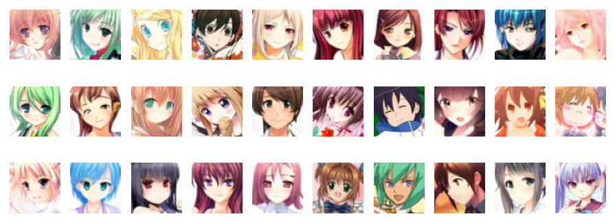
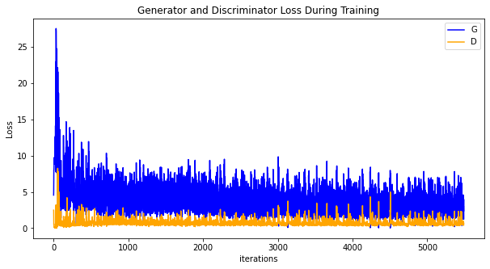
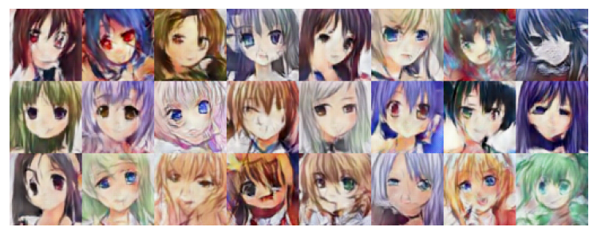

# Generating Cartoon Head Portrait via DCGAN

<a href="https://gitee.com/mindspore/docs/blob/r1.8/tutorials/application/source_en/cv/dcgan.md" target="_blank"></a>

In the following tutorial, we will use sample code to show how to set up the network, optimizer, calculate the loss function, and initialize the model weight. This [Anime Avatar Face Image Dataset](https://download.mindspore.cn/dataset/Faces/faces.zip) contains 70,171 96 x 96 anime avatar face images.

## GAN Basic Principle

Generative Adversarial Network (GAN) is a deep learning model, and is recently one of the most promising methods for unsupervised learning in complex distribution.

GAN was first proposed by Ian J. Goodfellow in his paper [Generative Adversarial Nets](https://papers.nips.cc/paper/5423-generative-adversarial-nets.pdf) in 2014. It consists of two different models: **generator** and **discriminator**.

- The generator generates "fake" images that look like the images for training.
- The discriminator determines whether the images output by the generator are real training images or fake images.

In the training process, the generator continuously attempts to deceive the discriminator by generating a better fake image, and the discriminator gradually improves the capability of discriminating images in this process. It reaches the nash equilibrium when the distribution of the fake image generated by the generator is the same as that of the training image, that is, the confidence of true/false judgment of the discriminator is 50%. Let's see some symbols that need to be used in the entire process:

Discriminator symbols:

- $x$: image data
- $D(x)$: discriminator network, which provides the probability of determining an image as a real image.

During the discrimination, $D(x)$ needs to process a 3 x 64 x 64 image in CHW format. When $x$ comes from training data, the value of $D(x)$ should be approximate to 1. When $x$ comes from the generator, the value of $D(x)$ should be approximate to 0. Therefore, $D(x)$ may also be considered as a conventional binary classifier.

Generator symbols:

- $z$: implicit vector extracted from the standard normal distribution
- $G(z)$: generator function that maps implicit vector $z$ to the data space

Function $G(z)$ is used to generate a data distribution similar to the real data distribution $pdata(x)$ based on the random Gaussian noise $z$ by using a generative network, where $θ$ is a network parameter. We want to find an optimal $θ$ value so that $pG(x;θ)$ and $pdata(x)$ are as close as possible.

$D(G(z))$ indicates the probability that the fake image generated by the generator $G$ is determined to be a real image. As described in [Goodfellow's paper](https://papers.nips.cc/paper/5423-generative-adversarial-nets.pdf), `D` and `G` are in a game. `D` wants to correctly classify real and fake images to the greatest extent, that is, parameter $log D(x)$. `G` attempts to deceive `D` to minimize the probability that the fake image is recognized, that is, parameter $log(1−D(G(z)))$. A loss function of the GAN is as follows:

$$\min_{G}\max_{D}V(D,G)=E_{x\sim_Pdata(x)}[log(D(x))]+E_{z\sim_Pz(z)}[log(1-D(G(z)))]$$

Theoretically, it reaches the nash equilibrium when $pG(x;θ) = pdata(x)$, where the discriminator randomly guesses whether the input is a real or fake image. The following describes the game process of the generator and discriminator:


In the preceding figure, the blue dotted line indicates the discriminator, the black dotted line indicates the real data distribution, the green solid line indicates the false data distribution generated by the generator, z indicates the implicit vector, and x indicates the generated fake image G(z).

1. At the beginning of the training, the quality of the generator and discriminator is poor. The generator randomly generates a data distribution.
2. The discriminator optimizes the network by calculating the gradient and loss function. The data close to the real data distribution is determined as 1, and the data close to the data distribution generated by the generator is determined as 0.
3. The generator generates data that is closer to the actual data distribution through optimization.
4. The data generated by the generator reaches the same distribution as the real data. In this case, the output of the discriminator is 1/2.

## DCGAN Basic Principle

Deep Convolutional Generative Adversarial Network (DCGAN) is a direct extension of GAN. The difference is that DCGAN uses convolution and transposed convolutional layers in the discriminator and generator, respectively.

It was first proposed by Radford et al. in paper [Unsupervised Representation Learning With Deep Convolutional Generative Adversarial Networks](https://arxiv.org/pdf/1511.06434.pdf). The discriminator consists of a hierarchical convolutional layer, a BatchNorm layer, and a LeakyReLU activation layer. Its input is a 3 x 64 x 64 image, and the output is the probability that the image is a real image. The generator consists of a transposed convolutional layer, a BatchNorm layer, and a ReLU activation layer. Its input is the implicit vector $z$ extracted from the standard normal distribution, and the output is a 3 x 64 x 64 RGB image.

This tutorial uses the anime face dataset to train a GAN, which is then used to generate anime avatar face images.

## Data Preparation and Processing

First, download the dataset to the specified directory and decompress it. The sample code is as follows:

```python
from mindvision import dataset

dl_path = "./datasets"
dl_url = "https://download.mindspore.cn/dataset/Faces/faces.zip"

dl = dataset.DownLoad() # Download the dataset.
dl.download_and_extract_archive(url=dl_url, download_path=dl_path)
```

The directory structure of the downloaded dataset is as follows:

```text
./datasets/faces
├── 0.jpg
├── 1.jpg
├── 2.jpg
├── 3.jpg
├── 4.jpg
    ...
├── 70169.jpg
└── 70170.jpg
```

### Data Processing

First, define some inputs for the execution process:

```python
import mindspore as ms

# Use the graph execution mode and specify the training platform to GPU. If the Ascend platform is required, replace it with Ascend.
ms.set_context(mode=ms.GRAPH_MODE, device_target="GPU")

data_root = "./datasets"  # Dataset root directory
batch_size = 128 # Batch size
image_size = 64 # Size of the training image.
nc = 3 # Number of color channels.
nz = 100 # Length of the implicit vector
ngf = 64 # Size of the feature map in the generator
ndf = 64 # Size of the feature map in the discriminator
num_epochs = 10 # Number of training epochs
lr = 0.0002 # Learning rate
beta1 = 0.5  # Beta 1 hyperparameter of the Adam optimizer
```

Define the `create_dataset_imagenet` function to process and augment data.

```python
import numpy as np
import mindspore as ms
import mindspore.dataset as ds
import mindspore.dataset.vision as vision

from mindspore import nn, ops

def create_dataset_imagenet(dataset_path):
    """Data loading"""
    data_set = ds.ImageFolderDataset(dataset_path, num_parallel_workers=4, shuffle=True,
                                     decode=True)

    # Data augmentation
    transform_img = [
        vision.Resize(image_size),
        vision.CenterCrop(image_size),
        vision.HWC2CHW(),
        lambda x: ((x / 255).astype("float32"), np.random.normal(size=(nz, 1, 1)).astype("float32"))
    ]

    # Data mapping
    data_set = data_set.map(input_columns="image", num_parallel_workers=4, operations=transform_img, column_order=[\"image\", \"latent_code\"])

    # Batch operation
    data_set = data_set.batch(batch_size)
    return data_set

# Obtain the processed dataset.
data = create_dataset_imagenet(data_root)

# Obtain the dataset size.
size = data.get_dataset_size()
```

Use the `create_dict_iterator` function to convert data into a dictionary iterator, and then use the `matplotlib` module to visualize some training data.

```python
import matplotlib.pyplot as plt
%matplotlib inline

data_iter = next(data.create_dict_iterator(output_numpy=True))

# Visualize some training data.
plt.figure(figsize=(10, 3), dpi=140)
for i, image in enumerate(data_iter['image'][:30], 1):
    plt.subplot(3, 10, i)
    plt.axis("off")
    plt.imshow(image.transpose(1, 2, 0))
plt.show()
```



## Setting Up a GAN

After the data is processed, you can set up a GAN. According to the DCGAN paper, all model weights should be randomly initialized from a normal distribution with `mean` of 0 and `sigma` of 0.02.

### Generator

Generator `G` maps the implicit vector `z` to the data space. Because the data is an image, this process also creates an RGB image with the same size as the real image. In practice, this function is implemented by using a series of `Conv2dTranspose` transposed convolutional layers. Each layer is paired with the `BatchNorm2d` layer and `ReLu` activation layer. The output data passes through the `tanh` function and returns a value within the data range of `[–1,1]`.

The following shows the image generated by DCGAN:


> Image source: https://arxiv.org/pdf/1511.06434.pdf

The generator structure in the code is determined by `nz`, `ngf`, and `nc` set in the input. `nz` is the length of implicit vector `z`, `ngf` determines the size of the feature map propagated by the generator, and `nc` is the number of channels in the output image.

The code implementation of the generator is as follows:

```python
from mindspore.common import initializer as init

def conv_t(in_channels, out_channels, kernel_size, stride=1, padding=0, pad_mode="pad"):
    """Define the transposed convolutional layer."""
    weight_init = init.Normal(mean=0, sigma=0.02)
    return nn.Conv2dTranspose(in_channels, out_channels,
                              kernel_size=kernel_size, stride=stride, padding=padding,
                              weight_init=weight_init, has_bias=False, pad_mode=pad_mode)

def bn(num_features):
    """Define the BatchNorm2d layer."""
    gamma_init = init.Normal(mean=1, sigma=0.02)
    return nn.BatchNorm2d(num_features=num_features, gamma_init=gamma_init)

class Generator(nn.Cell):
    """DCGAN generator"""

    def __init__(self):
        super(Generator, self).__init__()
        self.generator = nn.SequentialCell()
        self.generator.append(conv_t(nz, ngf * 8, 4, 1, 0))
        self.generator.append(bn(ngf * 8))
        self.generator.append(nn.ReLU())
        self.generator.append(conv_t(ngf * 8, ngf * 4, 4, 2, 1))
        self.generator.append(bn(ngf * 4))
        self.generator.append(nn.ReLU())
        self.generator.append(conv_t(ngf * 4, ngf * 2, 4, 2, 1))
        self.generator.append(bn(ngf * 2))
        self.generator.append(nn.ReLU())
        self.generator.append(conv_t(ngf * 2, ngf, 4, 2, 1))
        self.generator.append(bn(ngf))
        self.generator.append(nn.ReLU())
        self.generator.append(conv_t(ngf, nc, 4, 2, 1))
        self.generator.append(nn.Tanh())

    def construct(self, x):
        return self.generator(x)

# Instantiate the generator.
netG = Generator()
```

### Discriminator

As described above, discriminator `D` is a binary network model, and outputs the probability that the image is determined as a real image. It is processed through a series of `Conv2d`, `BatchNorm2d`, and `LeakyReLU` layers and obtains the final probability through the Sigmoid activation function.

The DCGAN paper mentions that using convolution instead of pooling for downsampling is a good way because it allows the network to learn its own pooling characteristics.

The code implementation of the discriminator is as follows:

```python
def conv(in_channels, out_channels, kernel_size, stride=1, padding=0, pad_mode="pad"):
    """Define the convolutional layers."""
    weight_init = init.Normal(mean=0, sigma=0.02)
    return nn.Conv2d(in_channels, out_channels,
                     kernel_size=kernel_size, stride=stride, padding=padding,
                     weight_init=weight_init, has_bias=False, pad_mode=pad_mode)

class Discriminator(nn.Cell):
    """DCGAN discriminator"""

    def __init__(self):
        super(Discriminator, self).__init__()
        self.discriminator = nn.SequentialCell()
        self.discriminator.append(conv(nc, ndf, 4, 2, 1))
        self.discriminator.append(nn.LeakyReLU(0.2))
        self.discriminator.append(conv(ndf, ndf * 2, 4, 2, 1))
        self.discriminator.append(bn(ndf * 2))
        self.discriminator.append(nn.LeakyReLU(0.2))
        self.discriminator.append(conv(ndf * 2, ndf * 4, 4, 2, 1))
        self.discriminator.append(bn(ndf * 4))
        self.discriminator.append(nn.LeakyReLU(0.2))
        self.discriminator.append(conv(ndf * 4, ndf * 8, 4, 2, 1))
        self.discriminator.append(bn(ndf * 8))
        self.discriminator.append(nn.LeakyReLU(0.2))
        self.discriminator.append(conv(ndf * 8, 1, 4, 1))
        self.discriminator.append(nn.Sigmoid())

    def construct(self, x):
        return self.discriminator(x)

# Instantiate the discriminator.
netD = Discriminator()
```

### Loss and Optimizer

MindSpore encapsulates the loss function and optimizer into cells. Due to the particularity of the GAN structure, the loss of the GAN is the multi-output form of the discriminator and generator, which makes the GAN different from a common classification network. Therefore, we need to customize the `WithLossCell` class to connect the loss function to the GAN.

## Loss Function

When `D` and `G` are defined, the binary cross-entropy loss function [BCELoss](https://www.mindspore.cn/docs/zh-CN/r1.8/api_python/nn/mindspore.nn.BCELoss.html) defined in MindSpore will be used to add the loss function and optimizer to `D` and `G`.

- Connect the generator and loss function. The code is as follows:

```python
# define loss function
loss = nn.BCELoss(reduction='mean')

class WithLossCellG(nn.Cell):
    """Connect the generator and loss function."""

    def __init__(self, netD, netG, loss_fn):
        super(WithLossCellG, self).__init__(auto_prefix=True)
        self.netD = netD
        self.netG = netG
        self.loss_fn = loss_fn

    def construct(self, latent_code):
        """Construct the loss calculation structure of the generator."""
        fake_data = self.netG(latent_code)
        out = self.netD(fake_data)
        label_real = ops.OnesLike()(out)
        loss = self.loss_fn(out, label_real)
        return loss
```

- Connect the discriminator and loss function. The code is as follows:

```python
class WithLossCellD(nn.Cell):
    """Connect the discriminator and loss function."""

    def __init__(self, netD, netG, loss_fn):
        super(WithLossCellD, self).__init__(auto_prefix=True)
        self.netD = netD
        self.netG = netG
        self.loss_fn = loss_fn

    def construct(self, real_data, latent_code):
        """Construct the loss calculation structure of the discriminator."""
        out_real = self.netD(real_data)
        label_real = ops.OnesLike()(out_real)
        loss_real = self.loss_fn(out_real, label_real)

        fake_data = self.netG(latent_code)
        fake_data = ops.stop_gradient(fake_data)
        out_fake = self.netD(fake_data)
        label_fake = ops.ZerosLike()(out_fake)
        loss_fake = self.loss_fn(out_fake, label_fake)
        return loss_real + loss_fake
```

### Optimizer

Two separate optimizers are set up here, one for `D` and the other for `G`. Both are Adam optimizers with `lr = 0.0002` and `beta1 = 0.5`.

To trace the learning progress of the generator, during the training process, a batch of fixed implicit vectors `fixed_noise` that comply with Gaussian distribution are periodically input to `G`. We can see the images generated by the implicit vector.

```python
# Create a batch of implicit vectors to observe G.
np.random.seed(1)
fixed_noise = ms.Tensor(np.random.randn(64, nz, 1, 1), dtype=ms.float32)

# Set optimizers for the generator and discriminator, respectively.
optimizerD = nn.Adam(netD.trainable_params(), learning_rate=lr, beta1=beta1)
optimizerG = nn.Adam(netG.trainable_params(), learning_rate=lr, beta1=beta1)
```

## Training Mode

Training is divided into two parts: discriminator training and generator training.

- Train the discriminator.

   The discriminator is trained to improve the probability of discriminating real images to the greatest extent. According to Goodfellow's approach, we can update the discriminator by increasing its stochastic gradient so as to maximize the value of $log D(x) + log(1 - D(G(z))$.

- Train the generator.

   As stated in the DCGAN paper, we want to train the generator by minimizing the value of $log(1 - D(G(z)))$ to produce better fake images.

In the preceding two processes, the training loss is obtained, and statistics are collected at the end of each epoch. A batch of `fixed_noise` is pushed to the generator to intuitively trace the training progress of `G`.

The training process is as follows:

```python
class DCGAN(nn.Cell):
    """Define the DCGAN."""

    def __init__(self, myTrainOneStepCellForD, myTrainOneStepCellForG):
        super(DCGAN, self).__init__(auto_prefix=True)
        self.myTrainOneStepCellForD = myTrainOneStepCellForD
        self.myTrainOneStepCellForG = myTrainOneStepCellForG

    def construct(self, real_data, latent_code):
        output_D = self.myTrainOneStepCellForD(real_data, latent_code).view(-1)
        netD_loss = output_D.mean()
        output_G = self.myTrainOneStepCellForG(latent_code).view(-1)
        netG_loss = output_G.mean()
        return netD_loss, netG_loss
```

Instantiate `WithLossCell` and `TrainOneStepCell` of the generator and discriminator.

```python
# Instantiate `WithLossCell`.
netD_with_criterion = WithLossCellD(netD, netG, loss)
netG_with_criterion = WithLossCellG(netD, netG, loss)

# Instantiate `TrainOneStepCell`.
myTrainOneStepCellForD = nn.TrainOneStepCell(netD_with_criterion, optimizerD)
myTrainOneStepCellForG = nn.TrainOneStepCell(netG_with_criterion, optimizerG)
```

Train the DCGAN cyclically, and collect the loss of the generator and discriminator every 50 iterations to facilitate subsequent drawing of the image of the loss function during the training process.

```python
import mindspore as ms

# Instantiate the DCGAN.
dcgan = DCGAN(myTrainOneStepCellForD, myTrainOneStepCellForG)
dcgan.set_train()

# Create an iterator.
data_loader = data.create_dict_iterator(output_numpy=True, num_epochs=num_epochs)
G_losses = []
D_losses = []
image_list = []

# Start cyclic training.
print("Starting Training Loop...")

for epoch in range(num_epochs):
    # Read data for each epoch of training.
    for i, d in enumerate(data_loader):
        real_data = ms.Tensor(d['image'])
        latent_code = ms.Tensor(d["latent_code"])
        netD_loss, netG_loss = dcgan(real_data, latent_code)
        if i % 50 == 0 or i == size - 1:
            # Output training records.
            print('[%2d/%d][%3d/%d]   Loss_D:%7.4f  Loss_G:%7.4f' % (
                epoch + 1, num_epochs, i + 1, size, netD_loss.asnumpy(), netG_loss.asnumpy()))
        D_losses.append(netD_loss.asnumpy())
        G_losses.append(netG_loss.asnumpy())

    # After each epoch ends, use the generator to generate a group of images.
    img = netG(fixed_noise)
    image_list.append(img.transpose(0, 2, 3, 1).asnumpy())

    # Save the network model parameters as a CKPT file.
    ms.save_checkpoint(netG, "Generator.ckpt")
    ms.save_checkpoint(netD, "Discriminator.ckpt")
```

```python
    Starting Training Loop...
    [ 1/10][  1/549]   Loss_D: 2.4791  Loss_G: 4.5578
    [ 1/10][ 51/549]   Loss_D: 3.0025  Loss_G:10.6227
    [ 1/10][101/549]   Loss_D: 0.8981  Loss_G: 7.0375
    ...
    [ 1/10][451/549]   Loss_D: 0.6918  Loss_G: 2.9458
    [ 1/10][501/549]   Loss_D: 0.5139  Loss_G: 4.7647
    [ 1/10][549/549]   Loss_D: 1.2940  Loss_G: 3.6022
    ...
    [10/10][501/549]   Loss_D: 0.4301  Loss_G: 2.1187
    [10/10][549/549]   Loss_D: 0.6756  Loss_G: 1.2940

```

## Result

Run the following code to describe the relationship between the `D` and `G` loss and the training iteration:

```python
plt.figure(figsize=(10, 5))
plt.title("Generator and Discriminator Loss During Training")
plt.plot(G_losses, label="G", color='blue')
plt.plot(D_losses, label="D", color='orange')
plt.xlabel("iterations")
plt.ylabel("Loss")
plt.legend()
plt.show()
```



Image generated by implicit vector `fixed_noise` during visual training.

```python
import matplotlib.pyplot as plt
import matplotlib.animation as animation

def showGif(image_list):
    show_list = []
    fig = plt.figure(figsize=(8, 3), dpi=120)
    for epoch in range(len(image_list)):
        images = []
        for i in range(3):
            row = np.concatenate((image_list[epoch][i * 8:(i + 1) * 8]), axis=1)
            images.append(row)
        img = np.clip(np.concatenate((images[:]), axis=0), 0, 1)
        plt.axis("off")
        show_list.append([plt.imshow(img)])

    ani = animation.ArtistAnimation(fig, show_list, interval=1000, repeat_delay=1000, blit=True)
    ani.save('./dcgan.gif', writer='pillow', fps=1)

showGif(image_list)
```


As shown in the preceding figure, the image quality becomes better as the number of training iterations increases. If the number of training epochs increases and the value of `num_epochs` is greater than 50, the generated anime avatar face image is similar to that in the dataset. The following describes how to load the GAN parameter file [Generator.ckpt](https://download.mindspore.cn/vision/classification/Generator.ckpt) in which the number of training epochs is 50 to generate an image. The code is as follows:

```python
import mindspore as ms
from mindvision import dataset

dl_path = "./netG"
dl_url = "https://download.mindspore.cn/vision/classification/Generator.ckpt"

dl = dataset.DownLoad()  # Download the `Generator.ckpt` file.
dl.download_url(url=dl_url, path=dl_path)

# Obtain model parameters from the file and load them to the network.
param_dict = ms.load_checkpoint("./netG/Generator.ckpt", netG)

img64 = netG(fixed_noise).transpose(0, 2, 3, 1).asnumpy()

fig = plt.figure(figsize=(8, 3), dpi=120)
images = []
for i in range(3):
    images.append(np.concatenate((img64[i * 8:(i + 1) * 8]), axis=1))
img = np.clip(np.concatenate((images[:]), axis=0), 0, 1)
plt.axis("off")
plt.imshow(img)
plt.show()
```

