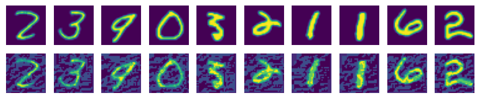

# FGSM Network Adversarial Attack

<a href="https://gitee.com/mindspore/docs/blob/master/tutorials/application/source_en/cv/fgsm.md" target="_blank"></a>

With continuous development and evolution of data, computing power, and theories in recent years, deep learning has been widely applied in many fields involving images, texts, voice, and autonomous driving. Meanwhile, people are getting more and more concerned about the security issues of various models in use, because AI models are vulnerable to intentional or unintentional attacks and generate incorrect results.

In this case, we will use the FGSM attack as an example to demonstrate how to attack and mislead a model.

## Adversarial Example Definition

Szegedy first proposed the concept of adversarial examples in 2013.

Small perturbations that cannot be perceived by humans are added to original examples, which deteriorates the performance of deep models. Such examples are adversarial examples. For example, after a noise is added to the image that should be predicted as panda, the model predicts the image as gibbon. The example is an adversarial example.


> The image comes from [Explaining and Harnessing Adversarial Examples](https://arxiv.org/abs/1412.6572).

## Attack Methods

Attacks on models can be classified from the following aspects:

1. Information that can be obtained by attackers:

   - **White-box attack**: Attackers have all knowledge and access permissions on a model, including the model structure, weight, input, and output. Attackers can interact with the model system in the process of generating adversarial attack data. Due to that attackers completely master information about models, they can design specific attack algorithms based on the features of the attacked model.

   - **Black-box attack**: Contrary to white-box attacks, attacks only obtain limited information about models. Attackers know nothing about the structure or weight of the model and know only part of the input and output.

2. Attackers' purposes:

   - **Targeted attack**: Attackers misguide the model result into a specific category.

   - **Untargeted attacks**: Attackers only want to generate incorrect results and do not care about new results.

The Fast Gradient Sign Method (FGSM) attack used in this case is a white-box attack method, which can be either a targeted or untargeted attack.

> For more model security functions, see [MindArmour](https://www.mindspore.cn/mindarmour/docs/en/master/index.html). Currently, MindArmour supports multiple adversarial example generation methods, such as FGSM, LLC, and Substitute Attack, and provides adversarial example robustness, fuzz testing, and privacy protection and evaluation modules to enhance model security.

### FGSM Attack

During the training of a classification network, a loss function is defined to measure the distance between the model output value and the actual label of the example. The model gradient is computed through backward propagation. The network parameters are updated through gradient descent to reduce the loss value and improve the model accuracy.

FGSM is a simple and efficient method for generating adversarial examples. Different from the training process of a normal classification network, FGSM computes the gradient $\nabla_x J(\theta ,x ,y)$ of the loss to the input. The gradient indicates the sensitivity of the loss to the input change.

Then, the preceding gradient is added to the original input to increase the loss value. As a result, the classification effect of the reconstructed input examples deteriorates, and the attack is successful.

Another requirement of adversarial examples is that the difference between the generated example and the original example must be as small as possible. The sign function can be used to make the image modification as even as possible.

The generated adversarial perturbation may be expressed by using the following formula:

$$ \eta  = \varepsilon  sign(\nabla_x  J(\theta)) \tag{1}$$

Adversarial examples can be formulated as follows:

$$ x' = x + \varepsilon sign(\nabla_x J(\theta ,x ,y)) \tag{2}$$

In the preceding information:

- $x$: an original input image that is correctly classified as "Pandas."
- $y$: an output of $x$.
- $\theta$: a model parameter.
- $\varepsilon$: an attack coefficient.
- $J(\theta, x, y)$: a loss of the training network.
- $\nabla_x J(\theta)$: a backward propagation gradient.

## Data Processing

In this case, MNIST is used to train LeNet with the qualified accuracy, and then the FGSM attack mentioned above is executed to deceive the network model and enable the model to implement incorrect classification.

Use the following sample code to download and decompress a dataset to a specified location.

```python
import mindspore.dataset.vision as transforms
from mindspore.dataset.vision import Inter
from mindspore.dataset import MnistDataset
from download import download

url = "https://mindspore-website.obs.cn-north-4.myhuaweicloud.com/" \
      "notebook/datasets/MNIST_Data.zip"
path = download(url, "./", kind="zip", replace=True)

dataset_train = MnistDataset(dataset_dir="./MNIST_Data/train", usage="train", shuffle=True)
dataset_eval = MnistDataset(dataset_dir="./MNIST_Data/test", usage="test", shuffle=True)

trans_transform = [
    transforms.Resize(size=32, interpolation=Inter.LINEAR),
    transforms.Rescale(1.0 / 255.0, 0.0),
    transforms.Rescale(1 / 0.3081, -1 * 0.1307 / 0.3081),
    transforms.HWC2CHW(),
]

dataset_train = dataset_train.map(operations=trans_transform, input_columns=["image"])
dataset_train = dataset_train.map(operations=lambda x: x.astype("int32"), input_columns=["label"])
dataset_train = dataset_train.batch(batch_size=32, drop_remainder=True)

dataset_eval = dataset_eval.map(operations=trans_transform, input_columns=["image"])
dataset_eval = dataset_eval.map(operations=lambda x: x.astype("int32"), input_columns=["label"])
dataset_eval = dataset_eval.batch(batch_size=32, drop_remainder=True)
```

The directory structure of the downloaded dataset files is as follows:

```text
./MNIST_Data
├── test
│   ├── t10k-images-idx3-ubyte
│   └── t10k-labels-idx1-ubyte
└── train
    ├── train-images-idx3-ubyte
    └── train-labels-idx1-ubyte
```

## Training LeNet

In the experiment, LeNet is used to complete image classification as a demo model. You need to define the network and use the MNIST dataset for training.

Define LeNet:

```python
from mindspore import nn
from mindspore.common.initializer import Normal


class LeNet5(nn.Cell):
    """LeNet5"""
    def __init__(self, num_classes=10, num_channel=1, include_top=True):
        super(LeNet5, self).__init__()
        self.include_top = include_top

        self.conv1 = nn.Conv2d(num_channel, 6, 5, pad_mode='valid')
        self.conv2 = nn.Conv2d(6, 16, 5, pad_mode='valid')
        self.relu = nn.ReLU()
        self.max_pool2d = nn.MaxPool2d(kernel_size=2, stride=2)

        if self.include_top:
            self.flatten = nn.Flatten()
            self.fc1 = nn.Dense(16 * 5 * 5, 120, weight_init=Normal(0.02))
            self.fc2 = nn.Dense(120, 84, weight_init=Normal(0.02))
            self.fc3 = nn.Dense(84, num_classes, weight_init=Normal(0.02))

    def construct(self, x):
        """
        LeNet5 construct.
        """
        x = self.conv1(x)
        x = self.relu(x)
        x = self.max_pool2d(x)
        x = self.conv2(x)
        x = self.relu(x)
        x = self.max_pool2d(x)
        if self.include_top:
            x = self.flatten(x)
            x = self.relu(self.fc1(x))
            x = self.relu(self.fc2(x))
            x = self.fc3(x)
        return x


network = LeNet5()
```

Define an optimizer and a loss function:

```python
import mindspore.nn as nn

net_loss = nn.SoftmaxCrossEntropyWithLogits(sparse=True, reduction='mean')
net_opt = nn.Momentum(network.trainable_params(), learning_rate=0.01, momentum=0.9)
```

Define network parameters:

```python
from mindspore import train

config_ck = train.CheckpointConfig(save_checkpoint_steps=1875, keep_checkpoint_max=10)
ckpoint = train.ModelCheckpoint(prefix="checkpoint_lenet", config=config_ck)
```

Train LeNet:

```python
from mindspore.train import LossMonitor
import mindspore as ms

model = ms.Model(network, loss_fn=net_loss, optimizer=net_opt, metrics={'accuracy'})
model.train(5, dataset_train, callbacks=[ckpoint, LossMonitor(1875)])
```

```text
epoch: 1 step: 1875, loss is 0.022706642746925354
epoch: 2 step: 1875, loss is 0.11357966810464859
epoch: 3 step: 1875, loss is 0.011764582246541977
epoch: 4 step: 1875, loss is 0.014187423512339592
epoch: 5 step: 1875, loss is 0.0022521568462252617
```

Test the current network. You can see that LeNet has reached a high accuracy.

```python
acc = model.eval(dataset_eval)
print("{}".format(acc))
```

```python
    {'accuracy': 0.9888822115384616}
```

Load the trained LeNet model:

```python
param_dict = ms.load_checkpoint("checkpoint_lenet-5_1875.ckpt")
ms.load_param_into_net(network, param_dict)
```

```text
[]
```

### Implementing FGSM

After the accurate LeNet is obtained, the FGSM attack is used to load noise in the image and perform the test again.

Compute a backward gradient using the loss function:

```python
def forward_fn(inputs, targets):
    out = network(inputs)
    loss = net_loss(out, targets)
    return loss
```

Then, implement the FGSM attack according to formula (2):

```python
import numpy as np


def gradient_func(inputs, labels):
    _grad_all = ops.composite.GradOperation(get_all=True, sens_param=False)
    # Obtain the gradient
    out_grad = _grad_all(forward_fn)(inputs, labels)[0]
    gradient = out_grad.asnumpy()
    gradient = np.sign(gradient)
    return gradient


def generate(inputs, labels, eps):
    # Implement FGSM
    inputs_tensor = ms.Tensor(inputs)
    labels_tensor = ms.Tensor(labels)
    gradient = gradient_func(inputs_tensor, labels_tensor)
    # Generate perturbation
    perturbation = eps * gradient
    # Generate the images after perturbation
    adv_x = inputs + perturbation
    return adv_x


def batch_generate(inputs, labels, eps, batch_size):
    # Process the dataset
    arr_x = inputs
    arr_y = labels
    len_x = len(inputs)
    batches = int(len_x / batch_size)
    res = []
    for i in range(batches):
        x_batch = arr_x[i * batch_size: (i + 1) * batch_size]
        y_batch = arr_y[i * batch_size: (i + 1) * batch_size]
        adv_x = generate(x_batch, y_batch, eps=eps)
        res.append(adv_x)
    adv_x = np.concatenate(res, axis=0)
    return adv_x
```

Reprocess the images from the test set in the MINIST dataset:

```python
images = []
labels = []
test_images = []
test_labels = []
predict_labels = []

ds_test = dataset_eval.create_dict_iterator(output_numpy=True)

for data in ds_test:
    images = data['image'].astype(np.float32)
    labels = data['label']
    test_images.append(images)
    test_labels.append(labels)
    pred_labels = np.argmax(model.predict(ms.Tensor(images)).asnumpy(), axis=1)
    predict_labels.append(pred_labels)

test_images = np.concatenate(test_images)
predict_labels = np.concatenate(predict_labels)
true_labels = np.concatenate(test_labels)
```

## Running Attack

It can be seen from the FGSM attack formula that, the larger the attack coefficient $\varepsilon$, the greater the change to the gradient. If the value of $\varepsilon$ is 0, the attack effect is not reflected.

$$\eta = \varepsilon sign(\nabla_x  J(\theta)) \tag{3}$$

Observe the attack effect when $\varepsilon$ is 0:

```python
import mindspore.ops as ops

advs = batch_generate(test_images, true_labels, batch_size=32, eps=0.0)

adv_predicts = model.predict(ms.Tensor(advs)).asnumpy()
adv_predicts = np.argmax(adv_predicts, axis=1)
accuracy = np.mean(np.equal(adv_predicts, true_labels))
print(accuracy)
```

```text
    0.9888822115384616
```

Set $\varepsilon$ to 0.5 and try to run the attack.

```python
advs = batch_generate(test_images, true_labels, batch_size=32, eps=0.5)

adv_predicts = model.predict(ms.Tensor(advs)).asnumpy()
adv_predicts = np.argmax(adv_predicts, axis=1)
accuracy = np.mean(np.equal(adv_predicts, true_labels))
print(accuracy)
```

```text
    0.36828926282051283
```

The preceding result shows that the accuracy of the LeNet model is greatly reduced.

The following shows the actual form of the attacked image. It can be seen that the image changes slightly, but the accuracy decreases greatly in the test.

```python
import matplotlib.pyplot as plt
%matplotlib inline

adv_examples = np.transpose(advs[:10], [0, 2, 3, 1])
ori_examples = np.transpose(test_images[:10], [0, 2, 3, 1])

plt.figure(figsize=(10, 3), dpi=120)
for i in range(10):
    plt.subplot(3, 10, i + 1)
    plt.axis("off")
    plt.imshow(np.squeeze(ori_examples[i]))
    plt.subplot(3, 10, i + 11)
    plt.axis("off")
    plt.imshow(np.squeeze(adv_examples[i]))
plt.show()
```


