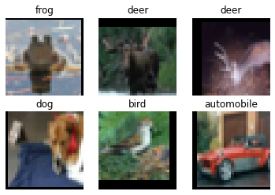
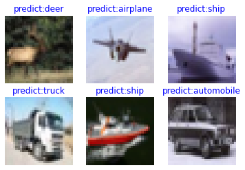

# ResNet-50 for Image Classification

<a href="https://gitee.com/mindspore/docs/blob/master/tutorials/application/source_en/cv/resnet50.md" target="_blank"></a>

Image classification is the most basic computer vision application and belongs to the supervised learning category. For example, we can determine the category to which an image (such as an image of a cat, a dog, an airplane, or a car) belongs. The following describes how to use ResNet-50 to classify the CIFAR-10 dataset.

## Introduction to ResNet

ResNet-50 was proposed by He Kaiming of Microsoft Research in 2015 and won the championship in the 2015 ILSVRC. Before ResNet was proposed, a convolutional neural network was obtained by stacking a series of convolutional layers and pooling layers. However, when the network was stacked to a specific depth, a degradation problem occurred. The following figures show the training error and test error of a 56-layer network and a 20-layer network on the CIFAR-10 dataset. The data in the figures shows that the training error and test error of the 56-layer network are greater than those of the 20-layer network. As the network depth increases, the errors do not decrease as expected.


In ResNet, a residual network is proposed to alleviate the degradation problem, and a relatively deep network (with more than 1,000 layers) can be built by using ResNet. The following figure shows the training error and test error of ResNet on the CIFAR-10 dataset. In the figure, the dotted lines indicate the training errors, and the solid lines indicate the test errors. As shown in the figure, a deeper ResNet indicates a smaller training error and a smaller test error.


> For more details about ResNet, see [*Deep Residual Learning for Image Recognition*](https://arxiv.org/pdf/1512.03385.pdf).

## Preparing and Loading Datasets

[The CIFAR-10 dataset](http://www.cs.toronto.edu/~kriz/cifar.html) contains 60,000 32 x 32 color images in 10 classes, with 6,000 images per class. There are 50,000 training images and 10,000 test images. The following example uses the `mindvision.dataset.Cifar10` API to download and load the CIFAR-10 dataset.

```python
from mindvision.dataset import Cifar10

# Dataset root directory
data_dir = "./datasets"

# Download, decompress, and load the CIFAR-10 training dataset.
dataset_train = Cifar10(path=data_dir, split='train', batch_size=6, resize=32, download=True)
ds_train = dataset_train.run()
step_size = ds_train.get_dataset_size()
# Download, decompress, and load the CIFAR-10 test dataset.
dataset_val = Cifar10(path=data_dir, split='test', batch_size=6, resize=32, download=True)
ds_val = dataset_val.run()
```

The directory structure of the CIFAR-10 dataset file is as follows:

```Text
datasets/
├── cifar-10-batches-py
│   ├── batches.meta
│   ├── data_batch_1
│   ├── data_batch_2
│   ├── data_batch_3
│   ├── data_batch_4
│   ├── data_batch_5
│   ├── readme.html
│   └── test_batch
└── cifar-10-python.tar.gz

```

Visualize the CIFAR-10 training dataset.

```python
import numpy as np
import matplotlib.pyplot as plt

data = next(ds_train.create_dict_iterator())

images = data["image"].asnumpy()
labels = data["label"].asnumpy()
print(f"Image shape: {images.shape}, Label: {labels}")

plt.figure()
for i in range(1, 7):
    plt.subplot(2, 3, i)
    image_trans = np.transpose(images[i - 1], (1, 2, 0))
    mean = np.array([0.4914, 0.4822, 0.4465])
    std = np.array([0.2023, 0.1994, 0.2010])
    image_trans = std * image_trans + mean
    image_trans = np.clip(image_trans, 0, 1)
    plt.title(f"{dataset_train.index2label[labels[i - 1]]}")
    plt.imshow(image_trans)
    plt.axis("off")
plt.show()
```

```python
    Image shape: (6, 3, 32, 32), Label: [6 4 4 5 2 1]
```



## Building a Network

The residual network is a main highlight of ResNet, with which the degradation problem can be effectively alleviated, a deeper network can be designed, and the network training accuracy can be improved. The following describes how to build a residual network and then build a ResNet-50 network by stacking residual networks.

### Building a Residual Network

The following figure shows the structure of a residual network. The residual network consists of two parts: main body and a shortcut (see the arc in the figure). The main body is obtained by stacking a series of convolution operations. The shortcut is directly from input to output. $F(x)+x$ is obtained by adding the feature matrix $F(x)$ output by the main body to the feature matrix $x$ output by the shortcut. After the ReLU activation function is used, the final output of the residual network is obtained.


There are two residual network structures. One is the building block, which is applicable to shallow ResNet, such as ResNet-18 and ResNet-34. The other is the bottleneck, which is applicable to deep ResNet, such as ResNet-50, ResNet-101, and ResNet-152.

#### Building Block

The following figure shows the structure of the building block. The main body has two convolutional layers.

+ On the first-layer network of the main body. 64 input channels are used. Then, 64 output channels are obtained through the $3\times3$ convolutional layer, the Batch Normalization layer, and the ReLU activation function layer.
+ On the second-layer network of the main body, 64 input channels are also used. Then, 64 output channels are obtained through the $3\times3$ convolutional layer, the Batch Normalization layer, and the ReLU activation function layer.

Finally, the feature matrix output by the main body is added to the feature matrix output by the shortcut. After the ReLU activation function is used, the final output of the building block is obtained.


When adding the feature matrix output by the main body to that output by the shortcut, ensure that the shape of the feature matrix output by the main body is the same as that of the feature matrix output by the shortcut. If the shapes are different, for example, when the number of output channels is twice that of input channels, the number of convolution kernels used by the shortcut for convolution operations is the same as that of the output channels and the size is $1\times1$. If the size of the output image is half of that of the input image, `stride` in the convolution operation of the shortcut must be set to **2**, and `stride` in the first-layer convolution operation of the main body must also be set to **2**.

The following code defines the `ResidualBlockBase` class to implement the building block structure:

```python
from typing import Type, Union, List, Optional
from mindvision.classification.models.blocks import ConvNormActivation
from mindspore import nn


class ResidualBlockBase(nn.Cell):
    expansion: int = 1  # The number of convolution kernels at the last layer is the same as that of convolution kernels at the first layer.

    def __init__(self, in_channel: int, out_channel: int,
                 stride: int = 1, norm: Optional[nn.Cell] = None,
                 down_sample: Optional[nn.Cell] = None) -> None:
        super(ResidualBlockBase, self).__init__()
        if not norm:
            norm = nn.BatchNorm2d

        self.conv1 = ConvNormActivation(in_channel, out_channel,
                                        kernel_size=3, stride=stride, norm=norm)
        self.conv2 = ConvNormActivation(out_channel, out_channel,
                                        kernel_size=3, norm=norm, activation=None)
        self.relu = nn.ReLU()
        self.down_sample = down_sample

    def construct(self, x):
        """ResidualBlockBase construct."""
        identity = x  # shortcut

        out = self.conv1(x)  # First layer of the main body: 3 x 3 convolutional layer
        out = self.conv2(out)  # Second layer of the main body: 3 x 3 convolutional layer

        if self.down_sample:
            identity = self.down_sample(x)
        out += identity  # The output is the sum of the main body and the shortcut.
        out = self.relu(out)

        return out
```

#### Bottleneck

The following figure shows the bottleneck structure. With the same input, the bottleneck structure has fewer parameters than the building block structure. Therefore, the bottleneck structure is more suitable for a deep network. The residual structure used by ResNet-50 is bottleneck. The main body of this structure has three convolutional layers, namely, $1\times1$, $3\times3$, and $1\times1$. $1\times1$ is used for dimension reduction and dimension rollup.

+ On the first-layer network of the main body, 256 input channels are used. Dimension reduction is performed by using 64 convolution kernels with a size of $1\times1$. Then, 64 output channels are obtained through the Batch Normalization layer and the ReLU activation function layer.
+ On the second-layer network of the main body, features are extracted by using 64 convolution kernels with a size of $3\times3$. Then, 64 output channels are obtained through the Batch Normalization layer and the ReLU activation function layer.
+ On the third-layer network of the main body, dimension rollup is performed by using 256 convolution kernels with a size of $1\times1$. Then, 256 output channels are obtained through the Batch Normalization layer.

Finally, the feature matrix output by the main body is added to the feature matrix output by the shortcut. After the ReLU activation function is used, the final output of the bottleneck is obtained.


When adding the feature matrix output by the main body to that output by the shortcut, ensure that the shape of the feature matrix output by the main body is the same as that of the feature matrix output by the shortcut. If the shapes are different, for example, when the number of output channels is twice that of input channels, the number of convolution kernels used by the shortcut for convolution operations is the same as that of the output channels and the size is $1\times1$. If the size of the output image is half of that of the input image, `stride` in the convolution operation of the shortcut must be set to **2**, and `stride` in the second-layer convolution operation of the main body must also be set to **2**.

The following code defines the `ResidualBlock` class to implement the bottleneck structure:

```python
class ResidualBlock(nn.Cell):
    expansion = 4  # The number of convolution kernels at the last layer is four times that of convolution kernels at the first layer.

    def __init__(self, in_channel: int, out_channel: int,
                 stride: int = 1, norm: Optional[nn.Cell] = None,
                 down_sample: Optional[nn.Cell] = None) -> None:
        super(ResidualBlock, self).__init__()
        if not norm:
            norm = nn.BatchNorm2d

        self.conv1 = ConvNormActivation(in_channel, out_channel,
                                        kernel_size=1, norm=norm)
        self.conv2 = ConvNormActivation(out_channel, out_channel,
                                        kernel_size=3, stride=stride, norm=norm)
        self.conv3 = ConvNormActivation(out_channel, out_channel * self.expansion,
                                        kernel_size=1, norm=norm, activation=None)
        self.relu = nn.ReLU()
        self.down_sample = down_sample

    def construct(self, x):
        identity = x  # shortcut

        out = self.conv1(x)  # First layer of the main body: 1 x 1 convolutional layer
        out = self.conv2(out)  # Second layer of the main body: 3 x 3 convolutional layer
        out = self.conv3(out)  # Third layer of the main body: 1 x 1 convolutional layer

        if self.down_sample:
            identity = self.down_sample(x)

        out += identity  # The output is the sum of the main body and the shortcut.
        out = self.relu(out)

        return out
```

#### Building a ResNet-50 Network

The following figure shows the structure of ResNet. Take the input color image $224\times224$ as an example. 64 conv1 whose size is $7\times7$ and whose stride is 2 are used. The output image size at this layer is $112\times112$, and the number of the output channels is 64. Then, a maximum downsampling pooling layer with a size of $3\times3$ is used. The output image size at this layer is $56\times56$, and the number of output channels is 64. Four residual network blocks (conv2_x, conv3_x, conv4_x, and conv5_x) are stacked. In this case, the size of the output image is $7\times7$, and the number of the output channels is 2048. Finally, the classification probability is obtained through an average pooling layer, a fully-connected layer, and softmax.


For each residual network block, conv2_x in ResNet-50 is used as an example. The residual network block is formed by stacking three bottleneck structures, and each bottleneck structure has 64 input channels and 256 output channels.

The following example defines `make_layer` to build residual blocks. The parameters are as follows:

+ `last_out_channel`: number of output channels of the previous residual network
+ `block`: residual network type. The value can be `ResidualBlockBase` or `ResidualBlock`.
+ `channel`: number of input channels of the residual network
+ `block_nums`: number of stacked residual network blocks
+ `stride`: stride of the convolution movement

```python
def make_layer(last_out_channel, block: Type[Union[ResidualBlockBase, ResidualBlock]],
               channel: int, block_nums: int, stride: int = 1):
    down_sample = None  # shortcut

    if stride != 1 or last_out_channel != channel * block.expansion:
        down_sample = ConvNormActivation(last_out_channel, channel * block.expansion,
                                         kernel_size=1, stride=stride, norm=nn.BatchNorm2d, activation=None)

    layers = []
    layers.append(block(last_out_channel, channel, stride=stride, down_sample=down_sample, norm=nn.BatchNorm2d))

    in_channel = channel * block.expansion
    # Stack residual networks.
    for _ in range(1, block_nums):
        layers.append(block(in_channel, channel, norm=nn.BatchNorm2d))

    return nn.SequentialCell(layers)
```

ResNet-50 has five convolution structures, one average pooling layer, and one fully-connected layer. The following uses the CIFAR-10 dataset as an example:

+ **conv1**: The size of the input image is $32\times32$, and the number of the input channels is 3. A convolutional layer with 64 convolution kernels, a size of $7\times7$ size, and a stride of 2, a Batch Normalization layer, and a ReLU activation function are used. The size of the output feature map at this layer is $16\times16$, and the number of the output channels is 64.
+ **conv2_x**: The size of the input feature map is $16\times16$, and the number of the input channels is 64. First, a maximum downsampling pooling operation with a size of $3\times3$ and a stride of 2 is performed. Then, three bottlenecks with the $[1\times1, 64; 3\times3, 64; 1\times1, 256]$ structure are stacked. The size of the output feature map at this layer is $8\times8$, and the number of the output channels is 256.
+ **conv3_x**: The size of the input feature map is $8\times8$, and the number of the input channels is 256. Four bottlenecks with the [1 x 1, 128; 3 x 3, 128; 1 x 1, 512] structure are stacked at this layer. The size of the output feature map at this layer is $4\times4$, and the number of the output channels is 512.
+ **conv4_x**: The size of the input feature map is $4\times4$, and the number of the input channels is 512. Six bottlenecks with the [1 x 1, 256; 3 x 3, 256; 1 x 1, 1024] structure are stacked at this layer. The size of the output feature map at this layer is $2\times2$, and the number of the output channels is 1024.
+ **conv5_x**: The size of the input feature map is $2\times2$, and the number of the input channels is 1024. Three bottlenecks with the [1 x 1, 512; 3 x 3, 512; 1 x 1, 2048] structure are stacked at this layer. The size of the output feature map at this layer is $1\times1$, and the number of the output channels is 2048.
+ **average pool & fc**: The number of the input channels is 2048, and the number of the output channels is the number of classes.

The following sample code is used to build a ResNet-50 model. You can call the `resnet50` function to build a ResNet-50 model. The parameters of the `resnet50` function are as follows:

+ `num_classes`: number of classes. The default value is **1000**.
+ `pretrained`: Used to download the corresponding training model and load the parameters in the pre-trained model to the network.

```python
from mindvision.classification.models.classifiers import BaseClassifier
from mindvision.classification.models.head import DenseHead
from mindvision.classification.models.neck import GlobalAvgPooling
from mindvision.classification.utils.model_urls import model_urls
from mindvision.utils.load_pretrained_model import LoadPretrainedModel


class ResNet(nn.Cell):
    def __init__(self, block: Type[Union[ResidualBlockBase, ResidualBlock]],
                 layer_nums: List[int], norm: Optional[nn.Cell] = None) -> None:
        super(ResNet, self).__init__()
        if not norm:
            norm = nn.BatchNorm2d
        # At the first convolutional layer, the number of the input channels is 3 (color image) and that of the output channels is 64.
        self.conv1 = ConvNormActivation(3, 64, kernel_size=7, stride=2, norm=norm)
        # Maximum pooling layer, reducing the image size
        self.max_pool = nn.MaxPool2d(kernel_size=3, stride=2, pad_mode='same')
        # Definition of each residual network structure block
        self.layer1 = make_layer(64, block, 64, layer_nums[0])
        self.layer2 = make_layer(64 * block.expansion, block, 128, layer_nums[1], stride=2)
        self.layer3 = make_layer(128 * block.expansion, block, 256, layer_nums[2], stride=2)
        self.layer4 = make_layer(256 * block.expansion, block, 512, layer_nums[3], stride=2)

    def construct(self, x):
        x = self.conv1(x)
        x = self.max_pool(x)

        x = self.layer1(x)
        x = self.layer2(x)
        x = self.layer3(x)
        x = self.layer4(x)

        return x


def _resnet(arch: str, block: Type[Union[ResidualBlockBase, ResidualBlock]],
            layers: List[int], num_classes: int, pretrained: bool, input_channel: int):
    backbone = ResNet(block, layers)
    neck = GlobalAvgPooling()  # Average pooling layer
    head = DenseHead(input_channel=input_channel, num_classes=num_classes)  # Fully-connected layer
    model = BaseClassifier(backbone, neck, head)  # Connect the backbone layer, neck layer, and head layer.

    if pretrained:
        # Download and load the pre-trained model.
        LoadPretrainedModel(model, model_urls[arch]).run()

    return model


def resnet50(num_classes: int = 1000, pretrained: bool = False):
    "ResNet-50 model"
    return _resnet("resnet50", ResidualBlock, [3, 4, 6, 3], num_classes, pretrained, 2048)
```

## Model Training and Evaluation

In this part, [a ResNet-50 pre-trained model](https://download.mindspore.cn/vision/classification/resnet50_224.ckpt) is used for fine-tuning. Call `resnet50` to build a ResNet-50 model and set `pretrained` to **True**. The ResNet-50 pre-trained model is automatically downloaded and the parameters of the pre-trained model are loaded to the network. Define an optimizer and a loss function, train the network by using the `model.train` API, and transfer the `mindvision.engine.callback.ValAccMonitor` API in MindSpore Vision to the callback function. The loss value and evaluation accuracy of the training are printed, and the CKPT file (**best.ckpt**) with the highest evaluation accuracy is saved to the current directory.

```python
from mindspore.train import Model
from mindvision.engine.callback import ValAccMonitor

# Define the ResNet-50 network.
network = resnet50(pretrained=True)

# Size of the input layer of the fully-connected layer
in_channel = network.head.dense.in_channels
head = DenseHead(input_channel=in_channel, num_classes=10)
# Reset the fully-connected layer.
network.head = head
# Set the learning rate.
num_epochs = 40
lr = nn.cosine_decay_lr(min_lr=0.00001, max_lr=0.001, total_step=step_size * num_epochs,
                        step_per_epoch=step_size, decay_epoch=num_epochs)
# Define an optimizer and a loss function.
opt = nn.Momentum(params=network.trainable_params(), learning_rate=lr, momentum=0.9)
loss = nn.SoftmaxCrossEntropyWithLogits(sparse=True, reduction='mean')
# Instantiate the model.
model = Model(network, loss, opt, metrics={"Accuracy": nn.Accuracy()})
# Perform model training.
model.train(num_epochs, ds_train, callbacks=[ValAccMonitor(model, ds_val, num_epochs)])
```

```Text
--------------------
Epoch: [  0 /  40], Train Loss: [2.733], Accuracy:  0.274
--------------------
Epoch: [  1 /  40], Train Loss: [2.877], Accuracy:  0.319
--------------------
Epoch: [  2 /  40], Train Loss: [2.438], Accuracy:  0.249
--------------------
Epoch: [  3 /  40], Train Loss: [1.532], Accuracy:  0.386

······

Epoch: [ 37 /  40], Train Loss: [1.142], Accuracy:  0.738
--------------------
Epoch: [ 38 /  40], Train Loss: [0.402], Accuracy:  0.727
--------------------
Epoch: [ 39 /  40], Train Loss: [2.031], Accuracy:  0.735
--------------------
Epoch: [ 40 /  40], Train Loss: [0.582], Accuracy:  0.745
================================================================================
End of validation the best Accuracy is:  0.754, save the best ckpt file in ./best.ckpt

```

## Visualizing Model Prediction Results

Define the `visualize_model` function, use the model with the highest validation accuracy described above to predict the CIFAR-10 dataset, and visualize the prediction result. If the prediction result is in blue, the prediction is correct. If the prediction result is in red, the prediction is incorrect.

```python
import matplotlib.pyplot as plt
import mindspore as ms


def visualize_model(best_ckpt_path, val_ds):
    num_class = 10  # Perform binary classification on wolf and dog images.
    net = resnet50(num_class)
    # Load model parameters.
    param_dict = ms.load_checkpoint(best_ckpt_path)
    ms.load_param_into_net(net, param_dict)
    model = Model(net)
    # Load the validation dataset.
    data = next(val_ds.create_dict_iterator())
    images = data["image"].asnumpy()
    labels = data["label"].asnumpy()
    # Predict the image type.
    output = model.predict(ms.Tensor(data['image']))
    pred = np.argmax(output.asnumpy(), axis=1)

    # Display the image and the predicted value of the image.
    plt.figure()
    for i in range(1, 7):
        plt.subplot(2, 3, i)
        # If the prediction is correct, the color is blue. If the prediction is incorrect, the color is red.
        color = 'blue' if pred[i - 1] == labels[i - 1] else 'red'
        plt.title('predict:{}'.format(dataset_val.index2label[pred[i - 1]]), color=color)
        picture_show = np.transpose(images[i - 1], (1, 2, 0))
        mean = np.array([0.4914, 0.4822, 0.4465])
        std = np.array([0.2023, 0.1994, 0.2010])
        picture_show = std * picture_show + mean
        picture_show = np.clip(picture_show, 0, 1)
        plt.imshow(picture_show)
        plt.axis('off')

    plt.show()

# Use the test dataset for validation.
visualize_model('best.ckpt', ds_val)
```


