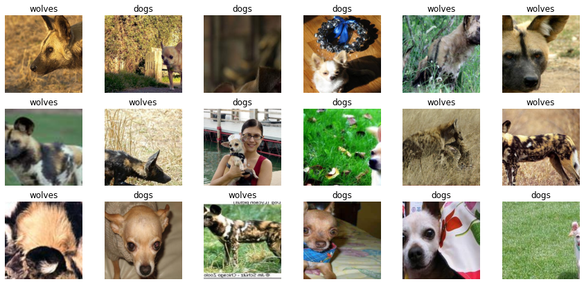
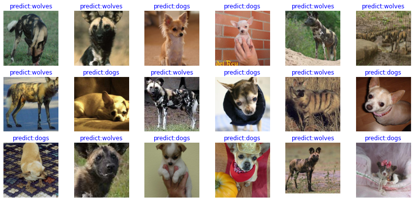
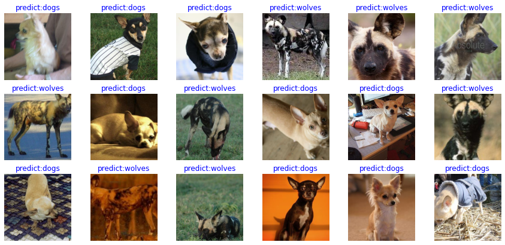

# Image Classification Transfer Learning

<a href="https://gitee.com/mindspore/docs/blob/r1.8/tutorials/application/source_en/cv/transfer_learning.md" target="_blank"></a>

In an actual application scenario, the training dataset is insufficient. As a result, few people train the entire network from the beginning. Generally, training is performed on a very large basic dataset to obtain a pre-trained model, and then the model is used to initialize a weight parameter of the network, or the model is applied to a specific task as a fixed feature extraction device. The following uses the transfer learning method to classify wolf and dog images in the ImageNet dataset.

> For details about transfer learning, see [Stanford University CS231n](https://cs231n.github.io/transfer-learning/#tf).

## Preparing Data

### Downloading a Dataset

Download the [dog and wolf classification dataset](https://mindspore-website.obs.cn-north-4.myhuaweicloud.com/notebook/datasets/intermediate/Canidae_data.zip) used in the case. The images in the dataset come from ImageNet. Each class has about 120 training images and 30 validation images. Use the `mindvision.dataset.DownLoad` API to download the dataset and decompress it to the current directory.

```python
from mindvision.dataset import DownLoad

dataset_url = "https://mindspore-website.obs.cn-north-4.myhuaweicloud.com/notebook/datasets/intermediate/Canidae_data.zip"
path = "./"

dl = DownLoad()
dl.download_and_extract_archive(dataset_url, path)
```

The dataset directory structure is as follows:

```Text
data/
└── Canidae
    ├── train
    │   ├── dogs
    │   └── wolves
    └── val
        ├── dogs
        └── wolves
```

## Loading a Dataset

The wolf and dog dataset is extracted from the ImageNet classification dataset. The `mindvision.dataset.ImageNet` API is used to load the dataset. This API has performed the default image augmentation operation on the images in the ImageNet classification dataset.

```python
from mindvision.dataset import ImageNet

# Dataset directory path
data_path = "./data/Canidae/"

# Create a training dataset.
dataset_train = ImageNet(data_path, split="train", shuffle=True,
                         resize=224, batch_size=18, repeat_num=1)
dataset_train = dataset_train.run()

# Create an evaluation dataset.
dataset_val = ImageNet(data_path, split="val", shuffle=True,
                       resize=224, batch_size=18, repeat_num=1)
dataset_val = dataset_val.run()
```

### Dataset Visualization

The return value of the training dataset loaded from the `mindvision.dataset.ImageNet` API is a dictionary. You can use the `create_dict_iterator` API to create a data iterator and use `next` to iteratively access the dataset. Here, `batch_size` is set to **18**. Therefore, you can use `next` to obtain 18 images and label data can be obtained at a time.

```python
data = next(dataset_train.create_dict_iterator())
images = data["image"]
labels = data["label"]

print("Tensor of image", images.shape)
print("Labels:", labels)
```

```python
    Tensor of image (18, 3, 224, 224)
    Labels: [1 0 0 0 1 1 1 1 0 0 1 1 1 0 1 0 0 0]
```

Visualize the obtained images and label data. The title is a label name corresponding to an image.

```python
import matplotlib.pyplot as plt
import numpy as np

# **class_name** corresponds to **label**. Labels are marked in ascending order of the folder character string.
class_name = {0: "dogs", 1: "wolves"}

plt.figure(figsize=(15, 7))
for i in range(len(labels)):
    # Obtain an image and its label.
    data_image = images[i].asnumpy()
    data_label = labels[i]
    # Process images for display.
    data_image = np.transpose(data_image, (1, 2, 0))
    mean = np.array([0.485, 0.456, 0.406])
    std = np.array([0.229, 0.224, 0.225])
    data_image = std * data_image + mean
    data_image = np.clip(data_image, 0, 1)
    # Display the image.
    plt.subplot(3, 6, i + 1)
    plt.imshow(data_image)
    plt.title(class_name[int(labels[i].asnumpy())])
    plt.axis("off")

plt.show()
```



## Training a Model

The following uses the ResNet-50 model for training. Use the `mindvision.classification.models.resnet50` API in MindSpore Vision to define the ResNet-50. When the `pretrained` parameter in the API is set to **True**, [the ResNet-50 pre-trained model](https://download.mindspore.cn/vision/classification/resnet50_224.ckpt) is automatically downloaded and the weight parameter is loaded to the network.

### Fine-tuning the Model

The pre-trained model in ResNet-50 is used to classify 1000 categories in the ImageNet dataset. Here, only the wolves and dogs are classified. Therefore, you need to reset the classifier in the pre-trained model and fine-tune the network.

```python
import mindspore.nn as nn
from mindvision.classification.models import resnet50
import mindspore as ms

net = resnet50(pretrained=True)

# Define a fully-connected layer.
class DenseHead(nn.Cell):
    def __init__(self, input_channel, num_classes):
        super(DenseHead, self).__init__()
        self.dense = nn.Dense(input_channel, num_classes)

    def construct(self, x):
        return self.dense(x)

# Size of the input layer of the fully-connected layer
in_channels = net.head.dense.in_channels
# The number of output channels is 2.
head = DenseHead(in_channels, 2)
# Reset the fully-connected layer.
net.head = head

# Define an optimizer and a loss function.
opt = nn.Momentum(params=net.trainable_params(), learning_rate=0.001, momentum=0.9)
loss = nn.SoftmaxCrossEntropyWithLogits(sparse=True, reduction='mean')

# Instantiate the model.
model = ms.Model(net, loss, opt, metrics={"Accuracy": nn.Accuracy()})
```

#### Training and Evaluation

Train and evaluate the network, and use the `mindvision.engine.callback.ValAccMonitor` API in MindSpore Vision to print the loss value and the evaluation accuracy of the training. After the training is completed, save the CKPT file with the highest evaluation accuracy, `best.ckpt`, in the current directory.

```python
from mindvision.engine.callback import ValAccMonitor
from mindspore.train.callback import TimeMonitor

num_epochs = 10
model.train(num_epochs,
            dataset_train,
            callbacks=[ValAccMonitor(model, dataset_val, num_epochs), TimeMonitor()])
```

```python
    --------------------
    Epoch: [  0 /  10], Train Loss: [0.469], Accuracy:  1.000
    epoch time: 6525.242 ms, per step time: 501.942 ms
    --------------------
    Epoch: [  1 /  10], Train Loss: [0.134], Accuracy:  1.000
    epoch time: 2549.441 ms, per step time: 196.111 ms
    --------------------
    Epoch: [  2 /  10], Train Loss: [0.069], Accuracy:  1.000
    epoch time: 2561.402 ms, per step time: 197.031 ms
    --------------------
    Epoch: [  3 /  10], Train Loss: [0.131], Accuracy:  1.000
    epoch time: 2564.437 ms, per step time: 197.264 ms
    --------------------
    Epoch: [  4 /  10], Train Loss: [0.097], Accuracy:  1.000
    epoch time: 2563.061 ms, per step time: 197.159 ms
    --------------------
    Epoch: [  5 /  10], Train Loss: [0.037], Accuracy:  1.000
    epoch time: 2569.943 ms, per step time: 197.688 ms
    --------------------
    Epoch: [  6 /  10], Train Loss: [0.011], Accuracy:  1.000
    epoch time: 2577.678 ms, per step time: 198.283 ms
    --------------------
    Epoch: [  7 /  10], Train Loss: [0.018], Accuracy:  1.000
    epoch time: 2574.261 ms, per step time: 198.020 ms
    --------------------
    Epoch: [  8 /  10], Train Loss: [0.036], Accuracy:  1.000
    epoch time: 2568.633 ms, per step time: 197.587 ms
    --------------------
    Epoch: [ 9 /  10], Train Loss: [0.016], Accuracy:  1.000
    epoch time: 2558.043 ms, per step time: 196.773 ms
    ================================================================================
    End of validation the best Accuracy is:  1.000, save the best ckpt file in ./best.ckpt
```

#### Visualizing Model Prediction

Define the `visualize_mode` function to visualize model prediction.

```python
import matplotlib.pyplot as plt
import mindspore as ms


def visualize_model(best_ckpt_path, val_ds):
    num_class = 2  # Perform binary classification on wolf and dog images.
    net = resnet50(num_class)
    # Load model parameters.
    param_dict = ms.load_checkpoint(best_ckpt_path)
    ms.load_param_into_net(net, param_dict)
    model = ms.Model(net)
    # Load the validation dataset.
    data = next(val_ds.create_dict_iterator())
    images = data["image"].asnumpy()
    labels = data["label"].asnumpy()
    class_name = {0: "dogs", 1: "wolves"}
    # Predict the image type.
    output = model.predict(ms.Tensor(data['image']))
    pred = np.argmax(output.asnumpy(), axis=1)

    # Display the image and the predicted value of the image.
    plt.figure(figsize=(15, 7))
    for i in range(len(labels)):
        plt.subplot(3, 6, i + 1)
        # If the prediction is correct, the color is blue. If the prediction is incorrect, the color is red.
        color = 'blue' if pred[i] == labels[i] else 'red'
        plt.title('predict:{}'.format(class_name[pred[i]]), color=color)
        picture_show = np.transpose(images[i], (1, 2, 0))
        mean = np.array([0.485, 0.456, 0.406])
        std = np.array([0.229, 0.224, 0.225])
        picture_show = std * picture_show + mean
        picture_show = np.clip(picture_show, 0, 1)
        plt.imshow(picture_show)
        plt.axis('off')

    plt.show()
```

Obtain the **best.ckpt** file by model fine-tuning and predict the wolf and dog image data of the validation set. If the prediction font is blue, the prediction is correct. If the prediction font is red, the prediction is incorrect.

```python
visualize_model('best.ckpt', dataset_val)
```



### Training Using Fixed Features

When fixed features are used for training, all network layers except the last layer need to be frozen. You can set `requires_grad == False` to freeze parameters so that the gradient is not computed in backward propagation.

```python
import mindspore.nn as nn
from mindvision.classification.models import resnet50
import mindspore as ms

net_work = resnet50(pretrained=True)

# Size of the input layer of the fully-connected layer
in_channels = net_work.head.dense.in_channels
# The number of output channels is 2.
head = DenseHead(in_channels, 2)
# Reset the fully-connected layer.
net_work.head = head

# Freeze all parameters except those at the last layer.
for param in net_work.get_parameters():
    if param.name not in ["head.dense.weight", "head.dense.bias"]:
        param.requires_grad = False

# Define an optimizer and a loss function.
opt = nn.Momentum(params=net_work.trainable_params(), learning_rate=0.001, momentum=0.5)
loss = nn.SoftmaxCrossEntropyWithLogits(sparse=True, reduction='mean')

# Instantiate the model.
model1 = ms.Model(net_work, loss, opt, metrics={"Accuracy": nn.Accuracy()})
```

#### Training and Evaluation

Start to train a model. This saves more than half of the time compared with not pre-training a model because some gradients do not need to be computed at this time.

```python
# Dataset used for training
from mindvision.engine.callback import ValAccMonitor
from mindspore.train.callback import TimeMonitor

ds_train = ImageNet(data_path, split="train", shuffle=True,
                    resize=224, batch_size=18, repeat_num=1)
ds_train = ds_train.run()
ds_val = ImageNet(data_path, split="val", shuffle=True,
                  resize=224, batch_size=18, repeat_num=1)
ds_val = ds_val.run()

num_epochs = 10
model1.train(num_epochs,
             ds_train,
             callbacks=[ValAccMonitor(model1, ds_val, num_epochs), TimeMonitor()])
```

```python
    --------------------
    Epoch: [  1 /  10], Train Loss: [0.598], Accuracy:  0.981
    epoch time: 3602.971 ms, per step time: 277.152 ms
    --------------------
    Epoch: [  2 /  10], Train Loss: [0.516], Accuracy:  0.870
    epoch time: 1422.890 ms, per step time: 109.453 ms
    --------------------
    Epoch: [  3 /  10], Train Loss: [0.388], Accuracy:  1.000
    epoch time: 2254.670 ms, per step time: 173.436 ms
    --------------------
    Epoch: [  4 /  10], Train Loss: [0.362], Accuracy:  1.000
    epoch time: 2181.150 ms, per step time: 167.781 ms
    --------------------
    Epoch: [  5 /  10], Train Loss: [0.332], Accuracy:  1.000
    epoch time: 2173.812 ms, per step time: 167.216 ms
    --------------------
    Epoch: [  6 /  10], Train Loss: [0.306], Accuracy:  1.000
    epoch time: 2205.381 ms, per step time: 169.645 ms
    --------------------
    Epoch: [  7 /  10], Train Loss: [0.285], Accuracy:  1.000
    epoch time: 2180.671 ms, per step time: 167.744 ms
    --------------------
    Epoch: [  8 /  10], Train Loss: [0.244], Accuracy:  1.000
    epoch time: 2166.159 ms, per step time: 166.628 ms
    --------------------
    Epoch: [  9 /  10], Train Loss: [0.259], Accuracy:  1.000
    epoch time: 2169.718 ms, per step time: 166.901 ms
    --------------------
    Epoch: [ 10 /  10], Train Loss: [0.280], Accuracy:  1.000
    epoch time: 2182.844 ms, per step time: 167.911 ms
    ================================================================================
    End of validation the best Accuracy is:  1.000, save the best ckpt file in ./best.ckpt
```

#### Visualizing Model Prediction

Obtain the **best.ckpt** file from fixed features and predict the wolf and dog image data of the validation set. If the prediction font is blue, the prediction is correct. If the prediction font is red, the prediction is incorrect.

```python
visualize_model('best.ckpt', dataset_val)
```


