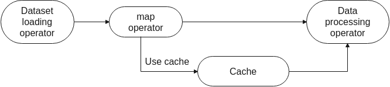

# Single-Node Data Cache

<a href="https://gitee.com/mindspore/docs/blob/master/tutorials/experts/source_en/dataset/cache.md" target="_blank"></a>

If you need to repeatedly access remote datasets or load datasets from disks, you can use the single-node cache operator to cache datasets in the local memory to accelerate dataset loading.

The cache operator depends on the cache server started on the current node. Functioning as a daemon process and independent of the training script, the cache server is mainly used to manage cached data, including storing, querying, and loading data, and writing cached data when the cache is not hit.

If the memory space is insufficient to cache all datasets, you can configure a cache operator to cache the remaining data to disks.

Currently, the cache service supports only single-node cache. That is, the client and server are deployed on the same machine. This service can be used in the following scenarios:

- Cache the loaded original dataset.

    You can use the cache in the dataset loading operator. The loaded data is stored in the cache server. If the same data is required subsequently, the data can be directly load from the cache server, avoiding repeated loading from the disk.

    

- Cache the data processed by argumentation.

    You can also use the cache in the `map` operator. The data processed by argumentation (such as image cropping or resizing) is directly cached, avoiding repeated data argumentation operations and reducing unnecessary computations.

    

## Data Cache Process

Before using the cache service, you need to install MindSpore and set the relevant environment variables.

> At present, data cache can only be performed in the Linux environment. Ubuntu, EulerOS and CentOS can refer to the [relevant tutorials](https://help.ubuntu.com/community/SwapFaq#How_do_I_add_a_swap_file.3F) to learn how to increase the swap memory space. In addition, since the use of cache may cause the server's memory shortage, it is recommended that users increase the server's swap memory space to more than 100GB before using the cache.

### 1. Start the cache server

Before using the single-node cache serve, you need to enter the following command at the command line to start the cache server:

```bash
cache_admin --start
```

If the above information is output, it means that the cache server starts successfully.

The preceding commands can use the `-h` and `-p` parameters to specify the server, or the user can specify it by configuring environment variables `MS_CACHE_HOST` and `MS_CACHE_PORT`. If not specified, the default operation is performed on servers with IP 127.0.0.1 and port number 50052.

The `ps -ef|grep cache_server` command can be used to check if the server is started and query server parameters.

The `cache_admin --server_info` command can also be used to check a detailed list of parameters for the server.

To enable the data overflow feature, the user must set the overflow path with the `-s` parameter when starting the cache server, or the feature is turned off by default.

```bash
cache_admin --server_info
```

The Cache Server Configuration table lists the IP address, port number, number of worker threads, log level, overflow path and other detailed configuration information of the current server. The Active sessions module displays a list of session IDs that are enabled in the current server.

The cache server log file is named in the format "cache_server.\<host name>.\<user name>.log.\<log level>.\<data-time>.\<process number>".

When `GLOG_v=0`, DEBUG log may be displayed on the screen.

### 2. Create the cache session

If there is no cache session in the cache server, you need to create a cache session and get the cache session id:

```bash
cache_admin -g
```

where 780643335 is the cache session id assigned to the server on port 50052, and the cache session id is assigned by the server.

The `cache_admin --list_sessions` command can be used to check all cache session information existing in the current server.

```bash
cache_admin --list_sessions
```

Output parameters description:

- `Session`: cache session id.
- `Cache Id`: cache instance id in the current cache session. `n/a` indicates that the cache instance has not been created at the moment.
- `Mem cached`: the amount of data cached in memory.
- `Disk cached`: the amount of data cached in disk.
- `Avg cache size`: the average size of each row of data currently cached.
- `Numa hit`: the number of **Numa** hits. The higher value will get the better time performance.

### 3. Create a cache instance

In the Python training script, use the `DatasetCache` API to define a cache instance named `test_cache`, and put a cache session ID created in the previous step to the `session_id` parameter.

```python
import mindspore.dataset as ds

test_cache = ds.DatasetCache(session_id=1456416665, size=0, spilling=False)
```

`DatasetCache` supports the following parameters:

- `session_id`: specifies the cache session ID, which can be created and obtained by running the `cache_admin -g` command.
- `size`: specifies the maximum memory space occupied by the cache. The unit is MB. For example, if the cache space is 512 GB, set `size=524288`. The default value is 0.
- `spilling`: determines whether to spill the remaining data to disks when the memory space exceeds the upper limit. The default value is False.
- `hostname`: specifies the IP address for connecting to the cache server. The default value is 127.0.0.1.
- `port`: specifies the port number for connecting to the cache server. The default value is 50052.
- `num_connections`: specifies the number of established TCP/IP connections. The default value is 12.
- `prefetch_size`: specifies the number of prefetched rows. The default value is 20.

The following things that needs to be noted:

In actual use, you are advised to run the `cache_admin -g` command to obtain a cache session id from the cache server and use it as the parameter of `session_id` to prevent errors caused by cache session nonexistence.

`size=0` indicates that the memory space used by the cache is not limited manually, but automically controlled by the cache server according to system's total memory resources, and cache server's memory usage would be limited to within 80% of the total system memory.

Users can also manually set `size` to a proper value based on the idle memory of the machine. Note that before setting the `size` parameter, make sure to check the available memory of the system and the size of the dataset to be loaded. If the memory space occupied by the cache_server or the space of the dataset to be loaded exceeds the available memory of the system, it may cause problems such as machine downtime/restart, automatic shutdown of cache_server, and failure of training process execution.

`spilling=True` indicates that the remaining data is written to disks when the memory space is insufficient. Therefore, ensure that you have the writing permission and the sufficient disk space on the configured disk path is  to store the cache data that spills to the disk. Note that if no spilling path is set when cache server starts, setting `spilling=True` will raise an error when calling the API.

`spilling=False` indicates that no data is written once the configured memory space is used up on the cache server.

If a dataset that does not support random access (such as `TFRecordDataset`) is used to load data and the cache service is enabled, ensure that the entire dataset is stored locally. In this scenario, if the local memory space is insufficient to store all data, spilling must be enabled to spill data to disks.

### 4. Insert a cache instance

Currently, the cache service can be used to cache both original datasets and datasets processed by argumentation. The following example shows two usage methods.

Note that both examples need to create a cache instance according to the method in step 3, and pass in the created `test_cache` as `cache` parameters in the dataset load or map operator.

CIFAR-10 dataset is used in the following two examples.

```python
from mindvision import dataset

dl_path = "./datasets"
data_dir = "./datasets/cifar-10-batches-bin/"
dl_url = "https://mindspore-website.obs.cn-north-4.myhuaweicloud.com/notebook/datasets/cifar-10-binary.tar.gz"

dl = dataset.DownLoad()  # download CIFAR-10 dataset
dl.download_and_extract_archive(url=dl_url, download_path=dl_path)
```

The directory structure of the extracted dataset file is as follows:

```text
./datasets/cifar-10-batches-bin
├── readme.html
├── test
│   └── test_batch.bin
└── train
    ├── batches.meta.txt
    ├── data_batch_1.bin
    ├── data_batch_2.bin
    ├── data_batch_3.bin
    ├── data_batch_4.bin
    └── data_batch_5.bin
```

#### Cache the original dataset data

Cache the original dataset, and the datat is loaded by the MindSpore system.

```python
dataset_dir = "./datasets/cifar-10-batches-bin/train"

# apply cache to dataset
data = ds.Cifar10Dataset(dataset_dir=dataset_dir, num_samples=4, shuffle=False, num_parallel_workers=1, cache=test_cache)

num_iter = 0
for item in data.create_dict_iterator(num_epochs=1):  # each data is a dictionary
    # in this example, each dictionary has a key "image"
    print("{} image shape: {}".format(num_iter, item["image"].shape))
    num_iter += 1
```

You can run the `cache_admin --list_sessions` command to check whether there are four data records in the current session. If yes, the data is successfully cached.

```bash
cache_admin --list_sessions
```

#### Cache the data processed by argumentation

Cache data after data enhancement processing `transforms`.

```python
import mindspore.dataset.vision.c_transforms as c_vision

dataset_dir = "cifar-10-batches-bin/"

# apply cache to dataset
data = ds.Cifar10Dataset(dataset_dir=dataset_dir, num_samples=5, shuffle=False, num_parallel_workers=1)

# apply cache to map
rescale_op = c_vision.Rescale(1.0 / 255.0, -1.0)
data = data.map(input_columns=["image"], operations=rescale_op, cache=test_cache)

num_iter = 0
for item in data.create_dict_iterator(num_epochs=1):  # each data is a dictionary
    # in this example, each dictionary has a keys "image"
    print("{} image shape: {}".format(num_iter, item["image"].shape))
    num_iter += 1
```

```text
0 image shape: (32, 32, 3)
1 image shape: (32, 32, 3)
2 image shape: (32, 32, 3)
3 image shape: (32, 32, 3)
4 image shape: (32, 32, 3)
```

You can run the `cache_admin --list_sessions` command to check whether there are five data records in the current session. If yes, the data is successfully cached.

```bash
cache_admin --list_sessions
```

### 5. Destroy the cache session

After the training is complete, you can destroy the current cache and release the memory.

```bash
cache_admin --destroy_session 780643335
```

The preceding command is used to destroy the cache with the session ID 1456416665 on the server with the port number 50052.

If you choose not to destroy the cache, the cached data still exists in the cache session. You can use the cache when starting the training script next time.

### 6. Stop the cache server

After using the cache server, you can stop it. This operation will destroy all cache sessions on the current server and release the memory.

```bash
cache_admin --stop
```

The preceding command is used to shut down the server with the port number 50052.

If you choose not to shut down the server, the cache sessions on the server will be retained for future use. During the next training, you can create a cache session or reuse the existing cache.

## Cache Sharing

During the single-node multi-device distributed training, the cache operator allows multiple same training scripts to share the same cache and read and write data from the cache.

1. Start the cache server.

    ```bash
    $cache_admin --start
    ```

    Cache server startup completed successfully!
    The cache server daemon has been created as process id 39337 and listening on port 50052
    Recommendation:
        Since the server is detached into its own daemon process, monitor the server logs (under/tmp/mindspore/cache/log) for any issues that may happen after startup

2. Create a cache session.

    Create the shell script `cache.sh` for starting Python training and run the following command to generate a cache session ID:

    ```shell
    #!/bin/bash
    # This shell script will launch parallel pipelines

    # get path to dataset directory
    if [ $# != 1 ]
    then
            echo "Usage: sh cache.sh DATASET_PATH"
    exit 1
    fi
    dataset_path=$1

    # generate a session id that these parallel pipelines can share
    result=$(cache_admin -g 2>&1)
    rc=$?
    if [ $rc -ne 0 ]; then
        echo "some error"
        exit 1
    fi

    # grab the session id from the result string
    session_id=$(echo $result | awk '{print $NF}')
    ```

3. Pass the cache session id to the training script.

    Continue to write the shell script and add the following command to pass `session_id` and other parameters when the Python training is started:

    ```bash
    # make the session_id available to the python scripts
    num_devices=4

    for p in $(seq 0 $((${num_devices}-1))); do
        python my_training_script.py --num_devices "$num_devices" --device "$p" --session_id $session_id --dataset_path $dataset_path
    done
    ```

    > Complete sample code: [cache.sh](https://gitee.com/mindspore/docs/blob/master/docs/sample_code/cache/cache.sh).

4. Create and apply a cache instance.

    CIFAR-10 dataset is used in the following example.

    ```text
    ├─cache.sh
    ├─my_training_script.py
    └─cifar-10-batches-bin
        ├── batches.meta.txt
        ├── data_batch_1.bin
        ├── data_batch_2.bin
        ├── data_batch_3.bin
        ├── data_batch_4.bin
        ├── data_batch_5.bin
        ├── readme.html
        └── test_batch.bin
    ```

    Create and write the Python script `my_training_script.py`. Use the following code to receive `session_id` and pass it as a parameter when defining a cache instance.

    ```python
    import argparse
    import mindspore.dataset as ds

    parser = argparse.ArgumentParser(description='Cache Example')
    parser.add_argument('--num_devices', type=int, default=1, help='Device num.')
    parser.add_argument('--device', type=int, default=0, help='Device id.')
    parser.add_argument('--session_id', type=int, default=1, help='Session id.')
    parser.add_argument('--dataset_path', type=str, default=None, help='Dataset path')
    args_opt = parser.parse_args()

    # apply cache to dataset
    test_cache = ds.DatasetCache(session_id=args_opt.session_id, size=0, spilling=False)
    dataset = ds.Cifar10Dataset(dataset_dir=args_opt.dataset_path, num_samples=4, shuffle=False, num_parallel_workers=1,
                                num_shards=args_opt.num_devices, shard_id=args_opt.device, cache=test_cache)
    num_iter = 0
    for _ in dataset.create_dict_iterator():
        num_iter += 1
    print("Got {} samples on device {}".format(num_iter, args_opt.device))
    ```

    > Complete sample code: [my_training_script.py](https://gitee.com/mindspore/docs/blob/master/docs/sample_code/cache/my_training_script.py)

5. Execute the training script.

    Execute the shell script `cache.sh` to enable distributed training.

    ```bash
    $ sh cache.sh cifar-10-batches-bin/
    Got 4 samples on device 0
    Got 4 samples on device 1
    Got 4 samples on device 2
    Got 4 samples on device 3
    ```

    You can run the `cache_admin --list_sessions` command to check whether only one group of data exists in the current session. If yes, cache sharing is successful.

    ```bash
    $ cache_admin --list_sessions
    Listing sessions for server on port 50052

    Session    Cache Id  Mem cached Disk cached  Avg cache size  Numa hit
    3392558708   821590605          16         n/a            3227        16
    ```

6. Destroy the cache session.

    After the training is complete, you can destroy the current cache and release the memory.

    ```bash
    $ cache_admin --destroy_session 3392558708
    Drop session successfully for server on port 50052
    ```

7. Stop the cache server, after using the cache server, you can stop it.

    ```bash
    $ cache_admin --stop
    Cache server on port 50052 has been stopped successfully.
    ```

## Cache Acceleration

In order to share large data sets among multiple servers and alleviate the disk space requirements of a single server, users can usually choose to use NFS (Network File System), that is, the network file system, to store data sets (for the construction and configuration of NFS storage servers, see [HUAWEI CLOUD-NFS Storage Server Setup]( https://www.huaweicloud.com/articles/14fe58d0991fb2dfd2633a1772c175fc.html)。

However, access to NFS datasets is often expensive, resulting in longer training sessions by using NFS datasets.

In order to improve the training performance of the NFS dataset, we can choose to use a cache service to cache the dataset in memory as Tensor.

Once cached, post-sequence epochs can read data directly from memory, avoiding the overhead of accessing remote NAS.

It should be noted that in the data processing process of the training process, and the dataset usually needs to be augmentated with randomness after loading, such as `RandomCropDecodeResize`. If the cache is added to the operation with randomness, it will cause the results of the first enhancement operation to be cached, and the results read from the cache server in the later sequence are the first cached data, resulting in the loss of data randomness and affecting the accuracy of the training network.

Therefore, we can choose to add a cache directly after the data set reads the operator. This section takes this approach, using the MobileNetV2 network as a sample for an example.

For complete sample code, refer to ModelZoo's [MobileNetV2](https://gitee.com/mindspore/models/tree/master/official/cv/mobilenetv2).

1. Create Shell script `cache_util.sh` for managing cache:

    ```bash
    bootup_cache_server()
       {
         echo "Booting up cache server..."
         result=$(cache_admin --start 2>&1)
         echo "${result}"
       }

       generate_cache_session()
       {
         result=$(cache_admin -g | awk 'END {print $NF}')
         echo "${result}"
       }
    ```

    > Complete sample code: [cache_util.sh](https://gitee.com/mindspore/docs/blob/master/docs/sample_code/cache/cache_util.sh).

2. In the Shell script `run_train_nfs_cache.sh` that starts NFS dataset training, turn on the cache server for the scenario trained with datasets located on NFS and generate a cache session saved in the Shell variable `CACHE_SESSION_ID`:

    ```bash
    CURPATH="${dirname "$0"}"
       source ${CURPATH}/cache_util.sh

       bootup_cache_server
       CACHE_SESSION_ID=$(generate_cache_session)
    ```

3. Pass in the `CACHE_SESSION_ID` and other parameters when starting Python training:

    ```text
    python train.py \
    --platform=$1 \
    --dataset_path=$5 \
    --pretrain_ckpt=$PRETRAINED_CKPT \
    --freeze_layer=$FREEZE_LAYER \
    --filter_head=$FILTER_HEAD \
    --enable_cache=True \
    --cache_session_id=$CACHE_SESSION_ID \
    &> log$i.log &
    ```

4. In the `train_parse_args()` function of Python's parameter parsing script `args.py`, the incoming `cache_session_id` is received by the following code:

    ```python
    cache_session_id：

    import argparse

    def train_parse_args():
    ...
        train_parser.add_argument('--enable_cache',
            type=ast.literal_eval,
            default=False,
            help='Caching the dataset in memory to speedup dataset processing, default is False.')
        train_parser.add_argument('--cache_session_id',
             type=str,
             default="",
             help='The session id for cache service.')
    train_args = train_parser.parse_args()
    ```

    And call the `train_parse_args()` function in Python's training script `train.py` to parse the parameters such as the `cache_session_id` passed in, and pass it in as an argument when defining the dataset `dataset`.

    ```python
    from src.args import train_parse_args
    args_opt = train_parse_args()

    dataset = create_dataset(
        dataset_path=args_opt.dataset_path,
        do_train=True,
        config=config,
        enable_cache=args_opt.enable_cache,
        cache_session_id=args_opt.cache_session_id)
    ```

5. In the Python script `dataset.py` that defines the data processing process, an instance of `DatasetCache` is created and inserted after `ImageFolderDataset` based on  the parameters `enable_cache` and `cache_session_id` passed in:

    ```python
    def create_dataset(dataset_path, do_train, config, repeat_num=1, enable_cache=False, cache_session_id=None):
    ...
        if enable_cache:
            nfs_dataset_cache = ds.DatasetCache(session_id=int(cache_session_id), size=0)
        else:
            nfs_dataset_cache = None

        if config.platform == "Ascend":
            rank_size = int(os.getenv("RANK_SIZE", '1'))
            rank_id = int(os.getenv("RANK_ID", '0'))
            if rank_size == 1:
                data_set = ds.ImageFolderDataset(dataset_path, num_parallel_workers=8, shuffle=True, cache=nfs_dataset_cache)
            else:
                data_set = ds.ImageFolderDataset(dataset_path, num_parallel_workers=8, shuffle=True, num_shards=rank_size, shard_id=rank_id, cache=nfs_dataset_cache)
    ```

6. Run `run_train_nfs_cache.sh`, and obtain the following results:

    ```text
    epoch: [  0/ 200], step:[ 2134/ 2135], loss:[4.682/4.682], time:[3364893.166], lr:[0.780]
    epoch time: 3384387.999, per step time: 1585.193, avg loss: 4.682
    epoch: [  1/ 200], step:[ 2134/ 2135], loss:[3.750/3.750], time:[430495.242], lr:[0.724]
    epoch time: 431005.885, per step time: 201.876, avg loss: 4.286
    epoch: [  2/ 200], step:[ 2134/ 2135], loss:[3.922/3.922], time:[420104.849], lr:[0.635]
    epoch time: 420669.174, per step time: 197.035, avg loss: 3.534
    epoch: [  3/ 200], step:[ 2134/ 2135], loss:[3.581/3.581], time:[420825.587], lr:[0.524]
    epoch time: 421494.842, per step time: 197.421, avg loss: 3.417
    ...
    ```

    The following table shows the average epoch time on gpu servers of using cache versus or not using cache:

    ```text
       | 4p, MobileNetV2, imagenet2012            | without cache | with cache |
       | ---------------------------------------- | ------------- | ---------- |
       | first epoch time                         | 1649s         | 3384s      |
       | average epoch time (exclude first epoch) | 458s          | 421s       |
    ```

    You can see that after using the cache, the completion time of the first epoch increases more than if the cache is not used, which is mainly due to the overhead of writing cache data to the cache server. However, each subsequent epoch after caching data writes can get a large performance gain. Therefore, the greater the total number of episodes trained, the more pronounced the benefits of using the cache.

    Taking running 200 epochs as an example, using caching can reduce the total end-to-end training time from 92791 seconds to 87163 seconds, saving a total of about 5628 seconds.

7. When finish using, you can choose to shut down the cache server:

    ```text
    $ cache_admin --stop
    Cache server on port 50052 has been stopped successfully.
    ```

## Cache Performance Tuning

The cache service performance can be significantly improved in following scenarios:

- Cache the data processed by augmentation, especially when the data processing pipeline contains high complexity operations such as decode. In this scenario, you do not need to perform the data augmentation operation repeatedly on each epoch, which saves a lot of time.
- Use cache services during simple network training and inference. Compared with complex networks, simple networks require less training time. Therefore, the time performance is significantly improved when cache services are used in this scenario.

However, we may not benefit from cache in the following scenarios:

- The system memory is insufficient or the cache is not hit, resulting in poor cache service time performance. You can check whether the available system memory is sufficient and set a proper cache size before using the cache.
- Too much cache spilling will deteriorate the time performance. Therefore, try not to spill cache to disks when datasets that support random access (such as `ImageFolderDataset`) are used for data loading.
- Using cache on NLP network such as Bert does not perform. In the NLP scenarios, there are usually no high complexity data augmentation operations like decode.
- There is expectable startup overhead when using cache in non-mappable datasets like `TFRecordDataset`. According to the current design, it is required to cache all rows to the cache server before the first epoch of training. So the first epoch time can be longer than the non-cache case.

## Limitations

- Currently, dataset classes such as `GraphDataset`, `GeneratorDataset`, `PaddedDataset`, and `NumpySlicesDataset` do not support cache. `GeneratorDataset`, `PaddedDataset`, and `NumpySlicesDataset` belong to `GeneratorOp`, so their error message is displayed as "There is currently no support for GeneratorOp under cache."
- Data processed by `batch`, `concat`, `filter`, `repeat`, `skip`, `split`, `take`, and `zip` does not support cache.
- Data processed by random data argumentation operations (such as `RandomCrop`) does not support cache.
- The same cache instance cannot be nested in different locations of the same pipeline.

