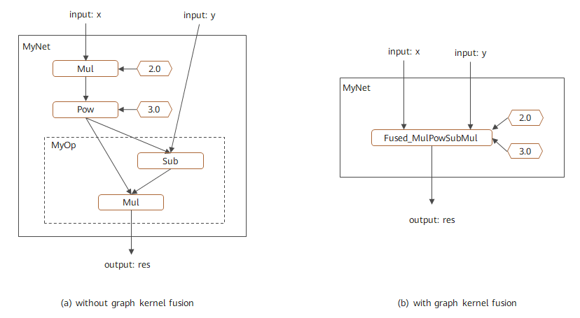

# Enabling Graph Kernel Fusion

[](https://gitee.com/mindspore/docs/blob/r2.0/tutorials/experts/source_en/debug/graph_fusion_engine.md)

## Introduction

The graph kernel fusion is used to optimize network performance by cooperating with MindSpore AKG which is a operator compiler based on polyhedral technology. With analyzing and evaluating the compute graph, it will apply optimization such as computing workload reduction, operator splitting, fusion and special operator compiling, to reduce network execution time. Also, the whole optimization process is completed automatically only if the graph kernel setting is enabled. This will help the user focus on the network development.

> MindSpore AKG is installed with MindSpore by default. For CPU backend and installed from source, ensure that [llvm 12.0.1](https://github.com/llvm/llvm-project/archive/refs/tags/llvmorg-12.0.1.tar.gz) is installed.

The graph kernel fusion is available for:

- Network with high performance requirement;
- Custom combination operators with high performance requirement.

## Enabling Method

The graph kernel is disabled by default. We can just specify the `enable_graph_kernel=True` parameter for `context` in the training script to enable it.

```python
import mindspore as ms
ms.set_context(enable_graph_kernel=True)
```

> - Graph kernel fusion optimization can be enabled in either Graph or PyNative mode. After enabling, it will selectively perform fusion optimization according to the graph features and graph optimization capabilities. And the graph optimization capabilities may also change and evolve between different versions. For example: PyNative mode currently selectively fuses jit subgraphs or backward subgraphs, and some dynamic shape operators may skip fusion.
> - For most scenarios, graph kernel fusion optimization can usually achieve positive performance gains and the same or similar calculation accuracy. But in a very few scenarios, it may also cause performance degradation. In addition, due to operator implementation differences, there may also be some changes in accuracy. It is recommended that users selectively use it according to their own scenarios.
> - On the CPU platform, graph kernel fusion uses the [OpenMP](https://www.openmp.org/) parallel computing technology for operator acceleration. To get a better operator execution performance, it is suggested to use the environment variable: `OMP_NUM_THREADS` to set OpenMP parallel threads. The recommended value for `OMP_NUM_THREADS` is a positive integer, which should be no more than the number of CPU kernels, such as: `export OMP_NUM_THREADS=10`

### Sample Scripts

To illustrate the fusion scenario, we construct a simple network `MyNet`, including multiplication and addition operators. The two operators will be fused together with enabled graph kernel:

```python
import numpy as np
import mindspore as ms
from mindspore.nn import Cell
import mindspore.ops as ops

ms.set_context(mode=ms.GRAPH_MODE, device_target="GPU")
# save graph ir to view fusion detail.
ms.set_context(save_graphs=2)
# enable graph kernel optimization.
ms.set_context(enable_graph_kernel=True)

class MyNet(Cell):
    def __init__(self):
        super(MyNet, self).__init__()
        self.add = ops.Add()
        self.mul = ops.Mul()

    def construct(self, x):
        a = self.mul(x, 2.0)
        res = self.add(a, 1.0)
        return res

x = np.ones((4, 4)).astype(np.float32) * 0.5
net = MyNet()
result = net(ms.Tensor(x))
print("result: {}".format(result))
```

The output is:

```text
result: [[2. 2. 2. 2.]
 [2. 2. 2. 2.]
 [2. 2. 2. 2.]
 [2. 2. 2. 2.]]
```

The fusion of this graph is shown in Figure 1, the left graph is without graph kernel fusion being enabled and the right one is with graph kernel fusion being enabled, which can be checked by dumped graph IR or device profiling.


*Figure 1 Graph kernel fusion on computational graph*

## Custom Combination Operators

We can easily implement high-performance custom combination operators based on graph kernel. The steps are as follows:

1. Define custom operator by combining basic operators;
2. Enable Graph Kernel;
3. Graph kernel automatically fuses the basic operators and generates high-performance fusion operators.

### Sample Scripts

We construct a simple network `MyNet` and define the custom operator `MyOp`:

```python
import numpy as np
import mindspore as ms
from mindspore.nn import Cell
import mindspore.ops as ops

ms.set_context(mode=ms.GRAPH_MODE, device_target="GPU")
# enable graph kernel optimization.
ms.set_context(enable_graph_kernel=True)

class MyOp(Cell):
    """ my first custom OP composited by basic OPs """
    def __init__(self):
        super(MyOp, self).__init__()
        self.sub = ops.Sub()
        self.mul = ops.Mul()

    def construct(self, x, y):
        a = self.sub(x, y)
        return self.mul(a, x)

class MyNet(Cell):
    def __init__(self):
        super(MyNet, self).__init__()
        self.mul = ops.Mul()
        self.pow = ops.Pow()
        self.my_op = MyOp()

    def construct(self, x, y):
        a = self.mul(x, 2.0)
        b = self.pow(a, 3.0)
        res = self.my_op(b, y)
        return res

x = np.ones((4, 4)).astype(np.float32) * 0.2
y = np.ones((4, 4)).astype(np.float32) * 0.3
net = MyNet()
result = net(ms.Tensor(x), ms.Tensor(y))
print("result: {}".format(result))
```

The output is:

```text
result: [[-0.015104 -0.015104 -0.015104 -0.015104]
 [-0.015104 -0.015104 -0.015104 -0.015104]
 [-0.015104 -0.015104 -0.015104 -0.015104]
 [-0.015104 -0.015104 -0.015104 -0.015104]]
```

The fusion of this graph is shown in Figure 2, the left graph is without graph kernel fusion being enabled and the right one is with graph kernel fusion being enabled, which can be checked by dumped graph IR or device profiling.



*Figure 2 Custom combination operator on computational graph*

## FAQs

### Cuda header related issue

Akg need header file "cuda_runtime.h" to generate kernels. If akg fail to auto-search the path of header file(hint: **error: cuda_runtime.h: No such file or directory**), please try to set related environment variables:

```bash
# Linux-X86_64 samples
export CPATH=/usr/local/cuda/targets/x86_64-linux/include:$CPATH
export LD_LIBRARY_PATH=/usr/local/cuda/targets/x86_64-linux/lib:$LD_LIBRARY_PATH
export PATH=/usr/local/cuda/bin:$PATH
```
