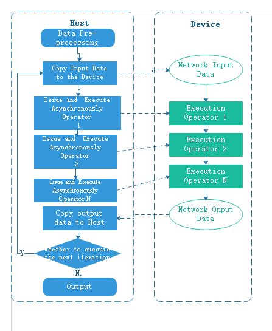
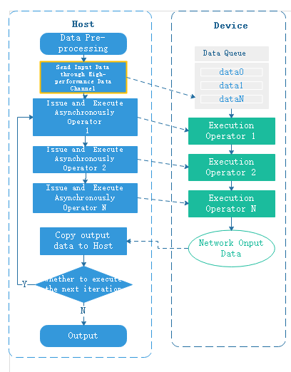

# Sinking Mode

<a href="https://gitee.com/mindspore/docs/blob/master/tutorials/experts/source_en/optimize/execution_opt.md" target="_blank"></a>

## Overview

The Ascend chip integrates computational units such as AICORE and AICPU. The AICORE is responsible for dense Tensor and Vector operations, while the AICPU is responsible for processing complex control logic.

To fully utilize the computing, logic control and task distribution capabilities of the Ascend chip, MindSpore provides data graph sink, graph sink and loop sink functions to greatly reduce Host-Device interaction overhead and effectively improve the performance of training and inference. MindSpore computational graph contains the network operators and the dependencies between the operators.

From the user's perspective, the process of network training is as follows:


This tutorial introduces the principles and usage of data sink, graph sink and loop sink as an example of the execution flow of training.

## Data Sinking

To improve the execution performance of the network, a dedicated chip is usually used to execute the operator. A chip corresponds to a Device, and the general interaction flow between Host and Device is as follows:



As seen from the above figure, each training iteration needs to copy data from Host to Device, and the overhead of copying input data between Host and Device can be eliminated by data sinking.

When data sinking is enabled, MindSpore creates a dedicated data cache queue on the Device side. The MindSpore data processing engine uses a high-performance data channel to send the pre-processed results of the data to the data queue on the Device side, and the computational graph copies the input data directly from the data queue via the GetNext operator. The Host sends data to the data queue and the computational graph reads data from the data queue to form a running parallel, and the data for the next iteration can be sent to the data queue while executing the current iteration, thus hiding the overhead of the Host-Device data copy. For the principle of MindSpore high-performance data processing engine, refer to [here](https://www.mindspore.cn/docs/en/master/design/data_engine.html).

Both GPU backend and Ascend backend support data sinking, and the Host-Device interaction flow for GPU data sinking is as follows:



Users can control whether to enable data sink through `dataset_sink_mode` of the [train](https://mindspore.cn/docs/en/master/api_python/train/mindspore.train.Model.html#mindspore.train.Model.train) interface.

## Graph Sinking

In general, each training iteration needs to issue and trigger the execution of each operator on the device, and Host and Device interact frequently.

In order to reduce the interaction between Host and Device, the operators in the network are packaged and issued to Device together during graph compilation, so that each iteration only triggers the execution of the computational graph once, thus improving the execution efficiency of the network.


The GPU backend does not support graph sinking currently. When using the Ascend device, data sinking is turned on and the graph sinking is turned on at the same time.

## Loop Sinking

When data sinking and graph sinking are enabled, the computed results of each iteration are returned to Host, which determines whether it is necessary to move to the next iteration. To reduce the Device-Host interaction for each iteration, you can sink the loop judgment into the next iteration to the Device, so that the computation result is returned to the Host when all iterations are executed. The loop sinking Host-Device interaction flow is as follows:


The users control the number of sink iterations per epoch through the `dataset_sink_mode` and `sink_size` parameters of the [train](https://mindspore.cn/docs/zh-CN/master/api_python/train/mindspore.train.Model.html#mindspore.train.Model.train) interface, and the Device side executes `sink_size` iterations consecutively before returning to the Host.

## Usage

### `Model.train` Implements Data Sinking

`dataset_sink_mode`, the `train` interface parameter of `Model` can control whether the data is sunk. If `dataset_sink_mode` is True, it means data sinking, otherwise it is non-sunk. The so-called sink means that the data is sent directly to the Device through the channel.

The `dataset_sink_mode` parameter can be used with `sink_size` to control the size of the data sinking per `epoch`. When `dataset_sink_mode` is set to True, i.e. data sink mode:

- If `sink_size` is the default value -1, the entire dataset is trained per `epoch`. Ideally the speed of data sinking is faster than that of the hardware computation, ensuring that the time to process the data is within the network computation time.

- If `sink_size` > 0, the original dataset can be traversed infinitely, and the sink data process is still the same as `sink_size` = -1, with the difference that each `epoch` trains only the `sink_size` amount of data. If there is a `LossMonitor`, the loss value is printed once for the `sink_size` amount of data, and the next `epoch` continues to traverse from the end of the last traversal.

The total amount of data sinking is controlled by the variables `epoch` and `sink_size` together, i.e., total data = `epoch` * `sink_size`.

When using `LossMonitor`, `TimeMonitor` or other `Callback` interfaces, if `dataset_sink_mode` is set to False, there is one interaction per `step` between the Host side and the Device side, so one result will be returned per `step`. If `dataset_sink_mode` is True, because the data is transmitted through the channel on the Device, one data interaction per `epoch` between the Host side and the Device side, so only one result is returned per `epoch`.

> The current CPU does not support data sinking.
> When set to GRAPH mode, the shape of each batch of data must be the same, while when set to PYNATIVE mode, the size of each batch of data is required to be the same.
> Since the traversal of the dataset by data sinking is continuous, non-continuous traversal is not currently supported.
> If you get `fault kernel_name=GetNext`, `GetNext... task error` or `outputs = self.get_next()` and other similar errors, it is possible that some samples are too time-consuming to be processed during data processing, causing the network computation side to fail to get the data for a long time to report errors, when using data sinking mode. At this point, you can set `dataset_sink_mode` to False to verify again, or use `create_dict_iterator()` interface to loop the dataset separately. Refer to [data processing performance optimization](https://mindspore.cn/tutorials/experts/en/master/dataset/optimize.html) to tune the data processing to ensure high performance of data processing.

Code samples are as follows:

```python
import os
import requests
import mindspore.dataset as ds
import mindspore as ms
import mindspore.dataset.transforms as transforms
import mindspore.dataset.vision as vision
import mindspore.nn as nn
from mindspore import train
from mindspore.common.initializer import TruncatedNormal
from mindspore.dataset.vision import Inter
import mindspore.ops as ops

requests.packages.urllib3.disable_warnings()

def create_dataset(data_path, batch_size=32, repeat_size=1,
                   num_parallel_workers=1):
    """
    create dataset for train or test
    """
    # define dataset
    mnist_ds = ds.MnistDataset(data_path)

    resize_height, resize_width = 32, 32
    rescale = 1.0 / 255.0
    shift = 0.0
    rescale_nml = 1 / 0.3081
    shift_nml = -1 * 0.1307 / 0.3081

    # define map operations
    resize_op = vision.Resize((resize_height, resize_width), interpolation=Inter.LINEAR)  # Bilinear mode
    rescale_nml_op = vision.Rescale(rescale_nml, shift_nml)
    rescale_op = vision.Rescale(rescale, shift)
    hwc2chw_op = vision.HWC2CHW()
    type_cast_op = transforms.TypeCast(ms.int32)

    # apply map operations on images
    mnist_ds = mnist_ds.map(input_columns="label", operations=type_cast_op, num_parallel_workers=num_parallel_workers)
    mnist_ds = mnist_ds.map(input_columns="image", operations=resize_op, num_parallel_workers=num_parallel_workers)
    mnist_ds = mnist_ds.map(input_columns="image", operations=rescale_op, num_parallel_workers=num_parallel_workers)
    mnist_ds = mnist_ds.map(input_columns="image", operations=rescale_nml_op, num_parallel_workers=num_parallel_workers)
    mnist_ds = mnist_ds.map(input_columns="image", operations=hwc2chw_op, num_parallel_workers=num_parallel_workers)

    # apply DatasetOps
    buffer_size = 10000
    mnist_ds = mnist_ds.shuffle(buffer_size=buffer_size)  # 10000 as in LeNet train script
    mnist_ds = mnist_ds.batch(batch_size, drop_remainder=True)
    mnist_ds = mnist_ds.repeat(repeat_size)

    return mnist_ds


def conv(in_channels, out_channels, kernel_size, stride=1, padding=0):
    """weight initial for conv layer"""
    weight = weight_variable()
    return nn.Conv2d(in_channels, out_channels,
                     kernel_size=kernel_size, stride=stride, padding=padding,
                     weight_init=weight, has_bias=False, pad_mode="valid")


def fc_with_initialize(input_channels, out_channels):
    """weight initial for fc layer"""
    weight = weight_variable()
    bias = weight_variable()
    return nn.Dense(input_channels, out_channels, weight, bias)


def weight_variable():
    """weight initial"""
    return TruncatedNormal(0.02)


class LeNet5(nn.Cell):
    """
    Lenet network
    Args:
        num_class (int): Num classes. Default: 10.

    Returns:
        Tensor, output tensor

    Examples:
        >>> LeNet(num_class=10)
    """

    def __init__(self, num_class=10):
        super(LeNet5, self).__init__()
        self.num_class = num_class
        self.batch_size = 32
        self.conv1 = conv(1, 6, 5)
        self.conv2 = conv(6, 16, 5)
        self.fc1 = fc_with_initialize(16 * 5 * 5, 120)
        self.fc2 = fc_with_initialize(120, 84)
        self.fc3 = fc_with_initialize(84, self.num_class)
        self.relu = nn.ReLU()
        self.max_pool2d = nn.MaxPool2d(kernel_size=2, stride=2)
        self.reshape = ops.Reshape()

    def construct(self, x):
        x = self.conv1(x)
        x = self.relu(x)
        x = self.max_pool2d(x)
        x = self.conv2(x)
        x = self.relu(x)
        x = self.max_pool2d(x)
        x = self.reshape(x, (self.batch_size, -1))
        x = self.fc1(x)
        x = self.relu(x)
        x = self.fc2(x)
        x = self.relu(x)
        x = self.fc3(x)
        return x

def download_dataset(dataset_url, path):
    filename = dataset_url.split("/")[-1]
    save_path = os.path.join(path, filename)
    if os.path.exists(save_path):
        return
    if not os.path.exists(path):
        os.makedirs(path)
    res = requests.get(dataset_url, stream=True, verify=False)
    with open(save_path, "wb") as f:
        for chunk in res.iter_content(chunk_size=512):
            if chunk:
                f.write(chunk)
    print("The {} file is downloaded and saved in the path {} after processing".format(os.path.basename(dataset_url), path))


if __name__ == "__main__":
    ms.set_context(mode=ms.GRAPH_MODE, device_target="GPU")
    ds_train_path = "./datasets/MNIST_Data/train/"
    download_dataset("https://mindspore-website.obs.myhuaweicloud.com/notebook/datasets/mnist/train-labels-idx1-ubyte", ds_train_path)
    download_dataset("https://mindspore-website.obs.myhuaweicloud.com/notebook/datasets/mnist/train-images-idx3-ubyte", ds_train_path)
    ds_train = create_dataset(ds_train_path, 32)

    network = LeNet5(10)
    net_loss = nn.SoftmaxCrossEntropyWithLogits(sparse=True, reduction="mean")
    net_opt = nn.Momentum(network.trainable_params(), 0.01, 0.9)
    model = ms.Model(network, net_loss, net_opt)

    print("============== Starting Training ==============")
    model.train(epoch=10, train_dataset=ds_train, callbacks=[train.LossMonitor()], dataset_sink_mode=True, sink_size=1000)
```

```text
The train-labels-idx1-ubyte file is downloaded and saved in the path ./datasets/MNIST_Data/train/ after processing
The train-images-idx3-ubyte file is downloaded and saved in the path ./datasets/MNIST_Data/train/ after processing
============== Starting Training ==============
TotalTime = 1.57468, [16]
[parse]: 0.00476957
[symbol_resolve]: 0.379241, [1]
    [Cycle 1]: 0.378255, [1]
        [resolve]: 0.378242
[combine_like_graphs]: 0.00174131
[meta_unpack_prepare]: 0.000686213
[abstract_specialize]: 0.0927178
[auto_monad]: 0.00169479
[inline]: 4.96954e-06
[pipeline_split]: 8.78051e-06
[optimize]: 1.05932, [16]
...
epoch: 1 step: 1000, loss is 0.2323482483625412
epoch: 2 step: 1000, loss is 0.1581915020942688
epoch: 3 step: 1000, loss is 0.0452561192214489
epoch: 4 step: 1000, loss is 0.0008174572139978409
epoch: 5 step: 1000, loss is 0.026678290218114853
epoch: 6 step: 1000, loss is 0.24375736713409424
epoch: 7 step: 1000, loss is 0.004280050750821829
epoch: 8 step: 1000, loss is 0.08765432983636856
epoch: 9 step: 1000, loss is 0.06880836188793182
epoch: 10 step: 1000, loss is 0.05223526805639267
```

When batch_size is 32, the size of the dataset is 1875. When sink_size is set to 1000, it means that each epoch sinks 1000 batches of data, the number of sinks is epoch=10, and the total amount of sunk data is: epoch*sink_size=10000.

When dataset_sink_mode is set to True, the results are returned once per epoch. DatasetHelper is used to iterate the dataset and manage the data information during the training process. If in sink mode, use the mindspore.connect_network_with_dataset function to connect the current training network or evaluation network the network and the DatasetHelper. This function encapsulates the input network by using mindspore.ops.GetNext to enable fetching data from the data channel with the corresponding name queue_name on the device side during forward computation and passing the data to the input network. When in non-sink mode, the dataset is traversed directly at the Host to obtain the data.

When dataset_sink_mode is False, the sink_size parameter setting is invalid.

### `data_sink` Implements Data Sinking

In MindSpore functional programming paradigm, it is also possible to use the [data_sink interface](https://mindspore.cn/docs/en/master/api_python/mindspore/mindspore.data_sink.html) to bind the execution functions and datasets of the modes for data sinking. The meaning of the parameters is as follows:

- `fn`: The execution function of the sink model.
- `dataset`: Datasets, generated by [mindspore.dataset](https://mindspore.cn/docs/en/master/api_python/mindspore.dataset.html).
- `sink_size`: Used to adjust the amount of data executed per sink, and specified as any positive number. Default value is 1, i.e. only one step of data is executed per sink. If you want to sink the data of an entire epoch in a single execution, you can use the `get_datasize_size()` method of `dataset` to specify its value. You can also sink multiple epochs at once and set the value to `epoch * get_datasize_size()`. (Multiple calls to `data_sink` traverse the dataset consecutively, with the next call continuing from the end of the previous call)
- `jit_config`: The JitConfig configuration item used suring compilation. For details, please refer to [mindspore.JitConfig](https://mindspore.cn/docs/en/master/api_python/mindspore/mindspore.JitConfig.html#mindspore.JitConfig). Default value: None, which means run in PyNative mode.
- `input_signature`: Used to represent the Tensor of input parameters. The Tensor's shape and dtype will be used as the input shape and dtype of the function. Default value: None.

> The current CPU does not support data sinking.
> When set to GRAPH mode, the shape of each batch of data must be the same, while when set to PYNATIVE mode, the size of each batch of data is required to be the same.
> Since the traversal of the dataset by data sinking is continuous, non-continuous traversal is not currently supported.
> If you get `fault kernel_name=GetNext`, `GetNext... task error` or `outputs = self.get_next()` and other similar errors, it is possible that some samples are too time-consuming to be processed during data processing, causing the network computation side to fail to get the data for a long time to report errors, when using data sinking mode. At this point, you can set `dataset_sink_mode` to False to verify again, or use `create_dict_iterator()` interface to loop the dataset separately. Refer to [data processing performance optimization](https://mindspore.cn/tutorials/experts/en/master/dataset/optimize.html) to tune the data processing to ensure high performance of data processing.

The code samples are as follows:

```python
import os
import requests
import mindspore.dataset as ds
import mindspore as ms
import mindspore.dataset.transforms as transforms
import mindspore.dataset.vision as vision
import mindspore.nn as nn
from mindspore.common.initializer import TruncatedNormal
from mindspore.dataset.vision import Inter
import mindspore.ops as ops

requests.packages.urllib3.disable_warnings()

def create_dataset(data_path, batch_size=32, repeat_size=1,
                   num_parallel_workers=1):
    """
    create dataset for train or test
    """
    # define dataset
    mnist_ds = ds.MnistDataset(data_path)

    resize_height, resize_width = 32, 32
    rescale = 1.0 / 255.0
    shift = 0.0
    rescale_nml = 1 / 0.3081
    shift_nml = -1 * 0.1307 / 0.3081

    # define map operations
    resize_op = vision.Resize((resize_height, resize_width), interpolation=Inter.LINEAR)  # Bilinear mode
    rescale_nml_op = vision.Rescale(rescale_nml, shift_nml)
    rescale_op = vision.Rescale(rescale, shift)
    hwc2chw_op = vision.HWC2CHW()
    type_cast_op = transforms.TypeCast(ms.int32)

    # apply map operations on images
    mnist_ds = mnist_ds.map(input_columns="label", operations=type_cast_op, num_parallel_workers=num_parallel_workers)
    mnist_ds = mnist_ds.map(input_columns="image", operations=resize_op, num_parallel_workers=num_parallel_workers)
    mnist_ds = mnist_ds.map(input_columns="image", operations=rescale_op, num_parallel_workers=num_parallel_workers)
    mnist_ds = mnist_ds.map(input_columns="image", operations=rescale_nml_op, num_parallel_workers=num_parallel_workers)
    mnist_ds = mnist_ds.map(input_columns="image", operations=hwc2chw_op, num_parallel_workers=num_parallel_workers)

    # apply DatasetOps
    buffer_size = 10000
    mnist_ds = mnist_ds.shuffle(buffer_size=buffer_size)  # 10000 as in LeNet train script
    mnist_ds = mnist_ds.batch(batch_size, drop_remainder=True)
    mnist_ds = mnist_ds.repeat(repeat_size)

    return mnist_ds


def conv(in_channels, out_channels, kernel_size, stride=1, padding=0):
    """weight initial for conv layer"""
    weight = weight_variable()
    return nn.Conv2d(in_channels, out_channels,
                     kernel_size=kernel_size, stride=stride, padding=padding,
                     weight_init=weight, has_bias=False, pad_mode="valid")


def fc_with_initialize(input_channels, out_channels):
    """weight initial for fc layer"""
    weight = weight_variable()
    bias = weight_variable()
    return nn.Dense(input_channels, out_channels, weight, bias)


def weight_variable():
    """weight initial"""
    return TruncatedNormal(0.02)


class LeNet5(nn.Cell):
    """
    Lenet network
    Args:
        num_class (int): Num classes. Default: 10.

    Returns:
        Tensor, output tensor

    Examples:
        >>> LeNet(num_class=10)
    """

    def __init__(self, num_class=10):
        super(LeNet5, self).__init__()
        self.num_class = num_class
        self.batch_size = 32
        self.conv1 = conv(1, 6, 5)
        self.conv2 = conv(6, 16, 5)
        self.fc1 = fc_with_initialize(16 * 5 * 5, 120)
        self.fc2 = fc_with_initialize(120, 84)
        self.fc3 = fc_with_initialize(84, self.num_class)
        self.relu = nn.ReLU()
        self.max_pool2d = nn.MaxPool2d(kernel_size=2, stride=2)
        self.reshape = ops.Reshape()

    def construct(self, x):
        x = self.conv1(x)
        x = self.relu(x)
        x = self.max_pool2d(x)
        x = self.conv2(x)
        x = self.relu(x)
        x = self.max_pool2d(x)
        x = self.reshape(x, (self.batch_size, -1))
        x = self.fc1(x)
        x = self.relu(x)
        x = self.fc2(x)
        x = self.relu(x)
        x = self.fc3(x)
        return x

def download_dataset(dataset_url, path):
    filename = dataset_url.split("/")[-1]
    save_path = os.path.join(path, filename)
    if os.path.exists(save_path):
        return
    if not os.path.exists(path):
        os.makedirs(path)
    res = requests.get(dataset_url, stream=True, verify=False)
    with open(save_path, "wb") as f:
        for chunk in res.iter_content(chunk_size=512):
            if chunk:
                f.write(chunk)
    print("The {} file is downloaded and saved in the path {} after processing".format(os.path.basename(dataset_url), path))

if __name__ == "__main__":
    ms.set_context(mode=ms.GRAPH_MODE, device_target="GPU")
    ds_train_path = "./datasets/MNIST_Data/train/"
    download_dataset("https://mindspore-website.obs.myhuaweicloud.com/notebook/datasets/mnist/train-labels-idx1-ubyte", ds_train_path)
    download_dataset("https://mindspore-website.obs.myhuaweicloud.com/notebook/datasets/mnist/train-images-idx3-ubyte", ds_train_path)

    network = LeNet5(10)
    network.set_train()
    weights = network.trainable_params()
    net_loss = nn.SoftmaxCrossEntropyWithLogits(sparse=True, reduction="mean")
    net_opt = nn.Momentum(network.trainable_params(), 0.01, 0.9)

    def forward_fn(data, label):
        loss = net_loss(network(data), label)
        return loss

    grad_fn = ops.value_and_grad(forward_fn, None, weights)

    def train_step(data, label):
        loss, grads = grad_fn(data, label)
        loss = ops.depend(loss, net_opt(grads))
        return loss

    print("============== Different calling methods train 10 epochs ==============")
    jit = ms.JitConfig()
    print("1. Default, execute one step data each per sink")
    ds_train = create_dataset(ds_train_path, 32)
    data_size = ds_train.get_dataset_size()
    epochs = 10
    sink_process = ms.data_sink(train_step, ds_train, jit_config=jit)
    for _ in range(data_size * epochs):
        loss = sink_process()
        print(f"step {_ + 1}, loss is {loss}")

    print("2. Execute one epoch data per sink")
    ds_train = create_dataset(ds_train_path, 32)
    data_size = ds_train.get_dataset_size()
    epochs = 10
    sink_process = ms.data_sink(train_step, ds_train, sink_size=data_size, jit_config=jit)
    for _ in range(epochs):
        loss = sink_process()
        print(f"epoch {_ + 1}, loss is {loss}")

    print("3. Execute multiple epoch data per sink")
    ds_train = create_dataset(ds_train_path, 32)
    data_size = ds_train.get_dataset_size()
    epochs = 10
    sink_process = ms.data_sink(train_step, ds_train, sink_size=epochs*data_size, jit_config=jit)
    loss = sink_process()
    print(f"loss is {loss}")
```

The code uses 3 calls to train 10 epochs separately.

1. Default behavior, sink 1 step of data at a time, and return loss at the end of each step. Training 10 epochs needs to call `ds_train.get_dataset_size() * 10` times in loop on Host side;
2. Sink 1 epoch of data at a time, and return loss at the end of each epoch. Training 10 epochs needs to call for 10 times in loop on Host side;
3. Sink 10 epochs of data at a time, and return loss at the end of 10 epochs. No need to loop on Host side.

Among the above methods, method 1 interacts with Device once at the end of each step, which is less efficient. Method 3 does not need to interact with Device during training and has the most efficient execution, but can only return the loss of the last step.
