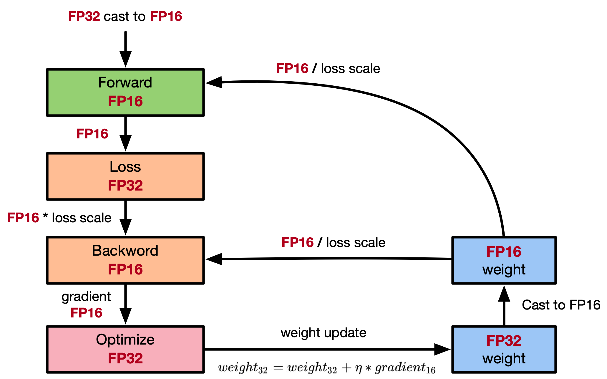

# Enabling Mixed Precision

`Ascend` `GPU` `Model Optimization`

<a href="https://gitee.com/mindspore/docs/blob/master/tutorials/experts/source_en/others/mixed_precision.md" target="_blank"></a>

## Overview

Generally, when a neural network model is trained, the default data type is FP32. In recent years, to accelerate training time, reduce memory occupied during network training, and store a trained model with same precision, more and more mixed-precision training methods are proposed in the industry. The mixed-precision training herein means that both single precision (FP32) and half precision (FP16) are used in a training process.

## Computation Process

Floating-point data types include double-precision (FP64), single-precision (FP32), and half-precision (FP16). In a training process of a neural network model, an FP32 data type is generally used by default to indicate a network model weight and other parameters. The following is a brief introduction to floating-point data types.

According to IEEE 754, floating-point data types are classified into double-precision (FP64), single-precision (FP32), and half-precision (FP16). Each type is represented by three different bits. FP64 indicates a data type that uses 8 bytes (64 bits in total) for encoding and storage. FP32 indicates a data type that uses 4 bytes (32 bits in total) and FP16 indicates a data type that uses 2 bytes (16 bits in total). As shown in the following figure:


As shown in the figure, the storage space of FP16 is half that of FP32, and the storage space of FP32 is half that of FP64. It consists of three parts:

- The leftmost bit indicates the sign bit.
- The middle bits indicate exponent bits.
- The rightmost bits indicate fraction bits.

FP16 is used as an example. The first sign bit sign indicates a positive or negative sign, the next five bits indicate an exponent, and the last 10 bits indicate a fraction. The formula is as follows:

$$x=(-1)^{S}\times2^{E-15}\times(1+\frac{fraction}{1024})$$

Similarly, the true value of a formatted FP32 is as follows:

$$x=(-1)^{S}\times2^{E-127}\times(1.M)$$

The true value of a formatted FP64 is as follows:

$$x=(-1)^{S}\times2^{E-1023}\times(1.M)$$

The maximum value that can be represented by FP16 is 0 11110 1111111111, which is calculated as follows:

$$(-1)^0\times2^{30-15}\times1.1111111111 = 1.1111111111(b)\times2^15 = 1.9990234375(d)\times2^15 = 65504$$

The minimum value that can be represented by FP16 is 0 00001 0000000000, which is calculated as follows:

$$ (-1)^{1}\times2^{1-15}=2^{-14}=6.104×10^{-5}=-65504$$

Therefore, the maximum value range of FP16 is [-65504,66504], and the precision range is $2^{-24}$. If the value is beyond this range, the value is set to 0.

## FP16 Training Issues

Why do we need mixed-precision? Compared with FP32, FP16 has the following advantages:

If a data type given to FP16 operators is FP32, the MindSpore framework performs precision reduction at the backend. You can enable the INFO log function and search for the keyword "Reduce precision" to view operators with precision reduced.

- Reduced memory usage: The bit width of FP16 is half of that of FP32. Therefore, the memory occupied by parameters such as the weight is also half of the original memory. The saved memory can be used to store larger network models or train more data.
- Higher communication efficiency: For distributed training, especially the large-scale model training, the communication overhead restricts the overall performance. A smaller communication bit width means that the communication performance can be improved, the waiting time can be reduced, and the data flow can be accelerated.
- Higher computing efficiency: On special AI acceleration chips, such as Huawei Ascend 910 and 310 series, or GPUs of the NVIDIA VOLTA architecture, the computing performance of FP16 is faster than that of FP32.

However, using FP16 also brings some problems, the most important of which are precision overflow and rounding error.

- Data overflow: The valid data range of FP16 is $[6.10\times10^{-5}, 65504]$, and that of FP32 is $[1.4\times10^{-45}, 1.7\times10^{38}]$. We can see that the valid range of FP16 is much narrower than that of FP32. When FP16 is used to replace FP32, overflow and underflow occur. In deep learning, a gradient (a first-order derivative) of a weight in a network model needs to be calculated. Therefore, the gradient is smaller than the weight value, and underflow often occurs.
- Rounding error: When the backward gradient of a network model is small, FP32 is usually used. However, when it is converted to FP16, the interval is smaller than the minimum interval, causing data overflow. For example, 0.00006666666 can be properly represented in FP32, but it will be represented as 0.000067 in FP16. The number that does not meet the minimum interval requirement of FP16 will be forcibly rounded off.

## Mixed-precision Computing Process

The following figure shows the typical computation process of mixed precision in MindSpore.



1. Parameters are stored in FP32 format.
2. During the forward computation, if an FP16 operator is involved, the operator input and parameters need to be cast from FP32 to FP16.
3. The loss layer is set to FP32.
4. During backward computation, the value is multiplied by Loss Scale to avoid underflow due to a small gradient.
5. The FP16 parameter is used for gradient computation, and the result is cast back to FP32.
6. Then, the value is divided by Loss scale to restore the multiplied gradient.
7. The optimizer checks whether the gradient overflows. If yes, the optimizer skips the update. If no, the optimizer uses FP32 to update the original parameters.

This document describes the computation process by using examples of automatic and manual mixed precision.

## MindSpore Mixed-precision

### Automatic Mixed Precision

To use the automatic mixed-precision, you need to call the `Model` API to transfer the network to be trained and optimizer as the input. This API converts the network model operators into FP16 operators.

> Due to precision problems, the `BatchNorm` operator and operators involved in loss still use FP32.

1. Introduce the MindSpore model API `Model`.

2. Define a network: This step is the same as that for defining a common network (no new configuration is required).

3. Create a dataset.

4. Use the `Model` API to encapsulate the network model, optimizer, and loss function, and set the `amp_level` parameter. For details, see [MindSpore API](https://www.mindspore.cn/docs/en/master/api_python/mindspore.html#mindspore.Model). In this step, MindSpore automatically selects an appropriate operator to convert FP32 to FP16.

The following is a basic code example. First, import the required libraries and declarations, and define the LeNet-5 network model.

```python
import numpy as np
import mindspore.nn as nn
from mindspore.nn import Accuracy
from mindspore import context, Model
from mindspore.common.initializer import Normal
from mindspore import dataset as ds

context.set_context(mode=context.GRAPH_MODE)
context.set_context(device_target="CPU")

class LeNet5(nn.Cell):
    """
    Lenet network

    Args:
        num_class (int): Number of classes. Default: 10.
        num_channel (int): Number of channels. Default: 1.

    Returns:
        Tensor, output tensor


    """
    def __init__(self, num_class=10, num_channel=1):
        super(LeNet5, self).__init__()
        self.conv1 = nn.Conv2d(num_channel, 6, 5, pad_mode='valid')
        self.conv2 = nn.Conv2d(6, 16, 5, pad_mode='valid')
        self.fc1 = nn.Dense(16 * 5 * 5, 120, weight_init=Normal(0.02))
        self.fc2 = nn.Dense(120, 84, weight_init=Normal(0.02))
        self.fc3 = nn.Dense(84, num_class, weight_init=Normal(0.02))
        self.relu = nn.ReLU()
        self.max_pool2d = nn.MaxPool2d(kernel_size=2, stride=2)
        self.flatten = nn.Flatten()

    def construct(self, x):
        x = self.max_pool2d(self.relu(self.conv1(x)))
        x = self.max_pool2d(self.relu(self.conv2(x)))
        x = self.flatten(x)
        x = self.relu(self.fc1(x))
        x = self.relu(self.fc2(x))
        x = self.fc3(x)
        return x
```

Create a virtual random dataset for data input of the sample model.

```python
# create dataset
def get_data(num, img_size=(1, 32, 32), num_classes=10, is_onehot=True):
    for _ in range(num):
        img = np.random.randn(*img_size)
        target = np.random.randint(0, num_classes)
        target_ret = np.array([target]).astype(np.float32)
        if is_onehot:
            target_onehot = np.zeros(shape=(num_classes,))
            target_onehot[target] = 1
            target_ret = target_onehot.astype(np.float32)
        yield img.astype(np.float32), target_ret

def create_dataset(num_data=1024, batch_size=32, repeat_size=1):
    input_data = ds.GeneratorDataset(list(get_data(num_data)), column_names=['data','label'])
    input_data = input_data.batch(batch_size, drop_remainder=True)
    input_data = input_data.repeat(repeat_size)
    return input_data
```

Set the `amp_level` parameter and use the `Model` API to encapsulate the network model, optimizer, and loss function.

```python
ds_train = create_dataset()

# Initialize network
network = LeNet5(10)

# Define Loss and Optimizer
net_loss = nn.SoftmaxCrossEntropyWithLogits(reduction="mean")
net_opt = nn.Momentum(network.trainable_params(),learning_rate=0.01, momentum=0.9)
model = Model(network, net_loss, net_opt, metrics={"Accuracy": Accuracy()}, amp_level="O2", loss_scale_manager=None)

# Run training
model.train(epoch=10, train_dataset=ds_train)
```

## Manual Mixed Precision

MindSpore also supports manual mixed-precision. (Manual mixed-precision is not recommended unless you want to customize special networks and features.)

Assume that only one dense layer on the network uses FP16 for computation and other layers use FP32.

> The mixed-precision is configured in the unit of Cell. The default type of a Cell is FP32.

2. Configure the mixed-precision: Use `to_float(mstype.float16)` to set the operators involved in the Cell to FP16.

3. Use `TrainOneStepCell` to encapsulate the network model and optimizer.

The following is a basic code example. First, import the required libraries and declarations.

```python
import numpy as np

import mindspore.nn as nn
from mindspore import dtype as mstype
from mindspore import Tensor, context
import mindspore.ops as ops
from mindspore.nn import WithLossCell, TrainOneStepCell
from mindspore.nn import Momentum

context.set_context(mode=context.GRAPH_MODE)
context.set_context(device_target="Ascend")
```

The network is defined in the same way regardless of whether FP32 or FP16 is used. The difference is that after the network is defined, the dense layer is declared to use FP16 for computing when the network model is initialized, that is, `net.dense.to_float(mstype.float16)`.

```python
# Define network
class Net(nn.Cell):
    def __init__(self, input_channel, out_channel):
        super(Net, self).__init__()
        self.dense = nn.Dense(input_channel, out_channel)
        self.relu = ops.ReLU()

    def construct(self, x):
        x = self.dense(x)
        x = self.relu(x)
        return x

# Initialize network
net = Net(512, 128)
# Set mixing precision
net.to_float(mstype.float16)
net.dense.to_float(mstype.float32)

# Define training data, label
predict = Tensor(np.ones([64, 512]).astype(np.float32) * 0.01)
label = Tensor(np.zeros([64, 128]).astype(np.float32))

# Define Loss and Optimizer
loss = nn.SoftmaxCrossEntropyWithLogits()
optimizer = Momentum(params=net.trainable_params(), learning_rate=0.1, momentum=0.9)
net_with_loss = WithLossCell(net, loss)
train_network = TrainOneStepCell(net_with_loss, optimizer)
train_network.set_train()

# Run training
output = train_network(predict, label)
```

> Constraint: When mixed-precision is used, the backward network can be generated only by the automatic differential function. Otherwise, MindSpore may generate exception information indicating that the data format does not match.
