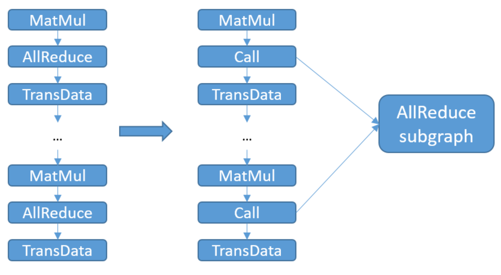

# Communication Subgraph Extraction and Reuse

<a href="https://gitee.com/mindspore/docs/blob/master/tutorials/experts/source_en/parallel/comm_subgraph.md" target="_blank"></a>

## Overview

In order to improve the accuracy of the model, it is a common means to continuously expand the model size, and it is not uncommon to see large models with more than 100 million parameters at present. However, as the scale of large models such as Pangu increases, the number of communication operators required for distributed training also rises dramatically. It will increase the communication time consumption for model compilation, and consume a large amount of stream resources. When the number of required streams exceeds the hardware limit, the model size cannot continue to scale up, thus becoming a bottleneck in the development of large models.

By extracting communication subgraphs by categorizing communication operators and reducing the number of communication operators in graph compilation, on the one hand, communication time consumption and model compilation time consumption can be reduced; on the other hand, the stream occupancy is reduced, making the model further scalable. For example, micro size can be further increased in pipeline parallel mode.

This feature currently only supports Ascend backend graph mode, and involves scenarios for distributed training. When there are a large number of communication operators in the computational graph, users can use this feature to improve graph compilation performance and reduce graph compilation time.

## Basic Principle

With this feature turned on, the MindSpore framework will perform the following steps:

1. Check if it is a graph mode and if this feature is turned on, otherwise it does not enter the optimization step of this feature.

2. Identify all reusable communication operators in the computational graph.

3. Group communication operators of the same type, the same shape, the same dtype and the same group in the same group. If the number of communication operators in a group exceeds the upper limit of communication operators that can be carried on a stream, the communication operator subgraph is created according to the operator type, shape, and dtype of the group.

4. Replace the communication operator in the original computational graph with the Call node and call the corresponding communication subgraph.



Since the communication operator in the communication subgraph occupies only one communication stream, the number of communication streams actually used will drop to 1 after replacing the communication operator in the original computational graph with a call to the communication subgraph. For example, if there are 30 AllReduce operators that can be grouped in the same group, and each communication stream can carry up to 3 communication operators, 10 communication streams are required before this feature can be turned on. With this feature turned on, the AllReduce subgraph occupies only 1 communication stream, thus saving 9 communication streams. Also, the time consumed by graph compilation for communication will be reduced due to the reduced number of communication operators processed in the compilation phase.

## Usage

The user can turn on the feature switch via the environment variable MS_COMM_COMPILER_OPT and configure the upper limit of the communication operators that can be reused. MS_COMM_COMPILER_OPT can be set to -1 or a positive integer to turn on this feature. If this environment variable is not set or set to another value, this feature will not be turned on. For the detailed information, refer to the following table. When this feature is turned on, the INFO log prints "MAX_COMM_OP_REUSE_NUM: xxx", indicating the upper limit of the reusable communication operator being used by the framework.
|MS_COMM_COMPILER_OPT|Descriptions|
|----|----|
|-1|Turn on this feature and use default communication operator reuse limit of the framework: 1000|
|Positive Integer|Turn on this feature, and use a positive integer set by the user as the upper limit of communication operator reuse|
|Not setting/Others|Turn off this feature|

Since the root diagram generates a large number of labels for multiple calls to the communication subgraph, when the user sets the MS_COMM_COMPILER_OPT value too large and exceeds the number limit of labels in the hardware, it will trigger the framework to report an error. Users can search the following logs to reduce the MS_COMM_COMPILER_OPT value appropriately:

```shell
Label list size:  # Indicate the total number of labels used for graph compilation
Reuse comm op reused_comm_sub_graphs_ size:  # Indicate the number of communication operators that will eventually be reused
Start reuse # This number of logs indicates the number of communication subgraphs generated
```
