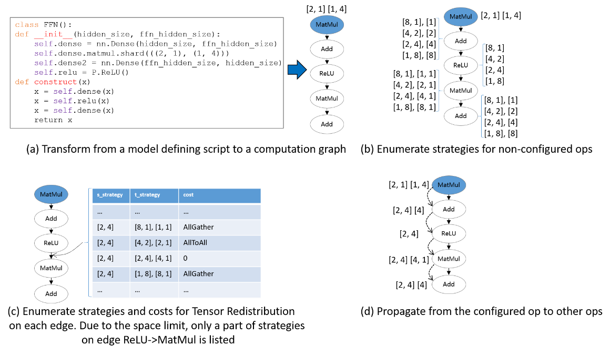
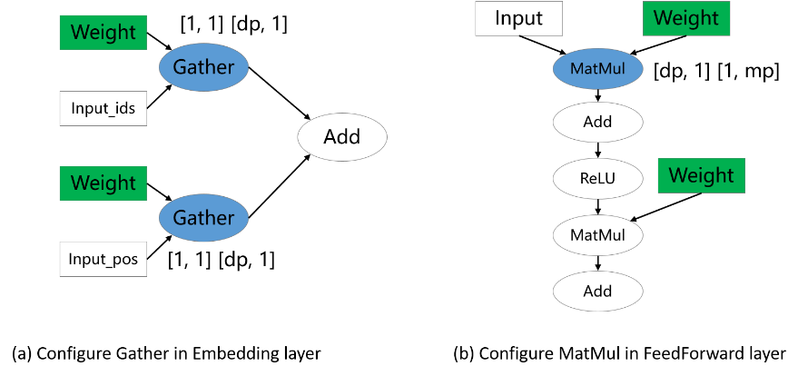
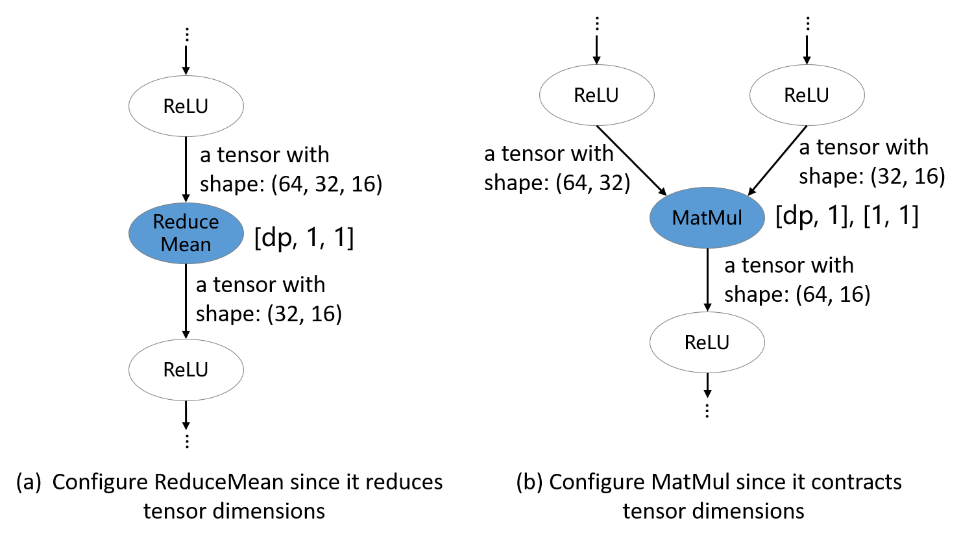
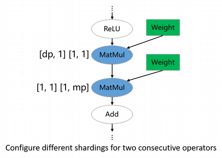

# Sharding Strategy Propagation Algorithm

[](https://gitee.com/mindspore/docs/blob/r2.2/tutorials/experts/source_en/parallel/sharding_propagation.md)

## Overview

The sharding strategy propagation algorithm means that the user only needs to manually define the strategies for a few key operators, and the strategies for the rest of the operators in the computation graph are automatically generated by the algorithm. Because the strategies of the key operators have been defined, the cost model of the algorithm mainly describes the redistribution cost between operators, and the optimization objective is to minimize the cost of the whole graph redistribution. Because the main operator strategy has been defined, which is equivalent to compress the search space, the search time of this scheme is shorter, and its strategy performance relies on the definition of the key operator strategy, so it still requires the user to have some ability to analyze the definition strategy.

> Hardware platforms supported by the sharding strategy propagation algorithm include Ascend, GPU, in addition to both PyNative mode and Graph mode.

Related interfaces:

1. `mindspore.set_auto_parallel_context(parallel_mode=ParallelMode.AUTO_PARALLEL, search_mode="sharding_propagation")`: Set the parallel mode to auto-parallel and the search mode to the sharding strategy propagation algorithm.

2. `mindspore.nn.Cell.shard()` and `mindspore.ops.Primitive.shard()`: Specifies the operator sharding strategy, and the strategy for the rest of the operators is derived by the propagation algorithm. Currently the `mindspore.nn.Cell.shard()` interface needs to be used in PyNative mode.

In summary, the sharding strategy propagation algorithm requires the user to manually configure the sharding strategy of the key operator.

## Basic Principles

Given a computation graph, **Sharding Propagation** is a functionality that propagates the Sharding Strategies from configured operator to the whole graph, with the goal of minimizing the communication cost in Tensor Redistribution.

The input of Sharding Propagation is a computation graph, in which nodes represent operators, and edges encode the data-dependency relationship of operators. From a model definition with some operators configured Sharding Strategies, Sharding Propagation executes as follows:

1. Generate possible Sharding Strategies for non-configured operators;
2. Generate Tensor Redistributions and the associated communication costs for each edge;
3. Start from the configured operators, and propagate the Sharding Strategies to non-configured operators using BFS, with the goal of minimizing the communication cost along each edge.

The following figure illustrates an example process of applying Sharding Propagation. Given an computation graph with some configured strategies, it first enumerates possible strategies for non-configured operators, as shown in figure (b). Next, it enumerates possible strategies and the Tensor Redistribution costs for each edge. Demonstrated in figure (c), the strategy for an edge is defined as a pair [*s_strategy*, *t_strategy*], where *s_strategy* and *t_strategy* denote Sharding Strategy for source operator and target operator, respectively. Finally, starting from the configured operator, it determines the next operator’s Sharding Strategy, such that the communication cost in Tensor Redistribution is minimized. The propagation ends when the Sharding Strategies for all operators are settled, as shown in figure (d).



## How to use Sharding Propagation in MindSpore

The following is an illustration of the sharding strategy propagation operation using an Ascend or GPU stand-alone 8-card example:

### Sample Code Description

> Download the complete sample code: [sharding_propagation](https://gitee.com/mindspore/docs/tree/r2.2/docs/sample_code/sharding_propagation).

The directory structure is as follows:

```text
└─ sample_code
    ├─ sharding_propagation
       ├── train.py
       └── run.sh
    ...
```

`train.py` is the script that defines the network structure and the training process. `run.sh` is the execution script.

### Configuring Distributed Environment

Specify the run mode, run device, run card number through the context interface. Unlike single card scripts, parallel scripts also need to specify the parallel mode `parallel_mode` as auto-parallel mode, the search mode `search_mode` as double recursive strategy, and initialize HCCL or NCCL communication through init. The `device_target` is automatically specified as the backend hardware device corresponding to the MindSpore package.

```python
import mindspore as ms
from mindspore.communication import init

ms.set_context(mode=ms.GRAPH_MODE, save_graphs=2)
ms.set_auto_parallel_context(parallel_mode=ms.ParallelMode.AUTO_PARALLEL, search_mode="sharding_propagation")
init()
ms.set_seed(1)
```

### Loading the Dataset

The dataset is loaded in the same way as that of the stand-alone, with the following code:

```python
import os
import mindspore.dataset as ds

def create_dataset(batch_size):
    dataset_path = os.getenv("DATA_PATH")
    dataset = ds.MnistDataset(dataset_path)
    image_transforms = [
        ds.vision.Rescale(1.0 / 255.0, 0),
        ds.vision.Normalize(mean=(0.1307,), std=(0.3081,)),
        ds.vision.HWC2CHW()
    ]
    label_transform = ds.transforms.TypeCast(ms.int32)
    dataset = dataset.map(image_transforms, 'image')
    dataset = dataset.map(label_transform, 'label')
    dataset = dataset.batch(batch_size)
    return dataset

data_set = create_dataset(32)
```

### Defining the Network

The definition of the network is exemplified by the FeedForward Network (`FFN`), which is distinguished from a single cardinality network by the addition of the sharding strategy of the `ops.MatMul()` operator:

> Currently only slicing the ops operator is supported in Graph mode.

```python
import mindspore as ms
from mindspore import nn, ops
from mindspore.common.initializer import initializer

class Dense(nn.Cell):
    def __init__(self, in_channels, out_channels):
        super().__init__()
        self.weight = ms.Parameter(initializer("normal", [in_channels, out_channels], ms.float32))
        self.bias = ms.Parameter(initializer("normal", [out_channels], ms.float32))
        # matmul i.e., the operator that is sliced
        self.matmul = ops.MatMul()
        self.add = ops.Add()

    def construct(self, x):
        x = self.matmul(x, self.weight)
        x = self.add(x, self.bias)
        return x

class FFN(nn.Cell):
    def __init__(self):
        super().__init__()
        self.flatten = ops.Flatten()
        self.dense1 = Dense(28*28, 64)
        self.relu = ops.ReLU()
        self.dense2 = Dense(64, 10)

    def construct(self, x):
        x = self.flatten(x)
        x = self.dense1(x)
        x = self.relu(x)
        x = self.dense2(x)
        return x

net = FFN()
# Configure the matmul operator sharding strategy in sense1 as ((2, 1), (1, 4))
net.dense1.matmul.shard(((2, 1), (1, 4)))
```

### Training the Network

In this step, we need to define the loss function, the optimizer, and the training process, which is partially the same as that of the single card:

```python
import mindspore as ms
from mindspore import nn, ops

optimizer = nn.Momentum(net.trainable_params(), 1e-3, 0.1)
loss_fn = nn.CrossEntropyLoss()

def forward_fn(data, target):
    logits = net(data)
    loss = loss_fn(logits, target)
    return loss, logits

grad_fn = ops.value_and_grad(forward_fn, None, net.trainable_params(), has_aux=True)

@ms.jit
def train_step(inputs, targets):
    (loss_value, _), grads = grad_fn(inputs, targets)
    optimizer(grads)
    return loss_value

for epoch in range(10):
    i = 0
    for image, label in data_set:
        loss_output = train_step(image, label)
        if i % 100 == 0:
            print("epoch: %s, step: %s, loss is %s" % (epoch, i, loss_output))
        i += 1
```

### Running a Stand-alone Eight-Card Script

Next, the corresponding scripts are invoked by commands, using the `mpirun` startup method and the 8-card distributed training script as an example of distributed training:

```bash
bash run.sh
```

After training, the log files are saved to the `log_output` directory. Set context: `save_graphs=2` in `train.py`, and you can print out the IR graphs of the compilation process, where some of the file directories are structured as follows:

```text
├─ log_output
|   └─ 1
|       ├─ rank.0
|       |   └─ stdout
|       ├─ rank.1
|       |   └─ stdout
|       ...
├─ rank_0
|   ├─ step_parallel_begin_xxxx.ir
|   ├─ xx_validate_xxx.ir
|   ...
├─ rank_1
|   ├─ step_parallel_begin_xxxx.ir
|   ├─ xx_validate_xxx.ir
|   ...
...
```

The part of Loss results are saved in `log_output/1/rank.*/stdout`, and the example is as follows:

```text
epoch: 0, step: 0, loss is 2.3016691
epoch: 0, step: 100, loss is 2.2160375
epoch: 0, step: 200, loss is 1.7746857
epoch: 0, step: 300, loss is 1.0550221
epoch: 0, step: 400, loss is 0.763592
epoch: 0, step: 500, loss is 0.5714973
epoch: 0, step: 600, loss is 0.4949431
epoch: 0, step: 700, loss is 0.4682496
epoch: 0, step: 800, loss is 0.29194525
epoch: 0, step: 900, loss is 0.43532845
epoch: 0, step: 1000, loss is 0.46586612
...
```

In `step_parallel_begin_xxxx.ir`, you can see that each computational operator is configured with a sharding strategy:

```text
...
  %4(logits) = MatMul(%2, %3) {instance name: matmul} primitive_attrs: {input_names: [x1, x2], out_strategy: None, transpose_x2: Bool(0), transpose_b: Bool(0), in_strategy: ((2, 1), (1, 4)), output_names: [output], transpose_a: Bool(0), transpose_x1: Bool(0)} {in_strategy: ((2, 1), (1, 4))}
      : (<Tensor[Float32], (256, 784)>, <Tensor[Float32], (784, 64)>) -> (<Tensor[Float32], (256, 64)>)
      # Scope: (Default)
  %5([CNode]1647) = Load($(@1_train_step.1349:para4_dense1.bias), %para16_u)
      : (<Ref[Tensor[Float32]], (64), ref_key=:dense1.bias>, <UMonad, NoShape>) -> (<Tensor[Float32], (64)>)
      # Scope: (Default)
  %6(logits) = Add(%4, %5) {instance name: add} primitive_attrs: {output_names: [output], input_names: [x, y]} {in_strategy: ((2, 4), (4))}
      : (<Tensor[Float32], (256, 64)>, <Tensor[Float32], (64)>) -> (<Tensor[Float32], (256, 64)>)
      # Scope: (Default)
  %7(logits) = ReLU(%6) {instance name: relu} primitive_attrs: {output_names: [output], input_names: [x]} {in_strategy: ((2, 4))}
      : (<Tensor[Float32], (256, 64)>) -> (<Tensor[Float32], (256, 64)>)
      # Scope: (Default)
  %8([CNode]1641) = Load($(@1_train_step.1349:para5_dense2.weight), %para16_u)
      : (<Ref[Tensor[Float32]], (64, 10), ref_key=:dense2.weight>, <UMonad, NoShape>) -> (<Tensor[Float32], (64, 10)>)
      # Scope: (Default)
  %9(logits) = MatMul(%7, %8) {instance name: matmul} primitive_attrs: {output_names: [output], transpose_a: Bool(0), input_names: [x1, x2], transpose_x2: Bool(0), transpose_x1: Bool(0), transpose_b: Bool(0)} {in_strategy: ((2, 4), (4, 1))}
      : (<Tensor[Float32], (256, 64)>, <Tensor[Float32], (64, 10)>) -> (<Tensor[Float32], (256, 10)>)
      # Scope: (Default)
...
```

For example, for the first MatMul operator, the input strategy in_strategy has been configured as ((2, 1), (1, 4)), and the sharding strategy of Add operator is configured as ((2, 4), (4)).

```text
(<Tensor[Float32], (256, 784)>, <Tensor[Float32], (784, 64)>) -> (<Tensor[Float32], (256, 64)>)
```

represents the original input of the operator. For the first MatMul operator, the first and second input shapes are (256, 784), (784, 64) respectively and the output shape is (256, 64).

In `xx_validate_xxx.ir`, you can see that the input and output tensor of each operator is sliced:

```text
...
  %3(equiv[CNode]4) = MatMul(%1, %2) {instance name: matmul} primitive_attrs: {input_names: [x1, x2], out_strategy: None, transpose_x2: Bool(0), transpose_b: Bool(0), in_strategy: ((2, 1), (1, 4)), output_names: [output], transpose_a: Bool(0), transpose_x1: Bool(0)} cnode_attrs: {related_comm_node_id: "30707"} cnode_primal_attrs: {unique_id: "31021", related_fusion_key: "all_reduce_2-511848487187618470_1", related_node_id: "28192"} {in_strategy: ((2, 1), (1, 4))}
      : (<Tensor[Float32], (128, 784)>, <Tensor[Float32], (784, 16)>) -> (<Tensor[Float32], (128, 16)>)
      # Scope: (Default)
      # In file train.py:40/        x = self.matmul(x, self.weight)/
  %4(equiv[CNode]1647) = Load(%para4_dense1.bias, U) cnode_primal_attrs: {unique_id: "31025"}
      : (<Ref[Tensor[Float32]], (16), ref_key=:dense1.bias>, <UMonad, NoShape>) -> (<Tensor[Float32], (16)>)
      # Scope: (Default)
  %5(equiv[CNode]4) = Add(%3, %4) primitive_attrs: {output_names: [output], input_names: [x, y]} cnode_attrs: {related_comm_node_id: "30709"} cnode_primal_attrs: {unique_id: "31020", related_fusion_key: "all_reduce_2-511848487187618470_1", related_node_id: "28190"} {in_strategy: ((2, 4), (4))}
      : (<Tensor[Float32], (128, 16)>, <Tensor[Float32], (16)>) -> (<Tensor[Float32], (128, 16)>)
      # Scope: (Default)
      # In file train.py:41/        x = self.add(x, self.bias)/
  %6(equiv[CNode]4) = ReLU(%5) {instance name: relu} primitive_attrs: {output_names: [output], input_names: [x]} cnode_primal_attrs: {unique_id: "31008"} {in_strategy: ((2, 4))}
      : (<Tensor[Float32], (128, 16)>) -> (<Tensor[Float32], (128, 16)>)
      # Scope: (Default)
      # In file train.py:58/        x = self.relu(x)/
  %7(equiv[CNode]1641) = Load(%para5_dense2.weight, U) cnode_primal_attrs: {unique_id: "31018"}
      : (<Ref[Tensor[Float32]], (16, 10), ref_key=:dense2.weight>, <UMonad, NoShape>) -> (<Tensor[Float32], (16, 10)>)
      # Scope: (Default)
  %8(equiv[CNode]4) = MatMul(%6, %7) {instance name: matmul} primitive_attrs: {output_names: [output], transpose_a: Bool(0), input_names: [x1, x2], transpose_x2: Bool(0), transpose_x1: Bool(0), transpose_b: Bool(0)} cnode_attrs: {related_comm_node_id: "30724"} cnode_primal_attrs: {unique_id: "31015", related_fusion_key: "all_reduce_2-511848487187618470_1", related_node_id: "28180"} {in_strategy: ((2, 4), (4, 1))}
      : (<Tensor[Float32], (128, 16)>, <Tensor[Float32], (16, 10)>) -> (<Tensor[Float32], (128, 10)>)
      # Scope: (Default)
      # In file train.py:40/        x = self.matmul(x, self.weight)/
...
```

For the first MatMul operator, after its inputs are sliced according to the strategy ((2, 1), (1, 4)), the shapes of the first and second inputs are sliced into (128, 784), (784, 16) from the original (256, 784), (784, 64), respectively, and thus the output shape of (128, 16) is obtained.

Other startup methods such as dynamic networking and `rank table` startup can be found in [startup methods](https://www.mindspore.cn/tutorials/experts/en/r2.2/parallel/startup_method.html).

### Empirical Principles on Configuring Sharding Strategies

Given a new model with numerous operators, from the user's perspective, a key problem is to determine which operators should be configured, with what sharding strategies. Since the goal of Sharding Propagation is to minimize Tensor Redistribution cost, instead of finding the global minima of end-to-end step time, it is crucial to configure proper sharding strategies for "key operators". There is no compulsory standard specifying which operators must be configured. However, based on our experience of training large models, there are indeed some principles guiding users to annotate shardings. Here, we list three principles, which may be useful for new users.

#### Configuring Parameter-involved Operators

The sharding strategies for parameters are important especially for large models, since parameter-induced memory consumption is the majority of total memory consumption. Therefore, parameter-involved operators usually need to explicitly configure the sharding strategies. In the following examples in the figure, Gather and MatMul involving weights are configured shardings, while other operators are not. These correspond the data-parallel Embedding layer and hybrid-parallel FeedForward Layer in [mindformers](https://gitee.com/mindspore/mindformers/tree/r0.8/mindformers/modules), respectively.



#### Configuring Dimension-manipulation Operators

In deep learning frameworks, operators can be broadly classified into two categories: semantically simple dimension-preserving operators and dimension-manipulation operators. Sharding Propagation could easily propagate shardings from inputs to outputs for dimension-preserving operators. However, for dimension-manipulation operators, explicit annotations should be configured to express users’ intuition, to avoid Sharding Propagation to derive non-user-desired shardings. In the following figure, ReduceMean and MatMul operators are configured shardings.



#### Configuring Parallel-changing-boundary Operators

For a model like ResNet, different parts of the model may prefer different parallelisms: front part uses data parallelism, while tail part uses model parallelism. This is achieved by annotating parallelism-changing boundary operators. In the example of following figure, the first MatMul propagates the data-parallelism sharding to the front part, while the second MatMul propagates the model-parallelism sharding to the tail part.



Users should not only understand the main idea of Sharding Propagation, but also have a preferred parallelism for their training models. If there is a sharding strategy inferred by Sharding Propagation that is conflict with your intuition, just add the preferred sharding to the operator. It indeed needs some trial-and-errors to acquire the satisfactory configuration.
