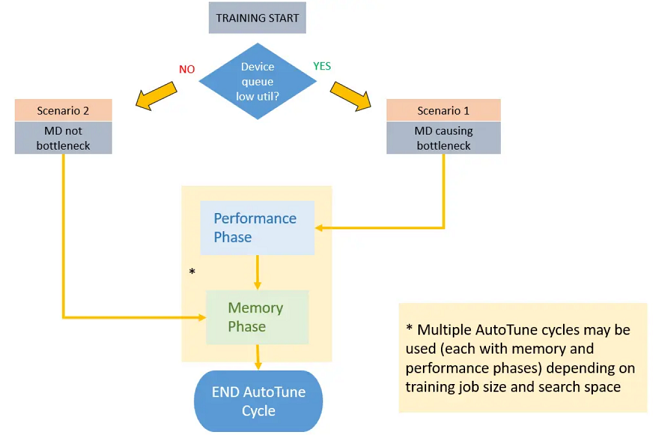

# 自动数据加速

<a href="https://gitee.com/mindspore/docs/blob/r1.7/tutorials/experts/source_zh_cn/debug/dataset_autotune.md" target="_blank"></a>

## 概述

MindSpore提供了一种自动数据调优的工具——Dataset AutoTune，用于在训练过程中根据环境资源的情况自动调整数据处理管道的并行度，
最大化利用系统资源加速数据处理管道的处理速度。

在整个训练的过程中，Dataset AutoTune模块会持续检测当前训练性能瓶颈处于数据侧还是网络侧。如果检测到瓶颈在数据侧，则将进一步对数据处理管道中的各个算子（如GeneratorDataset、map、batch此类数据算子）进行参数调整，目前可调整的参数包括算子的工作线程数（num_parallel_workers），算子的内部队列深度（prefetch_size）。



启动AutoTune后，MindSpore会根据一定的时间间隔，对数据处理管道的资源情况进行采样统计。

当Dataset AutoTune收集到足够的信息时，它会基于这些信息分析当前的性能瓶颈是否在数据侧。
如果是，Dataset AutoTune将调整数据处理管道的并行度，并加速数据集管道的运算。
如果不是，Dataset AutoTune也会尝试减少数据管道的内存使用量，为CPU释放一些可用内存。

> 自动数据加速在默认情况下是关闭的。

## 如何启动自动数据加速

启动自动数据加速（不保存调优后的推荐配置）:

```python
import mindspore.dataset as ds
ds.config.set_enable_autotune(True)
```

启动自动数据加速并设定调优结果的保存路径:

```python
import mindspore.dataset as ds
ds.config.set_enable_autotune(True, "/path/to/autotune_out")
```

## 如何自定义自动数据加速的调优间隔

设定自动数据加速的调优间隔（单位是step，与网络训练时step的含义一致）：

```python
import mindspore.dataset as ds
ds.config.set_autotune_interval(100)
```

> 特别的，当调优间隔设定为0时，表示每个epoch结束时进行调优（与网络训练时epoch的含义一致）。

获取当前自动数据加速的调优间隔:

```python
import mindspore.dataset as ds
print("tuning interval:", ds.config.get_autotune_interval())
```

## 约束

- Profiling性能分析和自动数据加速无法同时开启，否则会导致Profiling或Dataset AutoTune不生效。如果这样同时开启此两个功能，则会有一条警告信息提示用户检查是否为误操作。因此在使用Dataset AutoTune时，用户需要确保关闭Profiling功能。
- 如果同时启动了[数据异构加速](https://www.mindspore.cn/docs/zh-CN/r1.7/design/dataset_offload.html)和自动数据加速，当有数据节点通过AutoTune进行异构硬件加速时，自动数据加速将不能保存数据管道配置并以警告日志提醒，因为此时实际运行的数据管道并不是预先定义的数据管道。
- 如果数据处理管道包含不支持反序列化的节点（如用户自定义Python函数、GeneratorDataset），则使用保存的优化配置文件进行反序列化时将产生错误。此时推荐用户根据调优配置文件的内容手动修改数据管道的配置已达到加速的目的。
- 在分布式多卡训练启动自动数据加速时，`set_enable_autotune()` 需要在集群初始化完成后才能执行（mindspore.communication.management.init()），否则自动数据加速只会识别到ID为0的设备，且只会生成单个调优文件（预期生成文件数量应与设备数量相等），见以下样例：

    在分布式多卡训练场景，需要在集群初始化完成后才启动自动数据加速:

    ```python
    import mindspore.dataset as ds
    from mindspore.communication.management import init
    init()
    ...

    def create_dataset():
        ds.config.set_enable_autotune(True, "/path/to/autotune_out")
        ds.Cifar10Dataset()
    ...
    ```

    而不是

    ```python
    import mindspore.dataset as ds
    from mindspore.communication.management import init

    ds.config.set_enable_autotune(True, "/path/to/autotune_out")
    init()
    ...

    def create_dataset():
        ds.Cifar10Dataset()
    ...
    ```

## 样例

以ResNet网络训练作为一个样例。

### 自动数据加速配置

若要启用自动数据加速，仅需添加一条语句即可。

```python
# dataset.py of ResNet in ModelZoo
# models/official/cv/resnet/src/dataset.py

def create_dataset(...)
    """
    create dataset for train or test
    """
    # 启动自动数据加速
    ds.config.set_enable_autotune(True, "/path/to/autotune_out")

    # 其他数据集代码无需变更
    data_set = ds.Cifar10Dataset(data_path)
    ...
```

### 开始训练

根据[resnet/README.md](https://gitee.com/mindspore/models/blob/master/official/cv/resnet/README_CN.md#)所描述的步骤
启动CIFAR10数据集的训练，随后自动数据加速模块会通过LOG的形式展示其对于性能瓶颈的分析情况：

```text
[INFO] [auto_tune.cc:73 LaunchThread] Launching Dataset AutoTune thread
[INFO] [auto_tune.cc:35 Main] Dataset AutoTune thread has started.
[INFO] [auto_tune.cc:191 RunIteration] Run Dataset AutoTune at epoch #1
[INFO] [auto_tune.cc:203 RecordPipelineTime] Epoch #1, Average Pipeline time is 21.6624 ms. The avg pipeline time for all epochs is 21.6624ms
[INFO] [auto_tune.cc:231 IsDSaBottleneck] Epoch #1, Device Connector Size: 0.0224, Connector Capacity: 1, Utilization: 2.24%, Empty Freq: 97.76%
epoch: 1 step: 1875, loss is 1.1544309
epoch time: 72110.166 ms, per step time: 38.459 ms

[WARNING] [auto_tune.cc:236 IsDSaBottleneck] Utilization: 2.24% < 75% threshold, dataset pipeline performance needs tuning.
[WARNING] [auto_tune.cc:297 Analyse] Op (MapOp(ID:3)) is slow, input connector utilization=0.975806, output connector utilization=0.298387, diff= 0.677419 > 0.35 threshold.
[WARNING] [auto_tune.cc:253 RequestNumWorkerChange] Added request to change "num_parallel_workers" of Operator: MapOp(ID:3)From old value: [2] to new value: [4].
[WARNING] [auto_tune.cc:309 Analyse] Op (BatchOp(ID:2)) getting low average worker cpu utilization 1.64516% < 35% threshold.
[WARNING] [auto_tune.cc:263 RequestConnectorCapacityChange] Added request to change "prefetch_size" of Operator: BatchOp(ID:2)From old value: [1] to new value: [5].
epoch: 2 step: 1875, loss is 0.64530635
epoch time: 24519.360 ms, per step time: 13.077 ms

[WARNING] [auto_tune.cc:236 IsDSaBottleneck] Utilization: 0.0213516% < 75% threshold, dataset pipeline performance needs tuning.
[WARNING] [auto_tune.cc:297 Analyse] Op (MapOp(ID:3)) is slow, input connector utilization=1, output connector utilization=0, diff= 1 > 0.35 threshold.
[WARNING] [auto_tune.cc:253 RequestNumWorkerChange] Added request to change "num_parallel_workers" of Operator: MapOp(ID:3)From old value: [4] to new value: [6].
[WARNING] [auto_tune.cc:309 Analyse] Op (BatchOp(ID:2)) getting low average worker cpu utilization 4.39062% < 35% threshold.
[WARNING] [auto_tune.cc:263 RequestConnectorCapacityChange] Added request to change "prefetch_size" of Operator: BatchOp(ID:2)From old value: [5] to new value: [9].
epoch: 3 step: 1875, loss is 0.9806979
epoch time: 17116.234 ms, per step time: 9.129 ms

...

[INFO] [profiling.cc:703 Stop] MD Autotune is stopped.
[INFO] [auto_tune.cc:52 Main] Dataset AutoTune thread is finished.
[INFO] [auto_tune.cc:53 Main] Printing final tree configuration
[INFO] [auto_tune.cc:66 PrintTreeConfiguration] CifarOp(ID:5) num_parallel_workers: 2 prefetch_size: 2
[INFO] [auto_tune.cc:66 PrintTreeConfiguration] MapOp(ID:4) num_parallel_workers: 1 prefetch_size: 2
[INFO] [auto_tune.cc:66 PrintTreeConfiguration] MapOp(ID:3) num_parallel_workers: 10 prefetch_size: 2
[INFO] [auto_tune.cc:66 PrintTreeConfiguration] BatchOp(ID:2) num_parallel_workers: 8 prefetch_size: 17
[INFO] [auto_tune.cc:55 Main] Suggest to set proper num_parallel_workers for each Operation or use global setting API: mindspore.dataset.config.set_num_parallel_workers
[INFO] [auto_tune.cc:57 Main] Suggest to choose maximum prefetch_size from tuned result and set by global setting API: mindspore.dataset.config.set_prefetch_size
```

数据管道的性能分析和调整过程可以通过上述的LOG体现：

- **如何通过LOG观察自动数据加速模块的效果：**

  自动数据加速模块在默认情况下以INFO级别的LOG信息提醒用户其运行的情况，
  当检测到数据侧为瓶颈且需要发生参数变更时，则会通过WARNING级别的LOG信息提醒用户正在调整的参数。

- **如何阅读输出LOG：**

  在数据处理管道的初始配置下，Device Connector队列（数据管道与计算网络之间的缓冲队列）的利用率较低。

  ```text
  [INFO] [auto_tune.cc:231 IsDSaBottleneck] Epoch #1, Device Connector Size: 0.0224, Connector Capacity: 1, Utilization: 2.24%, Empty Freq: 97.76%
  [WARNING] [auto_tune.cc:236 IsDSaBottleneck] Utilization: 2.24% < 75% threshold, dataset pipeline performance needs tuning.
  ```

  原因主要是数据处理管道生成数据的速度较慢，网络侧很快就会读取完生成的数据，基于此情况，
  自动数据加速模块调整可MapOp(ID:3)的工作线程数（"num_parallel_workers"）与BatchOp(ID:2)算子内部队列深度（"prefetch_size"）。

  ```text
  [WARNING] [auto_tune.cc:297 Analyse] Op (MapOp(ID:3)) is slow, input connector utilization=0.975806, output connector utilization=0.298387, diff= 0.677419 > 0.35 threshold.
  [WARNING] [auto_tune.cc:253 RequestNumWorkerChange] Added request to change "num_parallel_workers" of Operator: MapOp(ID:3)From old value: [2] to new value: [4].
  [WARNING] [auto_tune.cc:309 Analyse] Op (BatchOp(ID:2)) getting low average worker cpu utilization 1.64516% < 35% threshold.
  [WARNING] [auto_tune.cc:263 RequestConnectorCapacityChange] Added request to change "prefetch_size" of Operator: BatchOp(ID:2)From old value: [1] to new value: [5].
  ```

  提高了数据处理管道的并行性，加快了速度处理的速度，整体的step time得到了可观的减少。

  ```text
  epoch: 1 step: 1875, loss is 1.1544309
  epoch time: 72110.166 ms, per step time: 38.459 ms
  epoch: 2 step: 1875, loss is 0.64530635
  epoch time: 24519.360 ms, per step time: 13.077 ms
  epoch: 3 step: 1875, loss is 0.9806979
  epoch time: 17116.234 ms, per step time: 9.129 ms
  ```

  而在训练的最后，自动数据加速模块将输出一个建议性信息，推荐用户调整对应算子的工作线程数算子内部队列深度。
  对于工作线程数配置，推荐在脚本中指定算子的num_parallel_workers参数，或通过mindspore.dataset.config.set_num_parallel_workers设置全局线程数；对于算子内部队列深度配置，推荐从LOG中选取最大的prefetch_size，并使用mindspore.dataset.config.set_prefetch_size进行设置。

  ```text
  [INFO] [auto_tune.cc:66 PrintTreeConfiguration] CifarOp(ID:5) num_parallel_workers: 2 prefetch_size: 2
  [INFO] [auto_tune.cc:66 PrintTreeConfiguration] MapOp(ID:4) num_parallel_workers: 1 prefetch_size: 2
  [INFO] [auto_tune.cc:66 PrintTreeConfiguration] MapOp(ID:3) num_parallel_workers: 10 prefetch_size: 2
  [INFO] [auto_tune.cc:66 PrintTreeConfiguration] BatchOp(ID:2) num_parallel_workers: 8 prefetch_size: 17
  [INFO] [auto_tune.cc:55 Main] Suggest to set proper num_parallel_workers for each Operation or use global setting API: mindspore.dataset.config.set_num_parallel_workers
  [INFO] [auto_tune.cc:57 Main] Suggest to choose maximum prefetch_size from tuned result and set by global setting API: mindspore.dataset.config.set_prefetch_size
  ```

### 保存自动数据加速的推荐配置

当开启AutoTune进行数据处理管道优化时，优化后的数据处理管道可被序列化（通过传入`filepath_prefix`参数）保存到JSON配置文件中。

`filepath_prefix`参数会根据当前训练环境处于单卡或多卡，自动生成对应卡号的JSON文件。

例如，配置 `filepath_prefix='autotune_out'` ：

- 在4卡训练环境下，会得到4个调优文件：autotune_out_0.json、autotune_out_1.json、autotune_out_2.json、autotune_out_3.json，对应着4个卡上数据管道的调优配置情况；
- 在单卡环境下，会得到autotune_out_0.json，对应着此卡上数据管道的调优配置情况。

JSON配置文件的示例如下:

```text
{
    "remark": "The following file has been auto-generated by the Dataset AutoTune.",
    "summary": [
        "CifarOp(ID:5)       (num_parallel_workers: 2, prefetch_size: 2)",
        "MapOp(ID:4)         (num_parallel_workers: 1, prefetch_size: 2)",
        "MapOp(ID:3)         (num_parallel_workers: 10, prefetch_size: 2)",
        "BatchOp(ID:2)       (num_parallel_workers: 8, prefetch_size: 17)"
    ],
    "tree": {...}
}
```

文件以配置摘要作为开头，随后是实际数据管道（`tree`）的信息。可通过反序列化接口`mindspore.dataset.deserialize`对该文件进行加载。

JSON配置文件注意事项:

- 非并行数据处理操作的`num_parallel_workers`值将显示`NA`。

### 加载自动数据加速的推荐配置

当需要直接加载调优结果，得到已经调优的数据处理管道，可以采用如下方法：

```python
import mindspore.dataset as ds
new_dataset = ds.deserialize("/path/to/autotune_out_0.json")
```

此处得到的 `new_dataset` 将包含上述JSON样例中从Cifar到Batch的数据集加载设置。

### 在进行下一次训练之前

在进行下一次训练之前，用户可以根据自动数据加速模块输出的推荐配置，对数据集加载部分的代码进行调整，
以便在下一次训练的开始时就可以在较优性能水平下运行数据处理管道。

另外，MindSpore也提供了相关的API用于全局调整数据处理管道算子的并行度与内部队列深度，请参考[mindspore.dataset.config](https://www.mindspore.cn/docs/zh-CN/r1.7/api_python/mindspore.dataset.config.html):

- [mindspore.dataset.config.set_num_parallel_workers](https://www.mindspore.cn/docs/zh-CN/r1.7/api_python/mindspore.dataset.config.html#mindspore.dataset.config.set_num_parallel_workers)
- [mindspore.dataset.config.set_prefetch_size](https://www.mindspore.cn/docs/zh-CN/r1.7/api_python/mindspore.dataset.config.html#mindspore.dataset.config.set_prefetch_size)
