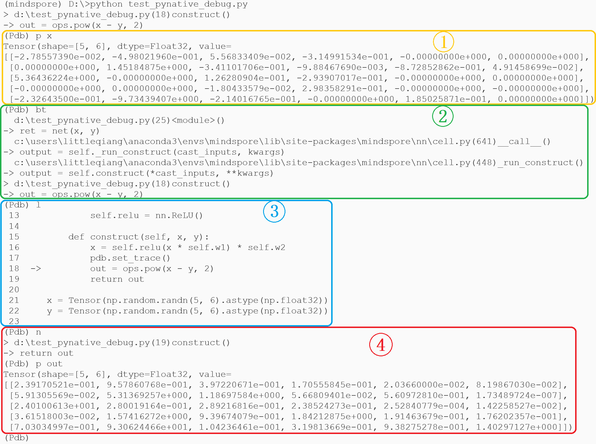
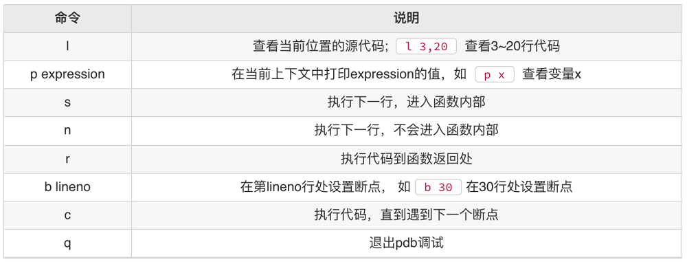

# PyNative 调试

<a href="https://gitee.com/mindspore/docs/blob/r1.10/tutorials/experts/source_zh_cn/debug/pynative_debug.md" target="_blank"></a>&nbsp;&nbsp;

## 简介

PyNative模式，也称为动态图模式。该模式的正向执行过程是按照Python的语法，逐语句执行Python指令。每一条Python指令执行完，都能够得到该条Python语句的执行结果。因此，在PyNative模式下，用户可以逐指令，或者在特定的指令位置调试网络脚本。

## 断点调试

断点调试是指在网络脚本的某一行指令前，或者指令后设置一个断点。当网络脚本运行到这一行指令的断点位置时会停住，然后你可以在断点位置查看变量信息，或者一步一步地往下调试，整个调试过程都可以看各个变量当前的取值。通过分析断点处变量的是否合理，来判断当前的代码是否出错。由于PyNative模式在执行时，就是基于Python语法来逐语句执行Python指令。因此，在PyNative模式下，用户可以使用Python的断点调试工具：pdb，来对网络脚本进行调试。

通过以下代码演示断点调试的功能。

```python
import pdb
import numpy as np
import mindspore as ms
from mindspore import Tensor, nn, set_context
from mindspore import Parameter, ParameterTuple
from mindspore.ops import GradOperation
from mindspore import ops
set_context(mode=ms.PYNATIVE_MODE)
class Net(nn.Cell):
    def __init__(self):
        super(Net, self).__init__()
        self.w1 = Parameter(Tensor(np.random.randn(5, 6).astype(np.float32)), name="w1", requires_grad=True)
        self.w2 = Parameter(Tensor(np.random.randn(5, 6).astype(np.float32)), name="w2", requires_grad=True)
        self.relu = nn.ReLU()
        self.pow = ops.Pow()

    def construct(self, x, y):
        x = self.relu(x * self.w1) * self.w2
        pdb.set_trace()
        out = self.pow(x - y, 2)
        return out

x = Tensor(np.random.randn(5, 6).astype(np.float32))
y = Tensor(np.random.randn(5, 6).astype(np.float32))

net = Net()
ret = net(x, y)
weights = ParameterTuple(filter(lambda x : x.requires_grad, net.get_parameters()))
grads = GradOperation(get_by_list=True)(net, weights)(x, y)
print("grads: ", grads)

```

1. 用户通过在脚本中导入“pdb”，即可使用pdb的断点调试功能，如下：

    ```python
    import pdb
    ```

2. 在需要进行断点的位置，设置如下指令，即可让网络脚本运行到该指令时停住：

    **演示代码** ：

    ```python
    x = self.relu(x * self.w1) * self.w2
    pdb.set_trace()
    out = self.pow(x - y, 2)
    return out
    ```

    如图1所示，脚本暂定在指令 `out = self.pow(x-y, 2)`处，并等待输入pdb指令。

    

    图 1

3. 当网络脚本在断点处停住时，用户可以使用Python pdb常用的调试指令来对网络脚本进行调试，比如：打印变量的取值，查看程序调用栈，单步调试执行等。

    * 打印变量的取值可以通过p指令实现，如图1中①所示；
    * 查看程序调用栈可以通过bt指令实现，如图1中②所示；
    * 查看断点所处网络脚本的上下文，可以通过l指令来实现，如图1中③所示；
    * 单步调试网络脚本，可以通过n指令来实现，如图1中④所示。

## pdb 常用命令



更多pdb使用使用方法可以查看pdb的[官方文档](https://docs.python.org/zh-cn/3/library/pdb.html)。
