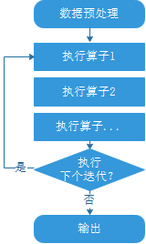
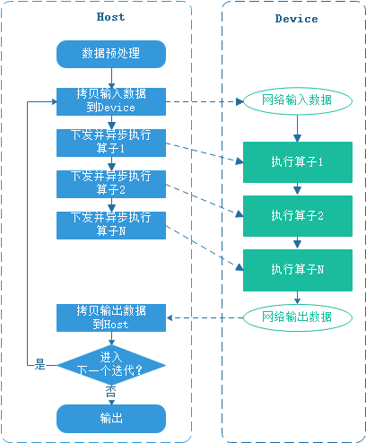
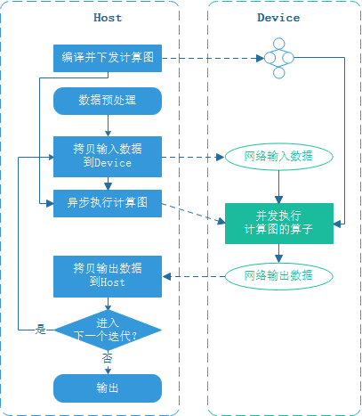
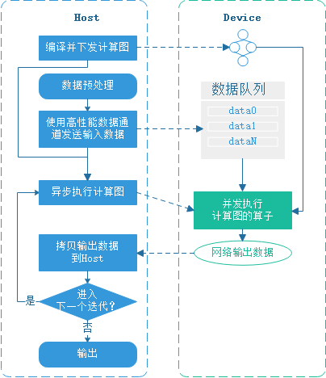
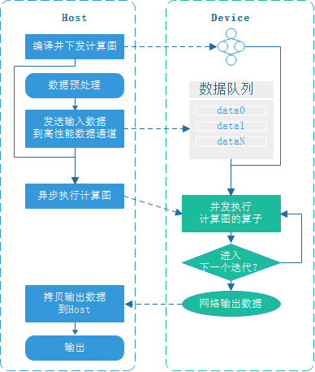

# 下沉模式

<a href="https://gitee.com/mindspore/docs/blob/master/tutorials/experts/source_zh_cn/others/execution_opt.md" target="_blank"></a>

## 概述

昇腾芯片上集成了AICORE、AICPU和CPU。其中，AICORE负责大型Tensor Vector运算，AICPU负责标量运算，CPU负责逻辑控制和任务分发。

Host侧CPU负责将图或算子下发到昇腾芯片。昇腾芯片由于具备了运算、逻辑控制和任务分发的功能，所以不需要与Host侧的CPU进行频繁的交互，只需要将计算完的最终结果返回给Host侧，实现整图下沉到Device执行，避免Host-Device频繁交互，减小了开销。

为了充分使用昇腾芯片硬件功能，打造极致性能，MindSpore提供了整图下沉功能，目的是减少Host-Device交互开销，有效地提升训练与推理的性能。

MindSpore构建的图包含数据图和计算图，通过将数据图下沉和计算图下沉的方式，减少Host-Device交互开销。且结合循环下沉可以实现多个Step下沉，进一步减少Host和Device的交互次数。

MindSpore的计算图包含网络中的所有算子和算子间的依赖关系。从用户的视角来看，训练的处理流程如下：



本教程以训练的执行流程为例介绍计算图下沉、数据下沉和循环下沉的原理和使用方法。

## 计算图下沉

为了提升网络的执行性能，通常使用专用的芯片来执行算子，每个芯片对应一个Device，Host与Device交互的流程如下：



由上图可见，每次训练迭代都需要下发并触发device上算子的执行，Host与Device交互频繁。

为减少Host与Device的交互，在图编译时，将网络中的算子打包并一起下发到device，每次迭代只触发整张计算图的执行即可，从而提升网络的执行效率。



用户通过[train](https://mindspore.cn/docs/zh-CN/master/api_python/train/mindspore.train.Model.html#mindspore.train.Model.train)接口的`dataset_sink_mode`控制是否使能数据下沉，使能数据下沉就会使能计算图下沉。

## 数据下沉

计算图下沉的每个迭代都需要从Host拷贝数据到Device，可通过数据下沉消除Host和Device间拷贝输入数据的开销。

使能数据下沉后，MindSpore会在Device侧创建专门的数据缓存队列，MindSpore数据处理引擎使用高性能数据通道将数据的预处理结果发送到Device的数据队列上，计算图通过GetNext算子直接从数据队列拷贝输入数据，Host向数据队列发送数据和计算图从数据队列读取数据形成流水并行，执行当前迭代的同时可向数据队列发送下一个迭代的数据，从而隐藏了Host-Device数据拷贝的开销，MindSpore高性能数据处理引擎的原理参考[这里](https://www.mindspore.cn/docs/zh-CN/master/design/data_engine.htm)。Host-Device交互流程如下：



用户通过[train](https://mindspore.cn/docs/zh-CN/master/api_python/train/mindspore.train.Model.html#mindspore.train.Model.train)接口的`dataset_sink_mode`控制是否使能数据下沉。

## 循环下沉

启用计算图下沉和数据下沉后，每个迭代的计算结果都会返回Host，并由Host判断是否需要进入下一个迭代，为消除每个迭代Device与Host的交互，可以将进入下一个迭代的循环判断下沉到Device，这样等所有迭代执行完成后再将计算结果返回到Host，进一步提升训练性能。循环下沉的Host-Device交互流程如下：



用户通过使用[train](https://mindspore.cn/docs/zh-CN/master/api_python/train/mindspore.train.Model.html#mindspore.train.Model.train)接口的`dataset_sink_mode`和`sink_size`控制每个epoch的下沉数据量。Device测会运行`sink_size`指定的迭代次数，然后再返回到Host侧。

## 使用方法

`Model`的`train`接口参数`dataset_sink_mode`可以控制数据是否下沉。`dataset_sink_mode`为True表示数据下沉，否则为非下沉。所谓下沉即数据通过通道直接传送到Device上。

`dataset_sink_mode`参数可以配合`sink_size`控制每个`epoch`下沉的数据量大小。当`dataset_sink_mode`设置为True，即数据下沉模式时：

- 如果`sink_size`为默认值-1，则每一个`epoch`训练整个数据集，理想状态下下沉数据的速度快于硬件计算的速度，保证处理数据的耗时隐藏于网络计算时间内；

- 如果`sink_size`>0，此时原始数据集可以被无限次遍历，下沉数据流程仍与`sink_size`=-1相同，不同点是每个`epoch`仅训练`sink_size`大小的数据量，如果有`LossMonitor`，那么会训练`sink_size`大小的数据量就打印一次loss值，下一个`epoch`继续从上次遍历的结束位置继续遍历。

下沉的总数据量由`epoch`和`sink_size`两个变量共同控制，即总数据量=`epoch`*`sink_size`。

当使用`LossMonitor`、`TimeMonitor`或其它`Callback`接口时，如果`dataset_sink_mode`设置为False，Host侧和Device侧之间每个`step`交互一次，所以会每个`step`返回一个结果，如果`dataset_sink_mode`为True，因为数据在Device上通过通道传输， Host侧和Device侧之间每个`epoch`进行一次数据交互，所以每个`epoch`只返回一次结果。

> 当前CPU不支持数据下沉。
>
> 如果在使用数据下沉模式时，出现`fault kernel_name=GetNext`、`GetNext... task error`或者`outputs = self.get_next()`等类似的错误，那么有可能是数据处理过程中某些样本处理太耗时，导致网络计算侧长时间拿不到数据报错，此时可以将`dataset_sink_mode`设置为False再次验证，或者对数据集使用`create_dict_iterator()`接口单独循环数据集，并参考[数据处理性能优化](https://mindspore.cn/tutorials/experts/zh-CN/master/dataset/optimize.html)调优数据处理，保证数据处理高性能。

代码样例如下：

```python
import os
import requests
import mindspore.dataset as ds
import mindspore as ms
import mindspore.dataset.transforms as transforms
import mindspore.dataset.vision as vision
import mindspore.nn as nn
from mindspore.common.initializer import TruncatedNormal
from mindspore.dataset.vision import Inter
import mindspore.ops as ops

requests.packages.urllib3.disable_warnings()

def create_dataset(data_path, batch_size=32, repeat_size=1,
                   num_parallel_workers=1):
    """
    create dataset for train or test
    """
    # define dataset
    mnist_ds = ds.MnistDataset(data_path)

    resize_height, resize_width = 32, 32
    rescale = 1.0 / 255.0
    shift = 0.0
    rescale_nml = 1 / 0.3081
    shift_nml = -1 * 0.1307 / 0.3081

    # define map operations
    resize_op = vision.Resize((resize_height, resize_width), interpolation=Inter.LINEAR)  # Bilinear mode
    rescale_nml_op = vision.Rescale(rescale_nml, shift_nml)
    rescale_op = vision.Rescale(rescale, shift)
    hwc2chw_op = vision.HWC2CHW()
    type_cast_op = transforms.TypeCast(ms.int32)

    # apply map operations on images
    mnist_ds = mnist_ds.map(input_columns="label", operations=type_cast_op, num_parallel_workers=num_parallel_workers)
    mnist_ds = mnist_ds.map(input_columns="image", operations=resize_op, num_parallel_workers=num_parallel_workers)
    mnist_ds = mnist_ds.map(input_columns="image", operations=rescale_op, num_parallel_workers=num_parallel_workers)
    mnist_ds = mnist_ds.map(input_columns="image", operations=rescale_nml_op, num_parallel_workers=num_parallel_workers)
    mnist_ds = mnist_ds.map(input_columns="image", operations=hwc2chw_op, num_parallel_workers=num_parallel_workers)

    # apply DatasetOps
    buffer_size = 10000
    mnist_ds = mnist_ds.shuffle(buffer_size=buffer_size)  # 10000 as in LeNet train script
    mnist_ds = mnist_ds.batch(batch_size, drop_remainder=True)
    mnist_ds = mnist_ds.repeat(repeat_size)

    return mnist_ds


def conv(in_channels, out_channels, kernel_size, stride=1, padding=0):
    """weight initial for conv layer"""
    weight = weight_variable()
    return nn.Conv2d(in_channels, out_channels,
                     kernel_size=kernel_size, stride=stride, padding=padding,
                     weight_init=weight, has_bias=False, pad_mode="valid")


def fc_with_initialize(input_channels, out_channels):
    """weight initial for fc layer"""
    weight = weight_variable()
    bias = weight_variable()
    return nn.Dense(input_channels, out_channels, weight, bias)


def weight_variable():
    """weight initial"""
    return TruncatedNormal(0.02)


class LeNet5(nn.Cell):
    """
    Lenet network
    Args:
        num_class (int): Num classes. Default: 10.

    Returns:
        Tensor, output tensor

    Examples:
        >>> LeNet(num_class=10)
    """

    def __init__(self, num_class=10):
        super(LeNet5, self).__init__()
        self.num_class = num_class
        self.batch_size = 32
        self.conv1 = conv(1, 6, 5)
        self.conv2 = conv(6, 16, 5)
        self.fc1 = fc_with_initialize(16 * 5 * 5, 120)
        self.fc2 = fc_with_initialize(120, 84)
        self.fc3 = fc_with_initialize(84, self.num_class)
        self.relu = nn.ReLU()
        self.max_pool2d = nn.MaxPool2d(kernel_size=2, stride=2)
        self.reshape = ops.Reshape()

    def construct(self, x):
        x = self.conv1(x)
        x = self.relu(x)
        x = self.max_pool2d(x)
        x = self.conv2(x)
        x = self.relu(x)
        x = self.max_pool2d(x)
        x = self.reshape(x, (self.batch_size, -1))
        x = self.fc1(x)
        x = self.relu(x)
        x = self.fc2(x)
        x = self.relu(x)
        x = self.fc3(x)
        return x

def download_dataset(dataset_url, path):
    filename = dataset_url.split("/")[-1]
    save_path = os.path.join(path, filename)
    if os.path.exists(save_path):
        return
    if not os.path.exists(path):
        os.makedirs(path)
    res = requests.get(dataset_url, stream=True, verify=False)
    with open(save_path, "wb") as f:
        for chunk in res.iter_content(chunk_size=512):
            if chunk:
                f.write(chunk)
    print("The {} file is downloaded and saved in the path {} after processing".format(os.path.basename(dataset_url), path))


if __name__ == "__main__":
    ms.set_context(mode=ms.GRAPH_MODE, device_target="GPU")
    ds_train_path = "./datasets/MNIST_Data/train/"
    download_dataset("https://mindspore-website.obs.myhuaweicloud.com/notebook/datasets/mnist/train-labels-idx1-ubyte", ds_train_path)
    download_dataset("https://mindspore-website.obs.myhuaweicloud.com/notebook/datasets/mnist/train-images-idx3-ubyte", ds_train_path)
    ds_train = create_dataset(ds_train_path, 32)

    network = LeNet5(10)
    net_loss = nn.SoftmaxCrossEntropyWithLogits(sparse=True, reduction="mean")
    net_opt = nn.Momentum(network.trainable_params(), 0.01, 0.9)
    model = ms.Model(network, net_loss, net_opt)

    print("============== Starting Training ==============")
    model.train(epoch=10, train_dataset=ds_train, callbacks=[ms.LossMonitor()], dataset_sink_mode=True, sink_size=1000)
```

运行结果如下：

```text
============== Starting Training ==============
epoch: 1 step: 1000, loss is 0.110185064
epoch: 2 step: 1000, loss is 0.12088283
epoch: 3 step: 1000, loss is 0.15903473
epoch: 4 step: 1000, loss is 0.030054657
epoch: 5 step: 1000, loss is 0.013846226
epoch: 6 step: 1000, loss is 0.052161213
epoch: 7 step: 1000, loss is 0.0050197737
epoch: 8 step: 1000, loss is 0.17207858
epoch: 9 step: 1000, loss is 0.010310417
epoch: 10 step: 1000, loss is 0.000672762
```

batch_size为32的情况下，数据集的大小为1875，当sink_size设置为1000时，表示每个epoch下沉1000个batch的数据，下沉次数为epoch=10，下沉的总数据量为：epoch*sink_size=10000。

dataset_sink_mode为True，所以每个epoch返回一次结果。 训练过程中使用DatasetHelper进行数据集的迭代及数据信息的管理。如果为下沉模式，使用 mindspore.connect_network_with_dataset 函数连接当前的训练网络或评估网络 network 和 DatasetHelper，此函数使用 mindspore.ops.GetNext 包装输入网络，以实现在前向计算时，在设备（Device）侧从对应名称为 queue_name 的数据通道中获取数据，并将数据传递到输入网络。如果为非下沉模式，则在主机（Host）直接遍历数据集获取数据。

dataset_sink_mode为False时，sink_size参数设置无效。
