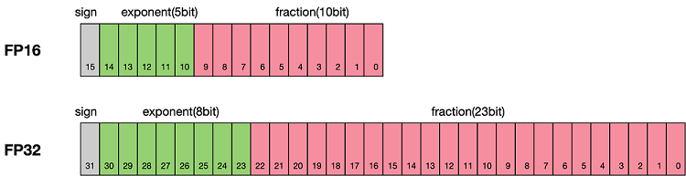
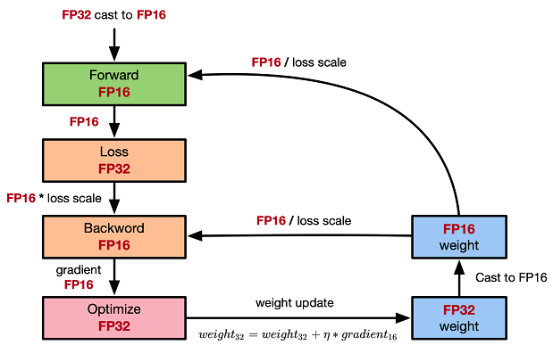
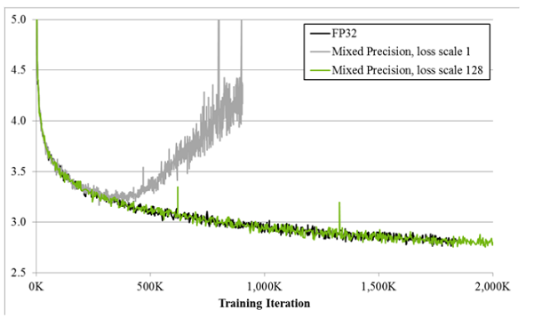
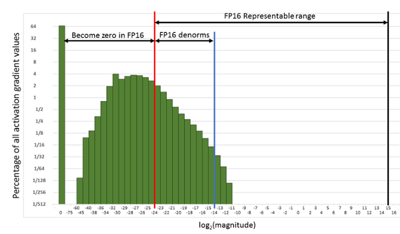

# 混合精度

`Ascend` `GPU` `模型调优`

感谢：[ZOMI酱](https://www.zhihu.com/people/ZOMI)

<a href="https://authoring-modelarts-cnnorth4.huaweicloud.com/console/lab?share-url-b64=aHR0cHM6Ly9vYnMuZHVhbHN0YWNrLmNuLW5vcnRoLTQubXlodWF3ZWljbG91ZC5jb20vbWluZHNwb3JlLXdlYnNpdGUvbm90ZWJvb2svbW9kZWxhcnRzL21pbmRzcG9yZV9taXhlZF9wcmVjaXNpb24uaXB5bmI=&imageid=65f636a0-56cf-49df-b941-7d2a07ba8c8c" target="_blank"></a>&nbsp;&nbsp;
<a href="https://gitee.com/mindspore/docs/blob/r1.7/tutorials/experts/source_zh_cn/others/mixed_precision.md" target="_blank"></a>

## 概述

通常我们训练神经网络模型的时候，默认使用的数据类型为单精度FP32。近年来，为了加快训练时间、减少网络训练时候所占用的内存，并且保存训练出来的模型精度持平的条件下，业界提出越来越多的混合精度训练的方法。这里的混合精度训练是指在训练的过程中，同时使用单精度（FP32）和半精度（FP16）。

## 浮点数据类型

浮点数据类型主要分为双精度（FP64）、单精度（FP32）、半精度（FP16）。在神经网络模型的训练过程中，一般默认采用单精度（FP32）浮点数据类型，来表示网络模型权重和其他参数。在了解混合精度训练之前，这里简单了解浮点数据类型。

根据IEEE二进制浮点数算术标准（IEEE 754）的定义，浮点数据类型分为双精度（FP64）、单精度（FP32）、半精度（FP16）三种，其中每一种都有三个不同的位来表示。FP64表示采用8个字节共64位，来进行的编码存储的一种数据类型；同理，FP32表示采用4个字节共32位来表示；FP16则是采用2字节共16位来表示。如图所示：



从图中可以看出，与FP32相比，FP16的存储空间是FP32的一半，FP32则是FP64的一半。主要分为三个部分：

- 最高位表示符号位sign bit。
- 中间表示指数位exponent bit。
- 低位表示分数位fraction bit。

以FP16为例子，第一位符号位sign表示正负符号，接着5位表示指数exponent，最后10位表示分数fraction。公式为：

$$x=(-1)^{S}\times2^{E-15}\times(1+\frac{fraction}{1024})$$

同理，一个规则化的FP32的真值为：

$$x=(-1)^{S}\times2^{E-127}\times(1.M)$$

一个规格化的FP64的真值为：

$$x=(-1)^{S}\times2^{E-1023}\times(1.M)$$

FP16可以表示的最大值为 0 11110 1111111111，计算方法为：

$$(-1)^0\times2^{30-15}\times1.1111111111 = 1.1111111111(b)\times2^15 = 1.9990234375(d)\times2^15 = 65504$$

FP16可以表示的最小值为 0 00001 0000000000，计算方法为：

$$ (-1)^{1}\times2^{1-15}=2^{-14}=6.104×10^{-5}=-65504$$

因此FP16的最大取值范围是[-65504, 66504]，能表示的精度范围是 $2^{-24}$，超过这个数值的数字会被直接置0。

## 使用FP16训练问题

首先来看看为什么需要混合精度。使用FP16训练神经网络，相对比使用FP32带来的优点有：

- 减少内存占用：FP16的位宽是FP32的一半，因此权重等参数所占用的内存也是原来的一半，节省下来的内存可以放更大的网络模型或者使用更多的数据进行训练。
- 加快通讯效率：针对分布式训练，特别是在大模型训练的过程中，通讯的开销制约了网络模型训练的整体性能，通讯的位宽少了意味着可以提升通讯性能，减少等待时间，加快数据的流通。
- 计算效率更高：在特殊的AI加速芯片如华为昇腾系列的Ascend 910和310系列，或者NVIDIA VOLTA架构的GPU上，使用FP16的执行运算性能比FP32更加快。

但是使用FP16同样会带来一些问题，其中最重要的是精度溢出和舍入误差。

- 数据溢出：数据溢出比较好理解，FP16的有效数据表示范围为 $[6.10\times10^{-5}, 65504]$，FP32的有效数据表示范围为 $[1.4\times10^{-45}, 1.7\times10^{38}]$。可见FP16相比FP32的有效范围要窄很多，使用FP16替换FP32会出现上溢（Overflow）和下溢（Underflow）的情况。而在深度学习中，需要计算网络模型中权重的梯度（一阶导数），因此梯度会比权重值更加小，往往容易出现下溢情况。
- 舍入误差：Rounding Error指示是当网络模型的反向梯度很小，一般FP32能够表示，但是转换到FP16会小于当前区间内的最小间隔，会导致数据溢出。如0.00006666666在FP32中能正常表示，转换到FP16后会表示成为0.000067，不满足FP16最小间隔的数会强制舍入。

## 混合精度计算流程

MindSpore混合精度典型的计算流程如下图所示：



1. 参数以FP32存储；
2. 正向计算过程中，遇到FP16算子，需要把算子输入和参数从FP32 cast成FP16进行计算；
3. 将Loss层设置为FP32进行计算；
4. 反向计算过程中，首先乘以Loss Scale值，避免反向梯度过小而产生下溢；
5. FP16参数参与梯度计算，其结果将被cast回FP32；
6. 除以Loss scale值，还原被放大的梯度；
7. 判断梯度是否存在溢出，如果溢出则跳过更新，否则优化器以FP32对原始参数进行更新。

本文通过自动混合精度和手动混合精度的样例来讲解计算流程。

## MindSpore混合精度

### 自动混合精度

使用自动混合精度，需要调用`Model`接口，将待训练网络和优化器作为输入传进去，该接口会把网络模型的的算子转换成FP16算子。

> 除`BatchNorm`算子和Loss涉及到的算子外因为精度问题，仍然使用FP32执行运算。

使用`Model`接口具体的实现步骤为：

1. 引入MindSpore的模型训练接口`Model`；

2. 定义网络：该步骤和正常的网络定义相同(无需新增任何配置)；

3. 创建数据集：该步骤可参考[数据处理](https://www.mindspore.cn/tutorials/zh-CN/r1.7/advanced/dataset.html)；

4. 使用`Model`接口封装网络模型、优化器和损失函数，设置`amp_level`参数，详情参考[MindSpore API](https://www.mindspore.cn/docs/zh-CN/r1.7/api_python/mindspore.html#mindspore.Model)。该步骤MindSpore会自动选择合适的算子自动进行FP32到FP16的类型转换。

下面是基础的代码样例，首先导入必须的库和声明，并定义LeNet5网络模型。

```python
import numpy as np
import mindspore.nn as nn
from mindspore.nn import Accuracy
from mindspore import context, Model
from mindspore.common.initializer import Normal
from mindspore import dataset as ds

context.set_context(mode=context.GRAPH_MODE)
context.set_context(device_target="CPU")

class LeNet5(nn.Cell):
    """
    Lenet network

    Args:
        num_class (int): Number of classes. Default: 10.
        num_channel (int): Number of channels. Default: 1.

    Returns:
        Tensor, output tensor
    """

    def __init__(self, num_class=10, num_channel=1):
        super(LeNet5, self).__init__()
        self.conv1 = nn.Conv2d(num_channel, 6, 5, pad_mode='valid')
        self.conv2 = nn.Conv2d(6, 16, 5, pad_mode='valid')
        self.fc1 = nn.Dense(16 * 5 * 5, 120, weight_init=Normal(0.02))
        self.fc2 = nn.Dense(120, 84, weight_init=Normal(0.02))
        self.fc3 = nn.Dense(84, num_class, weight_init=Normal(0.02))
        self.relu = nn.ReLU()
        self.max_pool2d = nn.MaxPool2d(kernel_size=2, stride=2)
        self.flatten = nn.Flatten()

    def construct(self, x):
        x = self.max_pool2d(self.relu(self.conv1(x)))
        x = self.max_pool2d(self.relu(self.conv2(x)))
        x = self.flatten(x)
        x = self.relu(self.fc1(x))
        x = self.relu(self.fc2(x))
        x = self.fc3(x)
        return x
```

接着创建一个虚拟的随机数据集，用于样例模型的数据输入。

```Python
# create dataset
def get_data(num, img_size=(1, 32, 32), num_classes=10, is_onehot=True):
    for _ in range(num):
        img = np.random.randn(*img_size)
        target = np.random.randint(0, num_classes)
        target_ret = np.array([target]).astype(np.float32)
        if is_onehot:
            target_onehot = np.zeros(shape=(num_classes,))
            target_onehot[target] = 1
            target_ret = target_onehot.astype(np.float32)
        yield img.astype(np.float32), target_ret

def create_dataset(num_data=1024, batch_size=32, repeat_size=1):
    input_data = ds.GeneratorDataset(list(get_data(num_data)), column_names=['data','label'])
    input_data = input_data.batch(batch_size, drop_remainder=True)
    input_data = input_data.repeat(repeat_size)
    return input_data
```

设置`amp_level`参数，使用`Model`接口封装网络模型、优化器和损失函数。

```Python
ds_train = create_dataset()

# Initialize network
network = LeNet5(10)

# Define Loss and Optimizer
net_loss = nn.SoftmaxCrossEntropyWithLogits(reduction="mean")
net_opt = nn.Momentum(network.trainable_params(),learning_rate=0.01, momentum=0.9)
# Set amp level
model = Model(network, net_loss, net_opt, metrics={"Accuracy": Accuracy()}, amp_level="O2")

# Run training
model.train(epoch=10, train_dataset=ds_train)
```

### 手动混合精度

MindSpore目前还支持手动混合精度（一般不建议使用手动混合精度，除非自定义特殊网络和特性开发）。

假定在网络中只有一个Dense Layer使用FP16计算，其他Layer都用FP32计算。

> 混合精度配置以Cell为单位，Cell默认是FP32类型。

以下是一个手动混合精度的实现步骤：

1. 定义网络：该步骤与自动混合精度中的步骤2类似；

2. 配置混合精度：通过`to_float(mstype.float16)`把Cell中涉及的算子配置成FP16；

3. 使用`TrainOneStepCell`封装网络模型和优化器。

下面是基础的代码样例，首先导入必须的库和声明。

```python
import numpy as np

import mindspore.nn as nn
from mindspore import dtype as mstype
from mindspore import Tensor, context
import mindspore.ops as ops
from mindspore.nn import WithLossCell, TrainOneStepCell
from mindspore.nn import Momentum

context.set_context(mode=context.GRAPH_MODE)
context.set_context(device_target="Ascend")

```

网络定义无论是使用FP32还是FP16都是使用相同的方式，区别在于定义网络后，在初始化网络模型的时候声明dense层使用FP16进行计算，即`net.dense.to_float(mstype.float16)`。

```python
# Define network
class Net(nn.Cell):
    def __init__(self, input_channel, out_channel):
        super(Net, self).__init__()
        self.dense = nn.Dense(input_channel, out_channel)
        self.relu = ops.ReLU()

    def construct(self, x):
        x = self.dense(x)
        x = self.relu(x)
        return x

# Initialize network
net = Net(512, 128)
# Set mixing precision
net.dense.to_float(mstype.float16)

# Define training data, label
predict = Tensor(np.ones([64, 512]).astype(np.float32) * 0.01)
label = Tensor(np.zeros([64, 128]).astype(np.float32))

# Define Loss and Optimizer
loss = nn.SoftmaxCrossEntropyWithLogits()
optimizer = Momentum(params=net.trainable_params(), learning_rate=0.1, momentum=0.9)
net_with_loss = WithLossCell(net, loss)
train_network = TrainOneStepCell(net_with_loss, optimizer)
train_network.set_train()

# Run training
output = train_network(predict, label)
```

> 约束：使用混合精度时，只能由自动微分功能生成反向网络，不能由用户自定义生成反向网络，否则可能会导致MindSpore产生数据格式不匹配的异常信息。

## 损失缩放原理

损失缩放（Loss Scale）技术主要是作用于混合精度训练的过程当中。

在混合精度训练的过程中，会使用FP16类型来替代FP32类型进行数据存储，从而达到减少内存和提高计算速度的效果。但是由于FP16类型要比FP32类型表示的范围小很多，所以当参数（如梯度）在训练过程中变得很小时，就会发生数据下溢的情况。而Loss Scale损失缩放，正是为了解决FP16类型数据下溢问题而提出的。

其主要思想是在计算损失值loss的时候，将loss扩大一定的倍数。由于链式法则的存在，梯度也会相应扩大，然后在优化器更新权重时再缩小相应的倍数，从而避免了数据下溢的情况又不影响计算结果。

MindSpore中提供了两种Loss Scale的方式，分别是`FixedLossScaleManager`和`DynamicLossScaleManager`，需要和Model配合使用。在使用Model构建模型时，可配置混合精度策略`amp_level`和Loss Scale方式`loss_scale_manager`。

首先来看看为什么需要混合精度。使用FP16训练神经网络，相对比使用FP32带来的优点有：

- **减少内存占用**：FP16的位宽是FP32的一半，因此权重等参数所占用的内存也是原来的一半，节省下来的内存可以放更大的网络模型或者使用更多的数据进行训练。
- **加快通讯效率**：针对分布式训练，特别是在大模型训练的过程中，通讯的开销制约了网络模型训练的整体性能，通讯的位宽少了意味着可以提升通讯性能，减少等待时间，加快数据的流通。
- **计算效率更高**：在特殊的AI加速芯片如华为Ascend 910和310系列，或者NVIDIA VOLTA架构的Titan V and Tesla V100的GPU上，使用FP16的执行运算性能比FP32更加快。

但是使用FP16同样会带来一些问题，其中最重要的是精度溢出和舍入误差，Loss Scale就是为了解决精度溢出而提出的。

如图所示，如果仅仅使用FP32训练，模型收敛得比较好，但是如果用了混合精度训练，会存在网络模型无法收敛的情况。原因是梯度的值太小，使用FP16表示会造成了数据下溢出（Underflow）的问题，导致模型不收敛，如图中灰色的部分。于是需要引入损失缩放（Loss Scale）技术。



下面是在网络模型训练阶段， 某一层的激活函数梯度分布式中，其中有68%的网络模型激活参数位0，另外有4%的精度在$2^{-32},2^{-20}$这个区间内，直接使用FP16对这里面的数据进行表示，会截断下溢的数据，所有的梯度值都会变为0。


为了解决梯度过小数据下溢的问题，对前向计算出来的Loss值进行放大操作，也就是把FP32的参数乘以某一个因子系数后，把可能溢出的小数位数据往前移，平移到FP16能表示的数据范围内。根据链式求导法则，放大Loss后会作用在反向传播的每一层梯度，这样比在每一层梯度上进行放大更加高效。



损失放大是需要结合混合精度实现的，其主要的主要思路是：

- **Scale up阶段**：网络模型前向计算后在反响传播前，将得到的损失变化值DLoss增大$2^K$倍。
- **Scale down阶段**：反向传播后，将权重梯度缩$2^K$倍，恢复FP32值进行存储。

**动态损失缩放（Dynamic Loss Scale）**：上面提到的损失缩放都是使用一个默认值对损失值进行缩放，为了充分利用FP16的动态范围，可以更好地缓解舍入误差，尽量使用比较大的放大倍数。总结动态损失缩放算法，就是每当梯度溢出时候减少损失缩放规模，并且间歇性地尝试增加损失规模，从而实现在不引起溢出的情况下使用最高损失缩放因子，更好地恢复精度。

动态损失缩放的算法如下：

1. 动态损失缩放的算法会从比较高的缩放因子开始（如$2^{24}$），然后开始进行训练，并在迭代中检查数是否会溢出（Infs/Nans）；
2. 如果没有梯度溢出，则不调整缩放因子，继续进行迭代；如果检测到梯度溢出，则缩放因子会减半，重新确认梯度更新情况，直到参数不出现在溢出的范围内；
3. 在训练的后期，loss已经趋近收敛稳定，梯度更新的幅度往往小了，这个时候可以允许更高的损失缩放因子来再次防止数据下溢。
4. 因此，动态损失缩放算法会尝试在每N（N=2000）次迭代将损失缩放增加F倍数，然后执行步骤2检查是否溢出。

## MindSpore中使用损失缩放

下面将会分别介绍MindSpore中，使用损失缩放算法的主要两个API [FixedLossScaleManager](https://www.mindspore.cn/docs/zh-CN/r1.7/api_python/mindspore/mindspore.FixedLossScaleManager.html)和[DynamicLossScaleManager](https://www.mindspore.cn/docs/zh-CN/r1.7/api_python/mindspore/mindspore.DynamicLossScaleManager.html)。

### FixedLossScaleManager

`FixedLossScaleManager`在进行缩放的时候，不会改变scale的大小，scale的值由入参loss_scale控制，可以由用户指定，不指定则取默认值。

`FixedLossScaleManager`的另一个参数是`drop_overflow_update`，用来控制发生溢出时是否更新参数。

一般情况下LossScale功能不需要和优化器配合使用，但使用`FixedLossScaleManager`时，如果`drop_overflow_update`为False，那么优化器需设置`loss_scale`的值，且`loss_scale`的值要与`FixedLossScaleManager`的相同。

`FixedLossScaleManager`具体用法如下：

1. import必要的库，并声明使用图模式下执行。

    ```python
    import numpy as np
    import mindspore
    import mindspore.nn as nn
    from mindspore.nn import Accuracy
    from mindspore import context, Model, FixedLossScaleManager, DynamicLossScaleManager, Tensor
    from mindspore.train.callback import LossMonitor
    from mindspore.common.initializer import Normal
    from mindspore import dataset as ds

    mindspore.set_seed(0)
    context.set_context(mode=context.GRAPH_MODE)
    ```

2. 定义LeNet5网络模型，任何网络模型都可以使用Loss Scale机制。

    ```python
    class LeNet5(nn.Cell):
        """
        Lenet network

        Args:
            num_class (int): Number of classes. Default: 10.
            num_channel (int): Number of channels. Default: 1.

        Returns:
            Tensor, output tensor


        """
        def __init__(self, num_class=10, num_channel=1):
            super(LeNet5, self).__init__()
            self.conv1 = nn.Conv2d(num_channel, 6, 5, pad_mode='valid')
            self.conv2 = nn.Conv2d(6, 16, 5, pad_mode='valid')
            self.fc1 = nn.Dense(16 * 5 * 5, 120, weight_init=Normal(0.02))
            self.fc2 = nn.Dense(120, 84, weight_init=Normal(0.02))
            self.fc3 = nn.Dense(84, num_class, weight_init=Normal(0.02))
            self.relu = nn.ReLU()
            self.max_pool2d = nn.MaxPool2d(kernel_size=2, stride=2)
            self.flatten = nn.Flatten()

        def construct(self, x):
            x = self.max_pool2d(self.relu(self.conv1(x)))
            x = self.max_pool2d(self.relu(self.conv2(x)))
            x = self.flatten(x)
            x = self.relu(self.fc1(x))
            x = self.relu(self.fc2(x))
            x = self.fc3(x)
            return x
    ```

3. 定义数据集和训练流程中常用的接口。

    ```python
    # create dataset
    def get_data(num, img_size=(1, 32, 32), num_classes=10, is_onehot=True):
        for _ in range(num):
            img = np.random.randn(*img_size)
            target = np.random.randint(0, num_classes)
            target_ret = np.array([target]).astype(np.float32)
            if is_onehot:
                target_onehot = np.zeros(shape=(num_classes,))
                target_onehot[target] = 1
                target_ret = target_onehot.astype(np.float32)
            yield img.astype(np.float32), target_ret

    def create_dataset(num_data=1024, batch_size=32, repeat_size=1):
        input_data = ds.GeneratorDataset(list(get_data(num_data)), column_names=['data', 'label'])
        input_data = input_data.batch(batch_size, drop_remainder=True)
        input_data = input_data.repeat(repeat_size)
        return input_data

    ds_train = create_dataset()

    # Initialize network
    network = LeNet5(10)

    # Define Loss and Optimizer
    net_loss = nn.SoftmaxCrossEntropyWithLogits(reduction="mean")
    ```

4. 真正使用Loss Scale的API接口，作用于优化器和模型中。

    ```python
    # Define Loss Scale, optimizer and model
    #1) Drop the parameter update if there is an overflow
    loss_scale_manager = FixedLossScaleManager()
    net_opt = nn.Momentum(network.trainable_params(), learning_rate=0.01, momentum=0.9)
    model = Model(network, net_loss, net_opt, metrics={"Accuracy": Accuracy()}, amp_level="O0", loss_scale_manager=loss_scale_manager)

    #2) Execute parameter update even if overflow occurs
    loss_scale = 1024.0
    loss_scale_manager = FixedLossScaleManager(loss_scale, False)
    net_opt = nn.Momentum(network.trainable_params(), learning_rate=0.01, momentum=0.9, loss_scale=loss_scale)
    model = Model(network, net_loss, net_opt, metrics={"Accuracy": Accuracy()}, amp_level="O0", loss_scale_manager=loss_scale_manager)

    # Run training
    model.train(epoch=10, train_dataset=ds_train, callbacks=[LossMonitor()])
    ```

    运行结果如下：

    ```
    epoch: 1 step: 32, loss is 2.3018966
    epoch: 2 step: 32, loss is 2.2965345
    epoch: 3 step: 32, loss is 2.3021417
    epoch: 4 step: 32, loss is 2.2995133
    epoch: 5 step: 32, loss is 2.3040886
    epoch: 6 step: 32, loss is 2.3131478
    epoch: 7 step: 32, loss is 2.2919555
    epoch: 8 step: 32, loss is 2.311748
    epoch: 9 step: 32, loss is 2.304955
    epoch: 10 step: 32, loss is 2.2682834
    ```

### LossScale与优化器

前面提到了使用`FixedLossScaleManager`且`drop_overflow_update`为False时，优化器需要配合使用。

这是由于采用此方式进行配置时，梯度与`loss_scale`系数之间的除法运算在优化器中进行。优化器设置与`FixedLossScaleManager`相同的`loss_scale`，训练结果才是正确的。

> 后续MindSpore会优化不同场景下溢出检测功能的用法，并逐步移除优化器中的`loss_scale`参数，到时便无需配置优化器的`loss_scale`参数。

需要注意的是，当前MindSpore提供的部分优化器如`AdamWeightDecay`，未提供`loss_scale`参数。如果使用`FixedLossScaleManager`，且`drop_overflow_update`配置为False，优化器中未能进行梯度与`loss_scale`之间的除法运算，此时需要自定义`TrainOneStepCell`，并在其中对梯度除`loss_scale`，以使最终的计算结果正确，定义方式如下：

```python
import mindspore
from mindspore import nn, ops, Tensor

grad_scale = ops.MultitypeFuncGraph("grad_scale")

@grad_scale.register("Tensor", "Tensor")
def gradient_scale(scale, grad):
    return grad * ops.cast(scale, ops.dtype(grad))

class CustomTrainOneStepCell(nn.TrainOneStepCell):
    def __init__(self, network, optimizer, sens=1.0):
        super(CustomTrainOneStepCell, self).__init__(network, optimizer, sens)
        self.hyper_map = ops.HyperMap()
        self.reciprocal_sense = Tensor(1 / sens, mindspore.float32)

    def scale_grad(self, gradients):
        gradients = self.hyper_map(ops.partial(grad_scale, self.reciprocal_sense), gradients)
        return gradients

    def construct(self, *inputs):
        loss = self.network(*inputs)
        sens = ops.fill(loss.dtype, loss.shape, self.sens)
        # calculate gradients, the sens will equal to the loss_scale
        grads = self.grad(self.network, self.weights)(*inputs, sens)
        # gradients / loss_scale
        grads = self.scale_grad(grads)
        # reduce gradients in distributed scenarios
        grads = self.grad_reducer(grads)
        loss = ops.depend(loss, self.optimizer(grads))
        return loss
```

- network：参与训练的网络，该网络包含前向网络和损失函数的计算逻辑，输入数据和标签，输出损失函数值。
- optimizer：所使用的优化器。
- sens：参数用于接收用户指定的`loss_scale`，训练过程中梯度值会放大`loss_scale`倍。
- scale_grad函数：用于梯度与`loss_scale`系数之间的除法运算，还原梯度。
- construct函数：参照`nn.TrainOneStepCell`定义`construct`的计算逻辑，并在获取梯度后调用`scale_grad`。

自定义`TrainOneStepCell`后，需要手动构建训练网络，如下:

```python
from mindspore import nn, FixedLossScaleManager

network = LeNet5(10)

# Define Loss and Optimizer
net_loss = nn.SoftmaxCrossEntropyWithLogits(reduction="mean")
net_opt = nn.AdamWeightDecay(network.trainable_params(), learning_rate=0.01)

# Define LossScaleManager
loss_scale = 1024.0
loss_scale_manager = FixedLossScaleManager(loss_scale, False)

# Build train network
net_with_loss = nn.WithLossCell(network, net_loss)
net_with_train = CustomTrainOneStepCell(net_with_loss, net_opt, loss_scale)
```

构建训练网络后可以直接运行或通过Model运行：

```python
epochs = 2

#1) Execute net_with_train
ds_train = create_dataset()

for epoch in range(epochs):
    for d in ds_train.create_dict_iterator():
        result = net_with_train(d["data"], d["label"])

#2) Define Model and run
model = Model(net_with_train)

ds_train = create_dataset()

model.train(epoch=epochs, train_dataset=ds_train)
```

在此场景下使用`Model`进行训练时，`loss_scale_manager`和`amp_level`无需配置，因为`CustomTrainOneStepCell`中已经包含了混合精度的计算逻辑。

### DynamicLossScaleManager

`DynamicLossScaleManager`在训练过程中可以动态改变scale的大小，在没有发生溢出的情况下，要尽可能保持较大的scale。

`DynamicLossScaleManager`会首先将scale设置为一个初始值，该值由入参init_loss_scale控制。

在训练过程中，如果不发生溢出，在更新scale_window次参数后，会尝试扩大scale的值，如果发生了溢出，则跳过参数更新，并缩小scale的值，入参scale_factor是控制扩大或缩小的步数，scale_window控制没有发生溢出时，最大的连续更新步数。

具体用法如下，仅需将`FixedLossScaleManager`样例中定义LossScale，优化器和模型部分的代码改成如下代码：

```python
# Define Loss Scale, optimizer and model
scale_factor = 4
scale_window = 3000
loss_scale_manager = DynamicLossScaleManager(scale_factor, scale_window)
net_opt = nn.Momentum(network.trainable_params(), learning_rate=0.01, momentum=0.9)
model = Model(network, net_loss, net_opt, metrics={"Accuracy": Accuracy()}, amp_level="O0", loss_scale_manager=loss_scale_manager)
```

> 图片引用自[automatic-mixed-precision](https://developer.nvidia.com/automatic-mixed-precision)
