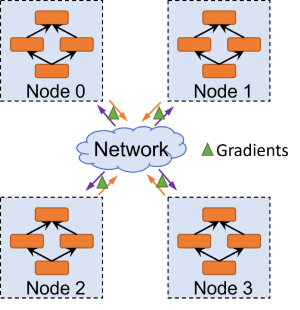

# 分布式训练通信融合

`Ascend` `GPU` `分布式并行`

<a href="https://gitee.com/mindspore/docs/blob/master/docs/mindspore/programming_guide/source_zh_cn/distributed_training_comm_fusion.md" target="_blank"></a>

## 概述

在分布式并行训练场景下训练大规模参数量的模型（如GPT-3, Pangu-$\alpha$），跨设备甚至跨节点的数据传输是制约扩展性以及算力利用率的瓶颈[1]。通信融合是一种提升网络资源利用率、加速数据传输效率的重要方法，其将相同源节点和目的节点的通信算子打包同时执行，以避免多个单算子执行带来的额外开销。

MindSpore支持对分布式训练中三种常用通信算子（`AllReduce`, `AllGather`, `ReduceScatter`）的融合，并提供简洁易用的接口方便用户自行配置。在长稳训练任务支撑中，通信融合特性发挥了重要作用。

## 基本原理

本节首先以数据并行为例，介绍分布式训练中计算和通信之间的关系，其次介绍通信融合在分布式训练场景下的必要性。

### 分布式训练中的计算和通信

分布式训练的整个过程可以粗略地分为本地模型计算和跨设备的网络数据交互两个过程，下面以数据并行[2]为例来介绍整体训练流程，其它并行方式，如模型并行[3]，流水线并行[4]等，请读者参考相关论文。

如下图所示，每个节点备份完整的神经网络模型，并利用本地的数据集分区训练一个mini-batch，进行前向和反向计算，反向计算得到的梯度跨节点进行同步，同步后继续下一个mini-batch的训练，如此循环迭代，直到accuracy/loss达到阈值，或者训练完一定数目的epoch。由此可见，在分布式训练过程中，计算和通信交替进行，目前已有工作研究如何将相互不依赖的计算和传输做流水化，以降低跨节点数据同步在整体训练时长中的占比[5-6]，这里不再赘述。



### 通信融合的必要性

网络通信的时间开销可以用以下公式衡量，其中，$m$是传输数据的大小，$\alpha$是网络传输速率，$\beta$是网络启动的固有开销。可见，当传输的message数变多，网络启动的固有开销占比会上升，并且传输小message，并不能有效利用网络带宽资源。即便是HPC领域的通信原语，如`AllReduce`, `AllGather`等，也遵循该原则。因此，通信融合技术能够有效提升网络资源利用率，降低网络同步时延。

$$t = \alpha m+\beta$$

### 通信融合的实现

当前支持对`AllReduce`, `AllGather`和`ReduceScatter`三种通信算子分别进行融合，配置项为一个dict类型，如：

comm_fusion={"allreduce": {"mode": "auto", "config": None}}。其中，"mode"有三种选项：

"auto"：自动按照数据量阈值64MB进行算子融合，配置参数"config"为None。

"size"：按照手动设置数据量阈值的方式进行通信算子融合，配置参数"config"类型为int，单位MB。

"index"：仅"allreduce"支持配置index，表示按照通信算子序列号进行融合的方式，配置参数"config"类型为list。例如：[20, 35]，表示将前20个AllReduce融合成1个，第20～35个AllReduce融合成1个，剩下的AllReduce融合成1个。

### 通信融合的使用方法

MindSpore提供两种接口来使能通信融合，下面分别进行介绍。

#### 自动并行场景下的配置

在自动并行或半自动并行场景下，用户在通过`context.set_auto_parallel_context`来配置并行策略时，可以利用该接口提供的`comm_fusion`参数来设置并行策略，用户可以指定用index方法还是fusion buffer的方法。具体参数说明请参照 [分布式并行接口说明](auto_parallel.md)。

#### 利用`Cell`提供的接口

无论在哪种并行模式场景下，用户都可以通过`Cell.set_comm_fusion`接口为模型某layer的参数设置index，MindSpore将融合相同index的参数。在自动并行和半自动并行场景下，推荐优先使用`comm_fusion`参数进行配置。

## 操作实践

### 样例代码说明

>你可以在这里下载完整的样例代码：
>
><https://gitee.com/mindspore/docs/tree/master/docs/sample_code/distributed_comm_fusion>。

目录结构如下：

```text
└─sample_code
    ├─distributed_comm_fusion
        ├── fusion_example_cell.py
        ├── rank_table_2pcs.json
        ├── rank_table_8pcs.json
        └── run_fusion_example.sh
```

其中每个文件的作用如下：

- fusion_example_cell.py：利用`Cell`提供的接口进行通信融合的示例。
- rank_table_2pcs.json：RANK_TABLE_FILE的2卡配置文件。
- rank_table_8pcs.json：RANK_TABLE_FILE的8卡配置文件。
- run_fusion_example.sh：通信融合的启动脚本。

### 配置通信融合

下面通过实际样例，介绍两种使用方法如何进行配置。

#### `comm_fusion`参数

如下述代码所示，使用`context.set_auto_parallel_context`接口的`comm_fusion`参数，为`AllReduce`算子配置融合模式为`auto`，意味着默认设置fusion buffer的大小为64MB。

```python
from mindspore.communication import init
from mindspore import nn
from mindspore import context, ParallelMode
context.set_auto_parallel_context(parallel_mode=ParallelMode.SEMI_AUTO_PARALLEL)
context.set_auto_parallel_context(comm_fusion={"allreduce": {"mode": "auto", "config": None}})
init()
```

若将所有的同类通信算子融合成一个算子，在当前训练迭代中，传输需要等待计算完全结束后才能执行，这样会造成设备的等待。

为了避免上述问题，可以将网络参数进行分组融合：在下一组参数进行的计算的同时，进行上组参数的通信，使得计算和通信能够互相隐藏，可以通过限定fusion buffer的大小，或者index分区的方法进行分组融合。

更多使用方法，可以参考MindSpore的[测试用例](https://gitee.com/mindspore/mindspore/blob/master/tests/ut/python/parallel/test_comm_fusion.py)。

>用户可以自行尝试`comm_fusion`的size和index模式，本质上都是fusion buffer类的方法。

#### `Cell.set_comm_fusion`接口

如下述代码所示，针对实例化后的DenseLayer，调用`set_comm_fusion`方法，为每一层设置fusion值。

```python
"""Cell Fusion Example"""
import os
from mindspore.communication import init
from mindspore import nn
from mindspore import context, ParallelMode
context.set_context(mode=context.GRAPH_MODE, device_target="Ascend", device_id=int(os.environ["DEVICE_ID"]))
context.set_auto_parallel_context(parallel_mode=ParallelMode.SEMI_AUTO_PARALLEL)
init()

class DenseLayer(nn.Cell):
    """A base layer with two dense layer"""
    def __init__(self):
        super().__init__()
        self.input_mapping = nn.Dense(10, 10)
        self.output_mapping = nn.Dense(10, 10)
    def construct(self, x):
        x = self.input_mapping(x)
        return self.output_mapping(x)

class Net(nn.Cell):
    """An network with many dense layers"""
    def __init__(self):
        super().__init__()
        self.layer1 = DenseLayer()
        self.layer2 = DenseLayer()
        self.layer3 = DenseLayer()
        self.layer1.set_comm_fusion(0)
        self.layer2.set_comm_fusion(1)
        self.layer3.set_comm_fusion(2)
    def construct(self, x):
        x = self.layer1(x)
        x = self.layer2(x)
        x = self.layer3(x)
        return x

net = Net()
for item in net.trainable_params():
    print(f"The parameter {item.name}'s fusion id is {item.comm_fusion}")
```

对应的输出如下，表示了每层特定dense的fusion index值：

```text
The parameter layer1.input_mapping.weight's fusion id is 0
The parameter layer1.input_mapping.bias's fusion id is 0
The parameter layer1.output_mapping.weight's fusion id is 0
The parameter layer1.output_mapping.bias's fusion id is 0
The parameter layer2.input_mapping.weight's fusion id is 1
The parameter layer2.input_mapping.bias's fusion id is 1
The parameter layer2.output_mapping.weight's fusion id is 1
The parameter layer2.output_mapping.bias's fusion id is 1
The parameter layer3.input_mapping.weight's fusion id is 2
The parameter layer3.input_mapping.bias's fusion id is 2
The parameter layer3.output_mapping.weight's fusion id is 2
The parameter layer3.output_mapping.bias's fusion id is 2
```

### 运行代码

上述代码需要在配置分布式变量后才可以运行。Ascend环境需要配置RANK_TABLE_FILE、RANK_ID和DEVICE_ID。配置的过程请参考[此处](https://www.mindspore.cn/docs/programming_guide/zh-CN/master/distributed_training_ascend.html#配置分布式环境变量)，GPU环境需要配置[OpenMPI](https://www.mindspore.cn/docs/programming_guide/zh-CN/master/distributed_training_gpu.html#配置分布式环境)、NCCL和[HOST_FILE](https://www.mindspore.cn/docs/programming_guide/zh-CN/master/distributed_training_gpu.html#多机多卡训练)，配置的过程请参考[此处](https://www.mindspore.cn/docs/programming_guide/zh-CN/master/distributed_training_gpu.html#配置分布式环境)。

Ascend分布式相关的环境变量有:

- RANK_TABLE_FILE：组网信息文件的路径。rank_table_file文件可以使用models代码仓中的hccl_tools.py生成，可以从[此处](https://gitee.com/mindspore/models/tree/master/utils/hccl_tools)获取。
- DEVICE_ID：当前卡在机器上的实际序号。
- RANK_ID：当前卡的逻辑序号。

GPU分布式相关的环境变量：

- HOST_FILE: 描述多卡训练时的设备IP和个数。文件每一行格式为[hostname] slots=[slotnum]，hostname可以是ip或者主机名。需要注意的是，不同机器上的用户名需要相同，但是hostname不可以相同。

用户可以通过[此处](https://gitee.com/mindspore/docs/tree/master/docs/sample_code/distributed_optimizer_parallel)获取上述的此文档中的脚本。执行下述的`bash`脚本即可运行程序，输出日志在device0/train.log0文件。

```bash
#!/bin/bash
set -e
echo "=============================================================================================================="
echo "Please run the script as: "
echo "bash run_fusion_example.sh DATA_PATH RANK_SIZE"
echo "For example: bash run_fusion_example.sh 8"
echo "It is better to use the absolute path."
echo "This example is expected to run on the Ascend environment."
echo "=============================================================================================================="
RANK_SIZE=$1

EXEC_PATH=$(pwd)

test_dist_8pcs()
{
    export RANK_TABLE_FILE=${EXEC_PATH}/rank_table_8pcs.json
    export RANK_SIZE=8
}

test_dist_2pcs()
{
    export RANK_TABLE_FILE=${EXEC_PATH}/rank_table_2pcs.json
    export RANK_SIZE=2
}

test_dist_${RANK_SIZE}pcs

for((i=0;i<${RANK_SIZE};i++))
do
    rm -rf device$i
    mkdir device$i
    cp ./fusion_example_cell.py ./device$i
    cd ./device$i
    export DEVICE_ID=$i
    export RANK_ID=$i
    echo "start training for device $i"
    env > env$i.log
    pytest -s -v ./fusion_example_cell.py > train.log$i 2>&1 &
    cd ../
done
echo "The program launch succeed, the log is under device0/train.log0."
```

在当前目录下配置完RANK_TABLE_FILE之后，下述的命令要求用户拥有8张Ascend 910设备。运行命令如下：

```bash
bash run_fusion_example.sh 8
```

## 参考文献

[1] Xu Y, Lee H J, Chen D, et al. GSPMD: general and scalable parallelization for ML computation graphs[J]. arXiv preprint arXiv:2105.04663, 2021.

[2] Li M, Zhou L, Yang Z, et al. Parameter server for distributed machine learning[C]//Big learning NIPS workshop. 2013, 6: 2.

[3] Dean J, Corrado G, Monga R, et al. Large scale distributed deep networks[J]. Advances in neural information processing systems, 2012, 25.

[4] Narayanan D, Harlap A, Phanishayee A, et al. PipeDream: generalized pipeline parallelism for DNN training[C]//Proceedings of the 27th ACM Symposium on Operating Systems Principles. 2019: 1-15.

[5] Zhang H, Zheng Z, Xu S, et al. Poseidon: An efficient communication architecture for distributed deep learning on {GPU} clusters[C]//2017 USENIX Annual Technical Conference (USENIX ATC 17). 2017: 181-193.

[6] Peng Y, Zhu Y, Chen Y, et al. A generic communication scheduler for distributed dnn training acceleration[C]//Proceedings of the 27th ACM Symposium on Operating Systems Principles. 2019: 16-29.