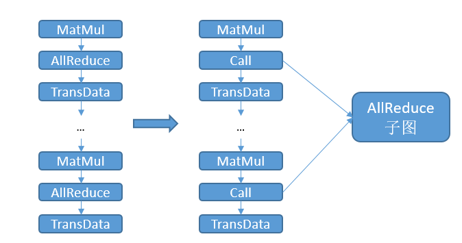

# 通信子图提取与复用

<a href="https://gitee.com/mindspore/docs/blob/master/tutorials/experts/source_zh_cn/parallel/comm_subgraph.md" target="_blank"></a>

## 概述

为了提升模型精度，不断扩大模型规模是一个常见的手段，当前参数量过亿的大模型已不少见。但随着盘古等大模型规模的增加，分布式训练时所需要的通信算子数量也大幅上涨，一方面会增加模型编译的通信耗时；另一方面会消耗大量的流资源，当所需的流数量超过硬件限制，模型规模就无法继续扩大，从而成为大模型发展的一个瓶颈。

通过对通信算子进行归类提取通信子图，减少图编译中的通信算子数量，一方面可以减少通信耗时，减少模型编译耗时；另一方面减少了流的占用，使得模型可以进一步扩展：比如pipeline并行模式下micro size可以进一步增大。

本特性目前只支持Ascend后端图模式，涉及场景为分布式训练，当计算图中存在大量通信算子时，用户可以使用本特性提升图编译性能，减少图编译耗时。

## 基本原理

在开启本特性后，MindSpore框架将执行以下步骤：

1. 检查是否为图模式以及是否开启本特性，否则不进入本特性的优化步骤；

2. 找出计算图中所有可复用的通信算子；

3. 把同类型、同shape、同dtype、同group的通信算子分在同一个组中，如果组中的通信算子数量超过一条流上所能承载的通信算子上限，则按该组的算子类型、shape、dtype创建通信算子子图。

4. 把原计算图中的通信算子替换成Call节点，调用对应的通信子图。



由于通信子图中的通信算子只占据一条通信流，将原计算图中的通信算子替换成对通信子图的调用后，实际使用的通信流数量将下降为1。比如有30个可以分在同一组的AllReduce算子，每条通信流上至多可以承载3个通信算子，则在开启本特性前，需要10条通信流。开启本特性后，AllReduce子图只占据1条通信流，这样就节省了9条通信流。同时，由于编译阶段处理的通信算子数量减少，图编译用于通信的耗时也将减少。

## 使用方法

用户可以通过环境变量MS_COMM_COMPILER_OPT打开特性开关，并配置可以复用的通信算子的上限。MS_COMM_COMPILER_OPT可以设置为-1或者一个正整数，表示开启本特性，不设置该环境变量或设置为其他值则不会开启本特性，详情请参考下表。开启本特性后，INFO日志会打印"MAX_COMM_OP_REUSE_NUM: xxx"，提示框架正在使用的可以复用的通信算子的上限。
|MS_COMM_COMPILER_OPT|说明|
|----|----|
|-1|开启本特性，使用框架默认的通信算子复用上限：1000|
|正整数|开启本特性，使用用户设置的正整数作为通信算子复用上限|
|不设置/其他|不开启本特性|

由于根图多次调用通信子图会产生大量的label，当用户设置的MS_COMM_COMPILER_OPT值过大，超过硬件的label数量限制，会引发框架报错。用户可以搜索以下日志，适当减小MS_COMM_COMPILER_OPT的值：

```shell
Label list size:  # 表示图编译使用的总label数量
Reuse comm op reused_comm_sub_graphs_ size:  # 表示最终进行复用的通信算子数量
Start reuse # 该日志条数表示生成的通信子图的数量
```
