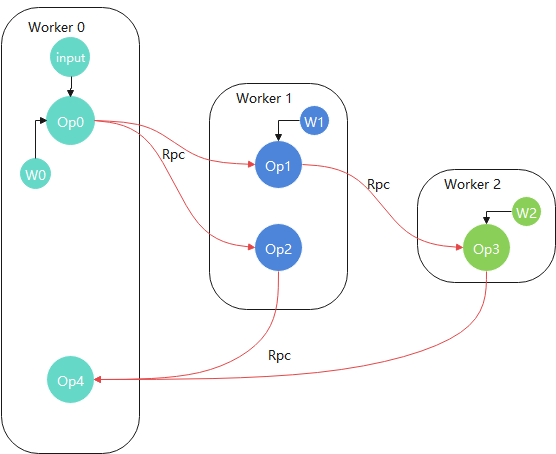

# 分布式图切分

<a href="https://gitee.com/mindspore/docs/blob/master/tutorials/experts/source_zh_cn/parallel/distributed_graph_partition.md" target="_blank"></a>

## 概述

在大模型训练任务中，用户往往使用各类并行算法将计算任务分配到各个节点，以充分利用计算资源，例如通过MindSpore的`算子级并行`，`流水线并行`等特性。但是在某些场景下，用户需要根据自定义算法将图切分为多个子图，分发到不同进程分布式执行。MindSpore的`分布式图切分`特性从这一需求出发，提供了算子粒度的Python层API，让用户能自由进行图切分和构建分布式训练/推理等任务。

## 基本原理

分布式任务需要在一个集群中执行，MindSpore为了在分布式图切分场景中拥有更好的可扩展性和可靠性，复用了MindSpore内置的`动态组网`模块，此模块在[不依赖OpenMPI进行训练](https://www.mindspore.cn/tutorials/experts/zh-CN/master/parallel/train_gpu.html#不依赖openmpi进行训练)和[Parameter Server模式](https://www.mindspore.cn/tutorials/experts/zh-CN/master/parallel/parameter_server_training.html)章节也有使用。

对于`分布式图切分`来说，每一个进程都代表一个计算节点(称之为`Worker`)，通过上述的`动态组网`模块，启动的调度节点(称之为`Scheduler`)可以让发现各个计算节点，进而组成一个计算集群。
在`动态组网`后，MindSpore会根据用户启动配置，为每个进程分配`role`和`rank`，即每个进程的`角色`和`id`，两者组成了每个进程的唯一`标签`，并且是Python层API`place`的入参。有了这层对应关系，用户可以通过调用`place`接口，对任意算子设置进程标签，MindSpore图编译模块处理后，将计算图切分成多个子图分发到不同进程上执行。`place`具体用法可参考[Primitive.place](https://www.mindspore.cn/docs/zh-CN/master/api_python/ops/mindspore.ops.Primitive.html#mindspore.ops.Primitive.place)以及[Cell.place](https://www.mindspore.cn/docs/zh-CN/master/api_python/nn/mindspore.nn.Cell.html#mindspore.nn.Cell.place)接口文档。
举例来说，经过分布式图切分后的计算拓扑图可能如下：



如上图所示，每个`Worker`上都有一部分用户已经切分的子图，拥有各自的权重和输入，各`Worker`间通过内置`Rpc通信算子`进行数据交互。

为了保证易用性和用户友好，MindSpore还支持用户只要对一份脚本作少许修改，即可启动动态组网和分布式训练(无需区分`Worker`还是`Scheduler`)。详见以下操作实践章节。

## 操作实践

以LeNet基于MNIST数据集在GPU上训练为例，将训练任务中图的不同部分拆分到不同计算节点上执行。你可以在这里下载到完整代码：<https://gitee.com/mindspore/docs/tree/master/docs/sample_code/distributed_graph_partition>。

目录结构如下：

```text
distributed_graph_partition/
├── lenet.py
├── run.sh
└── train.py
```

> 此教程不涉及跨物理节点启动，所有进程都在同一节点。对MindSpore来说，节点内和跨节点分布式图切分的实现是没有区别的：通过动态组网，图切分，图编译流程后，通过Rpc通信算子进行数据交互。

### 训练Python脚本准备

参考<https://gitee.com/mindspore/models/tree/master/official/cv/lenet>，使用[MNIST数据集](http://yann.lecun.com/exdb/mnist/)，了解如何训练一个LeNet网络。下面按照步骤给出训练脚本各部分代码示例。

#### 数据集加载

```python
import mindspore.dataset as ds
import mindspore.dataset.transforms as C
import mindspore.dataset.vision as CV
from mindspore.common import dtype as mstype
from mindspore.dataset.vision import Inter

def create_dataset(data_path, batch_size=32, repeat_size=1
                   num_parallel_workers=1):
    """
    create dataset for train or test
    """
    # define dataset
    mnist_ds = ds.MnistDataset(data_path)

    resize_height, resize_width = 32, 32
    rescale = 1.0 / 255.0
    shift = 0.0
    rescale_nml = 1 / 0.3081
    shift_nml = -1 * 0.1307 / 0.3081

    # define map operations
    resize_op = CV.Resize((resize_height, resize_width), interpolation=Inter.LINEAR)  # Bilinear mode
    rescale_nml_op = CV.Rescale(rescale_nml, shift_nml)
    rescale_op = CV.Rescale(rescale, shift)
    hwc2chw_op = CV.HWC2CHW()
    type_cast_op = C.TypeCast(mstype.int32)

    # apply map operations on images
    mnist_ds = mnist_ds.map(operations=type_cast_op, input_columns="label", num_parallel_workers=num_parallel_workers)
    mnist_ds = mnist_ds.map(operations=resize_op, input_columns="image", num_parallel_workers=num_parallel_workers)
    mnist_ds = mnist_ds.map(operations=rescale_op, input_columns="image", num_parallel_workers=num_parallel_workers)
    mnist_ds = mnist_ds.map(operations=rescale_nml_op, input_columns="image", num_parallel_workers=num_parallel_workers)
    mnist_ds = mnist_ds.map(operations=hwc2chw_op, input_columns="image", num_parallel_workers=num_parallel_workers)

    # apply DatasetOps
    buffer_size = 10000
    mnist_ds = mnist_ds.shuffle(buffer_size=buffer_size)
    mnist_ds = mnist_ds.batch(batch_size, drop_remainder=True)
    mnist_ds = mnist_ds.repeat(repeat_size)
    return mnist_ds
```

以上代码创建MNIST数据集。

#### 构建LeNet网络

为了对一个单机单卡任务进行切图，我们需要先构造一个单机单卡副本：

```python
import mindspore.nn as nn
from mindspore.common.initializer import TruncatedNormal

def conv(in_channels, out_channels, kernel_size, stride=1, padding=0):
    """weight initial for conv layer"""
    weight = weight_variable()
    return nn.Conv2d(in_channels, out_channels,
                     kernel_size=kernel_size, stride=stride, padding=padding,
                     weight_init=weight, has_bias=False, pad_mode="valid")
def fc_with_initialize(input_channels, out_channels):
    """weight initial for fc layer"""
    weight = weight_variable()
    bias = weight_variable()
    return nn.Dense(input_channels, out_channels, weight, bias)
def weight_variable():
    """weight initial"""
    return TruncatedNormal(0.02)

class LeNet(nn.Cell):
    def __init__(self, num_class=10, channel=1):
        super(LeNet, self).__init__()
        self.num_class = num_class
        self.conv1 = conv(channel, 6, 5)
        self.conv2 = conv(6, 16, 5)
        self.fc1 = fc_with_initialize(16 * 5 * 5, 120)
        self.fc2 = fc_with_initialize(120, 84)
        self.fc3 = fc_with_initialize(84, self.num_class)
        self.relu = nn.ReLU()
        self.max_pool2d = nn.MaxPool2d(kernel_size=2, stride=2)
        self.flatten = nn.Flatten()

    def construct(self, x):
        x = self.conv1(x)
        x = self.relu(x)
        x = self.max_pool2d(x)
        x = self.conv2(x)
        x = self.relu(x)
        x = self.max_pool2d(x)
        x = self.flatten(x)
        x = self.fc1(x)
        x = self.relu(x)
        x = self.fc2(x)
        x = self.relu(x)
        x = self.fc3(x)
        return x
```

#### 调用接口进行分布式图切分

此次训练任务我们切分`fc1`到`Worker 0`，`fc2`到`Worker 1`，fc2到`Worker 2`，`conv1`到`Worker 3`，conv2到`Worker 4`进程。

在`LeNet.__init__`函数中，添加以下切图语句，即可做到分布式图切分：

```python
class LeNet(nn.Cell):
    def __init__(self, num_class=10, channel=1):
        super(LeNet, self).__init__()
        ...
        self.fc1.place("MS_WORKER", 0)
        self.fc2.place("MS_WORKER", 1)
        self.fc3.place("MS_WORKER", 2)
        self.conv1.place("MS_WORKER", 3)
        self.conv2.place("MS_WORKER", 4)
        ...
    ...
```

`place`接口第一个入参`role`为进程角色，第二个参数为进程`rank`，即代表算子在此类角色的某进程上执行。目前`place`接口只支持`MS_WORKER`角色，代表着上述的`Worker X`进程。

由此可见，用户只需将自定义算法通过一个单机副本描述出来，再通过`place`接口设置算子所在计算节点标签，即可快速实现一个分布式训练任务。此方式的优势在于：

**1.用户无需单独对每个计算节点编写执行脚本，只需一个脚本MindSpore即可执行分布式任务**

**2.提供了更加通用和用户友好的接口，通过`place`接口，用户能直观的描述自己的分布式训练算法**

#### 定义优化器和损失函数

```python
import mindspore.nn as nn

def get_optimizer(net, lr=0.01):
    momentum = 0.9
    mom_optimizer = nn.Momentum(filter(lambda x: x.requires_grad, net.get_parameters()), lr, momentum)
    return mom_optimizer
def get_loss():
    return nn.SoftmaxCrossEntropyWithLogits(sparse=True, reduction='mean')
```

#### 执行训练代码

训练代码入口脚本train.py：

```python
import mindspore.context as context
from mindspore import set_seed
from mindspore.train.metrics import Accuracy
from mindspore.train import Model
from mindspore.train.callback import LossMonitor, TimeMonitor
from mindspore.communication import init, get_rank


context.set_context(mode=context.GRAPH_MODE, device_target='GPU')
init()
net = LeNet()
opt = get_optimizer(net)
criterion = get_loss()
model = Model(net, criterion, opt, metrics={"Accuracy": Accuracy()})

print("================= Start training =================", flush=True)
ds_train = create_dataset(os.path.join(os.getenv("DATA_PATH"), 'train'))
model.train(10, ds_train, callbacks=[LossMonitor(), TimeMonitor()],dataset_sink_mode=False)

print("================= Start testing =================", flush=True)
ds_eval = create_dataset(os.path.join(os.getenv("DATA_PATH"), 'test'))
acc = model.eval(ds_eval, dataset_sink_mode=False)

if get_rank() == 0:
    print("Accuracy is:", acc)
```

以上代码先训练，后推理，其中所有过程都是以分布式的方式执行的。

- 在分布式图切分场景下，用户必须调用`mindspore.communication.init`，此接口是MindSpore的`动态组网`模块入口，用于帮助组建计算集群，通信算子初始化等。若没有调用，则MindSpore会执行单机单卡训练，即`place`接口不会生效。
- 由于某些进程上只有部分子图执行，因此它们的推理精度或者loss并没有意义。用户只需关注`Worker 0`上的精度即可。

### 训练Shell脚本准备

#### 启动Scheduler和Worker进程

由于是在节点内启动多个进程，因此只需要通过一个Shell脚本启动一个`Scheduler`进程和多个`Worker`进程。此动态组网在这两章节也有详细介绍和类似用法：[不依赖OpenMPI进行训练](https://www.mindspore.cn/tutorials/experts/zh-CN/master/parallel/train_gpu.html#不依赖openmpi进行训练)和[Parameter Server模式](https://www.mindspore.cn/tutorials/experts/zh-CN/master/parallel/parameter_server_training.html)，对于脚本中的环境变量含义以及用法，可以参考[Parameter Server模式](https://www.mindspore.cn/tutorials/experts/zh-CN/master/parallel/parameter_server_training.html)章节。

run.sh执行脚本如下：

```bash
execute_path=$(pwd)
self_path=$(dirname $0)

# Set public environment.
export MS_WORKER_NUM=5
export MS_SCHED_HOST=127.0.0.1
export MS_SCHED_PORT=8118
export DATA_PATH=$1

# Launch scheduler.
export MS_ROLE=MS_SCHED
rm -rf ${execute_path}/sched/
mkdir ${execute_path}/sched/
cd ${execute_path}/sched/ || exit
python ${self_path}/../train.py > sched.log 2>&1 &
sched_pid=`echo $!`


# Launch workers.
export MS_ROLE=MS_WORKER
worker_pids=()
for((i=0;i<$MS_WORKER_NUM;i++));
do
  rm -rf ${execute_path}/worker_$i/
  mkdir ${execute_path}/worker_$i/
  cd ${execute_path}/worker_$i/ || exit
  python ${self_path}/../train.py > worker_$i.log 2>&1 &
  worker_pids[${i}]=`echo $!`
done

# Wait for workers to exit.
for((i=0; i<${MS_WORKER_NUM}; i++)); do
  wait ${worker_pids[i]}
  status=`echo $?`
  if [ "${status}" != "0" ]; then
      echo "[ERROR] train failed. Failed to wait worker_{$i}, status: ${status}"
      exit 1
  fi
done

# Wait for scheduler to exit.
if [ "${status}" != "0" ]; then
  wait ${sched_pid}
  status=`echo $?`
  if [ "${status}" != "0" ]; then
    echo "[ERROR] train failed. Failed to wait scheduler, status: ${status}"
    exit 1
  fi
fi

exit 0
```

以上脚本中，`export MS_WORKER_NUM=5`代表此次分布式执行需要启动`5`个`MS_WORKER`进程；`export MS_SCHED_HOST=127.0.0.1`代表`Scheduler`的地址为`127.0.0.1`；`export MS_SCHED_PORT=8118`代表`Scheduler`开放端口为8118，所有进程会向此端口连接进行动态组网。

上述的环境变量对于`Worker`和`Scheduler`进程都要导出，然后分别导出对应角色，启动对应角色的进程：`export MS_ROLE=MS_SCHED`后启动Scheduler进程；`export MS_ROLE=MS_WORKER`后循环启动MS_WORKER_NUM个Worker进程。

> 注意每个进程都为后台执行，因此在脚本最后会有等待进程退出语句。

执行指令

```bash
bash run.sh [MNIST_DATA_PATH]
```

### 查看执行结果

查看精度执行指令：

```bash
grep -rn "Accuracy" */*.log
```

结果：

```text
Accuracy is: {'Accuracy': 0.9888822115384616}
```

说明分布式图切分对LeNet训练和推理结果没有影响。

## 总结

MindSpore分布式图切分特性提供给用户算子粒度的`place`接口，支持用户根据自定义算法对计算图进行切分，通过动态组网，执行各类场景下的分布式训练等任务。
用户只需要对单机单卡副本作出以下几点修改，即可启动任务：

- 在单机单卡副本最前面调用`mindspore.communication.init`接口，启动动态组网。
- 根据用户算法，对图中算子或者layer调用`nn.Cell`或者`ops.Primitive`的`place`接口，设置算子所在的进程标签。
- 通过Shell脚本启动`Worker`和`Scheduler`进程，执行分布式任务。

目前`place`接口为有限支持状态，进阶用法处于开发阶段，欢迎用户在MindSpore官网提出各类意见或issue。
`place`接口在当前存在以下限制：

- 入参`role`只支持设置为`MS_WORKER`。这是因为在分布式图切分场景下每个节点都是计算节点`Worker`，设置其他角色暂不需要。
- 无法和参数服务器，数据并行，自动并行混合使用。分布式图切分后每个进程的计算图不一致，这三种特性都存在进程间图或者算子的拷贝，与本特性叠加执行可能出现未知的错误。混合使用特性将会在后续版本中支持。
- 控制流+分布式图切分处于有限支持状态，可能会出现未错误。此场景也会在后续版本中支持。
- 在`Pynative`模式下不支持`place`接口。
