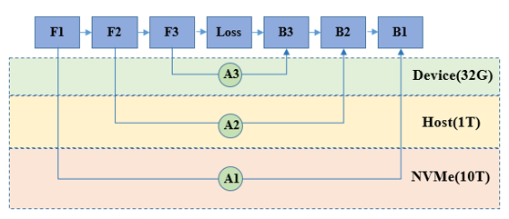

# 异构存储

[](https://gitee.com/mindspore/docs/blob/master/tutorials/experts/source_zh_cn/parallel/memory_offload.md)

## 概述

近几年基于Transformer的大模型在nlp和视觉的各个下游任务上取得了快速发展，往往模型越大，下游任务取得的精度越高。模型规模从亿级到千亿级发展，然而大模型训练需要消耗大量的计算存储资源，训练开销巨大。

大模型训练受显存大小限制，在单卡上能够存储的模型参数量有限。通过模型并行，我们可以将大模型拆分到不同的机器上，在引入必要的进程间通信后，进行集群协同训练，模型规模跟机器规模成正比。同时模型规模超过单机显存容量时，模型并行进行跨机通信的开销将越来越大，资源利用率将会显著下降，如何在单机上训练更大的模型，避免模型并行跨机通信成为大模型训练性能提升的关键。

通过异构存储管理，能够实现模型参数10倍到100倍的存储扩展，从而打破大模型训练的显存限制，实现低成本的大模型训练。本篇教程将会阐述异构存储管理基本原理并介绍相关配置参数及其使用。使用本特性，开发者可以使用相同的硬件训练更大的模型。

相关配置及开关代码：

```python
import mindspore

offload_config = {"offload_param": "cpu",
                  "auto_offload": False,
                  "offload_cpu_size": "512GB",
                  "offload_disk_size": "1024GB",
                  "offload_path": "./offload/",
                  "host_mem_block_size":"1GB",
                  "enable_aio": True,
                  "enable_pinned_mem": True}
mindspore.set_context(mode=mindspore.GRAPH_MODE, memory_offload='ON', max_device_memory='30GB')
mindspore.set_offload_context(offload_config=offload_config)
```

- `memory_offload`：是否开启异构存储功能，在内存不足场景下将空闲数据临时拷贝至Host侧内存。

- `max_device_memory`：设置设备可用的最大内存。

- `offload_config` 是异构存储的配置选项，其中：

    - `"offload_param": "cpu"` 设置模型的参数被存储于cpu内存上，仅在训练过程中需要使用数据时加载至设备侧，使用完成后随即卸载至cpu内存。
    - `"auto_offload": False` 设置关闭自动offload策略，parameter数据将严格安装上一条配置选项执行。
    - `"offload_cpu_size": "512GB", "offload_disk_size": "1024GB"` 分别设置了可用于offload的cpu内存和磁盘大小。
    - `"offload_path": "./offload/"` 设置用于offload的磁盘文件路径。
    - `"enable_pinned_mem": True` 设置开启锁页，开启后可加速HBM-CPU内存之间的拷贝。
    - `"host_mem_block_size":"1GB"` 设置cpu锁页内存池block大小。
    - `"enable_aio": True` 设置开启文件异步IO，开启后可加速DDR-磁盘之间的拷贝。（需要编译时带上-o选项，且仅支持安装了aio的Linux环境）

## 基本原理

在训练过程中，主要的存储数据由参数和中间结果构成：

- 参数：模型的权重及优化器的状态量等数据，在训练过程中需要一直存储
- 中间结果：正反向及优化过程中计算产生的数据，在对应计算完成后可以释放删除

通过异构存储管理，可以在训练过程中，将暂时不需要参与计算的参数或中间结果拷贝至Host侧内存，甚至硬盘存储，在需要数据参与计算时，再将其拷贝恢复至设备侧。通过上述手段，可以提升相同硬件设备能够训练的模型规模。



## 操作实践

下面以Ascend为例，进行异构存储操作说明：

### 样例代码说明

> 下载完整的样例代码：[memory_offload](https://gitee.com/mindspore/docs/tree/master/docs/sample_code/memory_offload)。

```text
└─ sample_code
    ├─ memory_offload
       ├── train.py
       └── run.sh
    ...
```

其中，`train.py`是定义网络结构和训练过程的脚本。`run.sh`是执行脚本。

### 配置分布式环境

通过context接口指定运行模式、运行设备、运行卡号等，此样例中并行模式采用数据并行，并通过init初始化HCCL或NCCL通信。

```python
import mindspore as ms
from mindspore.communication import init

ms.set_context(mode=ms.GRAPH_MODE)
ms.set_auto_parallel_context(parallel_mode=ms.ParallelMode.DATA_PARALLEL, gradients_mean=True)
ms.set_context(max_device_memory="1GB")
if args_opt.memory_offload == "ON":
    ms.set_context(memory_offload="ON")
    offload_config = {"offload_path": args_opt.offload_path, "auto_offload": args_opt.auto_offload,
                      "offload_param": args_opt.offload_param, "offload_cpu_size": args_opt.offload_cpu_size,
                      "offload_disk_size": args_opt.offload_disk_size,
                      "host_mem_block_size": args_opt.host_mem_block_size,
                      "enable_aio": args_opt.enable_aio, "enable_pinned_mem": args_opt.enable_pinned_mem}
    print("=====offload_config====\n", offload_config, flush=True)
    ms.set_offload_context(offload_config=offload_config)
init()
ms.set_seed(1)
```

`offload_config`是异构存储的配置字典，配置内容详见本章概述中相关配置说明。此处`max_device_memory`配置为"1GB"，是为了让显存无法加载完整网络，以此触发异构存储，此处的"1GB"仅代表我们在Ascend910上测试的边界显存，不同的硬件设备可能会有所不同。

### 数据集加载

此用例采用CIFAR-10数据集训练，因此采用CIFAR-10对应的的数据处理方式，由于并行方式是数据并行，还需配置`num_shards`和`shard_id`，代码如下：

```python
import os
import mindspore as ms
import mindspore.dataset as ds
from mindspore import nn, ops

def create_dataset(batch_size):
    dataset_path = os.getenv("DATA_PATH")
    rank_id = get_rank()
    rank_size = get_group_size()
    cifar_ds = ds.Cifar10Dataset(dataset_path, num_shards=rank_size, shard_id=rank_id)

    resize_height = 224
    resize_width = 224
    rescale = 1.0 / 255.0
    shift = 0.0

    random_crop_op = ds.vision.RandomCrop((32, 32), (4, 4, 4, 4))
    random_horizontal_op = ds.vision.RandomHorizontalFlip()
    resize_op = ds.vision.Resize((resize_height, resize_width))
    rescale_op = ds.vision.Rescale(rescale, shift)
    normalize_op = ds.vision.Normalize((0.4914, 0.4822, 0.4465), (0.2023, 0.1994, 0.2010))
    changeswap_op = ds.vision.HWC2CHW()
    type_cast_op = ds.transforms.TypeCast(ms.int32)

    c_trans = [random_crop_op, random_horizontal_op]
    c_trans += [resize_op, rescale_op, normalize_op, changeswap_op]
    cifar_ds = cifar_ds.map(operations=type_cast_op, input_columns="label")
    cifar_ds = cifar_ds.map(operations=c_trans, input_columns="image")
    cifar_ds = cifar_ds.shuffle(buffer_size=10)
    cifar_ds = cifar_ds.batch(batch_size=batch_size, drop_remainder=True)
    return cifar_ds

data_set = create_dataset(args_opt.batch_size)
```

### 定义网络

网络的定义与单卡网络一致：

```python
from mindspore import nn

class Network(nn.Cell):
    def __init__(self):
        super().__init__()
        self.conv1 = nn.Conv2d(3, 16, 3)
        self.relu = nn.ReLU()
        self.conv2 = nn.Conv2d(16, 16, 3)
        self.avgpool = nn.AdaptiveAvgPool2d(1)
        self.dense = nn.Dense(16, 10)

    def construct(self, x):
        x = self.conv1(x)
        x = self.relu(x)
        x = self.conv2(x)
        x = self.avgpool(x).squeeze()
        logits = self.dense(x)
        return logits

net = Network()
```

### 训练网络

在这一步，我们需要定义损失函数、优化器以及训练过程，这部分与数据并行写法一致，也是调用`nn.DistributedGradReducer`接口聚合梯度，代码如下：

```python
import mindspore as ms
from mindspore import nn, ops

optimizer = nn.SGD(net.trainable_params(), 1e-2)
loss_fn = nn.CrossEntropyLoss()

def forward_fn(data, target):
    logits = net(data)
    loss = loss_fn(logits, target)
    return loss, logits

grad_fn = ops.value_and_grad(forward_fn, None, net.trainable_params(), has_aux=True)
grad_reducer = nn.DistributedGradReducer(optimizer.parameters)

for epoch in range(1):
    i = 0
    for image, label in data_set:
        (loss_value, _), grads = grad_fn(image, label)
        grads = grad_reducer(grads)
        optimizer(grads)
        if i % 10 == 0:
            print("epoch: %s, step: %s, loss is %s" % (epoch, i, loss_value))
        i += 1

```

### 运行脚本

接下来通过命令调用对应的脚本：

```shell
bash run.sh 96 OFF
```

不开启异构存储的情况下，使用batch_size=96进行训练时，由于显存空间不够，会出现'Memory not enough'报错：

```bash
----------------------------------------------------
- Framework Error Message:
----------------------------------------------------
Out of Memory!!! Request memory size: 1088627200B, Memory Statistic:
Device HBM memory size: 32768M
MindSpore Used memory size: 1024M
MindSpore memory base address: 0x124140000000
Total Static Memory size: 56M
Total Dynamic memory size: 0M
Dynamic memory size of this graph: 0M

Please try to reduce 'batch_size' or check whether exists extra large shape. For more details, please refer to 'Out of Memory' at https://www.mindspore.cn .
```

开启异构存储后，能够正常使用batch_size=96训练：

```bash
bash run.sh 96 ON
```

```bash
epoch: 0, step: 0, loss is 2.3294048
epoch: 0, step: 10, loss is 2.3190398
epoch: 0, step: 20, loss is 2.314652
epoch: 0, step: 30, loss is 2.3337016
epoch: 0, step: 40, loss is 2.2817006
epoch: 0, step: 50, loss is 2.3032906
epoch: 0, step: 60, loss is 2.2946587
```

### 自动生成offload策略

除了严格安装用户`"offload_param"`的配置进行数据拷贝，MindSpore还支持自动生成异构存储策略。MindSpore可以通过分析网络的显存使用信息，并结合用户配置的`"max_device_memory"`、`"offload_cpu_size"`、`"offload_disk_size"`、`"hbm_ratio"`、`"cpu_ratio"`等参数生成异构存储策略，并按照既定策略在多种存储介质中进行数据搬移。

```python
import mindspore

offload_config = {"offload_path": "./offload/",
                  "auto_offload": True,
                  "offload_param": "cpu",
                  "offload_cpu_size": "512GB",
                  "offload_disk_size": "1024GB",
                  "host_mem_block_size":"1GB",
                  "enable_aio": True,
                  "enable_pinned_mem": True}
mindspore.set_context(mode=mindspore.GRAPH_MODE, memory_offload='ON', max_device_memory='30GB')
mindspore.set_offload_context(offload_config=offload_config)
```

本示例中设置了`"auto_offload": True`，`"offload_param"`只会影响parameter的初始存储位置，计算过程中框架会根据生成的策略来调整权重和中间结果的存放位置。
