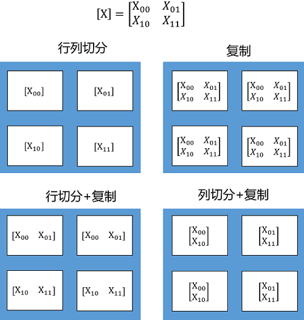
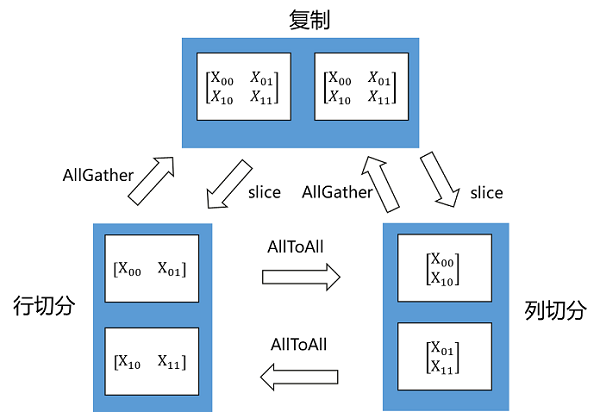

# 算子级并行

[](https://gitee.com/mindspore/docs/blob/r2.3/tutorials/experts/source_zh_cn/parallel/operator_parallel.md)

## 概述

随着深度学习的发展，网络模型正变得越来越大，如NLP领域已出现万亿级参数量的模型，模型容量远超单个设备的内存容量，导致单卡或数据并行均无法进行训练。算子级并行是通过将网络模型中每个算子涉及到的张量进行切分，当仅切分数据维度时，为逻辑上的数据并行，当仅切分模型维度时，为逻辑上的模型并行，通过降低单个设备的内存消耗，从而使大模型的训练成为可能。目前支持并行的算子列表，可以参考[算子级并行使用约束](https://www.mindspore.cn/docs/zh-CN/r2.3/note/operator_list_parallel.html)。

> 算子级并行模型支持的硬件平台包括Ascend、GPU，需要在Graph模式下运行。

相关接口：

1. `mindspore.set_auto_parallel_context(parallel_mode=ParallelMode.SEMI_AUTO_PARALLEL)`：设置半自动并行模式，必须在初始化网络之前调用。

2. `mindspore.ops.Primitive.shard()`：指定算子切分策略，详细案例请参考本章的[基本原理](#基本原理)。

3. `mindspore.ops.Primitive.add_prim_attr()`：为满足不同场景诉求，部分算子能通过`add_prim_attr`接口对其分布式实现进行配置，这些配置仅对`SEMI_AUTO_PARALLEL`与`AUTO_PARALLEL`模式适用，例如：

    - `ops.Gather().add_prim_attr("manual_split", split_tuple)`：该接口配置Gather算子的第一个输入非均匀切分，它仅对axis=0时有效。其中`split_tuple`是一个元素为int类型的元组，元素之和须等于Gather算子第一个输入的第零维的长度，元组个数须等于Gather算子第一个输入的第零维切分份数。
    - `ops.Gather().add_prim_attr("primitive_target", "CPU")`：该接口配置Gather算子在CPU上执行，用于异构场景。
    - `ops.Reshape()add_prim_attr("skip_redistribution")`：对于ops.Reshape的前后不进行张量重排布(张量重排布见[基本原理](#基本原理))。
    - `ops.ReduceSum().add_prim_attr("cross_batch")`：该接口仅对Reduce类算子适用。当配置这个参数后，Reduce类算子如果轴被切分，则会对分片完成reduce操作后不进行多卡之间的同步，结果会和单卡不等价。

## 基本原理

MindSpore对每个算子独立建模，用户可以设置正向网络中每个算子的切分策略（对于未设置的算子，默认按数据并行进行切分）。

在构图阶段，框架将遍历正向图，根据算子的切分策略对每个算子及其输入张量进行切分建模，使得该算子的计算逻辑在切分前后保持数学等价。框架内部使用Tensor Layout来表达输入输出张量在集群中的分布状态，Tensor Layout中包含了张量和设备间的映射关系，用户无需感知模型各切片在集群中如何分布，框架将自动调度分配。框架还将遍历相邻算子间张量的Tensor Layout，如果前一个算子输出张量作为下一个算子的输入张量，且前一个算子输出张量的Tensor Layout与下一个算子输入张量的Tensor Layout不同，则需要在两个算子之间进行张量重排布（Tensor Redistribution）。对于训练网络来说，框架处理完正向算子的分布式切分之后，依靠框架的自动微分能力，即能自动完成反向算子的分布式切分。

Tensor Layout用于描述Tensor在集群中的分布信息，Tensor可以按某些维度切分到集群，也可以在集群上复制。下面这个例子中，将一个二维矩阵切分到两个节点，有三种切分方式：行切分、列切分及复制（每种切分方式即对应于一种Tensor Layout），如下图所示：


如果将二维矩阵切分到4个节点，则有四种切分方式，行列同时切分、复制、行切分+复制、列切分+复制，如下图所示：



Tensor Redistribution用于处理不同Tensor Layout之间的转换，它能在集群中将Tensor从一种排布转换成另外一种排布。所有重排布操作，都会被分解成“集合通信+split+concat”等算子组合。下面两张图说明了几种Tensor Redistribution的操作。



*图：Tensor切分到两个节点的重排*


*图：Tensor切分到四个节点的重排*

用户可以使用shard()接口来设置算子的切分策略，该接口可以描述算子的每个输入张量的每个维度如何切分。比如MatMul.shard(((a, b), (b, c)))表示MatMul有两个输入张量，对第一个输入张量的行均匀切分a份，列均匀切分b份；对第二个输入张量的行均匀切分b份，列均匀切分c份。

```python
import mindspore.nn as nn
from mindspore import ops
import mindspore as ms

ms.set_auto_parallel_context(parallel_mode=ms.ParallelMode.SEMI_AUTO_PARALLEL, device_num=4)

class DenseMatMulNet(nn.Cell):
    def __init__(self):
        super(DenseMatMulNet, self).__init__()
        self.matmul1 = ops.MatMul.shard(((4, 1), (1, 1)))
        self.matmul2 = ops.MatMul.shard(((1, 1), (1, 4)))
    def construct(self, x, w, v):
        y = self.matmul1(x, w)
        z = self.matmul2(y, v)
        return z
```

在以上例子中，用户在4个卡上计算两个连续的二维矩阵乘：`Z = (X * W) * V` 。第一个矩阵乘`Y = X * W`，用户想把X按行切4份（即数据并行）；而第二个矩阵乘`Z = Y * V`，用户想把V按列切4份（即模型并行）：

由于第一个算子输出的Tensor Layout是第零维切分到集群，而第二个算子要求第一个输入Tensor在集群上复制。所以在图编译阶段，会自动识别两个算子输出/输入之间Tensor Layout的不同，从而自动推导出Tensor重排布的算法。而这个例子所需要的Tensor重排布是一个AllGather算子（注：MindSpore的AllGather算子会自动把多个输入Tensor在第零维进行合并）


## 操作实践

下面以Ascend或者GPU单机8卡为例，进行算子级并行操作说明：

### 样例代码说明

> 下载完整的样例代码：[distributed_operator_parallel](https://gitee.com/mindspore/docs/tree/r2.3/docs/sample_code/distributed_operator_parallel)。

目录结构如下：

```text
└─ sample_code
    ├─ distributed_operator_parallel
       ├── distributed_operator_parallel.py
       └── run.sh
    ...
```

其中，`distributed_operator_parallel.py`是定义网络结构和训练过程的脚本。`run.sh`是执行脚本。

### 配置分布式环境

通过context接口指定运行模式、运行设备、运行卡号等，与单卡脚本不同，并行脚本还需指定并行模式`parallel_mode`为半自动并行模式，并通过init初始化HCCL或NCCL通信。`max_device_memory`限制模型最大可以的设备内存，为了在Ascend硬件平台上给通信留下足够的设备内存，GPU则不需要预留。此处不设置`device_target`会自动指定为MindSpore包对应的后端硬件设备。

```python
import mindspore as ms
from mindspore.communication import init

ms.set_context(mode=ms.GRAPH_MODE)
ms.set_context(max_device_memory="28GB")
ms.set_auto_parallel_context(parallel_mode=ms.ParallelMode.SEMI_AUTO_PARALLEL)
init()
ms.set_seed(1)
```

### 数据集加载

在算子级并行场景下，数据集加载方式与单卡加载方式一致，代码如下：

```python
import os
import mindspore.dataset as ds

def create_dataset(batch_size):
    dataset_path = os.getenv("DATA_PATH")
    dataset = ds.MnistDataset(dataset_path)
    image_transforms = [
        ds.vision.Rescale(1.0 / 255.0, 0),
        ds.vision.Normalize(mean=(0.1307,), std=(0.3081,)),
        ds.vision.HWC2CHW()
    ]
    label_transform = ds.transforms.TypeCast(ms.int32)
    dataset = dataset.map(image_transforms, 'image')
    dataset = dataset.map(label_transform, 'label')
    dataset = dataset.batch(batch_size)
    return dataset

data_set = create_dataset(32)
```

### 定义网络

在当前半自动并行模式下，需要用ops算子(Primitive)定义网络。用户可以在单卡网络的基础上手动配置一些算子的切分策略，例如配置策略后的网络结构为：

```python
import mindspore as ms
from mindspore import nn, ops

class Network(nn.Cell):
    def __init__(self):
        super().__init__()
        self.flatten = ops.Flatten()
        self.fc1_weight = ms.Parameter(initializer("normal", [28*28, 512], ms.float32))
        self.fc2_weight = ms.Parameter(initializer("normal", [512, 512], ms.float32))
        self.fc3_weight = ms.Parameter(initializer("normal", [512, 10], ms.float32))
        self.matmul1 = ops.MatMul()
        self.relu1 = ops.ReLU()
        self.matmul2 = ops.MatMul()
        self.relu2 = ops.ReLU()
        self.matmul3 = ops.MatMul()

    def construct(self, x):
        x = self.flatten(x)
        x = self.matmul1(x, self.fc1_weight)
        x = self.relu1(x)
        x = self.matmul2(x, self.fc2_weight)
        x = self.relu2(x)
        logits = self.matmul3(x, self.fc3_weight)
        return logits

net = Network()
net.matmul1.shard(((2, 4), (4, 1)))
net.relu1.shard(((4, 1),))
net.matmul2.shard(((1, 8), (8, 1)))
net.relu2.shard(((8, 1),))
```

以上网络的`ops.MatMul()`和`ops.ReLU()`算子都配置了切分策略，以`net.matmul1.shard(((2, 4), (4, 1)))`为例，它的切分策略为：第一个输入的行切分2份，列切分4份；第二个输入的行切分4份；对于`net.relu2.shard(((8, 1),))`，它的切分策略为：第一个输入的行切分8份。需要注意的是，由于此处的两个`ops.ReLU()`的切分策略不同，所以要分别定义两次。

### 训练网络

在这一步，我们需要定义损失函数、优化器以及训练过程，这部分与单卡写法一致：

```python
import mindspore as ms
from mindspore import nn, ops

optimizer = nn.SGD(net.trainable_params(), 1e-2)
loss_fn = nn.CrossEntropyLoss()

def forward_fn(data, target):
    logits = net(data)
    loss = loss_fn(logits, target)
    return loss, logits

grad_fn = ops.value_and_grad(forward_fn, None, net.trainable_params(), has_aux=True)

@ms.jit
def train_step(inputs, targets):
    (loss_value, _), grads = grad_fn(inputs, targets)
    optimizer(grads)
    return loss_value

for epoch in range(10):
    i = 0
    for image, label in data_set:
        loss_output = train_step(image, label)
        if i % 10 == 0:
            print("epoch: %s, step: %s, loss is %s" % (epoch, i, loss_output))
        i += 1
```

### 运行单机8卡脚本

接下来通过命令调用对应的脚本，以`mpirun`启动方式，8卡的分布式训练脚本为例，进行分布式训练：

```bash
bash run.sh
```

训练完后，日志文件保存到`log_output`目录下，其中部分文件目录结构如下：

```text
└─ log_output
    └─ 1
        ├─ rank.0
        |   └─ stdout
        ├─ rank.1
        |   └─ stdout
...
```

关于Loss部分结果保存在`log_output/1/rank.*/stdout`中，示例如下：

```text
epoch: 0, step: 0, loss is 2.3026192
epoch: 0, step: 10, loss is 2.2928686
epoch: 0, step: 20, loss is 2.279024
epoch: 0, step: 30, loss is 2.2548661
epoch: 0, step: 40, loss is 2.192434
epoch: 0, step: 50, loss is 2.0514572
epoch: 0, step: 60, loss is 1.7082529
epoch: 0, step: 70, loss is 1.1759918
epoch: 0, step: 80, loss is 0.94476485
epoch: 0, step: 90, loss is 0.73854053
epoch: 0, step: 100, loss is 0.71934
...
```

其他启动方式如动态组网、`rank table`的启动可参考[启动方式](https://www.mindspore.cn/tutorials/experts/zh-CN/r2.3/parallel/startup_method.html)。
