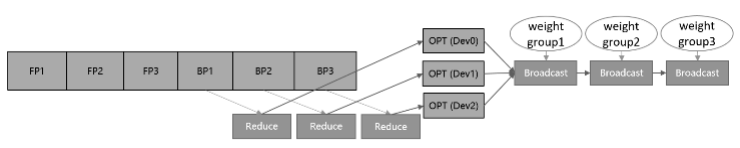
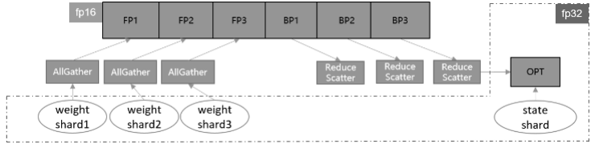

# 优化器并行

[](https://gitee.com/mindspore/docs/blob/r2.3/tutorials/experts/source_zh_cn/parallel/optimizer_parallel.md)

## 概述

在进行数据并行训练时，模型的参数更新部分在各卡间存在冗余计算，优化器并行通过将优化器的计算量分散到数据并行维度的卡上，在大规模网络上（比如Bert、GPT）可以有效减少内存消耗并提升网络性能。

在数据并行（DATA_PARALLEL）模式下使能优化器并行，框架会将需要更新的参数进行分散到不同卡上，各自更新后再通过Broadcast算子在集群间做权重共享。需要注意的是参数量应当大于机器数，当前只支持Lamb和AdamWeightDecay优化器。

在自动并行（AUTO_PARALLEL）或者半自动并行（SEMI_AUTO_PARALLEL）模式下使能优化器并行，如果经过策略切分后的参数在机器间存在重复切片，并且shape的最高维可以被重复切片的卡数整除，框架会以最小切片的方式保存参数并在优化器中更新。该模式下支持所有优化器。

| 并行模式      | 参数更新方式                                        | 优化器支持            | 后端支持      |
| ------------- | --------------------------------------------------- | --------------------- | --------|
| 数据并行      | 参数分组更新，然后广播到所有卡                      | Lamb、AdamWeightDecay和AdaFactor | Ascend |
| 自动/半自动并行 | 参数按数据并行度切分成N份，每张卡更新当前卡上的参数 | 所有优化器            | Ascend、GPU |

无论是哪种模式，优化器并行不会影响原有正反向网络的计算图，只会影响参数更新的计算量和计算逻辑。

> 优化器并行模型支持的硬件平台包括Ascend、GPU，需要在Graph模式下运行。

相关接口：

1. `mindspore.set_auto_parallel_context(parallel_mode=ParallelMode.SEMI_AUTO_PARALLEL, enable_parallel_optimizer=True)`：设置半自动并行模式，且开启优化器并行，必须在初始化网络之前调用。`enable_parallel_optimizer`开启后，默认对所有**占用内存不小于64KB**的参数进行优化器切分，请参考本章的[高级接口](#高级接口)。

2. `Cell.set_comm_fusion(NUM)`：在自动/半自动模式下，每个参数都会产生一个对应的AllGather操作和ReduceScatter操作。这些通信算子是自动并行框架自动插入的。然而，随着参数量增多，对应的通信算子也会增多，通信操作产生的算子调度和启动都会产生更多的开销。因此，可以通过`Cell`提供的`set_comm_fusion`方法，手动对每个`Cell`内的参数对应的AllGather和ReduceScatter操作配置融合标记NUM，以提高通信效率。MindSpore将融合相同NUM参数对应的通信算子，以减少通信开销。

## 基本原理

传统的数据并行模式将模型参数在每台设备上都有保有副本，把训练数据切分，在每次迭代后利用通信算子同步梯度信息，最后通过优化器计算对参数进行更新。数据并行虽然能够有效提升训练吞吐量，但并没有最大限度地利用机器资源。其中优化器会引入冗余内存和计算，消除这些冗余是需关注的优化点。

在一个训练迭代中，数据并行为了收集各卡上不同样本产生的参数梯度，引入通信操作将梯度在多卡间同步。因为不涉及模型并行，每张卡上的优化器运算其实是基于相同的参数、在相同的方向上更新。而消除优化器冗余的根本思想就是将这部分内存和计算量分散到各个卡上，实现内存和性能的收益。

如果要对优化器实现并行运算，有两种实现思路，参数分组(Weights Grouping)和参数切分(Weights Sharding)。其中参数分组是将优化器内的参数及梯度做层间划分，大致的训练流程如图1所示。将参数和梯度分组放到不同卡上更新，再通过通信广播操作在设备间共享更新后的权值。该方案的内存和性能收益取决于参数比例最大的group。当参数均匀划分时，理论上的正收益是N-1/N的优化器运行时间和动态内存，以及N-1/N的优化器状态参数内存大小，其中N表示设备数。而引入的负收益是共享网络权重时带来的通信时间。



*图1：参数分组训练流程示意图*

另一种实现方式参数切分是对参数做层内划分，对每一个参数及梯度根据设备号取其对应切片，各自更新后再调用通信聚合操作在设备间共享参数。这种方案的优点是天然支持负载均衡，即每张卡上参数量和计算量一致，缺点是对参数形状有整除设备数要求。该方案的理论收益与参数分组一致，为了扩大优势，框架做了如下几点改进。

首先，对网络中的权重做切分，可以进一步减少静态内存。但这也需要将迭代末尾的共享权重操作移动到下一轮迭代的正向启动前执行，保证进入正反向运算的依旧是原始张量形状。此外，优化器并行运算带来的主要负收益是共享权重的通信时间，如果我们能够将其减少或隐藏，就可以带来性能上的提升。通信跨迭代执行的一个好处就是，可以通过对通信算子适当分组融合，将通信操作与正向网络交叠执行，从而尽可能隐藏通信耗时。通信耗时还与通信量有关，对于涉及混合精度的网络，如果能够使用fp16通信，通信量相比fp32将减少一半。综合上述特点，参数切分的实现方案如图2所示。



*图2：参数切分训练流程示意图*

在实际网络训练的测试验证中，我们发现参数切分带来的内存收益是显著的。尤其是对于大规模网络模型而言，通常选择当下流行的Adaptive Moment estimation (Adam)和Layer-wise Adaptive Moments optimizer for Batching training (LAMB)训练网络，优化器自身的参数量和计算量不容忽视。经过参数分组，网络中的权重参数和优化器中的两份状态参数都减少了N-1/N倍，极大节省了静态内存空间。这为增大单轮迭代样本数量、提升整体训练吞吐量提供了可能，有效解决了大规模网络训练的内存压力。

MindSpore实现的优化器参数切分还具有与算子级并行混合使用的优势。当算子级模型并行参数未切满时，可以继续在数据并行的维度上进行优化器参数切分，增大机器资源的利用率，从而提升端到端性能。

## 操作实践

下面以Ascend或者GPU单机8卡为例，进行优化器并行操作说明：

### 样例代码说明

> 下载完整的样例代码：[distributed_optimizer_parallel](https://gitee.com/mindspore/docs/tree/r2.3/docs/sample_code/distributed_optimizer_parallel)。

目录结构如下：

```text
└─ sample_code
    ├─ distributed_optimizer_parallel
       ├── distributed_optimizer_parallel.py
       └── run.sh
    ...
```

其中，`distributed_optimizer_parallel.py`是定义网络结构和训练过程的脚本。`run.sh`是执行脚本。

### 配置分布式环境

通过context接口指定运行模式、运行设备、运行卡号等，与单卡脚本不同，并行脚本还需指定并行模式`parallel_mode`为半自动并行模式，并通过init初始化HCCL或NCCL通信。此外，还需开启优化器并行，配置`enable_parallel_optimizer=True`。此处不设置`device_target`会自动指定为MindSpore包对应的后端硬件设备。

```python
import mindspore as ms
from mindspore.communication import init

ms.set_context(mode=ms.GRAPH_MODE)
ms.set_auto_parallel_context(parallel_mode=ms.ParallelMode.SEMI_AUTO_PARALLEL, enable_parallel_optimizer=True)
init()
ms.set_seed(1)
```

### 数据集加载

在优化器并行场景下，数据集加载方式与单卡加载方式一致，代码如下：

```python
import os
import mindspore.dataset as ds

def create_dataset(batch_size):
    """create dataset"""
    dataset_path = os.getenv("DATA_PATH")
    dataset = ds.MnistDataset(dataset_path)
    image_transforms = [
        ds.vision.Rescale(1.0 / 255.0, 0),
        ds.vision.Normalize(mean=(0.1307,), std=(0.3081,)),
        ds.vision.HWC2CHW()
    ]
    label_transform = ds.transforms.TypeCast(ms.int32)
    dataset = dataset.map(image_transforms, 'image')
    dataset = dataset.map(label_transform, 'label')
    dataset = dataset.batch(batch_size)
    return dataset

data_set = create_dataset(32)
```

### 定义网络

优化器并行网络结构与单卡网络结构基本一致，区别在于增加了通信算子融合的配置：

```python
from mindspore import nn

class Network(nn.Cell):
    def __init__(self):
        super().__init__()
        self.flatten = nn.Flatten()
        self.layer1 = nn.Dense(28*28, 512)
        self.layer2 = nn.Dense(512, 512)
        self.layer3 = nn.Dense(512, 10)
        self.relu = nn.ReLU()

    def construct(self, x):
        x = self.flatten(x)
        x = self.layer1(x)
        x = self.relu(x)
        x = self.layer2(x)
        x = self.relu(x)
        logits = self.layer3(x)
        return logits

net = Network()
net.layer1.set_comm_fusion(0)
net.layer2.set_comm_fusion(1)
net.layer3.set_comm_fusion(2)
```

> 这里为了减少通信成本，为不同层配置了通信融合，详细可以参考[通信算子融合](https://www.mindspore.cn/tutorials/experts/zh-CN/r2.3/parallel/comm_fusion.html)。

### 训练网络

在这一步，我们需要定义损失函数、优化器以及训练过程，这部分与单卡写法一致：

```python
import mindspore as ms
from mindspore import nn

optimizer = nn.SGD(net.trainable_params(), 1e-2)
loss_fn = nn.CrossEntropyLoss()

def forward_fn(data, target):
    logits = net(data)
    loss = loss_fn(logits, target)
    return loss, logits

grad_fn = ms.value_and_grad(forward_fn, None, net.trainable_params(), has_aux=True)

@ms.jit
def train_step(inputs, targets):
    (loss_value, _), grads = grad_fn(inputs, targets)
    optimizer(grads)
    return loss_value

for epoch in range(10):
    i = 0
    for image, label in data_set:
        loss_output = train_step(image, label)
        if i % 10 == 0:
            print("epoch: %s, step: %s, loss is %s" % (epoch, i, loss_output))
        i += 1
```

### 运行单机8卡脚本

接下来通过命令调用对应的脚本，以`mpirun`启动方式，8卡的分布式训练脚本为例，进行分布式训练：

```bash
bash run.sh
```

训练完后，日志文件保存到`log_output`目录下，其中部分文件目录结构如下：

```text
└─ log_output
    └─ 1
        ├─ rank.0
        |   └─ stdout
        ├─ rank.1
        |   └─ stdout
...
```

结果保存在`log_output/1/rank.*/stdout`中，示例如下：

```text
epoch: 0, step: 0, loss is 2.3024087
epoch: 0, step: 10, loss is 2.2921634
epoch: 0, step: 20, loss is 2.278274
epoch: 0, step: 30, loss is 2.2537143
epoch: 0, step: 40, loss is 2.1638
epoch: 0, step: 50, loss is 1.984318
epoch: 0, step: 60, loss is 1.6061916
epoch: 0, step: 70, loss is 1.20966
epoch: 0, step: 80, loss is 0.98156196
epoch: 0, step: 90, loss is 0.77229893
epoch: 0, step: 100, loss is 0.6854114
...
```

其他启动方式如动态组网、`rank table`的启动可参考[启动方式](https://www.mindspore.cn/tutorials/experts/zh-CN/r2.3/parallel/startup_method.html)。

## 高级接口

1. `parallel_optimizer_config`：优化器并行特性还提供了配置字典`parallel_optimizer_config={}`。通过在`mindspore.set_auto_parallel_context()`中配置不同的键值，可以达到不同的效果：

    - `gradient_accumulation_shard`：如果为True，则累加梯度变量将在数据并行维度上进行分片。在累加梯度时，每个累加迭代中将会引入额外的通信(ReduceScatter)以保证计算的一致性，但节省了大量的计算设备内存(例如GPU显存)，因此可以使模型以更大的批量进行训练。仅当模型在流水线并行训练或梯度累加中设置此配置，并且具有数据并行维度时，此配置才会有效。默认值为True。

        ```python
        import mindspore as ms
        ms.set_auto_parallel_context(parallel_optimizer_config={"gradient_accumulation_shard": True}, enable_parallel_optimizer=True)
        ```

    - `parallel_optimizer_threshold(int)`：该值表示切分参数时，要求目标参数所占内存的最小值。当目标参数小于该值时，将不会被切分。默认值为64，单位为KB。

        ```python
        import numpy as np
        import mindspore as ms
        param = ms.Parameter(ms.Tensor(np.ones((10, 2)), dtype=ms.float32), name='weight1')
        # float32类型占用内存4Bytes:
        # param_size = np.prod(list(param.shape)) * 4 = (10 * 2) * 4 = 80B < 24KB, 不会被切分
        ms.set_auto_parallel_context(parallel_optimizer_config={"parallel_optimizer_threshold": 24})
        ```

    - `optimizer_weight_shard_size`：设置指定优化器权重切分通信域的大小。数值范围可以是(0, device_num]，若同时开启流水线并行，数值范围则为(0, device_num/stage]。如果参数的数据并行通信域大小不能被 `optimizer_weight_shard_size` 整除，那么指定的优化器权重切分通信域大小就不会生效。默认值为 ``-1`` ，表示优化器权重切片通信域大小是每个参数的数据并行通信域大小。

        ```python
        import mindspore as ms
        ms.set_auto_parallel_context(parallel_optimizer_config={"optimizer_weight_shard_size": 2}, enable_parallel_optimizer=True)
        ```

2. `Parameter.parallel_optimizer`：用户还可以通过此接口自定义某些权重是否进行优化器切分，如下所示：

    ```python
    import numpy as np
    import mindspore as ms
    param = ms.Parameter(ms.Tensor(np.ones((10, 2))), name='weight1', parallel_optimizer=True)

    # 设置 parallel_optimizer 属性的另一种方法
    param2 = ms.Parameter(ms.Tensor(np.ones((10, 2))), name='weight2')
    param2.parallel_optimizer = False
    ```