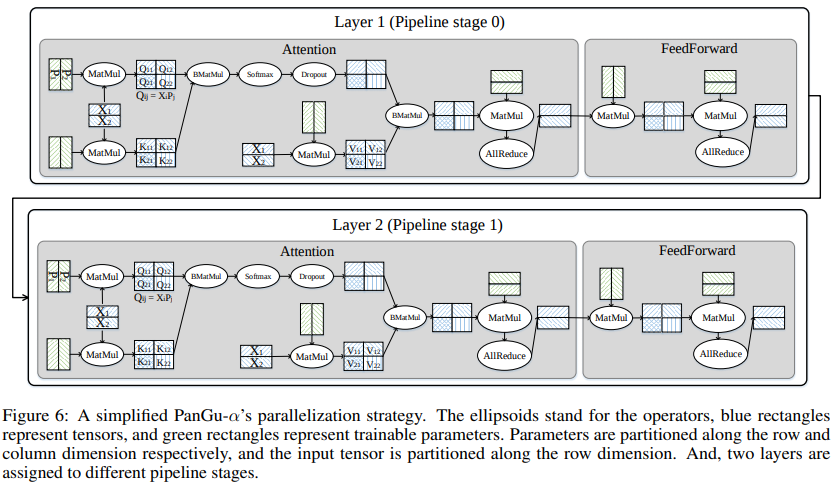

# 鹏程·盘古模型网络多维度混合并行解析

<a href="https://gitee.com/mindspore/docs/blob/master/tutorials/experts/source_zh_cn/parallel/pangu_alpha.md" target="_blank"></a>

## 概述

在MindSpore发布的鹏程·盘古模型[1]中，我们看到借助多维度自动混合并行可以实现超大规模Transformer网络的分布式训练。这篇文章将从网络脚本出发，详解模型各个组成部分的切分方式。

> 完整代码可以参考：https://gitee.com/mindspore/models/tree/master/official/nlp/pangu_alpha

在训练入口脚本train.py中，通过`context.set_auto_parallel_context`接口使能半自动并行模式`SEMI_AUTO_PARALLEL`，表明用户可以通过对算子配置切分策略的方式，借助框架自动完成切分。根据不同网络层运算量和计算方式的特点，选择合适的切分策略是本文关注的重点。此外，通过`enable_parallel_optimizer`和`pipeline_stages`参数可以配置优化器并行和流水线并行方式。

## Embedding层

在语言类模型训练中，输入的数据是由单词组成的句子，我们通常使用embedding算法实现词的向量化，将单词及其位置信息映射为`config.hidden_size`大小维度的词向量。盘古模型中的Embedding层由位置编码和词嵌入两个部分组成，通过`mindspore.nn.transformer.VocabEmbedding`实现基本的数据并行和模型并行逻辑。

如下代码所示，其中`Gather`算子接收两个输入，根据索引`input_ids`在查找表`embedding_table`中查找对应向量。查找表是在训练中需要学习的参数，静态占用卡上内存资源，我们可以根据查找表的大小决定对`Gather`算子采用数据并行策略`gather.shard(((1, 1), (parallel_config.data_parallel, 1)))`切分索引batch维度，或者模型并行策略`gather.shard(((parallel_config.model_parallel, 1), (1, 1)))`对查找表进行行切。当词表范围`config.vocab_size`较大时，建议对`word_embedding`选择模型并行策略，框架会自动引入计算和通信算子处理越界查找情况。

> 脚本和文章中使用config.data_parallel和config.model_parallel指代数据并行切分维度大小和模型并行切分维度大小。

```python
from mindspore import Parameter
from mindspore.common.initializer import initializer
import mindspore.ops as ops
from mindspore.nn import Cell
from mindspore.nn.transformer import EmbeddingOpParallelConfig
default_embedding_parallel_config = EmbeddingOpParallelConfig()
class VocabEmbedding(Cell):
    def __init__(self, vocab_size, hidden_size, parallel_config=default_embedding_parallel_config,
                 param_init='normal'):
        super(VocabEmbedding, self).__init__()
        self.vocab_size = vocab_size
        self.hidden_size = hidden_size
        self.embedding_table = Parameter(initializer(param_init, [self.vocab_size, self.hidden_size]),
                                         name='embedding_table', parallel_optimizer=False)
        if parallel_config.vocab_emb_dp:
            self.gather = ops.GatherV2().shard(((1, 1), (parallel_config.data_parallel, 1)))
        else:
            self.gather = ops.GatherV2().shard(((parallel_config.model_parallel, 1), (1, 1)))
    def construct(self, input_ids):
        output = self.gather(self.embedding_table, input_ids, 0)
        return output, self.embedding_table
```

基于`mindspore.nn.transformer.VocabEmbedding`，我们可以实现词嵌入向量和位置嵌入向量的求和。我们定义了`Add`和`Dropout`算子，并且设置这两个算子对应的策略为数据并行。

```python
from mindspore.common.initializer import initializer
import mindspore.ops as ops
from mindspore import nn
from mindspore.nn.transformer import VocabEmbedding
class EmbeddingLayer(nn.Cell):
    """Embedding layer of the PanGUAlpha Model"""
    def __init__(self, config):
        super(EmbeddingLayer, self).__init__()
        self.word_embedding = VocabEmbedding(vocab_size=config.vocab_size,
                                             hidden_size=config.hidden_size,
                                             param_init=initializer("normal", [config.vocab_size, config.hidden_size],
                                                                    dtype=config.param_init_type),
                                             parallel_config=config.parallel_config.embedding_dp_mp_config)
        self.position_embedding = VocabEmbedding(vocab_size=config.seq_length,
                                                 hidden_size=config.hidden_size,
                                                 param_init=initializer("normal",
                                                                        [config.seq_length, config.hidden_size],
                                                                        dtype=config.param_init_type),
                                                 parallel_config=config.parallel_config.embedding_dp_mp_config)
        self.add = ops.Add().shard(
            ((config.parallel_config.data_parallel, 1, 1), (config.parallel_config.data_parallel, 1, 1)))
        self.dropout = nn.Dropout(1 - config.dropout_rate)
        self.dropout.dropout.shard(((config.parallel_config.data_parallel, 1, 1),))
        self.is_first_iteration = True
        self.use_past = config.use_past
        self.batch_size = config.batch_size

    def construct(self, input_ids, input_position, init_reset, batch_valid_length):
        word_embedding, word_table = self.word_embedding(input_ids)
        if self.use_past and not self.is_first_iteration:
            _, seq_length = ops.shape(input_ids)
            input_position = batch_valid_length.view(self.batch_size, seq_length)
        position_embedding, _ = self.position_embedding(input_position)
        embed = self.add(word_embedding, position_embedding)
        embed = self.dropout(embed)
        return embed, word_table
```

## Decoder层

训练大规模Transformer网络的关键困难在于如何解决随着层数增加造成的计算和内存瓶颈，选择合理的切分方式尤为重要。鹏程·盘古模型的主体网络由多个结构相同但不共享权重的Decoder组成，Decoder又由Self-Attention和FeedForward两部分构成，切分的原则是尽量减少通信，它们的切分方式可以参照下图[1]：



### Self-Attention

Self-Attention可以直接通过`mindspore.nn.transformer.MultiHeadAttention`实现。在计算Attention的过程中，需要将输入向量投影到Query、Key、Value三个向量，然后在attention计算完成之后，需要将attention的输出再经过Dense层。下面分别介绍这三个部分的策略配置。

- 三个Dense矩阵乘法

  此处负责将shape为`[batch*sequence_length, hidden_size]`的输入tensor投影到三个向量，作为Attention计算的Query、Key、Value三个向量。这里对输入的batch维度及权重的output_channel维度进行混合并行切分`matmul.shard(((parallel_config.data_parallel, 1), (parallel_config.model_parallel, 1)))`。输出矩阵行、列均切，再加上切分的偏置项`bias_add.shard(((parallel_config.data_parallel, parallel_config.model_parallel), (parallel_config.model_parallel,)))`。

  ```python
  self.dense1 = nn.Dense(hidden_size,
                         hidden_size).to_float(compute_dtype)
  self.dense1.matmul.shard(((parallel_config.data_parallel, 1), (parallel_config.model_parallel, 1)))
  self.dense1.bias_add.shard(((parallel_config.data_parallel, parallel_config.model_parallel), (parallel_config.model_parallel,)))
  ```

- `Softmax`以及`BatchMatMul`

  在计算Attention的过程中，通过`BatchMatMul`实现Query和Key向量的矩阵乘法。此处,`softmax`的输入shape为`[batch, sequence_length, num_heads, size_per_head]`。因为每个`head`之间在计算attention score时是独立的，所以可以在`batch`维度和`heads`维度对`softmax`算子进行切分。

  ```python
  self.softmax = nn.Softmax()
  self.softmax.softmax.shard(((parallel_config.data_parallel, parallel_config.model_parallel, 1),))
  self.batch_matmul = ops.BatchMatMul().shard(
                      ((parallel_config.data_parallel, parallel_config.model_parallel, 1, 1),
                      (parallel_config.data_parallel, parallel_config.model_parallel, 1, 1)))
  ```

- Projection层

  Projection负责将attention的输出结果进行一次投影。在`MatMul`算子的相关维度进行切分。

  ```python
  self.projection = nn.Dense(hidden_size,
                             hidden_size).to_float(compute_dtype)
  self.projection.matmul.shard(((parallel_config.data_parallel, 1), (1, parallel_config.model_parallel)))
  ```

### FeedForward

FeedForward可以直接调用`mindspore.nn.transformer.FeedForward`实现。FeedForward网络层由两个矩阵乘组成，第一个矩阵乘切分方式和attention一致，输出矩阵行、列均切，即在`batch`维度和`输出维度`进行切分。为了避免引入算子间的重排布通信，第二个矩阵乘对权重的input_channel维度切分，即`matmul.shard(((parallel_config.data_parallel, parallel_config.model_parallel), (parallel_config.model_parallel, 1)))`，相关维切分时框架会自动插入`AllReduce`算子，在模型并行维度上累加切片结果。输出矩阵仅在`batch`维度切分，再加上偏置项`add.shard(((parallel_config.data_parallel, 1), (1,)))`。

```python
from mindspore.common.initializer import initializer
import mindspore.ops as ops
from mindspore import nn, Tensor, Parameter
from mindspore import dtype as mstype
from mindspore.nn import get_activation
from mindspore.nn.transformer import OpParallelConfig

default_dpmp_config = OpParallelConfig()
class Linear(nn.Cell):
    """
    The dense connected layer. Once the parallel mode is enabled, the input shape should be
    a 3-D tensor.
    """
    def __init__(self,
                 in_channels,
                 out_channels,
                 weight_init='normal',
                 bias_init='zeros',
                 has_bias=True,
                 activation=None,
                 transpose_b=True,
                 expert_num=1,
                 param_init_type=mstype.float32,
                 compute_dtype=mstype.float16):
        super(Linear, self).__init__()
        if transpose_b:
            weight_shape = [out_channels, in_channels]
        else:
            weight_shape = [in_channels, out_channels]
        self.expert_num = expert_num
        if self.expert_num > 1:
            self.expert_flag = True
            self.weight = Parameter(initializer(weight_init, [self.expert_num] + weight_shape, param_init_type),
                                    name="weight")
            self.matmul = ops.BatchMatMul(transpose_b=transpose_b)
        else:
            self.expert_flag = False
            self.weight = Parameter(initializer(weight_init, weight_shape, param_init_type), name="weight")
            self.matmul = ops.MatMul(transpose_b=transpose_b)
        self.bias = None
        self.has_bias = has_bias
        if self.has_bias:
            if isinstance(bias_init, Tensor):
                if bias_init.ndim != 1 or bias_init.shape[0] != out_channels:
                    raise ValueError("Bias init shape error.")
            self.bias = Parameter(initializer(bias_init, [out_channels], param_init_type), name="bias")
            self.bias_add = ops.Add()
        self.act_name = activation
        self.activation = get_activation(activation) if isinstance(activation, str) else activation
        self.activation_flag = self.activation is not None
        self.dtype = compute_dtype
        self.cast = ops.Cast()

    def construct(self, x):
        out_shape = ops.Shape()(x)[:-1] + (self.out_channels,)
        x = ops.Reshape()(x, (-1, self.in_channels))
        if self.expert_flag is True:
            x = ops.Reshape()(x, (self.expert_num, -1, self.in_channels))
        weight = self.cast(self.weight, self.dtype)
        x = self.matmul(x, weight)
        if self.has_bias:
            x = self.bias_add(x, self.cast(self.bias, self.dtype))
        output = ops.Reshape()(x, out_shape)
        if self.activation_flag:
            output = self.activation(output)
        return output

    def shard(self, strategy_matmul, strategy_bias=None, strategy_activation=None):
        """
         Set the shard for the linear. the strategy size should be equal to the inputs.
        """
        self.matmul.shard(strategy_matmul)
        if self.has_bias:
            self.bias_add.shard(strategy_bias)
        if self.activation_flag:
            getattr(self.activation, self.act_name).shard(strategy_activation)
        return self

class FeedForward(nn.Cell):
    """
    The multilayer perceptron with two linear layers with dropout applied at final output. The first linear
    will project the input dimension from hidden_size to ffn_hidden_size, the second linear will project the
    dimension from ffn_hidden_size to hidden_size. The first linear is sharded on the relative dimension,
    the second linear is sharded on the output dimension.
    """
    def __init__(self, hidden_size,
                 ffn_hidden_size,
                 dropout_rate,
                 hidden_act='gelu',
                 expert_num=1,
                 param_init_type=mstype.float32,
                 parallel_config=default_dpmp_config):
        super(FeedForward, self).__init__()
        dp = parallel_config.data_parallel
        mp = parallel_config.model_parallel
        input_size = hidden_size
        output_size = ffn_hidden_size
        # Here, 'ep' stands for expert parallel number, which is equal to data parallel number.
        ep = dp
        # Project to ffn_hidden_size
        self.mapping = Linear(in_channels=input_size,
                               out_channels=output_size,
                               activation=hidden_act,
                               transpose_b=False,
                               expert_num=expert_num,
                               param_init_type=param_init_type)
        self.mapping.shard(strategy_matmul=((dp, 1), (1, mp)),
                           strategy_bias=((dp, mp), (mp,)),
                           strategy_activation=((dp, mp),))
        # Project back to hidden_size
        self.projection = Linear(in_channels=output_size,
                                  out_channels=input_size,
                                  transpose_b=False,
                                  expert_num=expert_num,
                                  param_init_type=param_init_type)
        self.projection.shard(strategy_matmul=((dp, mp), (mp, 1)),
                              strategy_bias=((dp, 1), (1,)))
        self.projection.bias.parallel_optimizer = False
        self.dropout = nn.Dropout(1 - dropout_rate)
        self.dropout.dropout.shard(((dp, 1),))
        self.cast = ops.Cast()

    def construct(self, x):
        x = self.cast(x, mstype.float16)
        # returned shape is [bs, seq_length, ffn_hidden_size] or [bs * seq_length, ffn_hidden_size]
        hidden = self.mapping(x)
        output = self.projection(hidden)
        # returned shape is [bs, seq_length, ffn_hidden_size] or [bs * seq_length, ffn_hidden_size]
        output = self.dropout(output)
        return output
```

## Residual层

Transformer结构中值得注意的一个细节是，每个子层都有残差连接，并且跟着layernorm操作。虽然layernorm中也包含权重，但是仅为`hidden_size`大小的一维向量，占网络权重比例很小，所以这里直接采用数据并行切分方式。

```python
from mindspore import nn

layernorm1 = nn.LayerNorm((hidden_size,))
layernorm1.shard(((parallel_config.data_parallel, 1),))
```

## 预测层

计算loss前需要经过一个全连接层将输出特征从`config.hidden_size`映射回`config.vocab_size`维度得到logits。这里全连接层和`word_embedding`操作共享权重，所以要求全连接层权重的切分方式与embedding层保持一致。

```python
import mindspore.ops as ops
from mindspore import nn
class PanguAlpha_Head(nn.Cell):
    """
    Head for PanguAlpha to get the logits of each token in the vocab
    Args:
        config(PanguAlphaConfig): the config of network
    Inputs:
        state: the output of the backbone
        embedding_table: the embedding table of the vocabulary
    Returns:
        logits: Tensor, the logits of the corresponding inputs
    """

    def __init__(self, config):
        super(PanguAlpha_Head, self).__init__()
        if config.word_emb_dp:
            self.matmul = ops.MatMul(transpose_b=True).shard(((parallel_config.dp, 1), (1, 1)))
        else:
            self.matmul = ops.MatMul(transpose_b=True).shard(((parallel_config.dp, 1), (parallel_config.model_parallel, 1)))
        self.hidden_size = config.hidden_size
        self.log_softmax = ops.LogSoftmax(axis=-1)
        self.dtype = config.compute_dtype
        self.cast = ops.Cast()

    def construct(self, state, embedding_table):
        state = ops.Reshape()(state, (-1, self.hidden_size))
        # output logits over vocabulary [bs*seq_length, vocab_size]
        logits = self.matmul(state, self.cast(embedding_table, self.dtype))
        return logits
```

在这篇文章中，我们了解到如何通过配置算子切分策略的方式在单机脚本基础上快速实现Transformer类网络的分布式训练。具体到网络结构，embedding层、decorder层、residual层和linear层都有各自的切分特点，用户可以通过掌握算子策略配置方法，提升分布式训练、调优效率。

## 参考文献

[1] Zeng W ,  Ren X ,  Su T , et al. PanGu-$\\alpha$: Large-scale Autoregressive Pretrained Chinese Language Models with Auto-parallel Computation.  2021.
