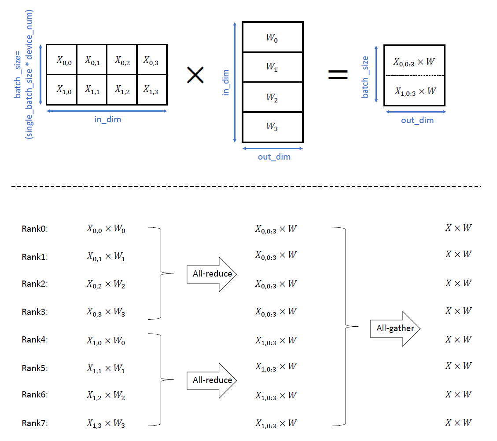

# 快速入门分布式并行训练

<a href="https://gitee.com/mindspore/docs/blob/master/tutorials/experts/source_zh_cn/parallel/parallel_training_quickstart.md" target="_blank"></a>

## 概述

本篇教程通过一个单隐藏层全连接神经网络的简单示例，展示如何通过**OpenMPI**，在单机8卡的**GPU**环境下，进行MindSpore分布式并行训练。

在GPU平台上，对ResNet网络进行分布式并行训练的教程见[分布式并行训练基础样例（GPU）](https://www.mindspore.cn/tutorials/experts/zh-CN/master/parallel/train_gpu.html)。相比之下：（1）该示例使用更加复杂的ResNet网络；（2）除使用OpenMPI的方式拉起训练外，该示例还介绍使用脚本的方式拉起训练。

> 你可以在这里下载完整的样例代码：
>
> <https://gitee.com/mindspore/docs/tree/master/docs/sample_code/distributed_training_quickstart>

目录结构如下：

```text
└─sample_code
    ├─distributed_training_quickstart
        ├── net.py
        ├── run_with_mpi.sh
    ...
```

其中，`net.py`为网络定义脚本，`run_with_mpi.sh`是执行脚本。

>此外，在Ascend 910平台上进行分布式并行训练的教程详见[分布式并行训练基础样例（Ascend）](https://www.mindspore.cn/tutorials/experts/zh-CN/master/parallel/train_ascend.html)与[分布式并行训练Transformer模型](https://www.mindspore.cn/tutorials/experts/zh-CN/master/parallel/transformer.html)。

## 准备环节

### 数据集

本样例随机构造一组输入数据与标签，代码如下：

```python
import numpy as np

def get_dataset(batch_size, in_dim, out_dim, step_per_epoch):
    np.random.seed(1)
    input_data = np.random.rand(batch_size, in_dim).astype(np.float32)
    label_data = np.random.rand(batch_size, out_dim).astype(np.float32)
    def generate():
        for _ in range(step_per_epoch):
            yield (input_data, label_data)
    return generate
```

其中，`step_per_epoch`为训练每epoch进行的step数，`batch_size`为批大小，`in_dim`为输入向量长度，`out_dim`为输出向量长度。

### 网络结构

本样例使用的网络代码如下：

```python
class Net(Cell):
    """define net"""
    def __init__(self, in_dim, hidden_dim, out_dim):
        super().__init__()
        self.in_dim = in_dim
        self.hidden_dim = hidden_dim
        self.out_dim = out_dim
        self.weight = Parameter(initializer("normal", [self.in_dim, self.hidden_dim]), "w")
        self.weight2 = Parameter(initializer("normal", [self.hidden_dim, self.out_dim]), "w2")
        self.matmul = ops.MatMul()
        self.relu = ops.ReLU()
        self.matmul2 = ops.MatMul()

    def construct(self, x):
        out = self.matmul(x, self.weight)
        out = self.relu(out)
        out = self.matmul2(out, self.weight2)
        return out
```

其中，`in_dim`为网络输入维度，`out_dim`为输出维度，需与数据维度匹配，而`hidden_dim`为网络隐藏层节点数。

## 通过OpenMPI进行半自动并行分布式训练

### OpenMPI环境配置

[OpenMPI](https://www.open-mpi.org/)是一种高性能消息传递库，是MindSpore采用的多进程通讯库，相关环境配置见：[通过OpenMPI运行脚本](https://www.mindspore.cn/tutorials/experts/zh-CN/master/parallel/train_ascend.html#通过openmpi运行脚本)。

>此外，MindSpore还支持不依赖OpenMPI进行分布式训练，详见：[不依赖OpenMPI进行训练](https://www.mindspore.cn/tutorials/experts/zh-CN/master/parallel/train_gpu.html#不依赖openmpi进行训练)。

### 半自动并行

目前MindSpore支持四种并行模式，详见：[分布式并行训练模式](https://www.mindspore.cn/tutorials/experts/zh-CN/master/parallel/introduction.html#分布式并行训练模式)。

本例中演示全自动并行，通过`set_auto_parallel_context()`接口配置`parallel_mode=ms.ParallelMode.AUTO_PARALLEL`实现。
全自动并行下共有三种可配置的并行策略搜索算法，详见：[全自动并行](https://www.mindspore.cn/tutorials/experts/zh-CN/master/parallel/introduction.html#全自动并行)。本例中，选择**切分策略传播算法**，通过`set_auto_parallel_context()`接口配置`search_mode="sharding_propagation"`实现，并手动设置`matmul`算子切分策略，其他算子的切分策略由并行策略搜索算法自动给出，代码如下：

```python
class Net(Cell):
    """define net"""
    def __init__(self, in_dim, hidden_dim, out_dim):
        super().__init__()
        self.in_dim = in_dim
        self.hidden_dim = hidden_dim
        self.out_dim = out_dim
        self.weight = Parameter(initializer("normal", [self.in_dim, self.hidden_dim]), "w")
        self.weight2 = Parameter(initializer("normal", [self.hidden_dim, self.out_dim]), "w2")

        # 对matmul算子手动设置切分策略
        # 其中(2, 4)表示matmul算子的输入数据在batch维切分为两份，在width维切分为四份
        # (4, 1)表示matmul算子的权重在height维切分为四份
        self.matmul = ops.MatMul().shard(((2, 4), (4, 1)))

        self.relu = ops.ReLU()
        self.matmul2 = ops.MatMul()

    def construct(self, x):
        out = self.matmul(x, self.weight)
        out = self.relu(out)
        out = self.matmul2(out, self.weight2)
        return out
```

其中，`shard()`方法的详细介绍见[自动并行原理](https://www.mindspore.cn/docs/zh-CN/master/design/distributed_training_design.html#自动并行原理)，接口介绍见[函数式算子切分](https://www.mindspore.cn/tutorials/experts/zh-CN/master/parallel/pynative_shard_function_parallel.html)

对于上述例子中设置的并行切分策略，在单机8卡环境下，前向传播过程的`matmul`算子计算过程示意图如下：



其中，上半部分为数据切分示意图，下半部分为在逻辑号（rank）0-7号的GPU卡各自执行的计算与通信过程示意图。

#### 代码运行

本例中，损失函数、优化器与训练过程的定义与单卡训练类似，代码如下：

```python
var_step_per_epoch = 4
var_single_batch_size = 2
var_in_dim = 32
var_hidden_dim = 16
var_out_dim = 16

ms.set_context(mode=ms.GRAPH_MODE, device_target="GPU", save_graphs=True, save_graphs_path="../saved_graph")

# 单机8卡环境，并行模式为全自动并行，策略搜索设置为策略传播算法
ms.set_auto_parallel_context(parallel_mode=ms.ParallelMode.AUTO_PARALLEL, search_mode="sharding_propagation", dataset_strategy="data_parallel")

# 初始化通信环境，并获取当前卡的逻辑序号，即rank_id
init("nccl")
rank_id = get_rank()

# 随机构造数据集
fake_dataset = get_dataset(var_single_batch_size, var_step_per_epoch, var_in_dim, var_out_dim)
dataset = ds.GeneratorDataset(fake_dataset, ["input", "label"])

# 定义网络结构
net = Net(var_in_dim, var_hidden_dim, var_out_dim)

# 定义损失函数、callback
loss = MSELoss()
callback = [LossMonitor(), ModelCheckpoint(directory="{}".format(rank_id))]

# 定义优化器
learning_rate = 0.2
momentum = 0.1
epoch_size = 5
opt = Momentum(net.trainable_params(), learning_rate, momentum)

# 模型训练
model = Model(net, loss_fn=loss, optimizer=opt)
model.train(epoch_size, dataset, callbacks=callback, dataset_sink_mode=False)
```

可以通过OpenMPI的`mpirun`命令进行训练，具体代码见脚本`run_with_mpi.sh`。

运行后，该脚本在后台进行，训练日志保存在`./device`目录下，逻辑编号为`rank_id`的卡的模型保存在`./device/{rank_id}`目录下。

此外，通过`ms.set_context()`接口配置`save_graphs=True`保存模型中间表示`MindIR`，逻辑编号为`rank_id`的卡的`MindIR`保存在`./saved_graph/{rank_id}`目录下。其中，MindSpore IR(MindIR)是MindSpore框架程序编译过程中介于源语言和目标语言之间的程序表示，以方便编译器进行程序分析和优化，详见[MindIR](https://www.mindspore.cn/docs/zh-CN/master/design/mindir.html)。

#### 验证

运行`run_with_mpi.sh`脚本后，记录的loss应下降，如：

```text
# ./device/train.log: #
...
epoch: 3 step: 2, loss is 0.367389976978302
epoch: 3 step: 2, loss is 0.367389976978302
epoch: 3 step: 2, loss is 0.367389976978302
epoch: 3 step: 2, loss is 0.367389976978302
epoch: 3 step: 2, loss is 0.367389976978302
epoch: 3 step: 2, loss is 0.367389976978302
epoch: 3 step: 2, loss is 0.367389976978302
epoch: 3 step: 2, loss is 0.367389976978302
epoch: 3 step: 3, loss is 0.35383114218711853
epoch: 3 step: 3, loss is 0.35383114218711853
epoch: 3 step: 3, loss is 0.35383114218711853
epoch: 3 step: 3, loss is 0.35383114218711853
epoch: 3 step: 3, loss is 0.35383114218711853
epoch: 3 step: 3, loss is 0.35383114218711853
epoch: 3 step: 3, loss is 0.35383114218711853
epoch: 3 step: 3, loss is 0.35383114218711853
epoch: 3 step: 4, loss is 0.3312329947948456
epoch: 3 step: 4, loss is 0.3312329947948456
epoch: 3 step: 4, loss is 0.3312329947948456
epoch: 3 step: 4, loss is 0.3312329947948456
epoch: 3 step: 4, loss is 0.3312329947948456
epoch: 3 step: 4, loss is 0.3312329947948456
epoch: 3 step: 4, loss is 0.3312329947948456
epoch: 3 step: 4, loss is 0.3312329947948456
epoch: 4 step: 1, loss is 0.295515775680542
epoch: 4 step: 1, loss is 0.295515775680542
epoch: 4 step: 1, loss is 0.295515775680542
epoch: 4 step: 1, loss is 0.295515775680542
epoch: 4 step: 1, loss is 0.295515775680542
epoch: 4 step: 1, loss is 0.295515775680542
epoch: 4 step: 1, loss is 0.295515775680542
epoch: 4 step: 1, loss is 0.295515775680542
epoch: 4 step: 2, loss is 0.2440134435892105
epoch: 4 step: 2, loss is 0.2440134435892105
epoch: 4 step: 2, loss is 0.2440134435892105
epoch: 4 step: 2, loss is 0.2440134435892105
epoch: 4 step: 2, loss is 0.2440134435892105
epoch: 4 step: 2, loss is 0.2440134435892105
epoch: 4 step: 2, loss is 0.2440134435892105
epoch: 4 step: 2, loss is 0.2440134435892105
...
```

可以在`./saved_graph/rank_x/step_parallel_begin_xxxx.ir`中，查看各算子的切分策略配置，如：

```text
# ./saved_graph/rank_0/step_parallel_begin_0041.ir: #
...
%3(out) = MatMul(%1, %2) {instance name: matmul} primitive_attrs: {input_names: [x1, x2], out_strategy: None, transpose_x2: false, transpose_b: false, in_strategy: ((2, 4), (4, 1)), output_names: [output], transpose_a: false, transpose_x1: false} {in_strategy: ((2, 4), (4, 1))}
    : (<Tensor[Float32], (16, 32)>, <Tensor[Float32], (32, 16)>) -> (<Tensor[Float32], (16, 16)>)
    # scope: (Default/network-WithLossCell/_backbone-Net)
%4(out) = ReLU(%3) {instance name: relu} primitive_attrs: {output_names: [output], input_names: [x]} {in_strategy: ((2, 4))}
    : (<Tensor[Float32], (16, 16)>) -> (<Tensor[Float32], (16, 16)>)
    # scope: (Default/network-WithLossCell/_backbone-Net)
%5([CNode]472) = Load($(@1_construct_wrapper.337:para4_w2), %para12_u)
    : (<Ref[Tensor(F32)], (16, 16), ref_key=:w2>, <UMonad>) -> (<Tensor[Float32], (16, 16)>)
    # scope: (Default/network-WithLossCell)
%6(out) = MatMul(%4, %5) {instance name: matmul2} primitive_attrs: {output_names: [output], transpose_a: false, input_names: [x1, x2], transpose_x2: false, transpose_x1: false, transpose_b: false} {in_strategy: ((2, 4), (4, 1))}
    : (<Tensor[Float32], (16, 16)>, <Tensor[Float32], (16, 16)>) -> (<Tensor[Float32], (16, 16)>)
    # scope: (Default/network-WithLossCell/_backbone-Net)
...
```

可以看到，`%4(out)`行对应的`relu`算子`%6(out)`行对应的`matmul2`算子被自动配置了切分策略。

进一步，可以在`./saved_graph/rank_x/18_execute_xxxx.ir`中，查看各卡实际执行的切分算子维度，如：

```text
# ./saved_graph/rank_0/18_execute_0185.ir: #
...
%12(equivout) = MatMul(%10, %11) {instance name: matmul} primitive_attrs: {input_names: [x1, x2], out_strategy: None, transpose_x2: false, transpose_b: false, in_strategy: ((2, 4), (4, 1)), output_names: [output], transpose_a: false, transpose_x1: false} {in_strategy: ((2, 4), (4, 1))}
    : (<Tensor[Float32], (8, 8)>, <Tensor[Float32], (8, 16)>) -> (<Tensor[Float32], (8, 16)>)
    # scope: (Default/network-WithLossCell/_backbone-Net)
    # In file /home/jenkins/shiwenqi/parallel_training_quick_start/device/./matmul.py(45)/        out = self.matmul(x, self.weight)/
    # In file /home/miniconda3/envs/swq-ms-py37/lib/python3.9/site-packages/mindspore/nn/wrap/cell_wrapper.py(114)/        out = self._backbone(data)/
    # In file /home/miniconda3/envs/swq-ms-py37/lib/python3.9/site-packages/mindspore/nn/wrap/cell_wrapper.py(376)/        loss = self.network(*inputs)/
%13(equiv[CNode]520) = AllReduce(%12) {instance name: forward_op_11795743325248501408} primitive_attrs: {group: 4-6301172352641561019, fusion: 0, op: sum, rank_list: (0, 1, 2, 3), group_ranks: 0-1-2-3, index: 0, group_rank_ids: (0, 1, 2, 3), no_eliminate: true} cnode_attrs: {comm_reuse: true}
    : (<Tensor[Float32], (8, 16)>) -> (<Tensor[Float32], (8, 16)>)
    # scope: (Default/network-WithLossCell/_backbone-Net)
%14(equiv[CNode]519) = StridedSlice(%13, (0, 0), (8, 4), (1, 1)) {instance name: redistribution_op_16390315056374637535StridedSlice} primitive_attrs: {new_axis_mask: 0, shrink_axis_mask: 0, end_mask: 0, input_names: [x, begin, end, strides], output_names: [output], keep_value_node_input: true, begin_mask: 0, ellipsis_mask: 0}
    : (<Tensor[Float32], (8, 16)>, <Tuple[Int64*2], sequence_nodes={node={ValueNode<ValueTuple> (0, 0), elements_use_flags: {ptr: 0x560e8fef5fa0, value: [const vector][1, 1]}}, node={ValueNode<ValueTuple> (0, 0), elements_use_flags: {ptr: 0x560e8fef5fa0, value: [const vector][1, 1]}}, node={<freed node>}, node={ValueNode<ValueTuple> (0, 0), elements_use_flags: {ptr: 0x560e8fef5fa0, value: [const vector][1, 1]}}, node={ValueNode<ValueTuple> (0, 0), elements_use_flags: {ptr: 0x560e8fef5fa0, value: [const vector][1, 1]}}, node={ValueNode<ValueTuple> (0, 0), elements_use_flags: {ptr: 0x560e8fef5fa0, value: [const vector][1, 1]}}, node={ValueNode<ValueTuple> (0, 0), elements_use_flags: {ptr: 0x560e8fef5fa0, value: [const vector][1, 1]}}, node={ValueNode<ValueTuple> (0, 0), elements_use_flags: {ptr: 0x560e8fef5fa0, value: [const vector][1, 1]}}, node={<freed node>}}>, <Tuple[Int64*2], sequence_nodes={node={ValueNode<ValueTuple> (8, 4), elements_use_flags: {ptr: 0x560e8fed50d0, value: [const vector][1, 1]}}, node={ValueNode<ValueTuple> (8, 4), elements_use_flags: {ptr: 0x560e8fed50d0, value: [const vector][1, 1]}}, node={<freed node>}, node={ValueNode<ValueTuple> (8, 4), elements_use_flags: {ptr: 0x560e8fed50d0, value: [const vector][1, 1]}}, node={ValueNode<ValueTuple> (8, 4), elements_use_flags: {ptr: 0x560e8fed50d0, value: [const vector][1, 1]}}, node={ValueNode<ValueTuple> (8, 4), elements_use_flags: {ptr: 0x560e8fed50d0, value: [const vector][1, 1]}}, node={ValueNode<ValueTuple> (8, 4), elements_use_flags: {ptr: 0x560e8fed50d0, value: [const vector][1, 1]}}, node={ValueNode<ValueTuple> (8, 4), elements_use_flags: {ptr: 0x560e8fed50d0, value: [const vector][1, 1]}}, node={<freed node>}}>, <Tuple[Int64*2], sequence_nodes={node={ValueNode<ValueTuple> (1, 1), elements_use_flags: {ptr: 0x560e8ffb4ff0, value: [const vector][1, 1]}}, node={ValueNode<ValueTuple> (1, 1), elements_use_flags: {ptr: 0x560e8ffb4ff0, value: [const vector][1, 1]}}, node={<freed node>}, node={ValueNode<ValueTuple> (1, 1), elements_use_flags: {ptr: 0x560e8ffb4ff0, value: [const vector][1, 1]}}, node={ValueNode<ValueTuple> (1, 1), elements_use_flags: {ptr: 0x560e8ffb4ff0, value: [const vector][1, 1]}}, node={ValueNode<ValueTuple> (1, 1), elements_use_flags: {ptr: 0x560e8ffb4ff0, value: [const vector][1, 1]}}, node={ValueNode<ValueTuple> (1, 1), elements_use_flags: {ptr: 0x560e8ffb4ff0, value: [const vector][1, 1]}}, node={ValueNode<ValueTuple> (1, 1), elements_use_flags: {ptr: 0x560e8ffb4ff0, value: [const vector][1, 1]}}, node={<freed node>}}>) -> (<Tensor[Float32], (8, 4)>)
    # scope: (Default/network-WithLossCell/_backbone-Net)
%15(equivout) = ReLU(%14) {instance name: relu} primitive_attrs: {output_names: [output], input_names: [x]} {in_strategy: ((2, 4))}
    : (<Tensor[Float32], (8, 4)>) -> (<Tensor[Float32], (8, 4)>)
    # scope: (Default/network-WithLossCell/_backbone-Net)
    # In file /home/jenkins/shiwenqi/parallel_training_quick_start/device/./matmul.py(46)/        out = self.relu(out)/
    # In file /home/miniconda3/envs/swq-ms-py37/lib/python3.9/site-packages/mindspore/nn/wrap/cell_wrapper.py(114)/        out = self._backbone(data)/
    # In file /home/miniconda3/envs/swq-ms-py37/lib/python3.9/site-packages/mindspore/nn/wrap/cell_wrapper.py(376)/        loss = self.network(*inputs)/
%16(equiv[CNode]472) = Load(%para4_w2, U)
    : (<Ref[Tensor(F32)], (4, 16), ref_key=:w2>, <UMonad>) -> (<Tensor[Float32], (4, 16)>)
    # scope: (Default/network-WithLossCell)
%17(equivout) = MatMul(%15, %16) {instance name: matmul2} primitive_attrs: {output_names: [output], transpose_a: false, input_names: [x1, x2], transpose_x2: false, transpose_x1: false, transpose_b: false} {in_strategy: ((2, 4), (4, 1))}
    : (<Tensor[Float32], (8, 4)>, <Tensor[Float32], (4, 16)>) -> (<Tensor[Float32], (8, 16)>)
    # scope: (Default/network-WithLossCell/_backbone-Net)
    # In file /home/jenkins/shiwenqi/parallel_training_quick_start/device/./matmul.py(47)/        out = self.matmul2(out, self.weight2)/
    # In file /home/miniconda3/envs/swq-ms-py37/lib/python3.9/site-packages/mindspore/nn/wrap/cell_wrapper.py(114)/        out = self._backbone(data)/
    # In file /home/miniconda3/envs/swq-ms-py37/lib/python3.9/site-packages/mindspore/nn/wrap/cell_wrapper.py(376)/        loss = self.network(*inputs)/
...
```

可以看到，`%12(equivout)`行对应的`matmul`算子维度与图示中一致。


