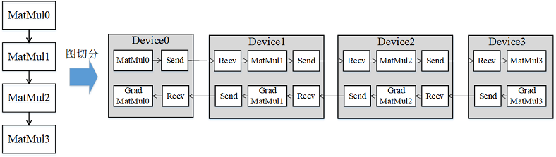

# 流水线并行

[](https://gitee.com/mindspore/docs/blob/r2.2/tutorials/experts/source_zh_cn/parallel/pipeline_parallel.md)

## 概述

近年来，神经网络的规模几乎是呈指数型增长。受单卡内存的限制，训练这些大模型用到的设备数量也在不断增加。受server间通信带宽低的影响，传统数据并行叠加模型并行的这种混合并行模式的性能表现欠佳，需要引入流水线并行。流水线并行能够将模型在空间上按阶段（Stage）进行切分，每个Stage只需执行网络的一部分，大大节省了内存开销，同时缩小了通信域，缩短了通信时间。MindSpore能够根据用户的配置，将单机模型自动地转换成流水线并行模式去执行。

> 流水线并行模型支持的硬件平台包括Ascend、GPU，需要在Graph模式下运行。

相关接口：

1. `mindspore.set_auto_parallel_context(parallel_mode=ParallelMode.SEMI_AUTO_PARALLEL, pipeline_stages=NUM)`：设置半自动并行模式，且设置`pipeline_stages`用来表明Stage的总数为NUM，必须在初始化网络之前调用。

2. `nn.WithLossCell(backbone, loss_fn)`：流水线并行需要首先通过此接口定义损失函数的Cell，即LossCell，用于封装骨干网络和损失函数。

3. `nn.PipelineCell(loss_cell, micro_size)`：流水线并行需要在LossCell外再包一层`PipelineCell`，并指定MicroBatch的size。为了提升机器的利用率，MindSpore将MiniBatch切分成了更细粒度的MicroBatch，最终的loss则是所有MicroBatch计算的loss值累加。其中，MicroBatch的size必须大于等于Stage的数量。

## 基本原理

流水线（Pipeline）并行是将神经网络中的算子切分成多个Stage，再把Stage映射到不同的设备上，使得不同设备去计算神经网络的不同部分。流水线并行适用于模型是线性的图结构。如图1所示，将4层MatMul的网络切分成4个Stage，分布到4台设备上。正向计算时，每台机器在算完本台机器上的MatMul之后将结果通过通信算子发送（Send）给下一台机器，同时，下一台机器通过通信算子接收（Receive）上一台机器的MatMul结果，同时开始计算本台机器上的MatMul；反向计算时，最后一台机器的梯度算完之后，将结果发送给上一台机器，同时，上一台机器接收最后一台机器的梯度结果，并开始计算本台机器的反向。



*图1：流水线并行的图切分示意图*

简单地将模型切分到多设备上并不会带来性能的提升，因为模型的线性结构到时同一时刻只有一台设备在工作，而其它设备在等待，造成了资源的浪费。为了提升效率，流水线并行进一步将小批次(MiniBatch)切分成更细粒度的微批次(MicroBatch)，在微批次中采用流水线式的执行序，从而达到提升效率的目的，如图2所示。将小批次切分成4个微批次，4个微批次在4个组上执行形成流水线。微批次的梯度汇聚后用来更新参数，其中每台设备只存有并更新对应组的参数。其中白色序号代表微批次的索引。


*图2：带MicroBatch的流水线并行执行时间线示意图*

MindSpore的流水线并行实现中对执行序进行了调整，来达到更优的内存管理。如图3所示，在编号为0的MicroBatch的正向执行完后立即执行其反向，这样做使得编号为0的MicroBatch的中间结果的内存得以更早地（相较于图2）释放，进而确保内存使用的峰值比图2的方式更低。


*图3：MindSpore流水线并行执行时间线示意图*

## 操作实践

下面以Ascend或者GPU单机8卡为例，进行流水线并行操作说明：

### 样例代码说明

> 下载完整的样例代码：[distributed_pipeline_parallel](https://gitee.com/mindspore/docs/tree/r2.2/docs/sample_code/distributed_pipeline_parallel)。

目录结构如下：

```text
└─ sample_code
    ├─ distributed_pipeline_parallel
       ├── distributed_pipeline_parallel.py
       └── run.sh
    ...
```

其中，`distributed_pipeline_parallel.py`是定义网络结构和训练过程的脚本。`run.sh`是执行脚本。

### 配置分布式环境

通过context接口指定运行模式、运行设备、运行卡号等，与单卡脚本不同，并行脚本还需指定并行模式`parallel_mode`为半自动并行模式，并通过init初始化HCCL或NCCL通信。此外，还需配置`pipeline_stages=2`指定Stage的总数。此处不设置`device_target`会自动指定为MindSpore包对应的后端硬件设备。

```python
import mindspore as ms
from mindspore.communication import init

ms.set_context(mode=ms.GRAPH_MODE)
ms.set_auto_parallel_context(parallel_mode=ms.ParallelMode.SEMI_AUTO_PARALLEL, pipeline_stages=2)
init()
ms.set_seed(1)
```

### 数据集加载

在流水线并行场景下，数据集加载方式与单卡加载方式一致，代码如下：

```python
import os
import mindspore.dataset as ds

def create_dataset(batch_size):
    dataset_path = os.getenv("DATA_PATH")
    dataset = ds.MnistDataset(dataset_path)
    image_transforms = [
        ds.vision.Rescale(1.0 / 255.0, 0),
        ds.vision.Normalize(mean=(0.1307,), std=(0.3081,)),
        ds.vision.HWC2CHW()
    ]
    label_transform = ds.transforms.TypeCast(ms.int32)
    dataset = dataset.map(image_transforms, 'image')
    dataset = dataset.map(label_transform, 'label')
    dataset = dataset.batch(batch_size)
    return dataset

data_set = create_dataset(32)
```

### 定义网络

流水线并行网络结构与单卡网络结构基本一致，区别在于增加了流水线并行策略配置。流水线并行需要用户去定义并行的策略，通过调用`pipeline_stage`接口来指定每个layer要在哪个stage上去执行。`pipeline_stage`接口的粒度为`Cell`。所有包含训练参数的`Cell`都需要配置`pipeline_stage`，并且`pipeline_stage`要按照网络执行的先后顺序，从小到大进行配置。在单卡模型基础上，增加`pipeline_stage`配置后如下：

```python
from mindspore import nn

class Network(nn.Cell):
    def __init__(self):
        super().__init__()
        self.flatten = nn.Flatten()
        self.layer1 = nn.Dense(28*28, 512)
        self.relu1= nn.ReLU()
        self.layer2 = nn.Dense(512, 512)
        self.relu2= nn.ReLU()
        self.layer3 = nn.Dense(512, 10)

    def construct(self, x):
        x = self.flatten(x)
        x = self.layer1(x)
        x = self.relu1(x)
        x = self.layer2(x)
        x = self.relu2(x)
        logits = self.layer3(x)
        return logits

net = Network()
net.layer1.pipeline_stage = 0
net.relu1.pipeline_stage = 0
net.layer2.pipeline_stage = 0
net.relu2.pipeline_stage = 1
net.layer3.pipeline_stage = 1
```

### 训练网络

在这一步，我们需要定义损失函数、优化器以及训练过程，与单卡模型不同，在这部分需要调用两个接口来配置流水线并行：

- 首先需要定义LossCell，本例中调用了`nn.WithLossCell`接口封装网络和损失函数。
- 然后需要在LossCell外包一层`nn.PipelineCell`，并指定MicroBatch的size。详细请参考本章概述中的相关接口。

```python
import mindspore as ms
from mindspore import nn, train

optimizer = nn.SGD(net.trainable_params(), 1e-2)
loss_fn = nn.CrossEntropyLoss()
loss_cb = train.LossMonitor()
net_with_grads = nn.PipelineCell(nn.WithLossCell(net, loss_fn), 4)
model = ms.Model(net_with_grads, optimizer=optimizer)
model.train(10, data_set, callbacks=[loss_cb], dataset_sink_mode=True)
```

> 目前流水线并行不支持自动混合精度特性。
>
> 流水线并行训练更适合用`model.train`的方式，这是因为流水线并行下的TrainOneStep逻辑复杂，而`model.train`内部封装了针对流水线并行的TrainOneStepCell，易用性更好。

### 运行单机8卡脚本

接下来通过命令调用对应的脚本，以`mpirun`启动方式，8卡的分布式训练脚本为例，进行分布式训练：

```bash
bash run.sh
```

训练完后，日志文件保存到`log_output`目录下，其中部分文件目录结构如下：

```text
└─ log_output
    └─ 1
        ├─ rank.0
        |   └─ stdout
        ├─ rank.1
        |   └─ stdout
...
```

结果保存在`log_output/1/rank.*/stdout`中，示例如下：

```text
epoch: 1 step: 1875, loss is 1.9490933418273926
epoch: 2 step: 1875, loss is 0.44548869132995605
epoch: 3 step: 1875, loss is 0.034527599811553955
epoch: 4 step: 1875, loss is 1.0163589715957642
epoch: 5 step: 1875, loss is 0.02109396457672119
epoch: 6 step: 1875, loss is 0.012739777565002441
epoch: 7 step: 1875, loss is 0.004988193511962891
epoch: 8 step: 1875, loss is 0.10372555255889893
epoch: 9 step: 1875, loss is 0.019182920455932617
epoch: 10 step: 1875, loss is 0.021012544631958008
```

其他启动方式如动态组网、`rank table`的启动可参考[启动方式](https://www.mindspore.cn/tutorials/experts/zh-CN/r2.2/parallel/startup_method.html)。
