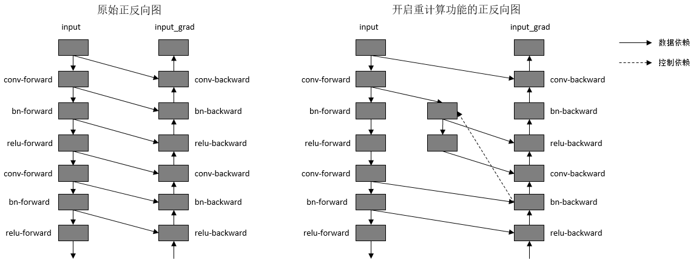

# 重计算

[](https://gitee.com/mindspore/docs/blob/r2.3/tutorials/experts/source_zh_cn/parallel/recompute.md)

## 概述

MindSpore采用反向模式的自动微分，根据正向图计算流程来自动推导出反向图，正向图和反向图一起构成了完整的计算图。在计算某些反向算子时，需要用到一些正向算子的计算结果，导致这些正向算子的计算结果需要驻留在内存中，直到依赖它们的反向算子计算完，这些正向算子的计算结果占用的内存才会被复用。这一现象推高了训练的内存峰值，在大规模网络模型中尤为显著。

为了解决这个问题，MindSpore提供了重计算的功能，可以不保存正向算子的计算结果，让这些内存可以被复用，然后在计算反向算子时，如果需要正向的结果，再重新计算正向算子。此教程以模型ResNet-50为例，讲解MindSpore如何配置重计算功能去训练模型。

相关接口：

1. `mindspore.nn.Cell.recompute()`：调用`Cell`的[recompute接口](https://www.mindspore.cn/docs/zh-CN/r2.3/api_python/nn/mindspore.nn.Cell.html#mindspore.nn.Cell.recompute)，调用该接口之后，在计算反向部分时，除了该Cell的输出算子，Cell里面其他的所有算子以及子Cell里面的所有算子都会被重新计算。

2. `mindspore.ops.Primitive.recompute()`：调用`Primitive`的[recompute接口](https://www.mindspore.cn/docs/zh-CN/r2.3/api_python/ops/mindspore.ops.Primitive.html#mindspore.ops.Primitive.recompute)，调用该接口之后，在计算反向部分时，该算子会被重新计算。

## 基本原理

MindSpore根据正向图计算流程来自动推导出反向图，正向图和反向图一起构成了完整的计算图。在计算某些反向算子时，可能需要用到某些正向算子的计算结果，导致这些正向算子的计算结果，需要驻留在内存中直到这些反向算子计算完，它们所占的内存才会被其他算子复用。而这些正向算子的计算结果，长时间驻留在内存中，会推高计算的内存占用峰值，在大规模网络模型中尤为显著。

为了降低内存峰值，重计算技术可以不保存正向激活层的计算结果，让该内存可以被复用，然后在计算反向部分时，重新计算出正向激活层的结果。MindSpore提供了重计算的能力。

重计算功能具体实现为根据用户指定的需要做重计算的正向算子，复制出一份相同的算子，输出到反向算子上，并删除原正向算子与反向算子间的连边关系。另外，我们需要保证复制出来的算子，在计算相应的反向部分时才开始被计算，所以需要插入控制依赖去保证算子执行顺序。如下图所示：



*图：开启重计算功能前后的正反向示意图*

为了方便用户使用，MindSpore目前不仅提供了针对单个算子设置的重计算接口，还提供针对Cell设置的重计算接口。当用户调用Cell的重计算接口时，这个Cell里面的所有正向算子都会被设置为重计算。

以GPT-3模型为例，设置策略为对每层layer对应的Cell设置为重计算，然后每层layer的输出算子设置为非重计算。72层GPT-3网络开启重计算的效果如下图所示：


*图：开启重计算功能前后的GPT-3内存使用比较*

## 操作实践

下面以Ascend或者GPU单机8卡为例，进行重计算操作说明：

### 样例代码说明

> 下载完整的样例代码：[recompute](https://gitee.com/mindspore/docs/tree/r2.3/docs/sample_code/recompute)。

目录结构如下：

```text
└─ sample_code
    ├─ recompute
       ├── train.py
       └── run.sh
    ...
```

其中，`train.py`是定义网络结构和训练过程的脚本。`run.sh`是执行脚本。

### 配置分布式环境

首先通过context接口指定运行模式、运行设备、运行卡号等，并行模式为数据并行模式，并通过init初始化HCCL或NCCL通信。设置`save_graphs=2`可以打印出计算图结构进行对比。`device_target`会自动指定为MindSpore包对应的后端硬件设备。

```python
import mindspore as ms
from mindspore.communication import init

ms.set_context(mode=ms.GRAPH_MODE, save_graphs=2)
ms.set_auto_parallel_context(parallel_mode=ms.ParallelMode.DATA_PARALLEL, gradients_mean=True)
init()
ms.set_seed(1)
```

### 数据集加载

此处数据集加载采用数据并行模式，指定`num_shards`和`shard_id`参数，分别对应卡的数量和逻辑序号，代码如下：

```python
import os
import mindspore.dataset as ds
from mindspore import nn

def create_dataset(batch_size):
    dataset_path = os.getenv("DATA_PATH")
    rank_id = get_rank()
    rank_size = get_group_size()
    dataset = ds.MnistDataset(dataset_path, num_shards=rank_size, shard_id=rank_id)
    image_transforms = [
        ds.vision.Rescale(1.0 / 255.0, 0),
        ds.vision.Normalize(mean=(0.1307,), std=(0.3081,)),
        ds.vision.HWC2CHW()
    ]
    label_transform = ds.transforms.TypeCast(ms.int32)
    dataset = dataset.map(image_transforms, 'image')
    dataset = dataset.map(label_transform, 'label')
    dataset = dataset.batch(batch_size)
    return dataset

data_set = create_dataset(32)
```

### 网络定义

网络在单卡模型的基础上，给激活函数算子配置了重计算，以减少内存占用：

```python
from mindspore import nn, ops

class Network(nn.Cell):
    def __init__(self):
        super().__init__()
        self.flatten = nn.Flatten()
        self.layer1 = nn.Dense(28*28, 512)
        self.relu1 = ops.ReLU()
        self.layer2 = nn.Dense(512, 512)
        self.relu2 = ops.ReLU()
        self.layer3 = nn.Dense(512, 10)

    def construct(self, x):
        x = self.flatten(x)
        x = self.layer1(x)
        x = self.relu1(x)
        x = self.layer2(x)
        x = self.relu2(x)
        logits = self.layer3(x)
        return logits

net = Network()
# 配置relu算子的重计算
net.relu1.recompute()
net.relu2.recompute()
```

### 训练网络

在这一步，我们需要定义损失函数、优化器以及训练过程，这个部分与数据并行模型一致：

```python
from mindspore import nn, ops

optimizer = nn.SGD(net.trainable_params(), 1e-2)
loss_fn = nn.CrossEntropyLoss()

def forward_fn(data, target):
    logits = net(data)
    loss = loss_fn(logits, target)
    return loss, logits

grad_fn = ops.value_and_grad(forward_fn, None, net.trainable_params(), has_aux=True)
grad_reducer = nn.DistributedGradReducer(optimizer.parameters)

for epoch in range(1):
    i = 0
    for image, label in data_set:
        (loss_value, _), grads = grad_fn(image, label)
        grads = grad_reducer(grads)
        optimizer(grads)
        if i % 10 == 0:
            print("epoch: %s, step: %s, loss is %s" % (epoch, i, loss_value))
        i += 1
```

### 运行单机8卡脚本

接下来通过命令调用对应的脚本，以`mpirun`启动方式，8卡的分布式训练脚本为例，进行分布式训练：

```bash
bash run.sh
```

训练完后，日志文件保存到`log_output`目录下，通过在`train.py`中设置context: `save_graphs=2`，可以打印出编译过程中的IR图，其中部分文件目录结构如下：

```text
├─ log_output
|   └─ 1
|       ├─ rank.0
|       |   └─ stdout
|       ├─ rank.1
|       |   └─ stdout
|       ...
├─ rank_0
|   ├─ xx_validate_xxx.ir
|   ...
├─ rank_1
|   ├─ xx_validate_xxx.ir
|   ...
...
```

关于Loss部分结果保存在`log_output/1/rank.*/stdout`中，示例如下：

```text
epoch: 0, step: 0, loss is 2.2929618
epoch: 0, step: 10, loss is 2.2396836
epoch: 0, step: 20, loss is 2.2097976
epoch: 0, step: 30, loss is 2.1942225
epoch: 0, step: 40, loss is 2.0986974
epoch: 0, step: 50, loss is 2.0612597
...
```

计算图结果在`xx_validate_xxx.ir`中，设置重计算前：

```text
...
  %81(1285) = MatMul(%80, %11) primitive_attrs: {output_names: (output), transpose_a: Bool(0), input_names: (x1, x2), transpose_x2: Bool(1), transpose_x1: Bool(0), transpose_b: Bool(1)} cnode_primal_attrs: {forward_node_name: "MatMul_24422", forward_unique_id: "24422"}
      : (<Tensor[Float32], (32, 10)>, <Tensor[Float32], (512, 10)>) -> (<Tensor[Float32], (32, 512)>)
...
  %82(1286) = ReluGrad(%81, %10) primitive_attrs: {output_names: (output), input_names: (x)} cnode_primal_attrs: {forward_node_name: "ReLU_24405", forward_unique_id: "24405"}
      : (<Tensor[Float32], (32, 512)>, <Tensor[Float32], (32, 512)>) -> (<Tensor[Float32], (32, 512)>)
...
  %83(1285) = MatMul(%82, %6) primitive_attrs: {output_names: (output), transpose_a: Bool(0), input_names: (x1, x2), transpose_x2: Bool(1), transpose_x1: Bool(0), transpose_b: Bool(1)} cnode_primal_attrs: {forward_node_name: "MatMul_24434", forward_unique_id: "24434"}
      : (<Tensor[Float32], (32, 512)>, <Tensor[Float32], (512, 512)>) -> (<Tensor[Float32], (32, 512)>)
...
  %84(1286) = ReluGrad(%83, %5) primitive_attrs: {output_names: (output), input_names: (x)} cnode_primal_attrs: {forward_node_name: "ReLU_24408", forward_unique_id: "24408"}
      : (<Tensor[Float32], (32, 512)>, <Tensor[Float32], (32, 512)>) -> (<Tensor[Float32], (32, 512)>)
...
  %85(1285) = MatMul(%0, %84) primitive_attrs: {output_names: (output), transpose_a: Bool(1), input_names: (x1, x2), transpose_x2: Bool(0), transpose_x1: Bool(1), transpose_b: Bool(0)} cnode_primal_attrs: {forward_node_name: "MatMul_24446", forward_unique_id: "24446"}
      : (<Tensor[Float32], (32, 784)>, <Tensor[Float32], (32, 512)>) -> (<Tensor[Float32], (784, 512)>)
...
```

设置重计算后：

```text
...
  %81(1285) = MatMul(%80, %11) primitive_attrs: {output_names: (output), transpose_a: Bool(0), input_names: (x1, x2), transpose_x2: Bool(1), transpose_x1: Bool(0), transpose_b: Bool(1)} cnode_primal_attrs: {forward_node_name: "MatMul_24422", forward_unique_id: "24422"}
      : (<Tensor[Float32], (32, 10)>, <Tensor[Float32], (512, 10)>) -> (<Tensor[Float32], (32, 512)>)
...
  %84([CNode]1292) = ReLU(%83) {instance name: relu2} primitive_attrs: {output_names: [output], input_names: [x], recompute: Bool(1)} cnode_attrs: {recompute_sub_graph: U64(1), recompute_id: I64(2), duplicated: Bool(1), need_cse_after_recompute: Bool(1)}
      : (<Tensor[Float32], (32, 512)>) -> (<Tensor[Float32], (32, 512)>)
      # Scope: (Default)
  %85([CNode]1293) = ReluGrad(%81, %84) primitive_attrs: {output_names: (output), input_names: (x)} cnode_attrs: {recompute_sub_graph: U64(1), target_grad: Bool(1)} cnode_primal_attrs: {forward_node_name: "ReLU_24405", forward_unique_id: "24405"}
      : (<Tensor[Float32], (32, 512)>, <Tensor[Float32], (32, 512)>) -> (<Tensor[Float32], (32, 512)>)
...
  %86(1285) = MatMul(%85, %6) primitive_attrs: {output_names: (output), transpose_a: Bool(0), input_names: (x1, x2), transpose_x2: Bool(1), transpose_x1: Bool(0), transpose_b: Bool(1)} cnode_primal_attrs: {forward_node_name: "MatMul_24434", forward_unique_id: "24434"}
      : (<Tensor[Float32], (32, 512)>, <Tensor[Float32], (512, 512)>) -> (<Tensor[Float32], (32, 512)>)
...
  %89([CNode]1296) = ReLU(%88) {instance name: relu2} primitive_attrs: {output_names: [output], input_names: [x], recompute: Bool(1)} cnode_attrs: {recompute_sub_graph: U64(0), recompute_id: I64(1), duplicated: Bool(1), need_cse_after_recompute: Bool(1)}
      : (<Tensor[Float32], (32, 512)>) -> (<Tensor[Float32], (32, 512)>)
      # Scope: (Default)
  %90([CNode]1297) = ReluGrad(%86, %89) primitive_attrs: {output_names: (output), input_names: (x)} cnode_attrs: {recompute_sub_graph: U64(0), target_grad: Bool(1)} cnode_primal_attrs: {forward_node_name: "ReLU_24408", forward_unique_id: "24408"}
      : (<Tensor[Float32], (32, 512)>, <Tensor[Float32], (32, 512)>) -> (<Tensor[Float32], (32, 512)>)
...
  %91(1285) = MatMul(%0, %90) primitive_attrs: {output_names: (output), transpose_a: Bool(1), input_names: (x1, x2), transpose_x2: Bool(0), transpose_x1: Bool(1), transpose_b: Bool(0)} cnode_primal_attrs: {forward_node_name: "MatMul_24446", forward_unique_id: "24446"}
      : (<Tensor[Float32], (32, 784)>, <Tensor[Float32], (32, 512)>) -> (<Tensor[Float32], (784, 512)>)
...
```

可见，`ReLU`算子被复制出来了一份，作为反向算子`ReluGrad`的输入。
