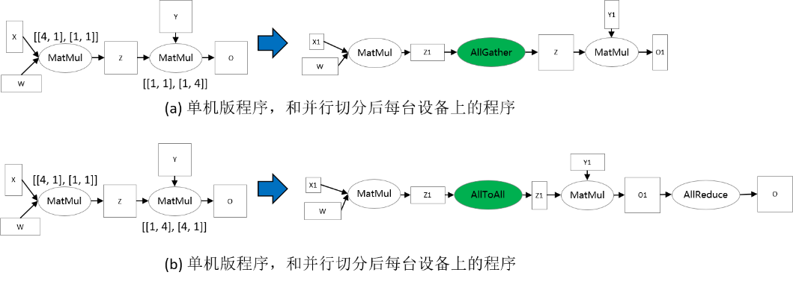

# 切分策略传播

`Ascend` `GPU` `并行训练` `自动并行`

<a href="https://gitee.com/mindspore/docs/blob/master/tutorials/experts/source_zh_cn/parallel/sharding_propagation.md" target="_blank"></a>

## 背景

分布式算子、张量排布和张量重排布是MindSpore中算子级并行中的基本概念。在[这里]( https://www.mindspore.cn/docs/zh-CN/master/design/distributed_training_design.html#automatic-parallelism)，以例子的形式介绍了这些概念。现在，我们形式化地定义这些概念。

算子级并行属于“单程序多数据”（Single Program Multiple Data，SPMD）的一种实现。同一段程序执行在不同数据分片上。MindSpore将单机版本的程序转换成并行版本的程序。该转换是细粒度的，会将单机版本程序中每个算子替换成分布式算子，同时保证替换是数学等价的。

### 分布式算子

分布式算子：运行在多设备上的分布式算子保证了与单机版本算子计算语义等价性。也就是：给定相同输入，分布式算子与单机版本算子总是得到相同的输出。

考虑矩阵乘算子（MatMul），其输入是两个矩阵X和W，Y = MatMul(X, W)。将此算子切到4台设备上并行执行。如果矩阵X在4台设备上都有副本，而W按列切分4份，每台设备有一份，那么单机版本MatMul算子对应的分布式算子同样是MatMul；即每台设备上都将执行MatMul算子。如果将X按照列切分4份，W按行切4份，每台机器各得到X和W的一个分片，那么单机版本MatMul算子对应的分布式算子是MatMul->AllReduce；即每台设备上都将顺序执行MatMul和AllReduce两个算子，才能保证数学等价性。

除了“单程序”（Single Program，SP）外，“多数据”（Multiple Data，MD）也需要指定，也就是哪台设备得到数据的哪个切片。为此，我们先定义切分策略（Sharding Strategy）。

### 切分策略

切分策略：算子的切分策略是一个二维数组，表示该算子的每个输入张量中的每个维度的切片数量。这里的切分都是均匀切分。

由切分策略，可以推导出**张量排布**，用以描述张量是如何分布在各个设备上的。

### 张量排布

张量排布：给定一个算子的切分策略，能够推导出该算子的输入和输出张量的**张量排布**；张量排布是由**逻辑设备矩阵**和**张量映射**构成的。逻辑设备矩阵是该算子的输入和输出张量共用的，为一维数组，表示设备是如何组织的。张量映射是二维数组，表示张量的某一维切分到逻辑设备矩阵的某一维。

同样考虑矩阵乘算子（MatMul），其输入是两个矩阵X和W：Y = MatMul(X, W)。给算子配置切分策略为[[2, 1], [1, 4]]，因此而得到的张量排布和每台设备上执行的计算如下图所示。X沿行均匀切分为2份，W沿列均匀切分为4份（如下图(b)）。根据切分策略，推导出逻辑设备矩阵和张量映射，如下图(c)所示。各个设备的坐标因此也确定下来了，描述了其在逻辑设备矩阵中的位置。张量在各个设备中的分布由设备的坐标决定。由下图(c)中表的‘2’列得出：设备0—设备3得到X<sub>0</sub>分片，设备4—设备7得到X<sub>1</sub>分片。由下图(c)中表的‘4’列得出：设备0和设备4得到W<sub>0</sub>分片，设备1和设备5得到W<sub>1</sub>分片，设备2和设备6得到W<sub>2</sub>分片，设备3和设备7得到W<sub>3</sub>分片。因此，各台设备上的计算也确定下来了，如下图(d)所示。


对于有数据依赖的两个算子（即一个算子的输出张量被第二个算子使用），两个算子对于该数据依赖张量定义的张量排布可能不同（由于逻辑设备矩阵不同或张量映射不同），因此提出了**张量重排布**，用以转换不一致的排布。这里给出张量重排布的定义，省略了具体算法。

### 张量重排布

张量重排布：给定同一张量的两个不一致的张量排布，张量重排布能够将源排布转换到目的排布，同时保证转换产生的通信代价最小。

这里的通信代价指的是每台设备通信的数据量。

考虑两个矩阵乘算子的例子：Z = MatMul(X, W), O = MatMul(Z, Y)。为了使得张量重排布起作用，两个矩阵乘算子配置了不同的切分策略，使得张量Z的排布不一致。在下图(a)中，第一个矩阵乘算子的输出张量Z是按行切分的，然而第二个矩阵乘算子要求张量Z是完整的，因此张量重排布推导出这里需要插入AllGather算子完成转换[1]。在下图(b)中，第一个矩阵乘算子的输出张量Z是按行切分的，然而第二个矩阵乘算子要求张量Z是按列切分的，故张量重排布推导出这里需要插入AllToAll算子完成转换。



## 基本原理

给定计算图，**切分策略传播**（Sharding Propagation）使得策略由配置的算子传播到整张计算图的所有算子。在传播过程中，策略选择的目标是最小化张量重排布产生的通信代价。

切分策略传播的输入是带有一些算子切分策略的计算图，其中的点表示算子，有向边表示数据依赖关系。切分策略传播的执行流程如下：

1. 为未配置切分策略的算子生成可行的切分策略；
2. 为每条边生成重排布策略及相应的代价；
3. 从已配置切分策略的算子出发，利用广度优先搜索将切分策略传播到其它未配置切分策略的算子。传播过程的目标是最小化每条边上的重排布通信代价。

下图所示的是切分策略传播的一个流程实例。在给定带有切分策略的计算图后，首先为没有配置切分策略的算子枚举其可行的策略，如下图(b)所示。然后，为每条边枚举重排布策略和相应的代价。如下图(c)所示，这里的重排布策略定义为二元组[*s_strategy*, *t_strategy*]，其中*s_strategy*表示的是源算子（下图(c)中的ReLU）的切分策略，*t_strategy*表示的是目的算子（下图(c)中的MatMul）的切分策略。当沿着一条边传播到下一个算子时（如图中ReLU切分策略已确定，为[2, 4]，下一步要决定MatMul算子的切分策略），总是在表中选择引起通信代价最小的目的算子的策略（即为MatMul选择[[2, 4], [4, 1]]）。最后，所有算子的切分策略都被确定，如下图(d)所示。


## 操作实践

### 样例代码说明

> 可以在这里下载完整的样例代码：
>
> <https://gitee.com/mindspore/docs/tree/master/docs/sample_code/sharding_propagation>。

目录结构如下，其中，`rank_table_8pcs.json`是配置当前Ascend多卡环境的组网信息文件（关于该配置文件的说明，参见[这里]( https://www.mindspore.cn/tutorials/experts/zh-CN/master/parallel/distributed_training_ascend.html#id4)），`train.py`是模型定义脚本，`run.sh`是执行脚本。

```text
└─sample_code
    ├─sharding_propagatinon
    │      rank_table_8pcs.json
    │      run.sh
    │      train.py
    ...
```

### 模型定义

我们定义以FeedForward Network（`FFN`）为例：

```python
class FFN(Cell):
    def __init__(self):
        super().__init__()
        self.dense1 = Dense(64, 64)
        self.relu = ops.ReLU()
        self.dense2= Dense(64, 64)

    def construct(self, x):
        x = self.dense1(x)
        x = self.relu(x)
        x = self.dense2(x)
        return x
```

### 配置切分策略传播

在FFN中为MatMul配置切分策略：

```python
self.dense1.matmul.shard(((2, 1), (1, 4)))
```

配置并行模式为自动并行的切分策略传播：

```python
context.set_auto_parallel_context(parallel_mode="auto_parallel", search_mode="sharding_propagation")
```

### 训练模型并检查切分策略

执行命令`bash run.sh 8`。通过在`train.py`中设置context: `save_graphs=True`，可以打印出编译过程中的IR图。我们选取设备0对应的IR图。

在`step_parallel_begin_xxxx.ir`中，可以看到每个计算算子都被配置了切分策略。

```text
...
  %3(x) = MatMul(%1, %2) {instance name: matmul} primitive_attrs: {input_names: [x1, x2], out_strategy: None, transpose_x2: false, transpose_b: false, in_strategy: ((2, 1), (1, 4)), output_names: [output], transpose_a: false, transpose_x1: false}
 {in_strategy: ((2, 1), (1, 4))}      : (<Tensor[Float32], (64, 64)>, <Tensor[Float32], (64, 64)>) -> (<Tensor[Float32], (64, 64)>)
  %4([CNode]453) = Load($(@1_construct_wrapper.298:para4_dense1.bias), %para15_u)
      : (<Ref[Tensor(F32)], (64)>, <UMonad>) -> (<Tensor[Float32], (64)>)
  %5(x) = Add(%3, %4) {instance name: add} primitive_attrs: {output_names: [output], input_names: [x, y]}
 {in_strategy: ((2, 4), (4))}      : (<Tensor[Float32], (64, 64)>, <Tensor[Float32], (64)>) -> (<Tensor[Float32], (64, 64)>)
  %6(x) = ReLU(%5) {instance name: relu} primitive_attrs: {output_names: [output], input_names: [x]}
 {in_strategy: ((2, 4))}      : (<Tensor[Float32], (64, 64)>) -> (<Tensor[Float32], (64, 64)>)
  %7([CNode]447) = Load($(@1_construct_wrapper.298:para5_dense2.weight), %para15_u)
      : (<Ref[Tensor(F32)], (64, 64)>, <UMonad>) -> (<Tensor[Float32], (64, 64)>)
  %8(x) = MatMul(%6, %7) {instance name: matmul} primitive_attrs: {output_names: [output], transpose_a: false, input_names: [x1, x2], transpose_x2: false, transpose_x1: false, transpose_b: false}
 {in_strategy: ((2, 4), (4, 1))}      : (<Tensor[Float32], (64, 64)>, <Tensor[Float32], (64, 64)>) -> (<Tensor[Float32], (64, 64)>)
  %9([CNode]449) = Load($(@1_construct_wrapper.298:para6_dense2.bias), %para15_u)
      : (<Ref[Tensor(F32)], (64)>, <UMonad>) -> (<Tensor[Float32], (64)>)
  %10(x) = Add(%8, %9) {instance name: add} primitive_attrs: {output_names: [output], input_names: [x, y]}
 {in_strategy: ((2, 4), (4))}      : (<Tensor[Float32], (64, 64)>, <Tensor[Float32], (64)>) -> (<Tensor[Float32], (64, 64)>)
...
```

在`xx_validate_xxx.ir`中，可以看到各个算子的输入输出张量是已经被切分后的。

```text
...
  %2(equivx) = MatMul(%0, %1) {instance name: matmul} primitive_attrs: {input_names: [x1, x2], out_strategy: None, transpose_x2: false, transpose_b: false, in_strategy: ((2, 1), (1, 4)), output_names: [output], transpose_a: false, transpose_x1: false}
 {in_strategy: ((2, 1), (1, 4))}      : (<Tensor[Float32], (32, 64)>, <Tensor[Float32], (64, 16)>) -> (<Tensor[Float32], (32, 16)>)
      # In file ./train.py(33)/        x = self.matmul(x, self.weight)/
  %3(equiv[CNode]453) = Load(%para4_dense1.bias, U)
      : (<Ref[Tensor(F32)], (16)>, <UMonad>) -> (<Tensor[Float32], (16)>)
  %4(equivx) = Add(%2, %3) {instance name: add} primitive_attrs: {output_names: [output], input_names: [x, y]}
 {in_strategy: ((2, 4), (4))}      : (<Tensor[Float32], (32, 16)>, <Tensor[Float32], (16)>) -> (<Tensor[Float32], (32, 16)>)
      # In file ./train.py(34)/        x = self.add(x, self.bias)/
  %5(equivx) = ReLU(%4) {instance name: relu} primitive_attrs: {output_names: [output], input_names: [x]}
 {in_strategy: ((2, 4))}      : (<Tensor[Float32], (32, 16)>) -> (<Tensor[Float32], (32, 16)>)
      # In file ./train.py(48)/        x = self.relu(x)/
  %6(equiv[CNode]447) = Load(%para5_dense2.weight, U)
      : (<Ref[Tensor(F32)], (16, 64)>, <UMonad>) -> (<Tensor[Float32], (16, 64)>)
  %7(equivx) = MatMul(%5, %6) {instance name: matmul} primitive_attrs: {output_names: [output], transpose_a: false, input_names: [x1, x2], transpose_x2: false, transpose_x1: false, transpose_b: false}
 {in_strategy: ((2, 4), (4, 1))}      : (<Tensor[Float32], (32, 16)>, <Tensor[Float32], (16, 64)>) -> (<Tensor[Float32], (32, 64)>)
      # In file ./train.py(33)/        x = self.matmul(x, self.weight)/
  %8(equiv[CNode]493) = AllReduce(%7) {instance name: forward_op_4025687080669949636} primitive_attrs: {group: 4-6301172352641561019, fusion: 0, op: sum, group_ranks: 0-1-2-3, index: 0}
      : (<Tensor[Float32], (32, 64)>) -> (<Tensor[Float32], (32, 64)>)
  %9(equiv[CNode]492) = StridedSlice(%8, (0, 0), (32, 16), (1, 1)) {instance name: redistribution_op_145462406996255498StridedSlice} primitive_attrs: {new_axis_mask: 0, shrink_axis_mask: 0, end_mask: 0, input_names: [x, begin, end, strides], output_names: [output], keep_value_node_input: true, begin_mask: 0, ellipsis_mask: 0}
      : (<Tensor[Float32], (32, 64)>, <Tuple[Int64*2]>, <Tuple[Int64*2]>, <Tuple[Int64*2]>) -> (<Tensor[Float32], (32, 16)>)
  %10(equiv[CNode]449) = Load(%para6_dense2.bias, U)
      : (<Ref[Tensor(F32)], (16)>, <UMonad>) -> (<Tensor[Float32], (16)>)
  %11(equivx) = Add(%9, %10) {instance name: add} primitive_attrs: {output_names: [output], input_names: [x, y]}
 {in_strategy: ((2, 4), (4))}      : (<Tensor[Float32], (32, 16)>, <Tensor[Float32], (16)>) -> (<Tensor[Float32], (32, 16)>)
...
```

[1]：注：实际上需要插入AllGather算子和Concat算子。
