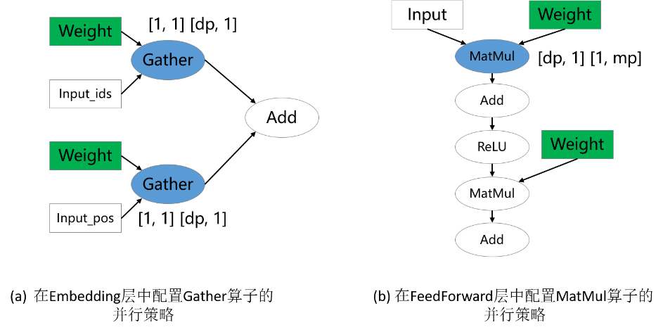

# 切分技巧

## 概述

给定一个新模型，从用户的角度，关键问题是配置哪些算子的切分策略来获得较好的性能。由于策略传播的目标是最小化张量重排布的代价，而非最小化端到端的迭代时间，因此，为“关键算子”配置合适的切分策略是十分重要的。然而，并不存在明确的规定约束哪些算子是必须配置切分策略的。尽管如此，基于我们训练大模型的经验，确实有一些原则可以用来指导新用户配置并行策略。这里，我们列出3条经验性的原则。

### 配置涉及权重的算子

参数权重的切分策略是十分重要的，尤其对大模型来说，因为参数权重引起的内存消耗占据模型训练总内存消耗的大部分。因此，涉及权重的算子通常需要显式地配置切分策略。在下图的两个例子中，涉及权重的Gather和MatMul算子配置了切分策略，而其他算子没有配置。这分别对应[mindformers](https://gitee.com/mindspore/mindformers/blob/r0.8/mindformers/modules/transformer/transformer.py)中的数据并行VocabEmbedding层和混合并行FeedForward层。

### 配置维度改变的算子

深度学习框架的算子大致可以分为两类：语义简单的维度保持的算子；会改变输入张量维度的算子。对于维度保持算子，策略传播算法可以较容易地将切分策略传播出去。但是，对于维度改变算子，显式地配置切分策略才能更好地表达用户的初始想法，避免策略传播算法推导出非用户期望的切分策略。在下图的例子中，ReduceMean和MatMul是维度改变算子，它们被配置了切分策略。

### 配置并行方式改变的边界算子

对于类似ResNet类的模型，模型的不同部分偏好的并行方式不同：前半部分使用数据并行，后半部分使用模型并行，以此获得最优的迭代性能。这可以通过为并行方式改变的边界算子配置策略来实现。在下图的例子中，第一个MatMul配置了数据并行的策略，它会将数据并行的策略向前传播到模型的前半部分；第二个MatMul配置了模型并行的策略，它会将模型并行的策略向后传播到模型的后半部分。

用户在用策略传播时不仅需要对其传播算法本身有一定的了解，还要对要训练的模型的并行方式有一定的理解。如果存在某个由策略传播算法决定的算子的并行策略不符合用户的期望，那总可以通过多配置一个算子并行策略的方式解决。实际中，对于一个新模型，确实需要尝试几次才能获得性能较优的整体并行配置。
