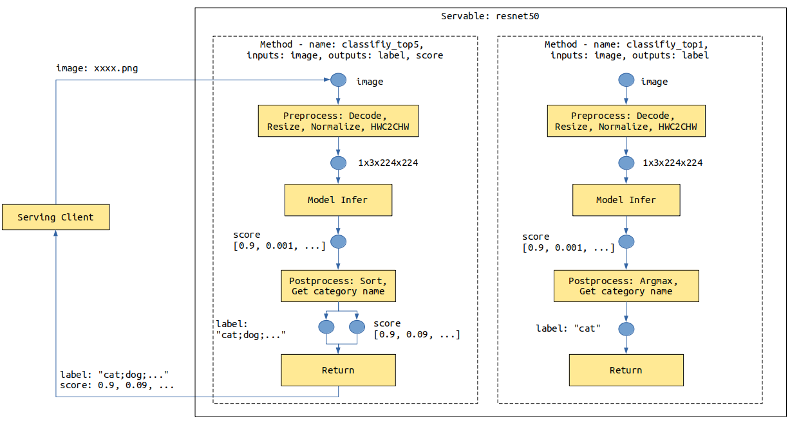

# 通过配置模型提供Servable

`Linux` `Ascend` `Serving` `初级` `中级` `高级`

<!-- TOC -->

- [通过配置模型提供Servable](#通过配置模型提供servable)
    - [概述](#概述)
    - [相关概念](#相关概念)
        - [预处理和后处理](#预处理和后处理)
        - [方法](#方法)
        - [实例](#实例)
    - [模型配置](#模型配置)
        - [预处理和后处理定义](#预处理和后处理定义)
        - [模型声明](#模型声明)
        - [方法定义](#方法定义)

<!-- /TOC -->

<a href="https://gitee.com/mindspore/docs/blob/master/tutorials/inference/source_zh_cn/serving_model.md" target="_blank"></a>

## 概述

MindSpore Serving当前仅支持Ascend 310和Ascend 910环境。

MindSpore Serving的Servable提供推理服务，包含两种类型。一种是推理服务来源于单模型，一种是推理服务来源于多模型组合，多模型组合正在开发中。模型需要进行配置以提供Serving推理服务。

本文将说明如何对单模型进行配置以提供Servable，以下所有Servable配置说明针对的是单模型Servable，Serving客户端简称客户端。

本文以ResNet-50作为样例介绍如何配置模型提供Servable。样例代码可参考[ResNet-50样例](https://gitee.com/mindspore/serving/tree/master/example/resnet/) 。

## 相关概念

### 预处理和后处理

模型提供推理能力，模型的每个输入和输出的数据类型、数据长度、Shape是固定的。

如果客户端发来的数据不能直接满足模型输入要求，需要通过预处理转化为满足模型输入的数据。
如果模型的输出不直接提供给客户端，需要通过后处理转化为所需的输出数据。

以下图是`resnet50` Servable数据流程图，描述了图像数据从Serving客户端通过网络传输到Serving，Serving进行预处理、推理和后处理，最后向Serving客户端返回结果：



针对Resnet50推理模型，客户端发来的数据为jpg、png等格式的图片，预期返回图片的分类。Resnet模型输入为经过图片`Decode`、`Resize`、`Normalize`等操作产生的Tensor，输出为每个类别的得分Tensor。需要通过预处理将图片转化为满足模型输入的Tensor，通过后处理返回**得分最大的类别名称**或者**前5类别名称及其得分**。

在不同的场景下，如果来自客户端的数据输入组成、结构或类型不同，可以提供不同的预处理。如果对模型的输出也有不同的要求，可以提供不同的后处理。比如上述`resnet50` Servable，针对返回**得分最大的类别名称**还是**前5类别名称及其得分**这两种场景提供了两个后处理。

### 方法

上述的`resnet` Servable提供了`classify_top5`和`classify_top1`两个方法（`Method`）。`classify_top5`输入为`image`，输出为`label`和`score`，返回前5的分类名称和得分。`classify_top1`预处理和`classify_top5`一致，而后处理不同，输入为`image`，输出为`label`，返回最大得分的分类名称。

一个Servable可提供一个或多个方法，Servable的名称和方法的名称标记了Serving提供的一个服务，每个方法对客户端提供的数据进行可选的预处理，接着进行模型推理，对模型的推理结果进行可选的后处理，最后将需要的结果返回给客户端。

Servable包含如下内容：

- 指定可选的预处理和可选的后处理；
- 定义方法输入、预处理、模型、后处理、方法输出之间的数据流，前者可作为后者的输入。比如方法输出的值可来源于方法输入、预处理、模型或后处理；
- 指定方法名，使客户端可以通过方法名指定使用的方法；
- 指定方法的输入和输出名称，使客户端可以通过名称来指定输入、获取输出。

### 实例

每次请求可包括一个或多个实例，每个实例之间相互独立，结果互不影响。比如一张图片返回一个分类类别，三张独立的图片独立返回三个分类类别。

## 模型配置

以Resnet50模型为例，模型配置文件目录结果如下图所示：

```shell
resnet50
├── 1
│   └── resnet_classify.mindir
├── 2
│   └── resnet_classify.mindir
└── servable_config.py
```

- 目录`resnet50`指示Servable的名称。

- 通过`servable_config.py`配置Servable，其中包括预处理和后处理定义、模型声明、方法定义。

- 目录`1`和`2`表示版本`1`和版本`2`的模型，模型版本为正整数，从`1`开始，数字越大表示版本越新。

- `resnet_classify.mindir`为模型文件，Servable启动会加载对应版本的模型文件。

### 预处理和后处理定义

预处理和后处理定义方式例子如下：

```python
import mindspore.dataset as ds
import mindspore.dataset.transforms.c_transforms as TC
import mindspore.dataset.vision.c_transforms as VC

def preprocess_eager(image):
    """
    Define preprocess, input is image numpy, return preprocess result.
    Return type can be numpy, str, bytes, int, float, or bool.
    Use MindData Eager, this image processing can also use other image processing library, likes numpy, PIL or cv2 etc.
    """
    image_size = 224
    mean = [0.485 * 255, 0.456 * 255, 0.406 * 255]
    std = [0.229 * 255, 0.224 * 255, 0.225 * 255]

    decode = VC.Decode()
    resize = VC.Resize([image_size, image_size])
    normalize = VC.Normalize(mean=mean, std=std)
    hwc2chw = VC.HWC2CHW()

    image = decode(image)
    image = resize(image)
    image = normalize(image)
    image = hwc2chw(image)
    return image

def postprocess_top1(score):
    """
    Define postprocess. This example has one input and one output.
    The input is the numpy tensor of the score, and the output is the label str of top one.
    """
    max_idx = np.argmax(score)
    return idx_2_label[max_idx]


def postprocess_top5(score):
    """
    Define postprocess. This example has one input and two outputs.
    The input is the numpy tensor of the score. The first output is the str joined by labels of top five, and the second output is the score tensor of the top five.
    """
    idx = np.argsort(score)[::-1][:5]  # top 5
    ret_label = [idx_2_label[i] for i in idx]
    ret_score = score[idx]
    return ";".join(ret_label), ret_score
```

预处理和后处理定义格式相同，入参为每个实例的输入数据。输入数据为文本时，入参为str对象；输入数据为其他数据类型，包括Tensor、Scalar number、Bool、Bytes时，入参为**numpy对象**。通过`return`返回实例的处理结果，`return`返回的数据可为**numpy、Python的bool、int、float、str、或bytes**单个数据对象或者由它们组成的tuple。

预处理和后处理输入的来源和输出的使用由[方法定义](https://www.mindspore.cn/tutorial/inference/zh-CN/master/serving_model.html#id9)决定。

### 模型声明

`resnet50` Servabale模型声明示例代码如下所示：

```python
from mindspore_serving.worker import register
register.declare_servable(servable_file="resnet50_1b_imagenet.mindir", model_format="MindIR", with_batch_dim=True)
```

其中`declare_servable`入参`servable_file`指示模型的文件名称；`model_format`指示模型的模型类别，当前Ascend310环境支持`OM`和`MindIR`两种模型类型，Ascend910环境仅支持`MindIR`模型类型。

如果模型输入和输出第1维度不是`batch`维度，需要设置参数`with_batch_dim=False`，`with_batch_dim`默认为`True`。

设置`with_batch_dim`为`True`，主要针对处理图片、文本等包含`batch`维度的模型。假设`batch_size=2`，当前请求有3个实例，共3张图片，会拆分为2次模型推理，第1次处理2张图片返回2个结果，第2次对剩余的1张图片进行拷贝做一次推理并返回1个结果，最终返回3个结果。


设置`with_batch_dim`为`False`，主要针对不涉及或不考虑`batch`维度的模型。比如输入输出为二维Tensor的矩阵乘模型。请求的每个实例将单独作一次推理任务。


另外，对于一个模型，假设其中一个输入是数据输入，包括`batch`维度信息，另一个输入为模型配置信息，没有包括`batch`维度信息，此时在设置`with_batch_dim`为`True`基础上，设置额外参数`without_batch_dim_inputs`指定没有包括`batch`维度信息的输入信息。
例如：

```python
from mindspore_serving.worker import register
# Input1 indicates the input shape information of the model, without the batch dimension information.
# input0: [N,3,416,416], input1: [2]
register.declare_servable(servable_file="yolov3_darknet53.mindir", model_format="MindIR",
                          with_batch_dim=True, without_batch_dim_inputs=1)
```

对于分布式模型`distributed_servable`，与非分布式单模型配置相比仅声明方法不同，需要使用`declare_distributed_servable`，其中入参`rank_size`表示模型推理使用的device个数，`stage_size`表示流水线的段数，可以参考[部署分布式推理服务](https://www.mindspore.cn/tutorial/inference/zh-CN/master/serving_distributed_example.html)。

```python
from mindspore_serving.worker import distributed
from mindspore_serving.worker import register

distributed.declare_distributed_servable(rank_size=8, stage_size=1, with_batch_dim=False)
```

### 方法定义

方法定义的例子如下：

```python
from mindspore_serving.worker import register

@register.register_method(output_names=["label"])
def classify_top1(image):
    """Define method `classify_top1` for servable `resnet50`.
     The input is `image` and the output is `label`."""
    x = register.call_preprocess(preprocess_eager, image)
    x = register.call_servable(x)
    x = register.call_postprocess(postprocess_top1, x)
    return x


@register.register_method(output_names=["label", "score"])
def classify_top5(image):
    """Define method `classify_top5` for servable `resnet50`.
     The input is `image` and the output is `label` and `score`. """
    x = register.call_preprocess(preprocess_eager, image)
    x = register.call_servable(x)
    label, score = register.call_postprocess(postprocess_top5, x)
    return label, score
```

上述代码在Servable `resnet50`定义了`classify_top1`和`classify_top5`方法，其中方法`classify_top1`入参为`image`，出参为`label`，方法`classify_top5`入参为`image`，出参为`label`和`score`。即，Servable方法的入参由Python方法的入参指定，Servable方法的出参由`register_method`的`output_names`指定。

另外方法定义中：

- `call_preprocess`指示了使用的预处理及其输入。

- `call_servable`指示了模型推理的输入。

- `call_postprocess`指示了使用的后处理及其输入。

- `return`指示了方法的返回数据，和`register_method`的`output_names`参数对应。

方法定义不能包括if、for、while等分支结构，预处理和后处理可选，不可重复，模型推理必选，且顺序不能打乱。

用户在客户端使用Servable某个方法提供的服务时，需要通过入参名称指定对应输入的值，通过出参名称识别各个输出的值。比如客户端访问方法`classify_top5`：

```python
from mindspore_serving.client import Client

def read_images():
    # read image file and return

def run_classify_top5():
    """Client for servable resnet50 and method classify_top5"""
    client = Client("localhost", 5500, "resnet50", "classify_top5")
    instances = []
    for image in read_images():  # read multi image
        instances.append({"image": image})  # input `image`
    result = client.infer(instances)
    print(result)
    for result_item in result:  # result for every image
        label = result_item["label"]  # result `label`
        score = result_item["score"]  # result `score`
        print("label result", label)
        print("score result", score)

if __name__ == '__main__':
    run_classify_top5()
```

另外，一次请求可包括多个实例，且多个排队处理的请求也将有多个实例，如果需要在自定义的预处理或后处理中通过多线程等并法方式处理多个实例，比如在预处理中使用MindData并发能力处理多个输入图片，MindSpore Serving提供了`call_preprocess_pipeline`和`call_postprocess_pipeline`用于注册此类预处理和后处理。详情可参考[ResNet-50样例的模型配置](https://gitee.com/mindspore/serving/blob/master/example/resnet/resnet50/servable_config.py) 。
