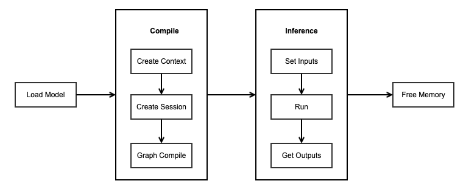

# Simplified MindSpore Lite C++ Demo

`Linux` `Windows` `x86` `C++` `Whole Process``Inference Application` `Data Preparation` `Beginner`

<a href="https://gitee.com/mindspore/docs/blob/r1.2/tutorials/lite/source_en/quick_start/quick_start_cpp.md" target="_blank"></a>

## Overview

This tutorial provides a MindSpore Lite inference demo. It demonstrates the basic on-device inference process using C++ by inputting random data, executing inference, and printing the inference result. You can quickly understand how to use inference-related APIs on MindSpore Lite. In this tutorial, the randomly generated data is used as the input data to perform the inference on the MobileNetV2 model and print the output data. The code is stored in the [mindspore/lite/examples/quick_start_cpp](https://gitee.com/mindspore/mindspore/tree/r1.2/mindspore/lite/examples/quick_start_cpp) directory.

The MindSpore Lite inference steps are as follows:

1. Load the model: Read the `.ms` model converted by the [model conversion tool](https://www.mindspore.cn/tutorial/lite/en/r1.2/use/converter_tool.html) from the file system, import the model by using [mindspore::lite::Model::Import](https://www.mindspore.cn/doc/api_cpp/en/r1.2/lite.html#import), parse the model, and create the `Model *`.
2. Create and configure context: Create and configure [context](https://www.mindspore.cn/doc/api_cpp/en/r1.2/lite.html#context) to save some basic configuration parameters required by a session to guide graph build and execution.
3. Create a session: Create [LiteSession](https://www.mindspore.cn/doc/api_cpp/en/r1.2/session.html#litesession) and configure the [context](https://www.mindspore.cn/doc/api_cpp/en/r1.2/lite.html#context) obtained in the previous step to the session.
4. Build a graph: Before performing inference, call the `CompileGraph` API of [LiteSession](https://www.mindspore.cn/doc/api_cpp/en/r1.2/session.html#litesession) to build a graph. In the graph build phase, subgraph partition and operator selection and scheduling are performed, which takes a long time. Therefore, it is recommended that with one [LiteSession](https://www.mindspore.cn/doc/api_cpp/en/r1.2/session.html#litesession) created, one graph be built. In this case, the inference will be performed for multiple times.
5. Input data: Before the graph is executed, data needs to be filled in the `Input Tensor`.
6. Perform inference: Use `RunGraph` of the [LiteSession](https://www.mindspore.cn/doc/api_cpp/en/r1.2/session.html#litesession) to perform model inference.
7. Obtain the output: After the graph execution is complete, you can obtain the inference result by `outputting the tensor`.
8. Release the memory: If the MindSpore Lite inference framework is not required, release the created [LiteSession](https://www.mindspore.cn/doc/api_cpp/en/r1.2/session.html#litesession) and [Model](https://www.mindspore.cn/doc/api_cpp/en/r1.2/lite.html#model).



> To view the advanced usage of MindSpore Lite, see [Using Runtime to Perform Inference (C++)](https://www.mindspore.cn/tutorial/lite/en/r1.2/use/runtime_cpp.html)].

## Building and Running

### Linux x86

- Environment requirements

    - System environment: Linux x86_64 (Ubuntu 18.04.02LTS is recommended.)
    - Build dependency:
        - [CMake](https://cmake.org/download/) >= 3.14
        - [GCC](https://gcc.gnu.org/releases.html) >= 7.3.0

- Build

  Run the [build script](https://gitee.com/mindspore/mindspore/blob/r1.2/mindspore/lite/examples/quick_start_cpp/build.sh) in the `mindspore/lite/examples/quick_start_cpp` directory to automatically download the MindSpore Lite inference framework library and model files and build the demo.

  ```bash
  bash build.sh
  ```

  > If the MindSpore Lite inference framework fails to be downloaded by using this build script, manually download the MindSpore Lite model inference framework [mindspore-lite-{version}-linux-x64.tar.gz](https://www.mindspore.cn/tutorial/lite/en/r1.2/use/downloads.html) whose hardware platform is CPU and operating system is Ubuntu-x64, and copy the `libmindspore-lite.a` file in the decompressed lib directory to the `mindspore/lite/examples/quick_start_cpp/lib` directory. Also copy the files from `inference/include` to the `mindspore/lite/examples/quick_start_cpp/include` directory.
  >
  > If the MobileNetV2 model fails to be downloaded, manually download the model file [mobilenetv2.ms](https://download.mindspore.cn/model_zoo/official/lite/mobilenetv2_imagenet/mobilenetv2.ms) and copy it to the `mindspore/lite/examples/quick_start_cpp/model` directory.
  >
  > After manually downloading and placing the file in the specified location, you need to execute the build.sh script again to complete the compilation.

- Inference

  After the build, go to the `mindspore/lite/examples/quick_start_cpp/build` directory and run the following command to experience MindSpore Lite inference on the MobileNetV2 model:

  ```bash
  ./mindspore_quick_start_cpp ../model/mobilenetv2.ms
  ```

  After the execution, the following information is displayed, including the tensor name, tensor size, number of output tensors, and the first 50 pieces of data.

  ```shell
  tensor name is:Default/head-MobileNetV2Head/Softmax-op204 tensor size is:4000 tensor elements num is:1000
  output data is:5.26823e-05 0.00049752 0.000296722 0.000377607 0.000177048 8.02107e-05 0.000212864 0.000422286 0.000273189 0.000234105 0.00099807 0.0042331 0.00204993 0.00124968 0.00294458 0.00139795 0.00111545 0.000656357 0.000809457 0.00153731 0.000621049 0.00224637 0.00127045 0.00187557 0.000420144 0.000150638 0.000266477 0.000438628 0.000187773 0.00054668 0.000212853 0.000921661 0.000127179 0.000565873 0.00100394 0.000300159 0.000282677 0.000358067 0.00215288 0.000477845 0.00107596 0.00065134 0.000722132 0.000807501 0.000631415 0.00043247 0.00125898 0.000255094 8.2606e-05 9.91917e-05 0.000794512
  ```

### Windows

- Environment requirements

    - System environment: 64-bit Windows 7 or 64-bit Windows 10
    - Build dependency:
        - [CMake](https://cmake.org/download/) >= 3.14
        - [MinGW GCC](https://sourceforge.net/projects/mingw-w64/files/ToolchainstargettingWin64/PersonalBuilds/mingw-builds/7.3.0/threads-posix/seh/x86_64-7.3.0-release-posix-seh-rt_v5-rev0.7z/download) = 7.3.0

- Build

    - Download the library: Manually download the MindSpore Lite model inference framework [mindspore-lite-{version}-win-x64.zip](https://www.mindspore.cn/tutorial/lite/en/r1.2/use/downloads.html) whose hardware platform is CPU and operating system is Windows-x64. Copy the `libmindspore-lite.a` file in the decompressed `inference/lib` directory to the `mindspore/lite/examples/quick_start_cpp/lib` project directory, and change the include directory to the `mindspore/lite/examples/quick_start_cpp/include` project directory. (Note: The `lib` and `include` directories under the project need to be created manually)

    - Download the model: Manually download the model file [mobilenetv2.ms](https://download.mindspore.cn/model_zoo/official/lite/mobilenetv2_imagenet/mobilenetv2.ms) and copy it to the `mindspore/lite/examples/quick_start_cpp/model` directory.

    - Build the demo: Run the [build script](https://gitee.com/mindspore/mindspore/blob/r1.2/mindspore/lite/examples/quick_start_cpp/build.bat) in the `mindspore/lite/examples/quick_start_cpp` directory to automatically download related files and build the Demo.

  ```bash
  call build.bat
  ```

- Inference

  After the build, go to the `mindspore/lite/examples/quick_start_cpp/build` directory and run the following command to experience MindSpore Lite inference on the MobileNetV2 model:

  ```bash
  call mindspore_quick_start_cpp.exe ../model/mobilenetv2.ms
  ```

  After the execution, the following information is displayed, including the tensor name, tensor size, number of output tensors, and the first 50 pieces of data.

  ```shell
  tensor name is:Default/head-MobileNetV2Head/Softmax-op204 tensor size is:4000 tensor elements num is:1000
  output data is:5.26823e-05 0.00049752 0.000296722 0.000377607 0.000177048 8.02107e-05 0.000212864 0.000422286 0.000273189 0.000234105 0.00099807 0.0042331 0.00204993 0.00124968 0.00294458 0.00139795 0.00111545 0.000656357 0.000809457 0.00153731 0.000621049 0.00224637 0.00127045 0.00187557 0.000420144 0.000150638 0.000266477 0.000438628 0.000187773 0.00054668 0.000212853 0.000921661 0.000127179 0.000565873 0.00100394 0.000300159 0.000282677 0.000358067 0.00215288 0.000477845 0.00107596 0.00065134 0.000722132 0.000807501 0.000631415 0.00043247 0.00125898 0.000255094 8.2606e-05 9.91917e-05 0.000794512
  ```

## Configure CMake

The following is the sample code when integrating `libmindspore-lite.a` static library through CMake.

> When CMake integrates the `libmindspore-lite.a` static library, the `-Wl,--whole-archive` option needs to be passed to the linker.
>
> In addition, the build option for stack protection `-fstack-protector-strong` is added during the build of MindSpore Lite. Therefore, the `ssp` library in MinGW needs to be linked on the Windows platform.

```cmake
cmake_minimum_required(VERSION 3.14)
project(QuickStartCpp)

if(CMAKE_CXX_COMPILER_ID STREQUAL "GNU" AND CMAKE_CXX_COMPILER_VERSION VERSION_LESS 7.3.0)
    message(FATAL_ERROR "GCC version ${CMAKE_CXX_COMPILER_VERSION} must not be less than 7.3.0")
endif()

# Add the directory to include search path
include_directories(${CMAKE_CURRENT_SOURCE_DIR})

# Add the directory to link search path
link_directories(${CMAKE_CURRENT_SOURCE_DIR}/lib)

file(GLOB_RECURSE QUICK_START_CXX ${CMAKE_CURRENT_SOURCE_DIR}/*.cc)
add_executable(mindspore_quick_start_cpp ${QUICK_START_CXX})

target_link_libraries(
        mindspore_quick_start_cpp
        -Wl,--whole-archive mindspore-lite -Wl,--no-whole-archive
        pthread
)

# Due to the increased compilation options for stack protection,
# it is necessary to target link ssp library when Use the static library in Windows.
if(WIN32)
    target_link_libraries(
            mindspore_quick_start_cpp
            ssp
    )
endif()
```

## Model Loading

Read the MindSpore Lite model from the file system and use the `mindspore::lite::Model::Import` function to import the model for parsing.

```c++
// Read model file.
size_t size = 0;
char *model_buf = ReadFile(model_path, &size);
if (model_buf == nullptr) {
  std::cerr << "Read model file failed." << std::endl;
  return -1;
}
// Load the .ms model.
auto model = mindspore::lite::Model::Import(model_buf, size);
delete[](model_buf);
if (model == nullptr) {
  std::cerr << "Import model file failed." << std::endl;
  return -1;
}
```

## Model Build

Model build includes context configuration creation, session creation, and graph build.

```c++
mindspore::session::LiteSession *Compile(mindspore::lite::Model *model) {
  // Create and init context.
  auto context = std::make_shared<mindspore::lite::Context>();
  if (context == nullptr) {
    std::cerr << "New context failed while." << std::endl;
    return nullptr;
  }

  // Create the session.
  mindspore::session::LiteSession *session = mindspore::session::LiteSession::CreateSession(context.get());
  if (session == nullptr) {
    std::cerr << "CreateSession failed while running." << std::endl;
    return nullptr;
  }

  // Build a graph.
  auto ret = session->CompileGraph(model);
  if (ret != mindspore::lite::RET_OK) {
    delete session;
    std::cerr << "Compile failed while running." << std::endl;
    return nullptr;
  }

  // Note: when use model->Free(), the model can not be compiled again.
  if (model != nullptr) {
    model->Free();
  }
  return session;
}
```

## Model Inference

Model inference includes data input, inference execution, and output obtaining. In this example, the input data is randomly generated, and the output result is printed after inference.

```c++
int Run(mindspore::session::LiteSession *session) {
  auto inputs = session->GetInputs();

  // Generate random data as input data.
  auto ret = GenerateInputDataWithRandom(inputs);
  if (ret != mindspore::lite::RET_OK) {
    std::cerr << "Generate Random Input Data failed." << std::endl;
    return ret;
  }

  // Run Inference.
  ret = session->RunGraph();
  if (ret != mindspore::lite::RET_OK) {
    std::cerr << "Inference error " << ret << std::endl;
    return ret;
  }

  // Get Output Tensor Data.
  auto out_tensors = session->GetOutputs();
  for (auto tensor : out_tensors) {
    std::cout << "tensor name is:" << tensor.first << " tensor size is:" << tensor.second->Size()
              << " tensor elements num is:" << tensor.second->ElementsNum() << std::endl;
    auto out_data = reinterpret_cast<float *>(tensor.second->MutableData());
    std::cout << "output data is:";
    for (int i = 0; i < tensor.second->ElementsNum() && i <= 50; i++) {
      std::cout << out_data[i] << " ";
    }
    std::cout << std::endl;
  }
  return mindspore::lite::RET_OK;
}
```

## Memory Release

If the MindSpore Lite inference framework is not required, release the created `LiteSession` and `Model`.

```c++
// Delete model buffer.
delete model;
// Delete session buffer.
delete session;
```
