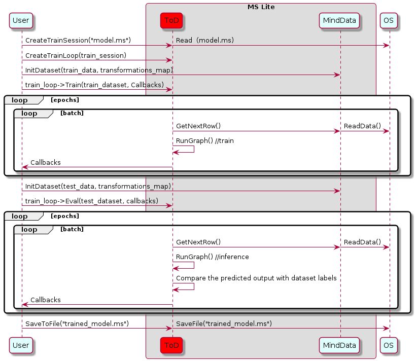

# Using Runtime for Model Training (C++)

`Linux` `Android` `Model Training` `Model Loading` `Data Preparation` `Intermediate` `Expert`

<a href="https://gitee.com/mindspore/docs/blob/r1.1/tutorials/lite/source_en/use/runtime_train_cpp.md" target="_blank"></a>

## Overview

The exact training scheme is encapsulated within the `.ms` model. The software that we will discuss below is not aware of it but rather perform training and inference in a generic manner.
Following the conversion of the model on the server to an `.ms` format, the file should be downloaded to the embedded device for the ToD process.

A sequence diagram explaining the train sequence is shown in the image below:



In this diagram the drawn objects represents:

- `OS`: A software element that is responsible to access storage data.
- `User`: The application/object that performs the training.
- `DataLoader`: An object that is responsible to load data from the storage and perform pre-processing prior to using it in the training (e.g., reading an image, rescaling it to a given size and converting it to bitmap).
- `TrainSession`: A software module provided by MindSpore Lite, that provides flatbuffer DeSerialization into a network of nodes and interconnecting tensors. It performs graph compilation and calls the graph executor for train and inference.

## Session Creation

In MindSpore Lite framework, `TrainSession` class provides the main API to the system. Here we will see how to interact with a `TrainSession` object.

### Reading Models

A Model file is flatbuffer-serialized file which was converted using the [MindSpore Model Converter Tool](https://www.mindspore.cn/tutorial/lite/en/r1.1/use/converter_tool.html). These files have a `.ms` extension. Before model training and/or inference, the model needs to be loaded from the file system and parsed. Related operations are mainly implemented in the [`Model`](https://www.mindspore.cn/doc/api_cpp/en/r1.1/lite.html#model) class which holds the model data such as the network structure, tensors sizes, weights data and operators attributes.
> Unlike in MindSpore Lite framework, in MindSpore Lite the user is not allowed to access the `Model` object, since it is being used by `TrainSession` during training. All interaction with `Model` including instantiation, Compiling and deletion are handled within `TrainSession`.

### Creating Contexts

[`Context`](https://www.mindspore.cn/doc/api_cpp/en/r1.1/lite.html#context) is a Mindspore Lite Object that contains basic configuration parameters required by the sessions to guide graph compilation and execution. It allows to define the device on which to run the model, e.g., CPU or GPU, the number of threads used for training and inference and the memory allocation scheme.
Currently, only single threaded CPU device is supported by TrainSession.

Once the TrainSession is created with the `Context` object, it is no longer needed and can be deleted.

### Creating Sessions

There are two methods to create a session:

- The first API allows MindSpore Lite to access the filesystem and read the model from a file, parse it, compile it and produce a valid TrainSession object. The `Context` described above is passed to the TrainSession as a basic configuration. The static function has the following signature `TrainSession *TrainSession::CreateSession(const string& filename, const Context *context, bool mode)`, where `filename` is the model's file name, context is the `Context` and mode is the initial training mode of the session (Train/Eval). On Success, a fully compiled and ready to use `TrainSession` instance is returned by the function, this instance must be freed using `delete` on the termination of the process.
- The second API is similar to the first but uses an in-memory copy of the flatbuffer in order to create the `TrainSession`. The static function has the following signature `TrainSession *TrainSession::CreateSession(const char* buf, size_t size, const Context *context, bool mode)`, where `buf` is a pointer to the in-memory buffer and `size` is its length. On Success, a fully compiled and ready-to-use `TrainSession` instance is returned by the function. If needed, the buf pointer can be freed immediately. The returned `TrainSession` instance must be freed using `delete` when no longer needed.

### Example

The following sample code demonstrates how to create a `TrainSession` that will run on a single thread in CPU:

```cpp
#include "include/train_session.h"
#include "include/context.h"

mindspore::lite::Context context;
context.device_list_[0].device_info_.cpu_device_info_.cpu_bind_mode_ = mindspore::lite::NO_BIND;
context.thread_num_ = 1;

auto session = mindspore::session::TrainSession::CreateSession(std::string("model_tod.ms"), &context);
```

## Training Mode

With TrainSessions, a network can be used for both inference and training.
These two modes differ in several aspects:

1. The input of the network: Running inference requires only the data, while running training requires both data and labels
2. The output of the network: Running inference returns the predicted values in the output, while running in training mode returns the loss
3. In training mode, the weights of the layers are updated in each Run, while in inference mode they are static
4. Some layers behave differently in inference vs. training mode, e.g., updating the accumulated batch mean and variance in Batch Normalization layers

### Switching between Train Mode and Eval Mode

To switch between these two modes `TrainSession` class exposes the following public methods:

```cpp
/// \brief Set model to train mode
/// \return STATUS as an error code of compiling graph, STATUS is defined in errorcode.h
virtual int Train() = 0;

/// \brief Set model to eval mode
/// \return STATUS as an error code of compiling graph, STATUS is defined in errorcode.h
virtual int Eval() = 0;
```

### Example

The following sample code shows how to set a `TrainSession` object to train mode.

```cpp
// Assuming session is a valid instance of TrainSession
auto ret = session->Train();
if (ret != RET_OK) {
    std::cerr << "Could not set session to train mode" << std::endl;
    return -1;
}
```

## Data Input

### Obtaining Input Tensors

Before graph execution, whether it is during training or inference, the input data must be filled-in into the model input tensors.
MindSpore Lite provides the following methods to obtain model input tensors:

1. Use the `GetInputsByTensorName` method to obtain model input tensors that are connected to the model input node based on the tensor name.

   ```cpp
   /// \brief  Get input MindSpore Lite MSTensors of model by tensor name.
   ///
   /// \param[in] tensor_name  Define tensor name.
   ///
   /// \return  MindSpore Lite MSTensor.
   virtual mindspore::tensor::MSTensor *GetInputsByTensorName(const std::string &tensor_name) const = 0;
   ```

2. Use the `GetInputs` method to directly obtain the vectors of all model input tensors.

   ```cpp
   /// \brief  Get input MindSpore Lite MSTensors of model.
   ///
   /// \return  The vector of MindSpore Lite MSTensor.
   virtual std::vector<tensor::MSTensor *> GetInputs() const = 0;
   ```

If the model requires more than one input tensor (this is certainly the case during training, where both data and labels serve as inputs of the network) it is the user's responsibility to know the inputs order or their tensorName. This can be obtained from the Python model.
Alternatively, one can deduce this information from the sizes of the input tensors.

### Copying Data

After model input tensors are obtained, the data must be copied into the tensors. The following methods allows to access the size of the data, it's shape, the number of elements, the data type and the writable pointer. See also detailed description in the [MSTensor](https://www.mindspore.cn/doc/api_cpp/en/r1.1/tensor.html#mstensor) API documentation.

```cpp
/// \brief  Get byte size of data in MSTensor.
///
/// \return  Byte size of data in MSTensor.
virtual size_t Size() const = 0;

/// \brief Get shape of the MindSpore Lite MSTensor.
///
/// \return A vector of int as the shape of the MindSpore Lite MSTensor.
virtual std::vector<int> shape() const = 0;

/// \brief Get number of element in MSTensor.
///
/// \return Number of element in MSTensor.
virtual int ElementsNum() const = 0;

/// \brief Get data type of the MindSpore Lite MSTensor.
///
/// \note TypeId is defined in mindspore/mindspore/core/ir/dtype/type_id.h. Only number types in TypeId enum are
/// suitable for MSTensor.
///
/// \return MindSpore Lite TypeId of the MindSpore Lite MSTensor.
virtual TypeId data_type() const = 0;

/// \brief  Get the pointer of data in MSTensor.
///
/// \note  The data pointer can be used to both write and read data in MSTensor.
///
/// \return  The pointer points to data in MSTensor.
virtual void *MutableData() const = 0;
```

### Example

The following sample code shows how to obtain the entire graph input `MSTensor` from `LiteSession` and enter the model input data to `MSTensor`.

```cpp
// Assuming session is a valid instance of TrainSession
auto inputs = session->GetInputs();

// Assuming the model has two input tensors, the first is for data and the second for labels
int data_index = 0;
int label_index = 1;

if (inputs.size() != 2) {
    std::cerr << "Unexpected amount of input tensors. Expected 2, model requires " << inputs.size() << std::endl;
    return -1;
}

// Assuming batch_size and data_size variables holds the Batch size and the size of a single data tensor, respectively:
// And assuming sparse labels are used
if ((inputs.at(data_index)->Size() != batch_size*data_size) ||
    (inputs.at(label_index)->ElementsNum() != batch_size)) {
    std::cerr << "Input data size does not match model input" << std::endl;
    return -1;
}

// Assuming data_ptr is the pointer to a batch of data tensors
// and iassuming label_ptr is a pointer to a batch of label indices (obtained by the DataLoder)
auto *in_data = inputs.at(data_index)->MutableData();
auto *in_labels = inputs.at(label_index)->MutableData();
if ((in_data == nullptr)|| (in_labels == nullptr)) {
    std::cerr << "Model's input tensor is nullptr" << std::endl;
    return -1;
}

memcpy(in_data, data_ptr, inputs.at(data_index)->Size());
memcpy(in_labels, label_ptr, inputs.at(label_index)->Size());
// After filling the input tensors the data_ptr and label_ptr may be freed
// The input tensors themselves are managed by MindSpore Lite and users are not allowed to access them or delete them
```

Note:  

- The data layout in the model input tensors of MindSpore Lite must be NHWC.
- The Tensors returned by `GetInputs` and `GetInputsByTensorName` methods shuold not be released by users.

## Graph Execution

### Executing Sessions

Whether a `TrainSession` object is in train mode or in eval mode, the way to make it execute, i.e., to run the data through the graph, is by calling `RunGraph` method.

```cpp
/// \brief Run session with callbacks.
///
/// \param[in] before Define a call_back_function to be called before running each node.
/// \param[in] after Define a call_back_function called after running each node.
///
/// \note RunGraph should be called after CompileGraph.
///
/// \return STATUS as an error code of running graph, STATUS is defined in errorcode.h.
virtual int RunGraph(const KernelCallBack &before = nullptr, const KernelCallBack &after = nullptr) = 0;
```

Prior to each run of the graph, the user must make sure that the data is properly loaded to the input tensors.

### Callback Running

MindSpore Lite framework allows the user to set two callback functions that will be called before and after each node runs. Such functions can assist the developer to trace his network, to debug it, and to measure how long it took each node to run. The callback parameters are as follows:

- The current input tensors of the running node
- The current output tensors of the running node
- Name and type of the running node

While the node name and type will be the same before and after the node runs, the output tensors will differ between the two callbacks invocations.
For some operators, also the input tesnors will vary.

```cpp
/// \brief  CallBackParam defines input arguments for callback function.
struct CallBackParam {
  std::string node_name; /**< node name argument */
  std::string node_type; /**< node type argument */
};

/// \brief KernelCallBack defined the function pointer for callBack.
using KernelCallBack = std::function<bool(std::vector<tensor::MSTensor *> inputs,
                                          std::vector<tensor::MSTensor *> outputs,
                                          const CallBackParam &opInfo)>;

```

### Example

The following sample code demonstrates how to define two callback functions, the first will be called before each layer runs, and the second after it ran

```cpp
// Assuming session is a valid instance of TrainSession and that data was assigned to the input tensors

// Definition of a callback function that will be called before forwarding operator
bool before_callback(const std::vector<mindspore::tensor::MSTensor *> &inputs,
                    const std::vector<mindspore::tensor::MSTensor *> &outputs,
                    const mindspore::CallBackParam &call_param) {
    std::cout << call_param.node_name << std::endl;
    std::cout << "Before forwarding: input size is " << inputs.size() << std::endl;
    return true;
};
// Definition of callback function that will be called after forwarding operator
bool after_callback(const std::vector<mindspore::tensor::MSTensor *> &inputs,
                    const std::vector<mindspore::tensor::MSTensor *> &outputs,
                    const mindspore::CallBackParam &call_param) {
    std::cout << "After forwarding: output size is " << outputs.size() << std::endl;
    return true;
};

// Hand over the callback functions to RunGraph when performing the training or inference
ret = session_->RunGraph(before_callback, after_callback);
if (ret != RET_OK) {
  MS_LOG(ERROR) << "Run graph failed.";
  return RET_ERROR;
}
```

## Obtaining Outputs

### Obtaining Output Tensors

After each execution of the graph, the user might want to read the model's outputs, whether it is the loss in the case of train mode, or the predicted output in the case of evaluation mode.

MindSpore Lite provides the following methods to obtain the model's output `MSTensor`.

1. Use the `GetOutputsByNodeName` method to obtain the output tensors that belong to a certain node:

   ```cpp
   /// \brief  Get output MindSpore Lite MSTensors of model by node name.
   ///
   /// \param[in] node_name Define node name.
   ///
   /// \return  The vector of MindSpore Lite MSTensor.
   virtual std::vector<tensor::MSTensor *> GetOutputsByNodeName(const std::string &node_name) const = 0;
   ```

2. Use the `GetOutputByTensorName` method to obtain ian output tensor, based on the tensor name.

   ```cpp
   /// \brief  Get output MindSpore Lite MSTensors of model by tensor name.
   ///
   /// \param[in] tensor_name  Define tensor name.
   ///
   /// \return  Pointer of MindSpore Lite MSTensor.
   virtual mindspore::tensor::MSTensor *GetOutputByTensorName(const std::string &tensor_name) const = 0;
   ```

3. Use the `GetOutputs` method to obtain all the output tensors, ordered by their tensor name:

   ```cpp
   /// \brief  Get output MindSpore Lite MSTensors of model mapped by tensor name.
   ///
   /// \return  The map of output tensor name and MindSpore Lite MSTensor.
   virtual std::unordered_map<std::string, mindspore::tensor::MSTensor *> GetOutputs() const = 0;
   ```

After model output tensors are obtained, you need to enter data into the tensors. Use the `Size` method of `MSTensor` to obtain the size of the data to be entered into tensors, use the `data_type` method to obtain the data type of `MSTensor`, and use the `MutableData` method of `MSTensor` to obtain the writable pointer.

```cpp
/// \brief  Get byte size of data in MSTensor.
///
/// \return  Byte size of data in MSTensor.
virtual size_t Size() const = 0;

/// \brief  Get data type of the MindSpore Lite MSTensor.
///
/// \note  TypeId is defined in mindspore/mindspore/core/ir/dtype/type_id.h. Only number types in TypeId enum are
/// suitable for MSTensor.
///
/// \return  MindSpore Lite TypeId of the MindSpore Lite MSTensor.
virtual TypeId data_type() const = 0;

/// \brief  Get the pointer of data in MSTensor.
///
/// \note The data pointer can be used to both write and read data in MSTensor.
///
/// \return  The pointer points to data in MSTensor.
virtual void *MutableData() const = 0;
```

### Example

The following sample code shows how to obtain the output `MSTensor` from `LiteSession` using the `GetOutputs` method and print the first ten data or all data records of each output `MSTensor`.

```cpp
// Assume that session is a vlaid TrainSession object
auto output_map = session->GetOutputs();
// Assume that the model has only one output node.
auto out_node_iter = output_map.begin();
std::string name = out_node_iter->first;
// Assume that the unique output node has only one output tensor.
auto out_tensor = out_node_iter->second;
if (out_tensor == nullptr) {
    std::cerr << "Output tensor is nullptr" << std::endl;
    return -1;
}
// Assume that the data format of output data is float 32.
if (out_tensor->data_type() != mindspore::TypeId::kNumberTypeFloat32) {
    std::cerr << "Output of lenet should in float32" << std::endl;
    return -1;
}
auto *out_data = reinterpret_cast<float *>(out_tensor->MutableData());
if (out_data == nullptr) {
    std::cerr << "Data of out_tensor is nullptr" << std::endl;
    return -1;
}
// Print the first 10 float data or all output data of the output tensor.
std::cout << "Output data: ";
for (size_t i = 0; i < 10 && i < out_tensor->ElementsNum(); i++) {
    std::cout << " " << out_data[i];
}
std::cout << std::endl;
// The elements in outputs do not need to be free by users, because outputs are managed by the MindSpore Lite.
```

Note that the vectors or map returned by the `GetOutputsByNodeName`, `GetOutputByTensorName` and `GetOutputs` methods do not need to be released by users.

The following sample code shows how to obtain the output `MSTensor` from `LiteSession` using the `GetOutputsByNodeName` method.

```cpp
// Assume that session is a vlaid TrainSession instance
// Assume that model has a output node named output_node_name_0.
auto output_vec = session->GetOutputsByNodeName("output_node_name_0");
// Assume that output node named output_node_name_0 has only one output tensor.
auto out_tensor = output_vec.front();
if (out_tensor == nullptr) {
    std::cerr << "Output tensor is nullptr" << std::endl;
    return -1;
}
```

The following sample code shows how to obtain the output `MSTensor` from `LiteSession` using the `GetOutputByTensorName` method.

```cpp
// Assume that session is a vlaid TrainSession instance
// We can use GetOutputTensorNames method to get the names of all the output tensors of the model
auto tensor_names = session->GetOutputTensorNames();
// Use output tensor name returned by GetOutputTensorNames as key
for (auto tensor_name : tensor_names) {
    auto out_tensor = session->GetOutputByTensorName(tensor_name);
    if (out_tensor == nullptr) {
        std::cerr << "Output tensor is nullptr" << std::endl;
        return -1;
    }
}
```

## Obtaining Version String

The following sample code shows how to obtain version string using `Version` method.

```cpp
#include "include/version.h"
std::string version = mindspore::lite::Version();
```

## Saving the Trained Model

MindSpore Lite provides the following API to save the trained model:

```cpp
  /// \brief Save the trained model into a flatbuffer file
  ///
  /// \param[in] filename Filename to save flatbuffer to
  ///
  /// \return 0 on success or -1 in case of error
  virtual int SaveToFile(const std::string &filename) const = 0;
```

You can load the saved model to do re-training or inference.

> - The trained model by MindSpore Lite can only be inferenced by MindSpore Lite training framework, that is, to create `TrainSession` first and call the `Eval()` api setting to the inference mode.
> - You can not use benchmark tool to run the trained model, please use [benchmark_train](https://www.mindspore.cn/tutorial/lite/zh-CN/r1.1/use/benchmark_train_tool.html) instead.
