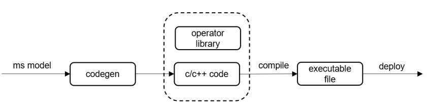

# 代码生成工具

`Linux` `IoT` `C++` `模型代码生成` `推理应用` `初级` `中级`

<a href="https://gitee.com/mindspore/docs/blob/r1.2/tutorials/lite/source_zh_cn/use/code_generator.md" target="_blank"></a>

## 概述

相较于移动终端，IoT设备上系统资源有限，对ROM空间占用、运行时内存和功耗要求较高。MindSpore Lite提供代码生成工具codegen，将运行时编译、解释计算图，移至离线编译阶段。仅保留推理所必须的信息，生成极简的推理代码。Codegen可对接NNACL和CMSIS算子库，支持生成可在x86/ARM64/ARM32A/ARM32M平台部署的推理代码。

代码生成工具Codegen的使用流程如下：

1. 通过MindSpore Lite转换工具[Converter](https://www.mindspore.cn/tutorial/lite/zh-CN/r1.2/use/converter_tool.html)，将训练好的模型文件转换为`*.ms`格式；

2. 通过自动代码生成工具codegen，输入`*.ms`模型自动生成源代码。

"

## 获取codegen

自动代码生成工具，可以通过两种方式获取：

1. MindSpore官网下载[Release版本](https://www.mindspore.cn/tutorial/lite/zh-CN/r1.2/use/downloads.html)
2. 从源码开始[编译构建](https://www.mindspore.cn/tutorial/lite/zh-CN/r1.2/use/build.html)

> 目前模型生成工具仅支持在Linux x86_64架构下运行。

## 参数说明

详细参数说明如下：

| 参数            | 是否必选 | 参数说明                         | 取值范围                   | 默认值    |
| --------------- | -------- | -------------------------------| -------------------------- | --------- |
| help            | 否       | 打印使用说明信息                 | -                          | -         |
| codePath        | 是       | 生成代码的路径                   | -                          | ./(当前目录)|
| target          | 是       | 生成代码针对的平台               | x86, ARM32M, ARM32A, ARM64 | x86       |
| modelPath       | 是       | 输入模型文件路径                 | -                          | -         |
| supportParallel | 否       | 是否生成支持多线程的代码          | true, false                | false     |
| debugMode       | 否       | 是否以生成调试模式的代码          | true, false                | false     |

> 输入模型文件，需要经过MindSpore Lite Converter工具转换成.ms格式。
> os不支持文件系统时，debugMode不可用。

## 使用步骤

### 生成代码

以LeNet网络为例:

```bash
./codegen --modelPath=./lenet.ms --codePath=./
```

执行成功后，会在codePath指定的目录下，生成名为lenet的文件夹，内容如下：

```text
lenet/
├── benchmark                       # 集成调试相关的例程
│   ├── benchmark.cc
│   ├── load_input.c
│   └── load_input.h
├── CMakeLists.txt
└── src                             # 源文件
    ├── CMakeLists.txt
    ├── mmodel.h
    ├── net.bin                     # 二进制形式的模型权重
    ├── net.c
    ├── net.cmake
    ├── net.h
    ├── session.cc
    ├── session.h
    ├── tensor.cc
    ├── tensor.h
    ├── weight.c
    └── weight.h
```

> 详细接口使用说明，请参考[API文档](https://www.mindspore.cn/doc/api_cpp/zh-CN/r1.2/index.html)。
> 以下三个接口暂不支持：
> 1. `virtual std::unordered_map<String, mindspore::tensor::MSTensor *> GetOutputs() const = 0;`
> 2. `virtual Vector<tensor::MSTensor *> GetOutputsByNodeName(const String &node_name) const = 0;`
> 3. `virtual int Resize(const Vector<tensor::MSTensor *> &inputs, const Vector<Vector<int>> &dims) = 0;`

### 执行推理

生成代码之后，即可以编译执行推理，详细步骤请参考[编译一个MNIST分类模型](https://www.mindspore.cn/tutorial/lite/zh-CN/r1.2/quick_start/quick_start_codegen.html)。
