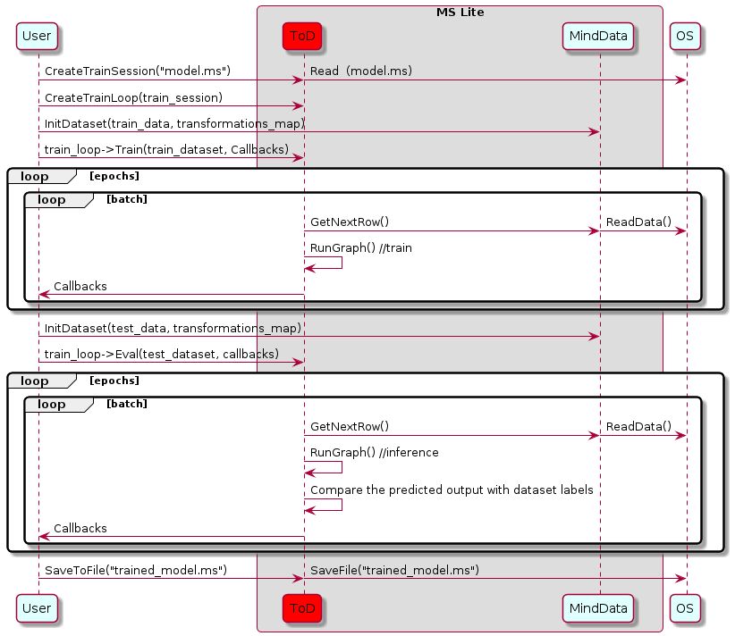

# 使用Runtime执行训练 (C++)

`Linux` `Android` `C++` `模型训练` `模型加载` `数据准备` `中级` `高级`

[](https://gitee.com/mindspore/docs/blob/r1.2/tutorials/lite/source_zh_cn/use/runtime_train_cpp.md)

## 概述

端侧训练主要步骤：

1. 使用云侧接口设计模型并导出`MindIR`模型文件。
2. 将`MindIR`模型文件转换为`ms`模型文件。
3. 在设备端训练、验证和保存`ms`模型文件。

> 转换得到的 *.ms 模型文件包含模型结构，.ms模型文件将被载入设备端进行训练。

下面的时序图展示了训练详细流程：



图中的名词说明：

- `OS`：程序运行的操作系统。
- `User`：用户调用`TrainLoop`类的函数。
- `MindData`：在训练中加载数据并预处输入理数据的系列接口（例如读取图像，缩放至指定大小，转换为bitmap格式）。
- `ToD`：MindSpore Lite在设备端的训练机制。
- `MS Lite`：MindSpore Lite架构，它能为模型节点和内联张量提供flatbuffer反序列化的功能、执行图编译并调用图执行器进行训练。
- `CreateTrainSession`：创建`TrainSession`类的对象。
- `CreateTrainLoop`：创建`TrainLoop`类的对象。
- `InitDataset`：用户自定义函数，加载并预处理数据。
- `train_loop`：迭代训练`TrainLoop`类的对象。
- `Train`：`TrainLoop`类的成员函数，接受现有的或用户自定义的回调对象。
- `Callbacks`：执行现有的或用户自定义的回调函数。

MindSpore Lite架构引入了`MindData`数据处理接口。首先，`MindData`简化了训练流程，创建会话、加载数据、预处理、训练和保存模型一个函数搞定；其次，它可在训练中加载并处理数据，这极大地降低了移动端的资源消耗。

用户依次执行上图中`User`列的函数即可启动模型训练。首先调用`CreateSession`函数创建训练会话对象，并创建`TrainLoop`类对象；然后依次执行`InitDataset`、`Train`、`Eval`即可完成训练。`ToD`和`MindData`列为模型训练中调用MindSpore Lite底层函数。

> 更多C++API说明，请参考[API文档](https://www.mindspore.cn/doc/api_cpp/zh-CN/r1.2/index.html)。

## 创建会话

MindSpore Lite训练框架中的[TrainSession](https://www.mindspore.cn/doc/api_cpp/zh-CN/r1.2/session.html#trainsession)是训练的主入口，通过`TrainSession`我们可以进行编译和运行图模型。

### 读取模型

模型文件是一个flatbuffer序列化文件，它通过MindSpore模型转换工具得到，其文件扩展名为`.ms`。在模型训练或推理之前，模型需要从文件系统中加载并解析。相关操作主要在[`TrainModel`](https://www.mindspore.cn/doc/api_cpp/zh-CN/r1.2/lite.html#trainmodel)类中实现，该类具有例如网络结构、张量大小、权重数据和操作属性等模型数据。

> 在MindSpore Lite中训练模型将被`TrainSession`占用，所以你不能直接改变它。所有与训练模型的交互操作，包括实例化、编译和删除操作将在`TrainSession`中处理。

### 创建上下文

[`Context`](https://www.mindspore.cn/doc/api_cpp/zh-CN/r1.2/lite.html#context)是一个MindSpore Lite对象，它包含了`TrainSession`用来加载模型文件、引导图编译和执行的基础配置参数。它能够让你指定模型运行的设备类型（例如CPU或GPU），模型训练和推理时使用的线程数量，以及内存分配策略。目前`TrainSession`只支持单线程的CPU设备。

如果用户通过`new`创建`Context`，不再需要时，需要用户通过`delete`释放。一般在`TrainSession`对象创建完成后，`Context`对象即可释放。

### 创建会话

有两种方式可以创建会话：

- 第一种直接读取文件系统上的训练模型文件，然后反序列化，编译并生成有效的`TrainSession`对象。上述`Context`将作为一个基本配置传递给`TrainSession`。该静态函数原型如下：

  `TrainSession *TrainSession::CreateSession(const string &filename, const Context *context, bool mode)`

  其中`filename`是模型文件名，`context`是指向Context的对象指针，`mode`表示当前会话是否为训练模式。成功创建后，函数返回一个已全部编译并可使用的`TrainSession`，该实例必须在当前会话结束前使用`delete`释放。

- 第二种使用flatbuffer的内存拷贝创建`TrainSession`。静态方法如下：

  `TrainSession *TrainSession::CreateSession(const char *model_buf, size_t size, lite::Context *context, bool train_mode = false)`

  其中`model_buf`是一个指向内存缓冲区的常量指针，`size`是缓冲区长度。成功创建后，函数返回一个完整编译并且可以使用的`TrainSession`实例。`model_buf`指针在函数调用完成后，可以被立即释放以节省资源。`train_mode`为是否将模型设置为训练模式。一旦`TrainSession`实例不再被使用，它必须使用`delete`释放。

### 创建迭代训练

用户可通过`CreateTrainLoop`函数创建的`TrainLoop`类对象来调用`MindData`接口函数，所以我们更推荐`CreateTrainLoop`函数。`CreateTrainLoop`原型如下：

  `TrainLoop *CreateTrainLoop(session::TrainSession *train_session, lite::Context *context, int batch_size = -1)`

下面示例代码演示了如何使用`TrainLoop`类在CPU多线程上创建训练会话：

```cpp
#include "include/train_session.h"
#include "include/context.h"

int CreateSession() {
    mindspore::lite::Context context;
    context.device_list_[0].device_info_.cpu_device_info_.cpu_bind_mode_ = mindspore::lite::NO_BIND;
    context.device_list_[0].device_info_.cpu_device_info_.enable_float16_ = false;
    context.device_list_[0].device_type_ = mindspore::lite::DT_CPU;
    context.thread_num_ = 2;
    // Create Session
    session_ = mindspore::session::TrainSession::CreateSession(ms_file_, &context);
    MS_ASSERT(nullptr != session_);
    loop_ = mindspore::session::TrainLoop::CreateTrainLoop(session_, &context);
    acc_metrics_ = std::shared_ptr<AccuracyMetrics>(new AccuracyMetrics);
    loop_->Init({acc_metrics_.get()});
    return 0;
}
```

> 参见[训练一个LeNet](https://gitee.com/mindspore/mindspore/blob/r1.2/mindspore/lite/examples/train_lenet/src/net_runner.cc)获取完整代码。

## 数据处理

### 数据输入流

`Dataset`类及其扩展类（例如`MnistDataset`和`AlbumDataset`）为用户提供了丰富的数据处理API，用户只需要指定数据集的路径，通过接口函数返回对应类型的共享指针来设定训练中执行的数据处理操作，输入流会在训练过程中加载并解析数据。API说明详见[Dataset](https://www.mindspore.cn/doc/api_cpp/zh-CN/r1.2/dataset.html)。

### 数据预处理流

`TensorTransform`类其扩展类（例如`TypeCast`和`OneHot`）为用户提供了丰富的数据预处理API，其功能与云侧Python接口相同，例如维度重塑、数据类型转换和独热编码等，用户只需要创建`TensorTransform`扩展类的对象并传递给Map函数， Map会在训练过程中顺序调用预处理函数处理已加载的数据。API说明详见[Vision](https://www.mindspore.cn/doc/api_cpp/zh-CN/r1.2/vision.html)。

### 使用示例

下述代码展示了如何使用`Dataset`类和`TensorTransform`类读取和处理数据：

```cpp
#include "include/datasets.h"
#include "include/context.h"
#include "include/transforms.h"

int DataSetPipeline() {
    train_ds_ = Mnist(data_dir_ + "/train", "all");
    TypeCast typecast_f("float32");
    Resize resize({h_, w_});
    train_ds_ = train_ds_->Map({&resize, &typecast_f}, {"image"});
    TypeCast typecast("int32");
    train_ds_ = train_ds_->Map({&typecast}, {"label"});
    train_ds_ = train_ds_->Shuffle(2);
    train_ds_ = train_ds_->Batch(batch_size_, true);
    if (verbose_) {
      std::cout << "DatasetSize is " << train_ds_->GetDatasetSize() << std::endl;
    }
    if (train_ds_->GetDatasetSize() == 0) {
      std::cout << "No relevant data was found in " << data_dir_ << std::endl;
      MS_ASSERT(train_ds_->GetDatasetSize() != 0);
    }
    return 0;
}
```

示例中用户可通过Mnist函数返回的`MnistDataset`类共享指针调用`Dataset`类和`TensorTransform`类的现有函数来定义训练数据处理流程。

## 执行训练

MindSpore为用户提供了现有的回调类：`accuracy_metrics`、`accuracy_monitor`、`ckpt_saver`、`classification_train_accuracy`、`loss_monitor`和`metrics`。`TrainLoop`类的`Train`和`Eval`函数分别将模型设置为训练和验证模式，指定数据预处理方法并监测会话状态。

### 训练

创建现有回调类对象并调用`TrainLoop`类的`Train`函数进行训练：

```cpp
int Train() {
  struct mindspore::lite::StepLRLambda step_lr_lambda(1, 0.8);
  mindspore::lite::LRScheduler step_lr_sched(mindspore::lite::StepLRLambda, static_cast<void *>(&step_lr_lambda), 1);
  mindspore::lite::LossMonitor lm(100);
  mindspore::lite::ClassificationTrainAccuracyMonitor am(1);
  mindspore::lite::CkptSaver cs(1000, std::string("lenet"));
  Rescaler rescale(255.0);
  loop_->Train(epochs_, train_ds_.get(), std::vector<TrainLoopCallBack *>{&rescale, &lm, &cs, &am, &step_lr_sched});
  return 0;
}
```

### 推理

同样，我们调用`TrainLoop`类的`Eval`函数进行推理：

```cpp
float Eval() {
    test_ds_ = Mnist(data_dir_ + "/test", "all");
    TypeCast typecast_f("float32");
    Resize resize({h_, w_});
    test_ds_ = test_ds_->Map({&resize, &typecast_f}, {"image"});
    TypeCast typecast("int32");
    test_ds_ = test_ds_->Map({&typecast}, {"label"});
    test_ds_ = test_ds_->Batch(batch_size_, true);
    Rescaler rescale(255.0);
    loop_->Eval(test_ds_.get(), std::vector<TrainLoopCallBack *>{&rescale});
    std::cout << "Eval Accuracy is " << acc_metrics_->Eval() << std::endl;
    return 0.0;
}
```

> 推理和训练模式的不同点：
> - 网络输入：训练需要数据和标签，而推理只需要数据。
> - 网络输出：训练返回损失值，而推理返回预测标签值。
> - 每一轮训练都会更新网络的各层权重值，但推理不会。
> - 网络的某些层在训练和推理具有不同的输出，例如在批量标准化 (Batch Normalization) 层中更新批次累计均值和方差。

## 其他

### 会话模式切换

`TrainLoop`类中的`Train`和`Eval`函数实际上调用的是`TrainSession`类中的`Train`和`Eval`函数，用户也可以直接调用`TrainSession`的方法来切换模型训练和验证模式，函数原型如下：

```cpp
/// \brief Set model to train mode
/// \return STATUS as an error code of compiling graph, STATUS is defined in errorcode.h
virtual int Train() = 0;

/// \brief Set model to eval mode
/// \return STATUS as an error code of compiling graph, STATUS is defined in errorcode.h
virtual int Eval() = 0;
```

下述代码展示了如何将一个当前训练会话设置为训练或验证模式：

```cpp
// Assuming session is a valid instance of TrainSession
auto ret = session->Train();
if (ret != RET_OK) {
    std::cerr << "Could not set session to train mode" << std::endl;
    return -1;
}

auto ret = session->Eval();
if (ret != RET_OK) {
    std::cerr << "Could not set session to eval mode" << std::endl;
    return -1;
}
```

### 获取输入张量

在图执行之前，无论执行训练或推理，输入数据必须载入模型的输入张量。MindSpore Lite提供了以下函数来获取模型的输入张量：

1. 使用[`GetInputsByTensorName`](https://www.mindspore.cn/doc/api_cpp/zh-CN/r1.2/session.html#getinputsbytensorname)方法，获取连接到基于张量名称的模型输入节点模型输入张量。

    ```cpp
    /// \brief  Get input MindSpore Lite MSTensors of model by tensor    name.
    ///
    /// \param[in] tensor_name  Define tensor name.
    ///
    /// \return  MindSpore Lite MSTensor.
    virtual mindspore::tensor::MSTensor *GetInputsByTensorName(const std::string &tensor_name) const = 0;
    ```

2. 使用[`GetInputs`](https://www.mindspore.cn/doc/api_cpp/zh-CN/r1.2/session.html#getinputs)方法，直接获取所有模型输入张量的向量。

    ```cpp
    /// \brief  Get input MindSpore Lite MSTensors of model.
    ///
    /// \return  The vector of MindSpore Lite MSTensor.
    virtual std::vector<tensor::MSTensor *> GetInputs() const = 0;
    ```

    如果模型需要1个以上的输入张量（例如训练过程中，数据和标签都作为网络的输入），用户有必要知道输入顺序和张量名称，这些信息可以从Python对应的模型中获取。此外，用户也根据输入张量的大小推导出这些信息。

3. 拷贝数据

    一旦获取到了模型的输入张量，数据需要拷贝到张量中。下列方法可以获取数据字节大小、数据维度、元素个数、数据类型和写指针。详见 [MSTensor](https://www.mindspore.cn/doc/api_cpp/en/r1.2/tensor.html#mstensor) API 文档。

    ```cpp
    /// \brief  Get byte size of data in MSTensor.
    ///
    /// \return  Byte size of data in MSTensor.
    virtual size_t Size() const = 0;

    /// \brief Get shape of the MindSpore Lite MSTensor.
    ///
    /// \return A vector of int as the shape of the MindSpore Lite MSTensor.
    virtual std::vector<int> shape() const = 0;

    /// \brief Get number of element in MSTensor.
    ///
    /// \return Number of element in MSTensor.
    virtual int ElementsNum() const = 0;

    /// \brief Get data type of the MindSpore Lite MSTensor.
    ///
    /// \note TypeId is defined in mindspore/mindspore/core/ir/dtype/type_id.h. Only number types in TypeId enum are
    /// suitable for MSTensor.
    ///
    /// \return MindSpore Lite TypeId of the MindSpore Lite MSTensor.
    virtual TypeId data_type() const = 0;

    /// \brief  Get the pointer of data in MSTensor.
    ///
    /// \note  The data pointer can be used to both write and read data in MSTensor.
    ///
    /// \return  The pointer points to data in MSTensor.
    virtual void *MutableData() const = 0;
    ```

    以下示例代码展示了如何从`LiteSession`中获取完整的图输入张量和如何将模型输入数据转换为`MSTensor`类型。

    ```cpp
    // Assuming session is a valid instance of TrainSession
    auto inputs = session->GetInputs();

    // Assuming the model has two input tensors, the first is for data and the second for labels
    int data_index = 0;
    int label_index = 1;

    if (inputs.size() != 2) {
        std::cerr << "Unexpected amount of input tensors. Expected 2, model requires " << inputs.size() << std::endl;
        return -1;
    }

    // Assuming batch_size and data_size variables holds the Batch size and the size of a single data tensor, respectively:
    // And assuming sparse labels are used
    if ((inputs.at(data_index)->Size() != batch_size*data_size) ||
        (inputs.at(label_index)->ElementsNum() != batch_size)) {
        std::cerr << "Input data size does not match model input" << std::endl;
        return -1;
    }

    // Assuming data_ptr is the pointer to a batch of data tensors
    // and iassuming label_ptr is a pointer to a batch of label indices (obtained by the DataLoder)
    auto *in_data = inputs.at(data_index)->MutableData();
    auto *in_labels = inputs.at(label_index)->MutableData();
    if ((in_data == nullptr)|| (in_labels == nullptr)) {
        std::cerr << "Model's input tensor is nullptr" << std::endl;
        return -1;
    }

    memcpy(in_data, data_ptr, inputs.at(data_index)->Size());
    memcpy(in_labels, label_ptr, inputs.at(label_index)->Size());
    // After filling the input tensors the data_ptr and label_ptr may be freed
    // The input tensors themselves are managed by MindSpore Lite and users are not allowed to access them or delete them
    ```

    > - MindSpore Lite模型输入张量的数据维度必须为NHWC（批次数，高度，宽度和通道数）。
    > - 用户不能主动释放`GetInputs`和`GetInputsByTensorName`函数返回的张量。

### 获取输出张量

MindSpore Lite提供下列方法来获取模型的输出张量：

1. 使用[`GetOutputByNodeName`](https://www.mindspore.cn/doc/api_cpp/zh-CN/r1.2/session.html#getoutputbynodename)方法获取一个确定节点的输出张量。

    ```cpp
    /// \brief  Get output MindSpore Lite MSTensors of model by node name.
    ///
    /// \param[in] node_name Define node name.
    ///
    /// \return  The vector of MindSpore Lite MSTensor.
    virtual std::vector<tensor::MSTensor *> GetOutputsByNodeName(const std::string &node_name) const = 0;
    ```

    下列代码为使用`GetOutputsByNodeName`方法从当前会话中获取输出张量：

    ```cpp
    // Assume that session is a vlaid TrainSession instance
    // Assume that model has a output node named output_node_name_0.
    auto output_vec = session->GetOutputsByNodeName("output_node_name_0");
    // Assume that output node named output_node_name_0 has only one output tensor.
    auto out_tensor = output_vec.front();
    if (out_tensor == nullptr) {
        std::cerr << "Output tensor is nullptr" << std::endl;
        return -1;
    }
    ```

2. 使用[`GetOutputByTensorName`](https://www.mindspore.cn/doc/api_cpp/zh-CN/r1.2/session.html#getoutputbytensorname)方法，依据张量名称获取输出张量。

    ```cpp
    /// \brief  Get output MindSpore Lite MSTensors of model by tensor name.
    ///
    /// \param[in] tensor_name  Define tensor name.
    ///
    /// \return  Pointer of MindSpore Lite MSTensor.
    virtual mindspore::tensor::MSTensor *GetOutputByTensorName(const std::string &tensor_name) const = 0;
    ```

    下列代码为使用`GetOutputsByTensorName`方法从当前会话中获取输出张量：

    ```cpp
    // Assume that session is a vlaid TrainSession instance
    // We can use GetOutputTensorNames method to get the names of all the output tensors of the model
    auto tensor_names = session->GetOutputTensorNames();
    // Use output tensor name returned by GetOutputTensorNames as key
    for (auto tensor_name : tensor_names) {
        auto out_tensor = session->GetOutputByTensorName(tensor_name);
        if (out_tensor == nullptr) {
            std::cerr << "Output tensor is nullptr" << std::endl;
            return -1;
        }
    }
    ```

3. 使用[`GetOutputs`](https://www.mindspore.cn/doc/api_cpp/zh-CN/r1.2/session.html#getoutputs)方法，根据张量名称排序的所有输出张量。

    ```cpp
    /// \brief  Get output MindSpore Lite MSTensors of model mapped by tensor name.
    ///
    /// \return  The map of output tensor name and MindSpore Lite MSTensor.
    virtual std::unordered_map<std::string, mindspore::tensor::MSTensor *> GetOutputs() const = 0;
    ```

    获取模型输出张量后，用户需要将数据导入张量中。使用`MSTensor`的`Size`方法获取将要导入张量中的数据大小，使用`data_type`方法获取 `MSTensor`的数据类型，并且使用`MutableData`方法写指针。

    ```cpp
    /// \brief  Get byte size of data in MSTensor.
    ///
    /// \return  Byte size of data in MSTensor.
    virtual size_t Size() const = 0;

    /// \brief  Get data type of the MindSpore Lite MSTensor.
    ///
    /// \note  TypeId is defined in mindspore/mindspore/core/ir/dtype/type_id.h. Only number types in TypeId enum are
    /// suitable for MSTensor.
    ///
    /// \return  MindSpore Lite TypeId of the MindSpore Lite MSTensor.
    virtual TypeId data_type() const = 0;

    /// \brief  Get the pointer of data in MSTensor.
    ///
    /// \note The data pointer can be used to both write and read data in MSTensor.
    ///
    /// \return  The pointer points to data in MSTensor.
    virtual void *MutableData() const = 0;
    ```

    下列代码展示了如何使用`GetOutputs`方法从会话中获取输出张量，并打印前10个数据或每个输出张量的数据记录。

    ```cpp
    // Assume that session is a vlaid TrainSession object
    auto output_map = session->GetOutputs();
    // Assume that the model has only one output node.
    auto out_node_iter = output_map.begin();
    std::string name = out_node_iter->first;
    // Assume that the unique output node has only one output tensor.
    auto out_tensor = out_node_iter->second;
    if (out_tensor == nullptr) {
        std::cerr << "Output tensor is nullptr" << std::endl;
        return -1;
    }
    // Assume that the data format of output data is float 32.
    if (out_tensor->data_type() != mindspore::TypeId::kNumberTypeFloat32) {
        std::cerr << "Output of lenet should in float32" << std::endl;
        return -1;
    }
    auto *out_data = reinterpret_cast<float *>(out_tensor->MutableData());
    if (out_data == nullptr) {
        std::cerr << "Data of out_tensor is nullptr" << std::endl;
        return -1;
    }
    // Print the first 10 float data or all output data of the output tensor.
    std::cout << "Output data: ";
    for (size_t i = 0; i < 10 && i < out_tensor->ElementsNum(); i++) {
        std::cout << " " << out_data[i];
    }
    std::cout << std::endl;
    // The elements in outputs do not need to be free by users, because outputs are managed by the MindSpore Lite.
    ```

    > 用户无需手动释放 `GetOutputsByNodeName`、`GetOutputByTensorName`和`GetOutputs`函数返回的数组或是哈希表。

### 执行训练或推理

#### 执行会话

无论`TrainSession`对象是训练或推理模式，图计算都是调用`RunGraph`方法。

```cpp
/// \brief Run session with callbacks.
///
/// \param[in] before Define a call_back_function to be called before running each node.
/// \param[in] after Define a call_back_function called after running each node.
///
/// \note RunGraph should be called after CompileGraph.
///
/// \return STATUS as an error code of running graph, STATUS is defined in errorcode.h.
virtual int RunGraph(const KernelCallBack &before = nullptr, const KernelCallBack &after = nullptr) = 0;
```

在执行图计算前，用户需要确保数据被正确地导入了输入张量中。

#### 执行回调

MindSpore Lite框架允许用户设置两个在每个节点计算前后调用的回调函数。这两个函数能够帮助用户跟踪、调试网络，并测量各节点的计算时间。回调参数如下：

- 计算节点的当前输入张量。
- 计算节点的当前输出张量。
- 计算节点的名称和类型。

尽管节点计算前后的名称和类型一致，两个回调函数的输出张量却不同。对于某些计算操作，输入张量也不同。

```cpp
/// \brief  CallBackParam defines input arguments for callback function.
struct CallBackParam {
  std::string node_name; /**< node name argument */
  std::string node_type; /**< node type argument */
};

/// \brief KernelCallBack defined the function pointer for callBack.
using KernelCallBack = std::function<bool(std::vector<tensor::MSTensor *> inputs,
 std::vector<tensor::MSTensor *> outputs,  const CallBackParam &opInfo)>;
```

以下代码为如何在执行训练前后使用回调函数：

```cpp
// Assuming session is a valid instance of TrainSession and that data was assigned to the input tensors

// Definition of a callback function that will be called before forwarding operator
bool before_callback(const std::vector<mindspore::tensor::MSTensor *> &inputs,
 const std::vector<mindspore::tensor::MSTensor *> &outputs,
 const mindspore::CallBackParam &call_param) {
    std::cout << call_param.node_name << std::endl;
    std::cout << "Before forwarding: input size is " << inputs.size() << std::endl;
    return true;
};
// Definition of callback function that will be called after forwarding operator
bool after_callback(const std::vector<mindspore::tensor::MSTensor *> &inputs,
 const std::vector<mindspore::tensor::MSTensor *> &outputs,
 const mindspore::CallBackParam &call_param) {
    std::cout << "After forwarding: output size is " << outputs.size() << std::endl;
    return true;
};

// Hand over the callback functions to RunGraph when performing the training or inference
ret = session_->RunGraph(before_callback, after_callback);
if (ret != RET_OK) {
  MS_LOG(ERROR) << "Run graph failed.";
  return RET_ERROR;
}
```

### 保存模型

MindSpore的`CkptSaver`类实际调用的是`SaveToFile`函数，当然你也可以直接调用`SaveToFile`来保存模型，`SaveToFile`原型如下：

```cpp
  /// \brief Save the trained model into a flatbuffer file
  ///
  /// \param[in] filename Filename to save flatbuffer to
  ///
  /// \return 0 on success or -1 in case of error
  virtual int SaveToFile(const std::string &filename) const = 0;
```

保存的模型可继续用于训练或推理。

> 请使用[benchmark_train](https://www.mindspore.cn/tutorial/lite/zh-CN/r1.2/use/benchmark_train_tool.html)进行训练模型性能和精度评估。
